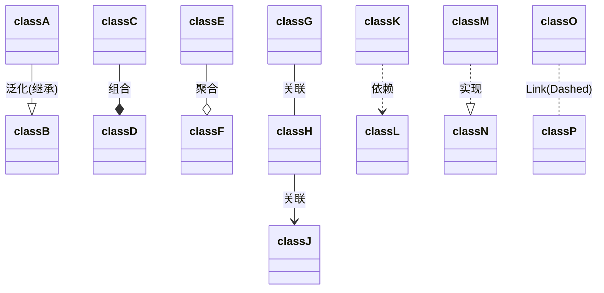
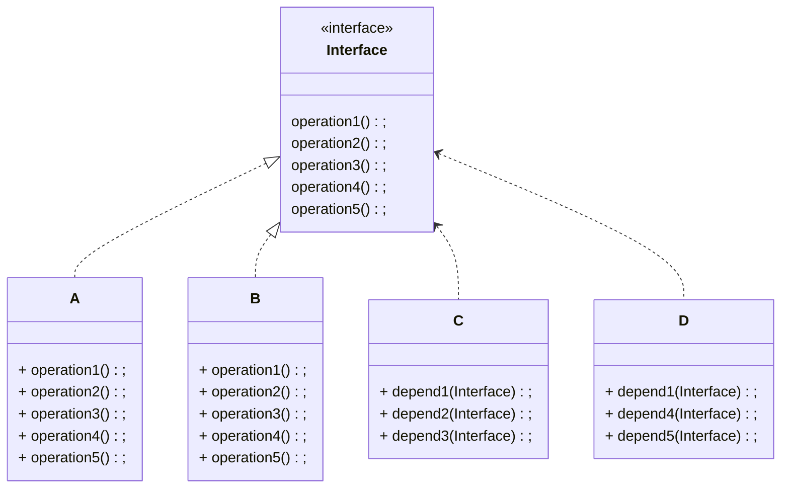
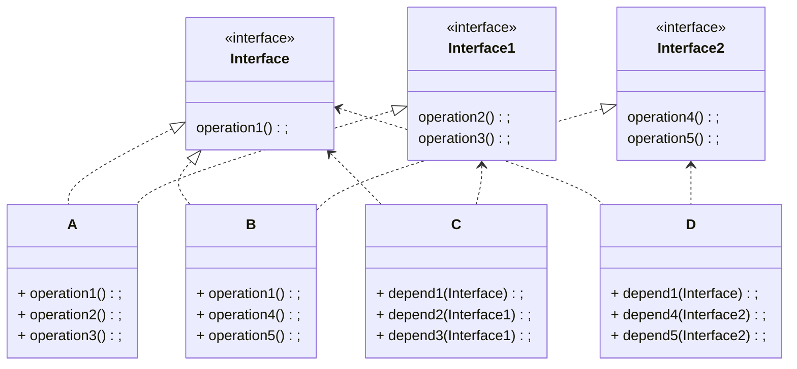
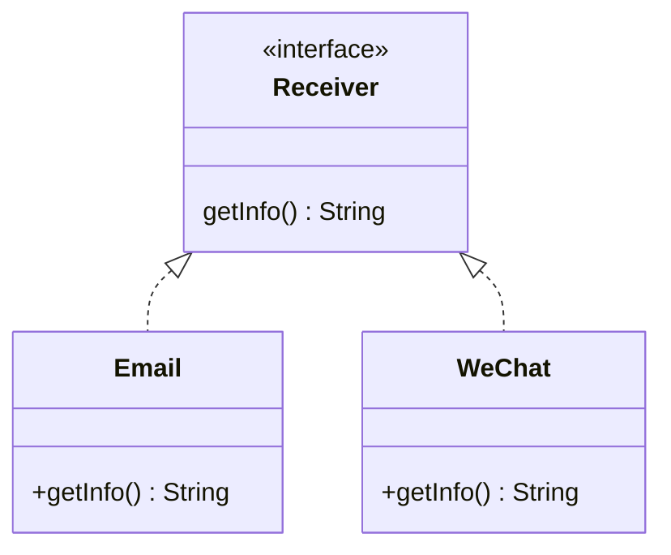
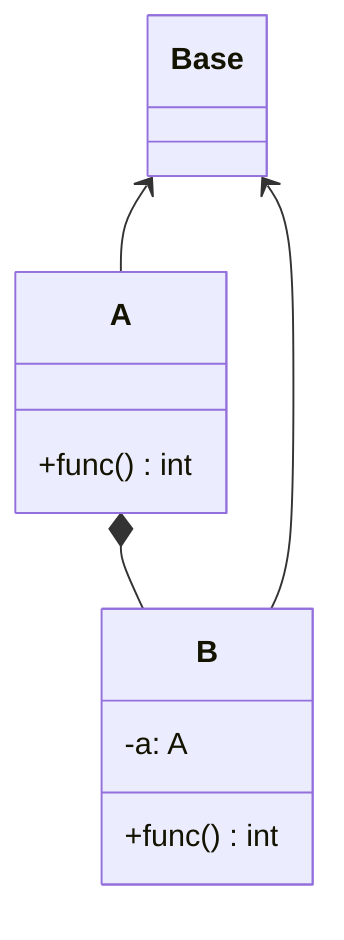
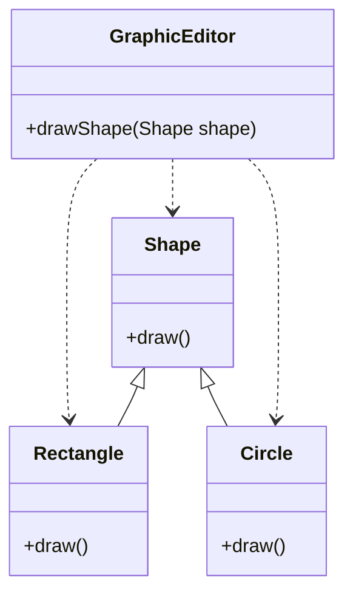
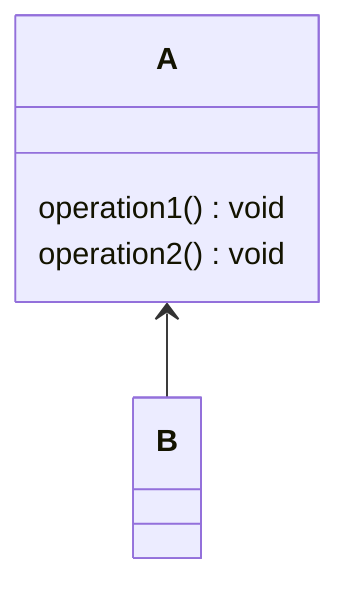
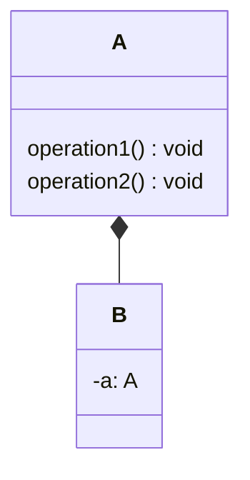
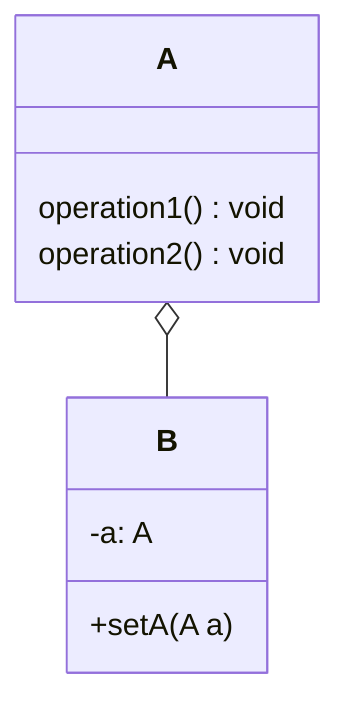

## 1. 设计模式

### 1.1 设计模式的目的

1. 代码重用性高：相同功能的代码，不用多次编写
2. 可读性强：便于其他程序员的阅读和理解
3. 可扩展性高：增减新功能时十分方便
4. 可靠性强：增减新功能，对原来的功能没有影响
5. 高内聚、低耦合

### 1.2 UML类图

`UML`：统一建模语言，是一种用于软件系统分析和设计的语言工具，它用于帮助软件开发人员进行思考和记录思路的结果

#### 1.2.1 基本含义




### 1.3 七大原则

七大原则是设计模式的基础

#### 1.3.1 单一职责

对类来说，即一个类应该只负责一项职责

```java
public class SingleResponsibility {
    public static void main(String[] args) {
        Vehicle vehicle = new Vehicle();
        vehicle.runAir("飞机");
        vehicle.runRoad("汽车");
    }
}
class Vehicle {
    public void runRoad(String vehicle) {
        System.out.println(vehicle + "在公路上运行");
    }

    public void runAir(String vehicle) {
        System.out.println(vehicle + "在天上飞行");
    }
}
```

> **注意**

1. 提高类的可读性，可维护性
2. 降低变更引起的风险
3. 通常情况下，我们应当遵守单一职责原则，只有逻辑足够简单，才可以在代码码级别违反单一职责原则，只有类中方法数量足够少，可以i在方法级别保持单一职责原则(比如上述的例子，一般都是写为多个类)

#### 1.3.2 接口隔离

客户端不应该依赖它不需要的接口，即一个类对另一个类的依赖应该建立在最小的接口上



A、B类实现接口`Interface`，C中的方法通过接口使用A，但只用到了1、2、3。D中的方法通过接口使用B，但只用到了1、4、5。

接口隔离：将`Interface`拆解成几个子接口，其他类根据需要来实现



具体实现

```java
interface Interface{
    void operation1();
}

interface Interface1{
    void operation2();
    void operation3();
}

interface Interface2{
    void operation4();
    void operation5();
}

class A implements Interface, Interface1 {
    @Override
    public void operation1() { }
    @Override
    public void operation2() { }
    @Override
    public void operation3() { }
}

class B implements Interface, Interface2 {
    @Override
    public void operation1() { }
    @Override
    public void operation4() { }
    @Override
    public void operation5() { }
}

// 通过接口使用A类或B类但只会用到1，2，3
class C {
    public void depend1(Interface i) {
        i.operation1();
    }
    public void depend2(Interface1 i) {
        i.operation2();
    }
    public void depend3(Interface1 i) {
        i.operation3();
    }
}

// 通过接口使用A类或B类但只会用到1，4，5
class D{
    public void depend1(Interface i) {
        i.operation1();
    }
    public void depend4(Interface2 i) {
        i.operation4();
    }
    public void depend5(Interface2 i) {
        i.operation5();
    }
}
```

#### 1.3.3 依赖倒转(倒置)

设计理念：相对于细节的多变性，抽象的东西要稳定的多。以抽象为基础搭建的架构比以细节为基础的架构要稳定的多。在`java`中，抽象指的就是接口或抽象类，细节就是具体的实现类。使用接口或抽象类的目的是制定好规范，而不涉及任何具体的操作，把展现细节的任务交给他们的实现类去完成

> **基本原则**

1. 高层模块不应该依赖底层模块，二者都应该依赖其抽象
2. 抽象不应该依赖细节，细节应该依赖抽象
3. 依赖倒转的中心思想是面向接口编程
4. 底层模块(一般是实现类)尽量都要有接口或抽象类，或两者都有
5. 方法的参数类型尽量是抽象类或接口，便于程序的扩展和优化
6. 继承时遵循里氏替换原则



> **具体实现**

```java
interface Receiver {
    String getInfo();
}

class Email implements Receiver{
    public String getInfo() {
        return "电子邮件信息: Hello, World";
    }
}

class WeChat implements Receiver{
    public String getInfo() {
        return "电子邮件信息: Hello, World";
    }
}

class Person {
    public void receive(Receiver receiver) {
        System.out.println(receiver.getInfo());
    }
}
```

> **依赖传递的方法**

1. 通过接口的实现类进行传递，比如上述方法

2. 也可以通过构造器来实现依赖的传递，将接口变成类本身的一个属性，通过构造器传入

   ```java
   interface Receiver {
       String getInfo();
   }
   public class Person {
       private Receiver receiver;
       
       public Person(Receiver receiver) { // 构造器传入
           this.receiver = receiver;
       }
       public void receive() {
           System.out.println(receiver.getInfo());
       }
   }
   ```

3. 通过`setter`方法，此时的接口也是类本身的一个属性，通过`setter`给其赋值

   ```java
   interface Receiver {
       String getInfo();
   }
   public class Person {
       private Receiver receiver;
       
       public void setReceiver(Receiver receiver) { // setter传入
           this.receiver = receiver;
       }
       public void receive() {
           System.out.println(receiver.getInfo());
       }
   }
   ```

#### 1.3.4 里氏替换

继承性：继承给程序设计带来便利的同时，也带来了弊端。比如使用集成会给程序带来**侵入性**，程序的可移植性降低，会增加对象间的耦合性。如果一个类被其他的类所继承，则当这个类需要修改时，必须考虑到所有的子类，并且父类修改后，所有涉及到子类的功能都有可能产生故障

> **基本原则**

1. 如果对每个类型为`T1`的对象`o1`，都有类型为`T2`的对象`o2`，使得以`T1`定义的所有程序`P`在所有的对象`o1`都代换为`o2`时，程序`P`的行为没有发生变化，那么类型`T2`是类型`T1`的子类型。即，所有引用基类的地方必须能透明地使用其子类的对象
2. 使用继承时，遵循里氏替换原则，在子类中尽量**不要**重写父类的方法
3. 继承实际上让两个类耦合性增强了，在适当的情况下，可以通过聚合，组合，依赖来解决问题

> **具体实例**

```java
class A {
    // 返回两个数的差
    public int func1(int num1, int num2) {
        return num1 - num2;
    }
}

class B extends A {
    @Override
    public int func1(int num1, int num2) {
        return num1 + num2;
    }
}
```

`A`类中有个求取两个数差的方法，`B`类继承`A`类后，重写了方法。当通过`B`的对象调用方法并想要实现原来的方法时，就有可能出错

> **里氏替换改写**



```java
// 基类
class Base {}

class A extends Base{
    // 返回两个数的差
    public int func(int num1, int num2) {
        return num1 - num2;
    }
}

class B extends Base {
    // 使用A中的方法进行组合A
    private A a;

    public int func(int num1, int num2) {
        if (a == null) {
            a = new A();
        }
        return a.func(num1, num2);
    }
}
```

#### 1.3.5 开闭原则

一个软件实体(比如类)，模块和函数应该对扩展开放(提供方)，对修改关闭(使用方)。用抽象构建框架，用实现扩展细节

> **基本原则**

1. 当软件需要变化时，尽量通过扩展软件实体的行为来实现变化，而不是通过修改已有的代码来实现变化
2. 使用设计模式的目的之一就是遵循开闭原则

> **案例分析**



`GraphicEditor`一个绘画类，内部调用`shape`方法进行绘画

```java
abstract class Shape{
    public abstract void draw();
}

// 绘图类[提供方]
class GraphicEditor{
    public void drawShape(Shape shape) {
        shape.draw();
    }
}

class Rectangle extends Shape {
    @Override
    public void draw() {
        System.out.println("矩形");
    }
}

class Circle extends Shape {
    @Override
    public void draw() {
        System.out.println("圆形");
    }
}
```

当新增加其他图形类时，并不需要修改`GraphicEditor`

#### 1.3.6 迪米特法则

> **基本原则**

1. 一个对象应该对其他对象保持最少的了解，即类和类之间的耦合度应该越低越好

2. 一个类对自己依赖的类知道的越少越好。对于依赖的类不管怎么复杂，都应该将逻辑封装在类的内部，对外只提供公共方法进行访问

3. 只与直接朋友通信

   直接朋友：每个对象都会与其他对象有耦合关系，只要两个对象之间有耦合关系，我们就说这两个对象之间是朋友关系。耦合的方式很多，依赖，关联，组合，聚合等。其中，出现成员变量，方法参数，方法返回值中的类为直接的朋友，而出现在局部变量中的类不是直接的朋友，而陌生类不要出现在局部变量中

#### 1.3.7 合成复用

原则是尽量使用过**合成/聚合**的方式，而不是使用继承



如果只是想要使用`A`类中的方法，使用继承会让`B`和`A`的耦合性增强，可以采用**合成/聚合**的方式

**组合**

即在B类的内部直接使用`new`的方式将A合成进去



**聚合**

通过`setter`的方式将A合成进去



