## 1. 概述

### 1.1 设计模式的目的

1. 代码重用性高：相同功能的代码，不用多次编写
2. 可读性强：便于其他程序员的阅读和理解
3. 可扩展性高：增减新功能时十分方便
4. 可靠性强：增减新功能，对原来的功能没有影响
5. 高内聚、低耦合

设计模式共分三类，23种

1. 创建型模式：**单例模式**、抽象工厂模式、原型模式、建造者模式、**工厂模式**
2. 结构型模式：适配器模式、桥接模式、**装饰模式**、组合模式、外观模式、享元模式、**代理模式**
3. 行为型模式：模板方法模式、命令模式、访问者模式、迭代器模式、**观察者模式**、中介者模式、备忘录模式、解释器模式、状态模式、策略模式、职责链模式

### 1.2 UML类图

`UML`：统一建模语言，是一种用于软件系统分析和设计的语言工具，它用于帮助软件开发人员进行思考和记录思路的结果

> **分类**

1. 用例图
2. 静态结构图：**类图**、对象图、包图、组件图、部署图
3. 动态行为图：交互图(时序图与协作图)、状态图、活动图

#### 1.2.1 基本含义

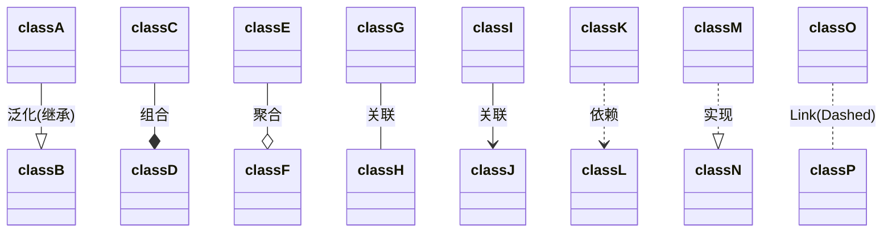

`UML`类图可以用来表示类本身，以及类和类之间的联系

类和类之间的联系包括：依赖、泛化(继承)、实现、关联、聚合与组合

#### 1.2.2 类图示例

```java
public class Person {
    private Integer id;
    private String name;

    public String getName() {
        return name;
    }
    
    public void setName(String name) {
        this.name = name;
    }
}
```

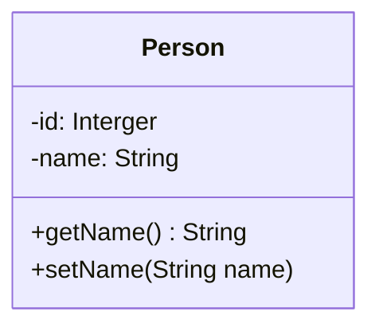

#### 1.2.3 依赖

只要在一个类中用到了另外的类，就会构成依赖关系，主要有以下几种情况

1. 类中用到了对方
2. 类的的成员属性
3. 方法的返回类型
4. 方法的参数类型
5. 方法中使用的局部变量

有以下依赖关系

```java
class PersonDao {}
class Person {}
class IDCard {}
class Department {}

public class PersonServiceBean {
    private PersonDao personDao;
    public void save(Person person) {}
    public IDCard getIDCard(Integer id) {
        return null;
    }
    public void modify() {
        Department department = new Department();
    }
}
```

对于`PersonServiceBean`这个类来说，它就依赖了其余的四个类

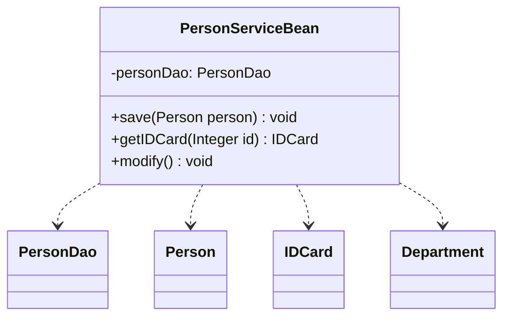

#### 1.2.4 泛化(继承)

有以下关系

```java
abstract class DaoSupport {
    public void save(Object entity) {}
    public void delete(Object id) {}
}
public class PersonServiceBean extends DaoSupport{}
```

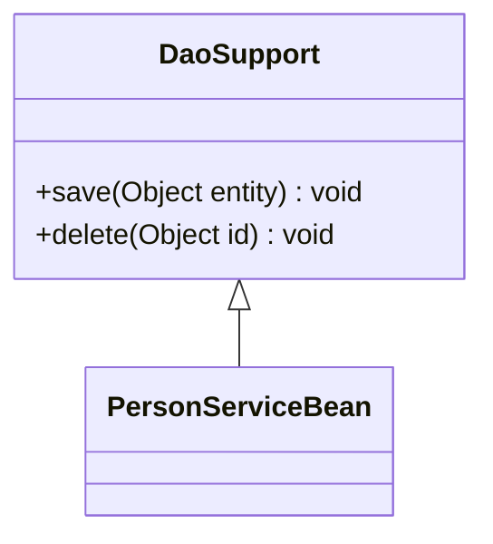

泛化关系就是继承关系

#### 1.2.5 实现

有以下关系

```java
interface PersonService {
    public void delete(Integer id);
}
public class PersonServiceImpl implements PersonService{
    @Override
    public void delete(Integer id) { }
}
```

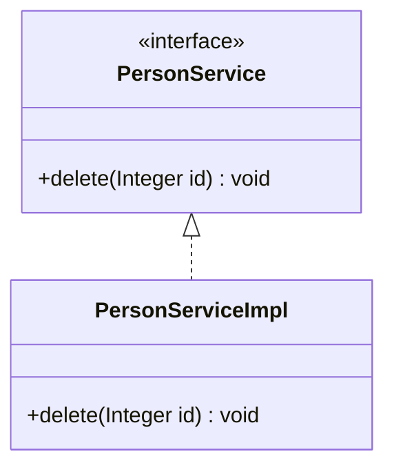

#### 1.2.6 关联

关联具有导航性：即双向关系或单向关系。

关系具有多重性：一对一、一对多、多对一

**单向多对一**

```java
public class Person{
	private IDCard card;
}
public class IDCard{}
```

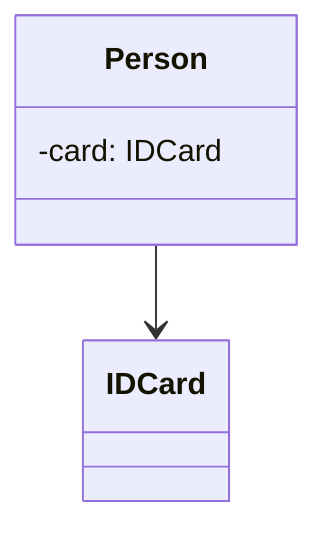

**双向一对一**

```java
public class Person{
	private IDCard card;
}
public class IDCard{
	private Person person;
}
```

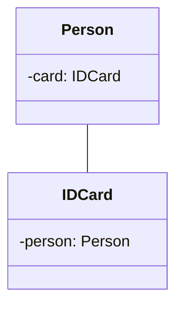

#### 1.2.7 聚合

聚合关系表示的是整体和部分的关系，整体与部分可以分开。聚合关系是关联关系的特例，所以它具有关联关系的导航性与多重性

> **示例**

```java
class Mouse {
}
class Monitor {
}

public class Computer {
    private Monitor monitor;
    private Mouse mouse;

    public void setMonitor(Monitor monitor) {
        this.monitor = monitor;
    }

    public void setMouse(Mouse mouse) {
        this.mouse = mouse;
    }
}
```

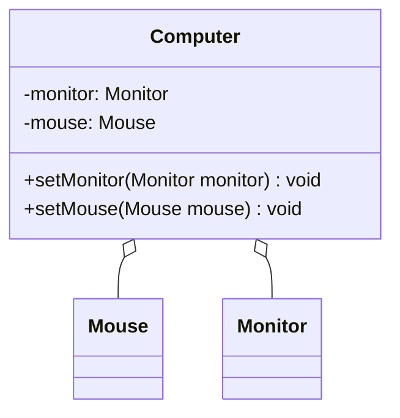

#### 1.2.8 组合

对于[1.2.7](#1.2.7 聚合)的例子，如果认为`Mouse`、`Monitor`和`Computer`是不可分离的，则为组合关系。

```java
class Mouse {
}
class Monitor {
}

public class Computer {
    private Monitor monitor = new Monitor();
    private Mouse mouse = new Mouse();
}
```

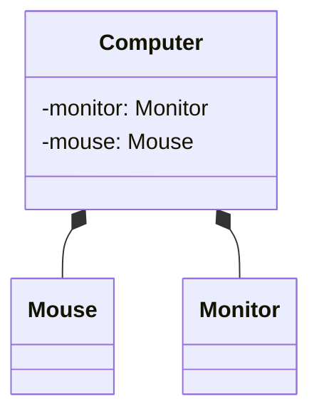

### 1.3 七大原则

七大原则是设计模式的基础

#### 1.3.1 单一职责

对类来说，即一个类应该只负责一项职责

```java
public class SingleResponsibility {
    public static void main(String[] args) {
        Vehicle vehicle = new Vehicle();
        vehicle.runAir("飞机");
        vehicle.runRoad("汽车");
    }
}
class Vehicle {
    public void runRoad(String vehicle) {
        System.out.println(vehicle + "在公路上运行");
    }

    public void runAir(String vehicle) {
        System.out.println(vehicle + "在天上飞行");
    }
}
```

> **注意**

1. 提高类的可读性，可维护性
2. 降低变更引起的风险
3. 通常情况下，我们应当遵守单一职责原则，只有逻辑足够简单，才可以在代码码级别违反单一职责原则，只有类中方法数量足够少，可以i在方法级别保持单一职责原则(比如上述的例子，一般都是写为多个类)

#### 1.3.2 接口隔离

客户端不应该依赖它不需要的接口，即一个类对另一个类的依赖应该建立在最小的接口上

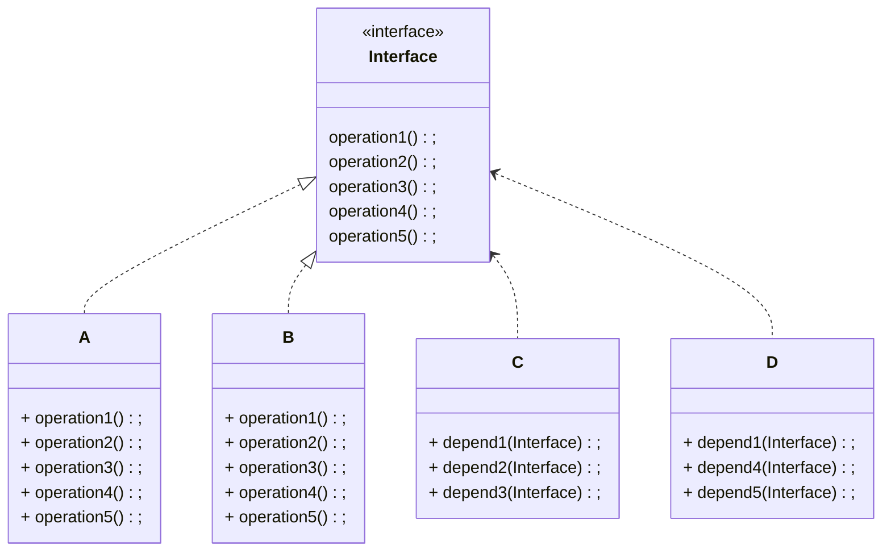

A、B类实现接口`Interface`，C中的方法通过接口使用A，但只用到了1、2、3。D中的方法通过接口使用B，但只用到了1、4、5。

接口隔离：将`Interface`拆解成几个子接口，其他类根据需要来实现

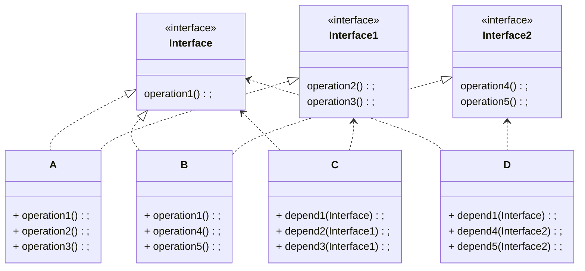

具体实现

```java
interface Interface{
    void operation1();
}

interface Interface1{
    void operation2();
    void operation3();
}

interface Interface2{
    void operation4();
    void operation5();
}

class A implements Interface, Interface1 {
    @Override
    public void operation1() { }
    @Override
    public void operation2() { }
    @Override
    public void operation3() { }
}

class B implements Interface, Interface2 {
    @Override
    public void operation1() { }
    @Override
    public void operation4() { }
    @Override
    public void operation5() { }
}

// 通过接口使用A类或B类但只会用到1，2，3
class C {
    public void depend1(Interface i) {
        i.operation1();
    }
    public void depend2(Interface1 i) {
        i.operation2();
    }
    public void depend3(Interface1 i) {
        i.operation3();
    }
}

// 通过接口使用A类或B类但只会用到1，4，5
class D{
    public void depend1(Interface i) {
        i.operation1();
    }
    public void depend4(Interface2 i) {
        i.operation4();
    }
    public void depend5(Interface2 i) {
        i.operation5();
    }
}
```

#### 1.3.3 依赖倒转(倒置)

设计理念：相对于细节的多变性，抽象的东西要稳定的多。以抽象为基础搭建的架构比以细节为基础的架构要稳定的多。在`java`中，抽象指的就是接口或抽象类，细节就是具体的实现类。使用接口或抽象类的目的是制定好规范，而不涉及任何具体的操作，把展现细节的任务交给他们的实现类去完成

> **基本原则**

1. 高层模块不应该依赖底层模块，二者都应该依赖其抽象
2. 抽象不应该依赖细节，细节应该依赖抽象
3. 依赖倒转的中心思想是面向接口编程
4. 底层模块(一般是实现类)尽量都要有接口或抽象类，或两者都有
5. 方法的参数类型尽量是抽象类或接口，便于程序的扩展和优化
6. 继承时遵循里氏替换原则

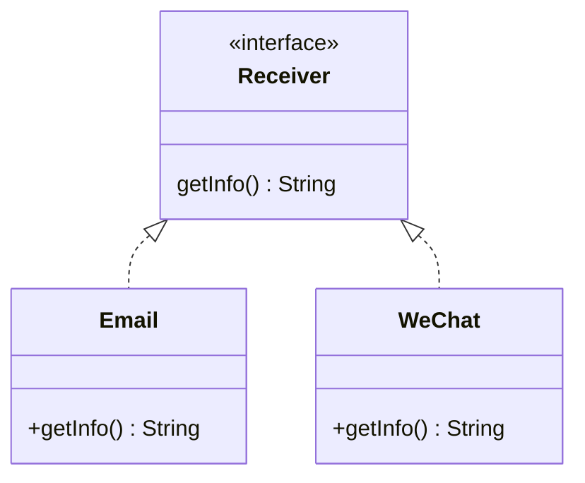

> **具体实现**

```java
interface Receiver {
    String getInfo();
}

class Email implements Receiver{
    public String getInfo() {
        return "电子邮件信息: Hello, World";
    }
}

class WeChat implements Receiver{
    public String getInfo() {
        return "电子邮件信息: Hello, World";
    }
}

class Person {
    public void receive(Receiver receiver) {
        System.out.println(receiver.getInfo());
    }
}
```

> **依赖传递的方法**

1. 通过接口的实现类进行传递，比如上述方法

2. 也可以通过构造器来实现依赖的传递，将接口变成类本身的一个属性，通过构造器传入

   ```java
   interface Receiver {
       String getInfo();
   }
   public class Person {
       private Receiver receiver;
       
       public Person(Receiver receiver) { // 构造器传入
           this.receiver = receiver;
       }
       public void receive() {
           System.out.println(receiver.getInfo());
       }
   }
   ```

3. 通过`setter`方法，此时的接口也是类本身的一个属性，通过`setter`给其赋值

   ```java
   interface Receiver {
       String getInfo();
   }
   public class Person {
       private Receiver receiver;
       
       public void setReceiver(Receiver receiver) { // setter传入
           this.receiver = receiver;
       }
       public void receive() {
           System.out.println(receiver.getInfo());
       }
   }
   ```

#### 1.3.4 里氏替换

继承性：继承给程序设计带来便利的同时，也带来了弊端。比如使用集成会给程序带来**侵入性**，程序的可移植性降低，会增加对象间的耦合性。如果一个类被其他的类所继承，则当这个类需要修改时，必须考虑到所有的子类，并且父类修改后，所有涉及到子类的功能都有可能产生故障

> **基本原则**

1. 如果对每个类型为`T1`的对象`o1`，都有类型为`T2`的对象`o2`，使得以`T1`定义的所有程序`P`在所有的对象`o1`都代换为`o2`时，程序`P`的行为没有发生变化，那么类型`T2`是类型`T1`的子类型。即，所有引用基类的地方必须能透明地使用其子类的对象
2. 使用继承时，遵循里氏替换原则，在子类中尽量**不要**重写父类的方法
3. 继承实际上让两个类耦合性增强了，在适当的情况下，可以通过聚合，组合，依赖来解决问题

> **具体实例**

```java
class A {
    // 返回两个数的差
    public int func1(int num1, int num2) {
        return num1 - num2;
    }
}

class B extends A {
    @Override
    public int func1(int num1, int num2) {
        return num1 + num2;
    }
}
```

`A`类中有个求取两个数差的方法，`B`类继承`A`类后，重写了方法。当通过`B`的对象调用方法并想要实现原来的方法时，就有可能出错

> **里氏替换改写**

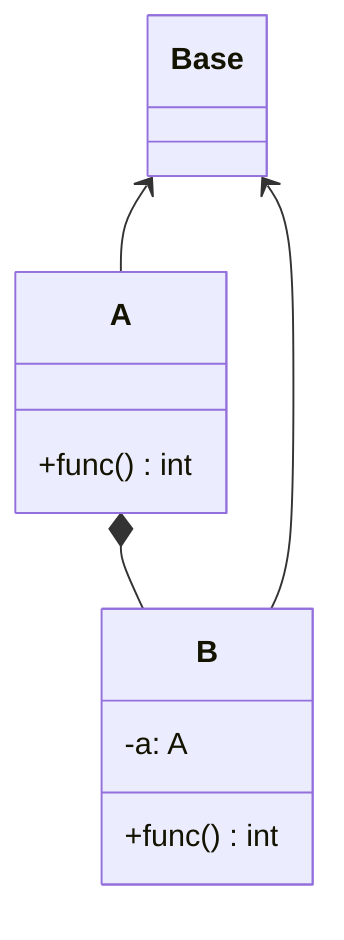

```java
// 基类
class Base {}

class A extends Base{
    // 返回两个数的差
    public int func(int num1, int num2) {
        return num1 - num2;
    }
}

class B extends Base {
    // 使用A中的方法进行组合A
    private A a;

    public int func(int num1, int num2) {
        if (a == null) {
            a = new A();
        }
        return a.func(num1, num2);
    }
}
```

#### 1.3.5 开闭原则

一个软件实体(比如类)，模块和函数应该对扩展开放(提供方)，对修改关闭(使用方)。用抽象构建框架，用实现扩展细节

> **基本原则**

1. 当软件需要变化时，尽量通过扩展软件实体的行为来实现变化，而不是通过修改已有的代码来实现变化
2. 使用设计模式的目的之一就是遵循开闭原则

> **案例分析**

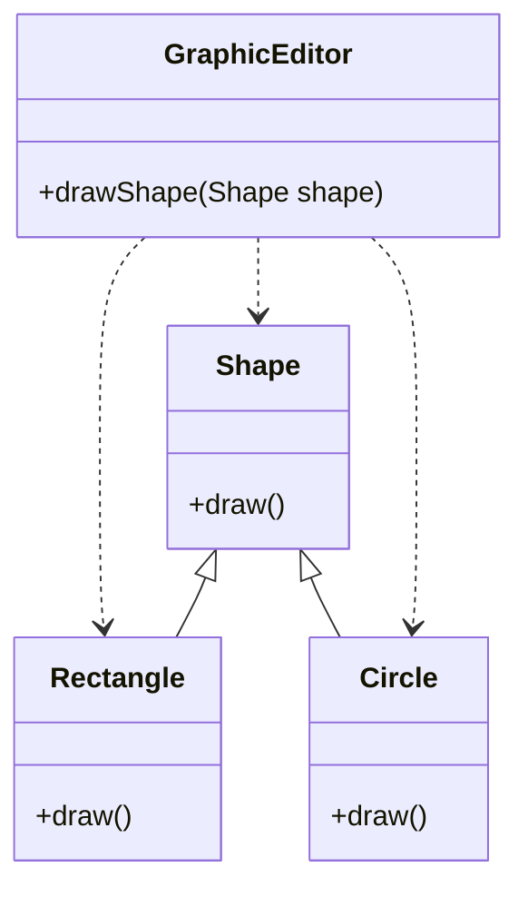

`GraphicEditor`一个绘画类，内部调用`shape`方法进行绘画

```java
abstract class Shape{
    public abstract void draw();
}

// 绘图类[提供方]
class GraphicEditor{
    public void drawShape(Shape shape) {
        shape.draw();
    }
}

class Rectangle extends Shape {
    @Override
    public void draw() {
        System.out.println("矩形");
    }
}

class Circle extends Shape {
    @Override
    public void draw() {
        System.out.println("圆形");
    }
}
```

当新增加其他图形类时，并不需要修改`GraphicEditor`

#### 1.3.6 迪米特法则

> **基本原则**

1. 一个对象应该对其他对象保持最少的了解，即类和类之间的耦合度应该越低越好

2. 一个类对自己依赖的类知道的越少越好。对于依赖的类不管怎么复杂，都应该将逻辑封装在类的内部，对外只提供公共方法进行访问

3. 只与直接朋友通信

   直接朋友：每个对象都会与其他对象有耦合关系，只要两个对象之间有耦合关系，我们就说这两个对象之间是朋友关系。耦合的方式很多，依赖，关联，组合，聚合等。其中，出现成员变量，方法参数，方法返回值中的类为直接的朋友，而出现在局部变量中的类不是直接的朋友，而陌生类不要出现在局部变量中

#### 1.3.7 合成复用

原则是尽量使用过**合成/聚合**的方式，而不是使用继承

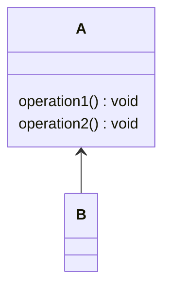

如果只是想要使用`A`类中的方法，使用继承会让`B`和`A`的耦合性增强，可以采用**合成/聚合**的方式

**组合**

即在B类的内部直接使用`new`的方式将A合成进去

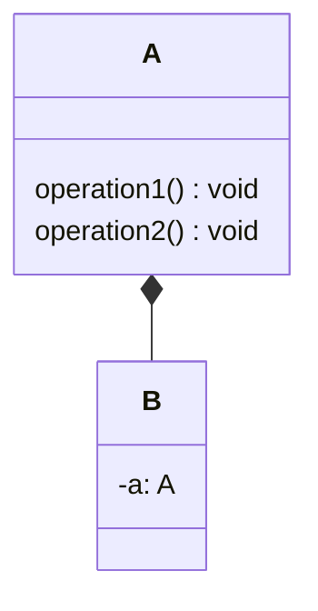

**聚合**

通过`setter`的方式将A合成进去

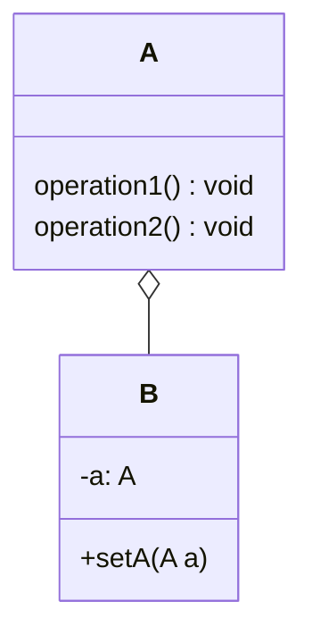

## 2. 单例模式

类的单例设计模式，就是采取一定的方法保证在整个的软件系统中，对某个类只能存在一个对象实例，并且该类就只提供一个取得其对象实例的方法(静态方法)

应用场景：需要频繁的进行创建和销毁的对象，创建对象时耗时过多或耗费资源过多，但又经常用到的对象，工具类对象、频繁访问数据库或文件的对象

### 2.1 饿汉式

#### 2.2.1 静态常量

1. 构造器私有化
2. 类的内部创建对象实例
3. 提供一个共有的静态方法，返回实例对象

```java
public class Singleton {
    private Singleton() {}
    
    private final static Singleton instance = new Singleton();

    public static Singleton getInstance() {
        return instance;
    }
}
```

> **优缺点**

- 优点：这种写法比较简单，就是在类装载的时候就完成实例化，避免线程同步问题
- 缺点：在类装载时就完成实例化，没有达到懒加载的效果，如果没有使用过这个实例，则会造成内存的浪费
- 这种方式基于`classloader`机制避免了多线程的同步问题

#### 2.1.2 静态代码块

```java
class Singleton {
    private final static Singleton instance;
    
    private Singleton() {}
    static {
        instance = new Singleton();
    }
    public static Singleton getInstance() {
        return instance;
    }
}
```

与[静态常量](#2.2.1 静态常量)的方式类似，只不过将实例化的过程放在了静态代码块中

### 2.3 懒汉式

#### 2.2.1 线程不安全

```java
public class Singleton {
    private static Singleton instance;
    
    private Singleton() {}
    public static Singleton getInstance() {
        if (instance == null) {
            instance = new Singleton();
        }
        return instance;
    }
}
```

> **优缺点**

- 有懒加载效果，但是只能在单线程下使用
- 不推荐使用

#### 2.2.2 线程安全

```java
public class Singleton {
    private static Singleton instance;
    
    private Singleton() {}
    public static synchronized Singleton getInstance() {
        if (instance == null) {
            instance = new Singleton();
        }
        return instance;
    }
}
```

> **优缺点**

- 解决了线程不安全的问题
- 效率底下，不推荐使用

#### 2.2.3 双重检查

```java
class Singleton {
    private static volatile Singleton instance;
    
    private Singleton() {}
    public static Singleton getInstance() {
        if (instance == null) {
            synchronized (Singleton.class) {
                if (instance == null) {
                    instance = new Singleton();
                }
            }
        }
        return instance;
    }
}
```

> **优缺点**

- 既保证了线程安全，又保证了效率
- 推荐使用:star:

#### 2.2.4 静态内部类

```java
class Singleton {
    private Singleton() {}

    private static class SingletonInstance {
        private final static Singleton INSTANCE = new Singleton();
    }

    public static Singleton getInstance() {
        return SingletonInstance.INSTANCE;
    }
}
```

> **优缺点**

- 静态内部类不会应为类的装载而装载，只会在使用到它的时候进行装载，且类的装载是线程安全的
- 效率高，推荐使用:star:

#### 2.2.5 枚举

```java
enum Singleton {
    INSTANCE;
}
```

> **优缺点**

- 枚举能够避免多线程同步问题，而且还能防止反序列化重新对象
- 推荐使用:star:

## 3. 工厂模式

工厂模式的意义：将实例化对象的代码提取出来，放到一个类中同一管理和维护，达到和主项目的依赖关系的解藕，从而提高项目的扩展和维护性

一个披萨制作的例子：

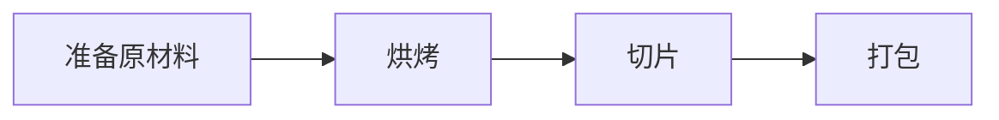

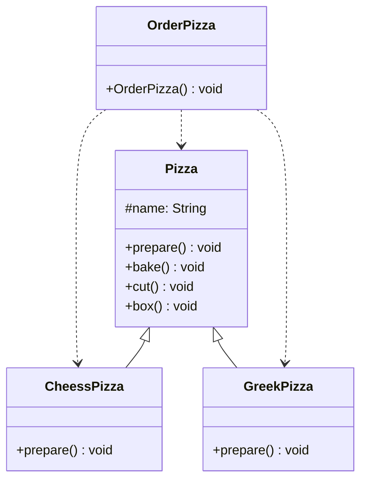

客户会使用订单类`OrderPizza`来订购不同的披萨

**具体的类编写**

1. 披萨类

   ```java
   public abstract class Pizza {
       protected String name;
   
       public abstract void prepare();
       public void bake() {
           System.out.println(name + "baking");
       }
       public void cut() {
           System.out.println(name + "cutting");
       }
       public void box() {
           System.out.println(name + "boxing");
       }
       public void setName(String name) {
           this.name = name;
       }
   }
   ```

2. 奶酪披萨

   ```java
   public class CheesePizza extends Pizza{
       @Override
       public void prepare() {
           System.out.println("给奶酪披萨准备原材料");
       }
   }
   ```

3. 希腊披萨

   ```java
   public class GreekPizza extends Pizza{
       @Override
       public void prepare() {
           System.out.println("给希腊披萨准备原材料");
       }
   }
   ```

4. `OrderPizza`

   ```java
   public class OrderPizza {
       public OrderPizza() {
           Pizza pizza = null;
           String name = "";
           Scanner scanner = new Scanner(System.in);
           tag:while (true) {
               name = scanner.next();
               switch (name) {
                   case "cheese":
                       pizza = new CheesePizza();
                       pizza.setName("奶酪披萨");
                       break;
                   case "greek":
                       pizza = new GreekPizza();
                       pizza.setName("希腊披萨");
                       break;
                   default:
                       break tag;
               }
               pizza.prepare();
               pizza.bake();
               pizza.cut();
               pizza.box();
           }
       }
   }
   ```

### 3.1 简单工厂

1. 简单工厂模式是属于创建型模式的一种。简单工厂模式是由一个工厂对象决定创建出哪一种产品类的实例。
2. 定义一个创建对象的类，有关这个类封装实例化对象的行为

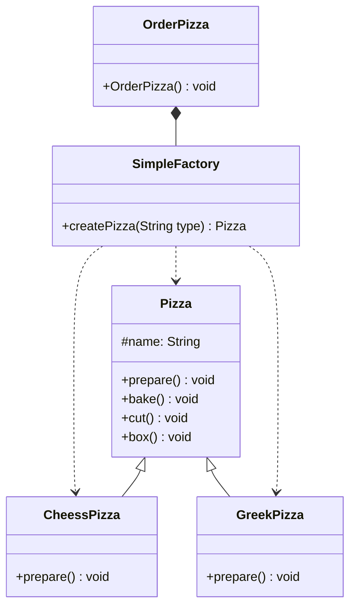

定义简单工厂类，将制造披萨的方法封装其中

```java
public class SimpleFactory {
    public Pizza createPizza(String type) {
        Pizza pizza = null;
        switch (type) {
            case "cheese":
                pizza = new CheesePizza();
                pizza.setName("奶酪披萨");
                break;
            case "greek":
                pizza = new GreekPizza();
                pizza.setName("希腊披萨");
                break;
        }
        return pizza;
    }
}
```

重新编写订单类

```java
public class OrderPizza {
    // 定义一个简单工厂对象
    private final SimpleFactory simpleFactory = new SimpleFactory();
    public OrderPizza() {
        String orderType = "";
        Pizza pizza = null;
        Scanner scanner = new Scanner(System.in);
        do {
            orderType = scanner.next();
            pizza = simpleFactory.createPizza(orderType);
            if (pizza != null) {
                pizza.prepare();
                pizza.bake();
                pizza.cut();
                pizza.box();
            } else {
                break;
            }
        } while (true);
    }
}
```

简单工厂也叫静态工厂，一般工厂类创建对象的方法为静态的

### 3.2 工厂方法

工厂方法模式：实例化方法放在其父类的抽象方法中，由子类决定要实例化的类，工厂方法模式将对象的实例化推迟到子类

新的需求，甲方现在要求添加如下需求：客户能够点不同地区的风味披萨，比如：北京奶酪披萨、伦敦希腊披萨等。如果使用简单工厂模式，要根据不同的地区创建不同的工厂类，不利于代码的可扩展性

工厂方法模式解决：将披萨项目的实例化的功能抽象成抽象方法，在不同的口味点餐子类中具体实现

```mermaid
classDiagram
class Pizza {
	#name: String
	+prepare() void
	+bake() void
	+cut() void
	+box() void
}
class BJCheessPizza {
	+prepare() void
}
class BJGreekPizza {
	+prepare() void
}
class LDCheessPizza {
	+prepare() void
}
class LDGreekPizza {
	+prepare() void
}
class OrderPizza {
	<<abstract>>
	+createPize(String type) Pizza
}
class BJOrderPizza {
	+createPize(String type) Pizza
}
class LDOrderPizza {
	+createPize(String type) Pizza
}
Pizza <|-- BJCheessPizza
BJCheessPizza <.. BJOrderPizza
BJGreekPizza <.. BJOrderPizza
Pizza <|-- BJGreekPizza
OrderPizza <|-- BJOrderPizza
OrderPizza <|-- LDOrderPizza
Pizza <|-- LDCheessPizza
LDCheessPizza <.. LDOrderPizza
LDGreekPizza <.. LDOrderPizza
Pizza <|-- LDGreekPizza
```

> **具体实现**

修改披萨的种类

```java
public class BJCheesePizza extends Pizza{
    @Override
    public void prepare() {
        setName("北京奶酪披萨");
        System.out.println("北京奶酪披萨 准备原材料");
    }
}

public class BJGreekPizza extends Pizza{
    @Override
    public void prepare() {
        setName("北京希腊披萨");
        System.out.println("北京希腊披萨 准备原材料");
    }
}
```

```java
public class LDCheesePizza extends Pizza{
    @Override
    public void prepare() {
        setName("伦敦奶酪披萨");
        System.out.println("伦敦奶酪披萨 准备原材料");
    }
}

public class LDGreekPizza extends Pizza{
    @Override
    public void prepare() {
        setName("伦敦希腊披萨");
        System.out.println("伦敦希腊披萨 准备原材料");
    }
}
```

修改`OrderPizza`为抽象类

```java
public abstract class OrderPizza {
    public OrderPizza() {
        String type = "";
        Pizza pizza = null;
        Scanner scanner = new Scanner(System.in);
        do {
            orderType = scanner.next();
            pizza = createPizza(type);

            if (pizza != null) {
                pizza.prepare();
                pizza.bake();
                pizza.cut();
                pizza.box();
            } else {
                break;
            }
        } while (true);
    }

    public abstract Pizza createPizza(String type);
}
```

创建北京披萨订单类与伦敦披萨订单类

```java
public class BJOrderPizza extends OrderPizza{
    @Override
    public Pizza createPizza(String type) {
        if (type.equals("cheese")) return new BJCheesePizza();
        if (type.equals("greek")) return new BJGreekPizza();
        return null;
    }
}

public class LDOrderPizza extends OrderPizza{
    @Override
    public Pizza createPizza(String type) {
        if (type.equals("cheese")) return new LDCheesePizza();
        if (type.equals("greek")) return new LDGreekPizza();
        return null;
    }
}
```

使用订单类时，可以根据需要创建不同的订单类

### 3.3 抽象工厂

1. 定义一个接口用于创建相关或有关依赖关系的对象簇，而无需指明具体的类
2. 使用者根据具体的需要去创建具体的子类

```mermaid
classDiagram
class Pizza {
	#name: String
	+prepare() void
	+bake() void
	+cut() void
	+box() void
}
class BJCheessPizza {
	+prepare() void
}
class BJGreekPizza {
	+prepare() void
}
class LDCheessPizza {
	+prepare() void
}
class LDGreekPizza {
	+prepare() void
}
class AbsFactory {
	<<interface>>
	+createPize(String type) Pizza
}
class BJFactory {
	+createPize(String type) Pizza
}
class LDFactory {
	+createPize(String type) Pizza
}
Pizza <|-- BJCheessPizza
Pizza <|-- BJGreekPizza
Pizza <|-- LDCheessPizza
Pizza <|-- LDGreekPizza
BJCheessPizza <.. BJFactory
BJGreekPizza <.. BJFactory
LDCheessPizza <.. LDFactory
LDGreekPizza <.. LDFactory
BJFactory ..|> AbsFactory
AbsFactory --o OrderPizza
LDFactory ..|> AbsFactory
```

披萨类与[工厂方法](#3.2 工厂方法)的披萨类相同

添加抽象层的接口`AbsFactory`

```java
public interface AbsFactory {
    public Pizza createPizza(String type);
}
```

添加`BJFactory`与`LDFactory`

```java
// BJFactory.java
public class BJFactory implements AbsFactory{
    @Override
    public Pizza createPizza(String type) {
        if (type.equals("cheese")) return new BJCheesePizza();
        if (type.equals("greek")) return new BJGreekPizza();
        return null;
    }
}

// LDFactory.java
public class LDFactory implements AbsFactory{
    @Override
    public Pizza createPizza(String type) {
        if (type.equals("cheese")) return new LDCheesePizza();
        if (type.equals("greek")) return new LDGreekPizza();
        return null;
    }
}
```

订单类

```java
public class OrderPizza {
    private final AbsFactory factory; // 聚合

    public OrderPizza(AbsFactory factory) {
        this.factory = factory;
        handleOrder();
    }

    private void handleOrder() {
        String type = "";
        Pizza pizza = null;
        Scanner scanner = new Scanner(System.in);
        do {
            type = scanner.next();
            pizza = factory.createPizza(type);

            if (pizza != null) {
                pizza.prepare();
                pizza.bake();
                pizza.cut();
                pizza.box();
            } else {
                break;
            }
        } while (true);
    }
}
```

## 4. 原型模式

1. 原型模式是指用原型实例指定创建对象的种类，并且通过拷贝这些原型，创建新的对象
2. 原型模式是一种创建型的设计模式，允许一个对象再创建另外一个可定制的对象，无需知道如何创建的细节
3. 工作原理：通过将一个原型对象传给那个要发动创建的对象，这个要发动创建的对象请求原型对象拷贝他们自己来实现创建

```mermaid
classDiagram
class Sheep {
	-name: String
    -color: String
	-age: Interger
	+Sheep(String name, String color, Integer color)
}
```

克隆羊问题：创建十只属性相同的克隆羊

```java
public class Sheep implements Cloneable{
    private String name;
    private String color;
    private Integer age;

    public Sheep(String name,
                 String color,
                 Integer age) {
        this.name = name;
        this.color = color;
        this.age = age;
    }

    @Override
    protected Object clone() throws CloneNotSupportedException {
        return super.clone();
    }
}
```

测试

```java
public class SheepTest {
    public static void main(String[] args) throws CloneNotSupportedException {
        Sheep sheep1 = new Sheep("Tom", "黄色", 3);
        Sheep sheep2 = (Sheep) sheep1.clone();
    }
}
```

