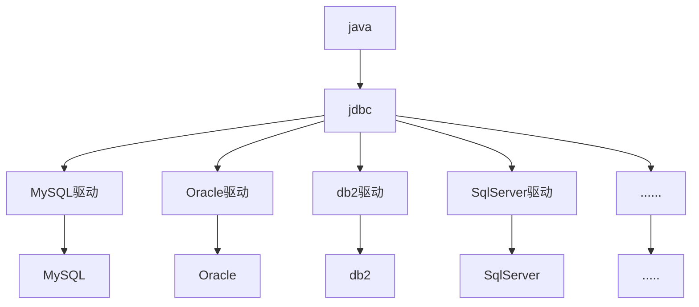

## 1. 简介

### 1.1 基本介绍

1. `JDBC`为访问不同的数据库提供了统一的接口，为使用者屏蔽了细节以及不同平台之间的差异
2. `Java`程序员使用`JDBC`，可以连接任何提供了`JDBC`驱动程序的数据库系统，从而完成对数据库的各种操作
3. `jdbc`架构图



4. 相关的类和接口主要在

   ```java
   java.sql
   javax.sql
   ```

5. 编写步骤

   注册驱动--> 加载`Driver`类

   获取连接 --> 得到`Connection`

   执行增删改查 --> 发送`SQL`给`mysql`

   释放连接

### 1.2 快速入门

环境搭建

```sql
CREATE table actor(
	id int PRIMARY KEY auto_increment,
	name VARCHAR(32) NOT NULL DEFAULT "",
	sex CHAR(1) NOT NULL DEFAULT "女",
	borndate DATETIME,
	phone VARCHAR(12)
) ENGINE=INNODB DEFAULT CHARSET=utf8mb4;
```

1. 注册驱动

   ```java
   Driver driver = new com.mysql.cj.jdbc.Driver();
   ```

2. 得到连接

   ```java
   String url = "jdbc:mysql://localhost:3306/test?useSSL=true&useUnicode=true&characterEncoding=UTF-8&serverTimezone=Asia/Shanghai";
   Properties info = new Properties();
   info.setProperty("user", "root");
   info.setProperty("password", "123456");
   Connection connect = driver.connect(url, info);
   ```

3. 测试

   ```java
   String sql = "INSERT INTO actor VALUES(NULL, '刘德华', '男', '1970-11-11', '110')";
   Statement statement = connect.createStatement();
   int rows = statement.executeUpdate(sql); // 返回影响的行数
   System.out.println(rows);
   ```

4. 关闭连接

   ```java
   statement.close();
   connect.close();
   ```

## 2. 连接方式

### 2.1 实现类方式

```java
@Test
public void test() throws SQLException {
    // 1. 注册驱动
    Driver driver = new com.mysql.cj.jdbc.Driver();

    // 2. 得到连接
    String url = "jdbc:mysql://localhost:3306/test?useSSL=true&useUnicode=true&characterEncoding=UTF-8&serverTimezone=Asia/Shanghai";
    Properties info = new Properties();
    info.setProperty("user", "root");
    info.setProperty("password", "123456");
    Connection connect = driver.connect(url, info);
    connect.close();
}
```

### 2.2 反射机制

使用反射进行动态加载，更加灵活

```java
@Test
@DisplayName("反射加载")
public void test2() throws Exception {
    Class<?> cls = Class.forName("com.mysql.cj.jdbc.Driver");
    Driver driver = (Driver)cls.getConstructor().newInstance();

    String url = "jdbc:mysql://localhost:3306/test?useSSL=true&useUnicode=true&characterEncoding=UTF-8&serverTimezone=Asia/Shanghai";
    Properties info = new Properties();
    info.setProperty("user", "root");
    info.setProperty("password", "123456");
    Connection connect = driver.connect(url, info);

    connect.close();
}
```

### 2.3 DriverManager

```java
@Test
@DisplayName("DriverManager")
public void test3() throws Exception{
    // 加载Driver
    Class<?> cls = Class.forName("com.mysql.cj.jdbc.Driver");
    Driver driver = (Driver)cls.getConstructor().newInstance();

    // 使用DriverManager管理
    String url = "jdbc:mysql://localhost:3306/test?useSSL=true&useUnicode=true&characterEncoding=UTF-8&serverTimezone=Asia/Shanghai";
    String user = "root";
    String password = "123456";

    DriverManager.registerDriver(driver); // 注册驱动
    Connection connect = DriverManager.getConnection(url, user, password);

    connect.close();
}
```

### 2.4 自动注册驱动:star:

`Class.forName()`加载`Driver`时，`Driver`会自动注册驱动

```java
@Test
@DisplayName("自动注册驱动")
public void test4() throws Exception{
    // 加载Driver
    Class.forName("com.mysql.cj.jdbc.Driver");

    // 使用DriverManager管理
    String url = "jdbc:mysql://localhost:3306/test?useSSL=true&useUnicode=true&characterEncoding=UTF-8&serverTimezone=Asia/Shanghai";
    String user = "root";
    String password = "123456";

    Connection connect = DriverManager.getConnection(url, user, password);

    connect.close();
}
```

> 注意

在`mysql`驱动`5.1.6`之后就不需要显示的加载`Driver`类了，因为程序会根据驱动包下的`META-INF\services\java.sql.Driver`文本中的类名去自动注册驱动

## 3. 常用接口

环境搭建，在所有测试开始之前初始化连接，在所有测试结束之后关闭连接

```java
@DisplayName("结果集测试")
public class ResultSetTest {
    private static Connection connect;
    @BeforeAll
    public static void before() throws Exception {
        Class.forName("com.mysql.cj.jdbc.Driver");
        // 使用DriverManager管理
        String url = "jdbc:mysql://localhost:3306/test?useSSL=true&useUnicode=true&characterEncoding=UTF-8&serverTimezone=Asia/Shanghai";
        String user = "root";
        String password = "123456";

        connect = DriverManager.getConnection(url, user, password);
    }

    @AfterAll
    public static void after() throws SQLException {
        if (connect != null) {
            connect.close();
        }
    }
}
```

### 3.1 ResultSet

插入几条数据

```sql
INSERT INTO 
	actor(`name`, sex, borndate, phone)
VALUES
    ('刘德华', '男', '1990-11-11', '11234'),
    ('Tom', '男', '1990-11-11', '11234'),
    ('Alice', '女', '1990-11-11', '11234'),
    ('铁柱', '男', '1990-11-11', '11234');
```

1. 表示数据库结果集的数据表，通常通过执行查询数据库的语句生成

2. `ResultSet`对象保持一个光标指向当前的数据行。最初，光标位于第一行之前

3. `next`方法将光标移动到下一行，并且由于在`ResultSet`对象中没有更多行时返回`false`，因此可以在`while`循环中来遍历结果集

4. 查询案例

   ```java
   @Test
   public void test() throws Exception {
       Statement statement = connect.createStatement();
       String sql = "SELECT * FROM actor";
       ResultSet resultSet = statement.executeQuery(sql);
   
       while (resultSet.next()) {
           System.out.print(resultSet.getInt(1) + " ");
           System.out.print(resultSet.getString(2) + " ");
           System.out.print(resultSet.getString(3) + " ");
           System.out.print(resultSet.getDate(4) + " ");
           System.out.println(resultSet.getString(5));
       }
   
       // 关闭连接
       resultSet.close();
       statement.close();
   }
   ```


### 3.2 Statement

1. `Statement`对象用于执行静态`SQL`语句并返回其生成的结果的对象
2. 建立连接之后，需要对数据库进行访问，执行命名或是`SQL`语句，可以通过`Statement`、`PreparedStatement`、`CallableStatement`(调用存储过程)来获取`Statement`对象
3. 但`Statement`对象执行`SQL`语句，存在`SQL`注入的风险，预防`SQL`注入，使用`PreparedStatement`代替`Statement`

#### 3.2.1 环境搭建

1. `PreparedStatement`执行的`SQL`语句中的参数用`?`来表示，调用`PreparedStatement`对象的`setXXX`方法来设置这些参数

2. 其余`API`与`Statement`相同，预处理也减少了编译次数，提高执行效率

3. 创建一张测试表

   ```sql
   CREATE TABLE user(
   	username VARCHAR(32),
   	password VARCHAR(32)
   )DEFAULT CHARSET=utf8mb4;
   
   INSERT INTO user VALUES('tom', '123');
   ```

#### 3.2.2 案例演示

`SQL`注入预防

```java
@Test
@DisplayName("预处理")
public void test2() throws Exception {
    String username = "1' OR";
    String password = "OR '1' = '1";

    String sql = "SELECT * FROM user WHERE username = ? AND password = ?";
    PreparedStatement statement = connect.prepareStatement(sql);
    statement.setString(1, username);
    statement.setString(2, password);
    ResultSet resultSet = statement.executeQuery();
    if (resultSet.next()) {
        System.out.println("登陆成功");
    } else {
        System.out.println("登陆失败");
    }

    resultSet.close();
    statement.close();
}
// 登陆失败
```

## 4. 事物

环境搭建

```sql
CREATE TABLE account(
	username VARCHAR(32),
	balance INT
)DEFAULT CHARSET=utf8mb4;

INSERT INTO account 
VALUES
('马云', 1000),
('马化腾', 1000);
```

### 4.1 基本介绍

1. `JDBC`程序中当一个`Connection`对象创建时，默认情况下是自动提交事物，即每次执行一条`SQL`语句时，如果执行成功，就会向数据库自动提交，而不能回滚
2. `JDBC`程序中为了让多个`SQL`语句作为一个整体执行，需要使用事物
3. 调用`Connection`的`setAutoCommit(false)`可以取消自动提交事物
4. 在所有的`SQL`语句都成功执行后，调用`commit()`方法提交事物
5. 在某个操作失败或出现异常时，调用`rollback()`方法回滚事物

### 4.2 默认情况

假设马云要向马化腾转账100元，即马云账户增加100，马化腾账户减少100

本测试类默认有[BeforeAll和AfterAll](#3. 常用接口)用来获取和关闭连接

```java
@Test
@DisplayName("默认情况下的事物")
public void transaction() {
    String sql = "UPDATE account SET balance = balance - 100 WHERE name = '马云'";
    Statement statement = null;
    try {
        statement = connect.createStatement();
        statement.executeUpdate(sql);

        if (true) {
            throw new Exception("模拟出现异常");
        }

        sql = "UPDATE account SET balance = balance + 100 WHERE name = '马化腾'";
        statement.executeUpdate(sql);
    } catch (Exception e) {
        e.printStackTrace();
    } finally {
        try {
            if (statement != null) {
                statement.close();
            }
        } catch (SQLException e) {
            e.printStackTrace();
        }
    }
}
```


可以看出，马云的账户减少，但马化腾的账户并没有增加

### 4.3 手动管理事物

设置手动提交事物

```java
@Test
@DisplayName("手动提交事务")
public void transaction() {
    String sql = "UPDATE account SET balance = balance - 100 WHERE name = '马云'";
    Statement statement = null;
    try {
        connect.setAutoCommit(false); // 使用事物
        statement = connect.createStatement();
        statement.executeUpdate(sql);

        if (true) {
            throw new Exception("模拟出现异常");
        }

        sql = "UPDATE account SET balance = balance + 100 WHERE name = '马化腾'";
        statement.executeUpdate(sql);

        connect.commit(); // 提交
    } catch (Exception e) {
        e.printStackTrace();
        try {
            connect.rollback(); // 回滚
        } catch (SQLException re) {
            re.printStackTrace();
        }
    } finally {
        try {
            if (statement != null) {
                statement.close();
            }
        } catch (SQLException e) {
            e.printStackTrace();
        }
    }
}
```


## 5. 批处理

### 5.1 基本介绍

1. 当需要成批插入或者更新记录时，可以采用`Java`的批量更新机制，这一机制允许多条语句一次性提交给数据库批量处理。通常情况下比单独提交处理更有效率

2. `JDBC`的批处理语句包括下面的方法

   - `addBatch()`：添加需要批处理的`SQL`语句或参数
   - `executeBatch()`：执行批处理语句
   - `clearBatch()`：清空批处理语句

3. `JDBC`连接`MySQL`时，如果要使用批处理语句，需要在`url`中添加参数`?rewriteBatchedStatement=true`

   ```properties
   url=jdbc:mysql://localhost:3306/test?useSSL=true&useUnicode=true&characterEncoding=UTF-8&serverTimezone=Asia/Shanghai&rewriteBatchedStatements=true
   ```

4. 批处理往往和`PreparedStatement`一起搭配使用

### 5.1 案例演示

本测试类默认有[BeforeAll和AfterAll](#3. 常用接口)用来获取和关闭连接

```java
@Test
public void test2() throws SQLException {
    String sql = "INSERT INTO account VALUES (?, ?)";
    PreparedStatement preparedStatement = connect.prepareStatement(sql);
    for (int i = 0; i < 1000; i++) {
        preparedStatement.setString(1, "jack" + i);
        preparedStatement.setInt(2, i);
        preparedStatement.addBatch(); // 加入到批处理
    }
    preparedStatement.executeBatch(); // 执行
    preparedStatement.close();
}
```

## 6. 数据库连接池

1. 传统的`JDBC`数据库使用`DriverManager`来获取，每次向数据库建立连接的时候都要将`Connection`加载到内存中，在验证其参数。频繁的数据库连接将占用很多的系统资源
2. 每一次的数据库连接，使用完成后都需要断开连接，如果程序出现异常而未能关闭，将导致数据库内存泄露
3. 为了应付上述的问题，可以采用数据库连接池技术

### 6.1 基本介绍

1. 预先在连接池中放入一定数量的连接，当需要建立数据库连接时，只需要从"连接池"中取出一个，使用完毕后再放回去
2. 数据库连接池负责分配、管理和释放数据库连接，它允许应用程序重复使用一个现有的数据库连接，而不是重新建立一个
3. 当应用程序向连接池请求的连接数超过池中最大的连接数量时，这些请求将被加入到等待队列中

4. `JDBC`的数据库连接池的接口为`javax.sql.DataSource`，具体的连接池由第三方实现

5. 常用的数据库连接池

   `C3P0`：速度相对较慢(Spring默认连接池)

   `DBCP`：速度相对`C3P0`较快，但不稳定

   `Proxool`：数据库连接池，有监控连接池状态的功能，稳定性较`C3P0`差一点

   `Druid`：是阿里提供的数据库连接池，性能较强

### 6.2 C3P0

依赖

```xml
<dependency>
    <groupId>com.mchange</groupId>
    <artifactId>c3p0</artifactId>
    <version>0.9.5.5</version>
</dependency>
```

#### 6.2.1 普通实现

```java
@Test
public void test() throws Exception {
    // 1. 通过配置文件读取相关信息
    Properties properties = new Properties();
    properties.load(new FileInputStream("jdbc.properties"));

    // 2. 创建数据源并设置相关参数
    ComboPooledDataSource dataSource = new ComboPooledDataSource();

    dataSource.setDriverClass(properties.getProperty("driver"));    // 驱动
    dataSource.setUser(properties.getProperty("user"));             // 用户名
    dataSource.setPassword(properties.getProperty("password"));     // 密码
    dataSource.setJdbcUrl(properties.getProperty("url"));           // url
    dataSource.setInitialPoolSize(10);                              // 初始化连接数
    dataSource.setMaxPoolSize(20);                                  // 最大连接数

    Connection connection = dataSource.getConnection();             // 获取连接

    connection.close();                                             // 关闭连接
}
```

一般情况下，所有的初始化配置都是在配置文件中完成的，推荐下面的方式创建连接池

#### 6.2.2 配置文件

在`resource`文件目录下新建`c3p0-config.xml`，这个文件名称是固定的

```xml
<c3p0-config>
    <!--  连接池的名字  -->
    <named-config name="my-config">
        <!--  驱动类  -->
        <property name="driverClass">com.mysql.cj.jdbc.Driver</property>
        <!--  url  -->
        <property name="jdbcUrl">jdbc:mysql://localhost:3306/test?useSSL=true&amp;useUnicode=true&amp;characterEncoding=UTF-8&amp;serverTimezone=Asia/Shanghai</property>
        <!--  用户名  -->
        <property name="user">root</property>
        <!--  密码  -->
        <property name="password">123456</property>
        <!--  每次增长的连接数  -->
        <property name="acquireIncrement">5</property>
        <!--  初始的连接数  -->
        <property name="initialPoolSize">10</property>
        <!--  最小连接数  -->
        <property name="minPoolSize">5</property>
        <!--  最大连接数  -->
        <property name="maxPoolSize">10</property>
        <!--  可连接而最多的命令对象数  -->
        <property name="maxStatements">10</property>
        <!--  每个连接对象可连接的最多的命令对象数  -->
        <property name="maxStatementsPerConnection">2</property>
    </named-config>
</c3p0-config>
```

测试

```java
@Test
@DisplayName("模板文件")
public void test1() throws SQLException {
    ComboPooledDataSource comboPooledDataSource = new ComboPooledDataSource("my-config");
    Connection connection = comboPooledDataSource.getConnection();

    connection.close();
}
```

### 6.3 Druid

在`resource`目录下新建`druid.properties`

```properties
# 驱动
driverClassName=com.mysql.cj.jdbc.Driver
# url
url=jdbc:mysql://localhost:3306/test?useSSL=true&useUnicode=true&characterEncoding=UTF-8&serverTimezone=Asia/Shanghai
# 用户名
username=root
# 密码
password=123456
# 初始化大小
initialSize=10
# 最小空闲连接数
minIdle=5
# 最大激活的连接数
maxActive=20
# 最大等待时间
maxWait=5000
```

测试

```java
public class DruidTest {
    public static void main(String[] args) throws Exception{
        // 1. 创建Properties
        Properties properties = new Properties();
        properties.load(new FileInputStream(DruidTest.class.getResource("/").getFile() + "druid.properties"));
        // 2. 创建数据源
        DataSource dataSource = DruidDataSourceFactory.createDataSource(properties);
        Connection connection = dataSource.getConnection();

        connection.close();
    }
}
```

## 7. ApacheDBUtils

`commons-dbutils`是`Apache`组织提供的一个开源`JDBC`工具类库，它是对`JDBC`的封装，使用`dbutils`能极大简化`JDBC`编码的工作量

**依赖**

```xml
<dependency>
    <groupId>commons-dbutils</groupId>
    <artifactId>commons-dbutils</artifactId>
    <version>1.7</version>
</dependency>
```

### 7.1 常用类

1. `QueryRunner`类：该类封装了`SQL`的执行，是线程安全的。可以实现增、删、改、查

2. 使用`QueryRunner`类实现查询

3. `ResultSetHandler`：接口用于处理`java.sql.ResultSet`，将数据按要求转换为另一种形式

   `ArrayHandler`：把结果集中的第一行数据转换为对象数组

   `ArrayListHandler`：把结果集中的每一行数据都转成一个数组，再存放到`List`中

   `BeanHandler`：将结果集中的第一行数据封装到一个对应的`javaBean`实例中

   `BeanListHandler`：将结果集中的每一行数据都封装到一个对应的`javabean`实例中，再存放到`List`中
   
   `ColumnListHandler`：将结果集中某一列的数据存放到`List`中
   
   `KeyedHandler(name)`：将结果集中的每行数据都封装到`Map`里，再把这些`map`再存到一个`map`里，其`Key`为指定的`key`
   
   `MapHandler`：将结果集中的每一行数据封装到一个`Map`里，`key`是列名，`value`就是对应的值
   
   `MapListHandler`：将结果集中的每一行都封装到一个`Map`里，然后在存放到`List`中
