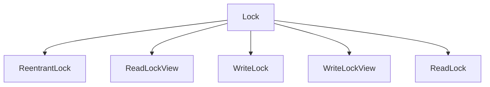
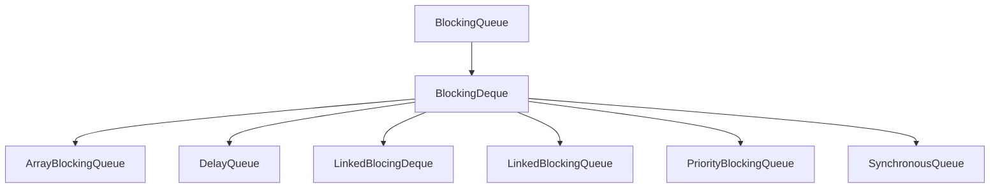
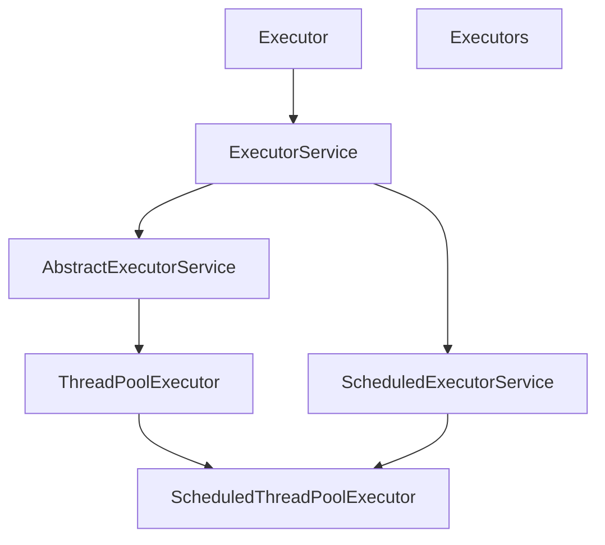

## 1. 概述

在`java`中，线程部分是一个重点，本篇文章说的`JUC`也是关于线程的。`JUC`就是`java.util.concurrent`工具包的简称。这是一个并发编程的工具包

### 1.1 进程与线程

进程`process`是计算机中的程序关于某数据集合上的一次运行活动，是系统进行资源分配和调度的基本单位，是操作系统结构的基础。在当代面向线程设计的计算机结构中，进程是线程的容器。程序是指令、数据及其组织形式的描述，进程是程序的实体。是计算机中的程序关于某数据集合上的一次运行活动，是系统进行资源分配和调度的基本单位，是操作系统结构的基础。程序是指令、数据及其组织形式的描述，进程是程序的实体

线程`thread`是操作系统能够进行运算调度的最小单位。它被包含在进程之中，是进程中的实际运作单位。一条线程指的是进程中一个单一顺序的控制流，一个进程中可以并发多个线程，每条线程并发执行不同的任务

### 1.2 线程的状态

#### 1.2.1 状态介绍


线程的生命周期就是线程对象的生老病死，即线程的状态，线程的声明周期可以通过`getState()`方法获得

线程的状态是一个枚举类，定义在`Thread`内部

```java
public enum State {
    NEW,		
    RUNNABLE,		
    BLOCKED,
    WAITING,
    TIMED_WAITING,
    TERMINATED;
}
```

1. `NEW`新建状态，创建了线程对象，在调用start()启动之前的状态
2. `RUNNABLE`可运行状态(准备就绪)，它是一个复合状态，包含READY和RUNNING两个状态。READY状态表示该线程可以被线程调度器进行调度，调度之后处于RUNNING状态，RUNNING表示该状态正在执行，Thread.yield()方法可以把线程由RUNNING状态转换为READY状态
3. `BLOCKED`阻塞状态，线程发起阻塞的`I/O`操作，或者申请由其他线程占用的独占资源，线程会转换为`BLOCKED`阻塞状态。处于阻塞状态的线程不会占用`CPU`资源。当阻塞的`I/O`操作执行完成后，或者线程获得了它申请的资源，现车给你可以转换为`RUNNABLE`
4. `WAITING`等待状态，线程执行了`Object.wait()`，`thread.join()`方法会吧线程转换为`WAITING`等待状态，执行`Object.notify()`方法，或者加入的线程执行完毕，当前线程会转换为`RUNNABLE`状态
5. `TIMED_WAITING`状态，与`WAITING`状态类似，都是等待状态。区别在于处在该状态的线程不会无限的等待，如果线程没有在指定的时间范围内完成期望的操作，该线程自动转换为`RUNNABLE`
6. `TERMINATED`线程结束处于终止状态

#### 1.2.2 wait/sleep

1. `sleep`是`Thread`的静态方法，而`wait`是`Object`的方法
2. `sleep`不会释放锁，它也不需要占用锁。`wait`会释放锁，但调用它的前提是当前线程占有锁(即代码要在`synchronized`中)
3. 它们都可以被`interrupted`方法中断

## 2. Lock接口

### 2.1 Synchronized

`synchronized`是`java`中的关键字，是一种同步锁。它修饰的对象有以下几种

1. 修饰一个代码块，被修饰的代码块称为同步语句块，其作用的范围是大括号`{}`括起来的代码，作用的对象是调用这个代码块的对象
2. 修饰一个方法，被修饰的方法称为同步方法，其作用范围是整个方法，作用的对象是调用这个方法的对象
3. 修饰一个静态方法，其作用的范围是整个静态方法，作用的对象是这个类的所有对象
4. 修饰一个类，其作用的范围是`synchronized`后面括号括起来的部分，作用主的对象是这个类的所有对象

> 案例：3个售票员，售卖30张票

```java
public class SaleTicket {
    public static void main(String[] args) {
        // 资源对象
        Ticket ticket = new Ticket();
        Thread thread1 = new Thread(() -> {
            for (int i = 0; i < 40; i++) {
                ticket.sale();
            }
        }, "售票员1");
        Thread thread2 = new Thread(() -> {
            for (int i = 0; i < 40; i++) {
                ticket.sale();
            }
        }, "售票员2");
        Thread thread3 = new Thread(() -> {
            for (int i = 0; i < 40; i++) {
                ticket.sale();
            }
        }, "售票员3");

        thread1.start();
        thread2.start();
        thread3.start();
    }
}

class Ticket{
    // 票的总数
    private int number = 30;

    // 卖票的方法
    public synchronized void sale(){
        if (number > 0) {
            System.out.println(Thread.currentThread().getName() + ": 卖出: " + (number--) + " 剩下: " + number);
        }
    }
}
```

### 2.2 Lock

`Lock`锁实现提供了比使用同步方法和语句可以获得的更广泛的锁操作。它们允许更灵活的结构，可能具有非常不同的属性，并且可能支持多个关联的条件对象。`Lock`提供了比`synchronized`更多的功能

**继承树**



#### 2.2.1 快速入门

> 案例：3个售票员，售卖30张票

```java
public class SaleTicket {
    public static void main(String[] args) {
        // 资源对象
        Ticket ticket = new Ticket();
        Thread thread1 = new Thread(() -> {
            for (int i = 0; i < 40; i++) {
                ticket.sale();
            }
        }, "售票员1");
        Thread thread2 = new Thread(() -> {
            for (int i = 0; i < 40; i++) {
                ticket.sale();
            }
        }, "售票员2");
        Thread thread3 = new Thread(() -> {
            for (int i = 0; i < 40; i++) {
                ticket.sale();
            }
        }, "售票员3");

        thread1.start();
        thread2.start();
        thread3.start();
    }
}

class Ticket{
    // 票的总数
    private int number = 30;

    // 锁对象
    private final Lock lock = new ReentrantLock();
    // 卖票的方法
    public void sale(){
        lock.lock();
        try {
            if (number > 0) {
                System.out.println(Thread.currentThread().getName() + ": 卖出: " + (number--) + " 剩下: " + number);
            }
        } finally {
            lock.unlock();
        }
    }
}
```

#### 2.2.2 简介

`synchronized`是自动上锁解锁，`Lock`则是手动上锁解锁。`Lock`是一个接口。

`Lock`与`synchronized`的区别

1. `Lock`不是`java`语言内置的，`synchronized`是`java`语言的关键字，因此是内置特性。`Lock`是一个类，通过这个类可以实现同步访问
2. `Lock`和`synchronized`有一点非常大的不同，采用`synchronized`不需要用户区手动释放锁，当`synchronized`方法或者`synchronized`代码块执行完之后，系统或自动让线程释放对锁的占用；而`Lock`则必须要用户去手动释放锁，如果没有主动释放锁，就可能导致出现死锁现象
3. `Lock`可以提高多个线程进行读操作的效率。在性能上来说，如果竞争资源不激烈，两者的性能是差不多的，而当竞争资源非常激烈时(即有大量线程同时竞争)，此时`Lock`的性能要远远优于`synchronized`

### 2.3 线程通讯

> 案例：一个线程将number加1，一个线程将number减1

```java
public class Signal {
    public static void main(String[] args) {
        Share share = new Share();
        new Thread(() -> {
            for (int i = 1; i <= 10; i++) {
                try {
                    share.incr();
                } catch (InterruptedException e) {
                    e.printStackTrace();
                }
            }
        }, "自加").start();

        new Thread(() -> {
            for (int i = 1; i <= 10; i++) {
                try {
                    share.decr();
                } catch (InterruptedException e) {
                    e.printStackTrace();
                }
            }
        }, "自减").start();
    }
}

// 资源类
class Share{
    private int number = 0;

    private final Lock lock = new ReentrantLock();
    private final Condition condition = lock.newCondition();

    public void incr() throws InterruptedException {
        lock.lock();
        try {
            while (number != 0) {  // 如果是if等待 可能会出现虚假唤醒的问题
                condition.await(); // 等待
            }

            number++;
            System.out.println(Thread.currentThread().getName() + " : " + number);

            // 通知
            condition.signalAll();
        } finally {
            lock.unlock();
        }
    }

    public void decr() throws InterruptedException {
        lock.lock();
        try {
            while (number != 1) { // 如果是if等待 可能会出现虚假唤醒的问题
                condition.await();
            }

            number--;
            System.out.println(Thread.currentThread().getName() + " : " + number);

            // 通知
            condition.signalAll();
        } finally {
            lock.unlock();
        }
    }
}
```

### 2.4 线程定制化通讯

> 案例：线程1打印5次，线程2打印10次，线程3打印15次。进行10轮

```java
public class Custom {
    public static void main(String[] args) {
        Share share = new Share();

        new Thread(() -> {
            for (int i = 1; i <= 10; i++) {
                try {
                    share.print5(i);
                } catch (InterruptedException e) {
                    e.printStackTrace();
                }
            }
        }, "线程1").start();
        new Thread(() -> {
            for (int i = 1; i <= 10; i++) {
                try {
                    share.print10(i);
                } catch (InterruptedException e) {
                    e.printStackTrace();
                }
            }
        }, "线程2").start();
        new Thread(() -> {
            for (int i = 1; i <= 10; i++) {
                try {
                    share.print15(i);
                } catch (InterruptedException e) {
                    e.printStackTrace();
                }
            }
        }, "线程3").start();
    }
}

// 资源
class Share {
   // 标志
   private byte flag = 1;

   // 锁对象
   private final Lock lock = new ReentrantLock();
   private final Condition condition1 = lock.newCondition();
   private final Condition condition2 = lock.newCondition();
   private final Condition condition3 = lock.newCondition();

    // 打印5次
    public void print5(int loop) throws InterruptedException {
        lock.lock();
        try {
            while (flag != 1) {
                condition1.await();
            }

            for (int i = 0; i < 5; i++) {
                System.out.println(Thread.currentThread().getName() + " : " + i + " 轮数: " + loop);
            }
            System.out.println();
            flag = 2;            // 修改标志位
            condition2.signal(); // 通知线程2
        } finally {
            lock.unlock();
        }
    }

    // 打印10次
    public void print10(int loop) throws InterruptedException {
        lock.lock();
        try {
            while (flag != 2) {
                condition2.await();
            }

            for (int i = 0; i < 10; i++) {
                System.out.println(Thread.currentThread().getName() + " : " + i + " 轮数: " + loop);
            }
            System.out.println();
            flag = 3;            // 修改标志位
            condition3.signal(); // 通知线程3
        } finally {
            lock.unlock();
        }
    }

    // 打印15次
    public void print15(int loop) throws InterruptedException {
        lock.lock();
        try {
            while (flag != 3) {
                condition3.await();
            }

            for (int i = 0; i < 15; i++) {
                System.out.println(Thread.currentThread().getName() + " : " + i + " 轮数: " + loop);
            }
            System.out.println();
            flag = 1;            // 修改标志位
            condition1.signal(); // 通知线程2
        } finally {
            lock.unlock();
        }
    }
}
```

## 3. 线程安全

### 3.1 List安全问题

`List`线程不安全实例，当循环的次数过多时会出现`ConcurrentModificationException`异常

```java
public class ThreadSafe {
    public static void main(String[] args) {
        List<String> list = new ArrayList<>();

        for (int i = 0; i < 50; i++) {
            new Thread(() -> {
                // 向集合添加内容
                list.add(UUID.randomUUID().toString().substring(0, 4));

                // 从集合中获取内容
                System.out.println(list);
            }, String.valueOf(i)).start();
        }
    }
}
```

集合线程不安全主要有以下三种解决方法.

1. 使用`Vector`，`Vector`中的方法都是添加了`synchronized`关键字的

2. 使用`Collections`工具类

    ```java
    List<String> list = Collections.synchronizedList(new ArrayList<>());
    ```

3. 使用`CopyOnWriteArrayList`，`CopyOnWriteArrayList`是`JUC`提供的一个类。内部使用"写时复制技术"，即当向集合内部写入数据时，会复制一份，将数据添加到复制的对象中去，添加结束时合并两个集合

    ```java
    List<String> list = new CopyOnWriteArrayList<>();
    ```

### 3.2 Set安全问题

`Set`不安全实例，当循环的次数过多时会出现`ConcurrentModificationException`异常

```java
public class ThreadSafe {
    public static void main(String[] args) {
        Set<String> set = new HashSet<>();
        for (int i = 0; i < 50; i++) {
            new Thread(() -> {
                // 向集合添加内容
                set.add(UUID.randomUUID().toString().substring(0, 4));

                // 从集合中获取内容
                System.out.println(set);
            }, String.valueOf(i)).start();
        }
    }
}    
```

使用`JUC`提供的`CopyOnWriteArraySet`同样可以解决此问题

```java
Set<String> set = new CopyOnWriteArraySet<>();
```

### 3.3 Map安全问题

`Map`不安全实例，当循环的次数过多时会出现`ConcurrentModificationException`异常

```java
public class ThreadSafe {
    public static void main(String[] args) {
        Map<String, String> map = new HashMap<>();

        for (int i = 0; i < 50; i++) {
            String key = String.valueOf(i);
            new Thread(() -> {
                // 向集合添加内容
                map.put(key, UUID.randomUUID().toString().substring(0, 4));

                // 从集合中获取内容
                System.out.println(map);
            }, String.valueOf(i)).start();
        }
    }
}
```

使用`JUC`中的`ConcurrentHashMap`

## 4. 多线程锁

### 4.3 锁的概述

`synchronized`实现同步的基础：`Java`中的每一个对象都可以作为锁，具体表现为如下的三种情况

1. 普通的同步方法，锁是当前实例对象
2. 静态的同步方法，锁是当前类的`Class`对象
3. 对于同步方法块，锁是`synchronized`括号里配置的对象

### 4.2 具体实例

1. 标准访问

    ```java
    class Phone {
        public synchronized void sendSMS() {
            try {
                Thread.sleep(2000);
            } catch (InterruptedException e) {
                e.printStackTrace();
            }
            System.out.println("------sendSMS");
        }
        public synchronized void sendEmail() {
            System.out.println("------sendEmail");
        }
        public void getHello() {
            System.out.println("------getHello");
        }
    }
    
    public class ThreadDemo {
        public static void main(String[] args) {
            Phone phone = new Phone();
            new Thread(() -> {
                phone.sendSMS();
            }, "打电话线程").start();
    
            new Thread(() -> {
                phone.sendEmail();
            }, "发邮件线程").start();
        }
    }
    // ------sendSMS
    // ------sendEmail
    ```

    当`synchronized`添加到方法上时，锁为当前对象

2. 两个资源对象

    ```java
    class Phone {
        public synchronized void sendSMS() {
            try {
                Thread.sleep(2000);
            } catch (InterruptedException e) {
                e.printStackTrace();
            }
            System.out.println("------sendSMS");
        }
        public synchronized void sendEmail() {
            System.out.println("------sendEmail");
        }
        public void getHello() {
            System.out.println("------getHello");
        }
    }
    
    public class ThreadDemo {
        public static void main(String[] args) {
            Phone phone1 = new Phone();
            Phone phone2 = new Phone();
            new Thread(() -> {
                phone1.sendSMS();
            }, "打电话线程").start();
    
            new Thread(() -> {
                phone2.sendEmail();
            }, "发邮件线程").start();
        }
    }
    // ------sendEmail
    // ------sendSMS
    ```

    如果是两个资源对象，则当线程1在`sleep`时，线程2则是可以正常活动的，因为两个方法的锁是不同的对象

3. 两个静态同步方法

    ```java
    class Phone {
        public synchronized static void sendSMS() {
            try {
                Thread.sleep(2000);
            } catch (InterruptedException e) {
                e.printStackTrace();
            }
            System.out.println("------sendSMS");
        }
        public synchronized static void sendEmail() {
            System.out.println("------sendEmail");
        }
        public void getHello() {
            System.out.println("------getHello");
        }
    }
    
    public class ThreadDemo {
        public static void main(String[] args) {
            Phone phone1 = new Phone();
            Phone phone2 = new Phone();
            new Thread(() -> {
                phone1.sendSMS();
            }, "打电话线程").start();
    
            new Thread(() -> {
                phone2.sendEmail();
            }, "发邮件线程").start();
        }
    }
    // ------sendSMS
    // ------sendEmail
    ```

    当`synchronized`添加在静态方法上时，锁对象为当前类的`Class`对象

### 4.3 公平锁和非公平锁

`ReentrantLock`的构造函数中可以传入一个`boolean`来决定是否创建公平锁(默认非公平锁)

非公平锁：效率高，但可能会出现线程饥饿的现象(即所有的工作都让一个线程去做，其他线程处于闲置的状态)

公平锁：效率相对较低，

### 4.4 可重入锁

`synchronized`(隐式)和`Lock`(显示)都是可重入锁(如果外层的锁和内层的锁相同，则外层可以任意进出内层)

```java
public class ThreadDemo {
    // 可重入锁
    public static void main(String[] args) {
        Object obj = new Object();
        new Thread(() -> {
            synchronized (obj) {
                System.out.println(Thread.currentThread().getName() + " : 外层");
                synchronized (obj) {
                    System.out.println(Thread.currentThread().getName() + " : 中层");
                    synchronized (obj) {
                        System.out.println(Thread.currentThread().getName() + " : 内层");
                    }
                }
            }
        }, "可重入锁").start();
    }
}
```

## 5. Callable

与`Runnable`相比，`Callable<T>`具有返回值的特点

```java
public class FutureTaskTest {
    public static void main(String[] args) throws ExecutionException, InterruptedException {
        // 创建一个未来任务对象
        FutureTask<Integer> task = new FutureTask<>(new Source());

        // 创建一个线程
        new Thread(task, "Callable线程").start();

        while (!task.isDone()) { // 判断线程是否执行完成
            System.out.println("wait...");
        }
        
        // 获取线程结果
        System.out.println(task.get()); 
    }
}

class Source implements Callable<Integer> {
    private Integer num = 10;

    @Override
    public Integer call() {
        System.out.println(Thread.currentThread().getName());
        return num;
    }
}
```

## 6. JUC辅助类

### 6.1 减少计数CountDownLatch

#### 6.1.1 简介

1. 构造器，`count`为计数器的初值。当计数器的值变为0时，因`await`方法阻塞的线程会被唤醒，继续执行

    ```java
    CountDownLatch(int count)
    ```

2. 使当前线程在锁存器倒计数至零之前一直等待，除非线程被中断。当一个线程调用`await`方法时，这个线程会阻塞

    ```java
    void await()
    ```

3. 递减锁存器的计数，如果计数到达零，则释放所有等待的线程。其他线程调用`countDown`方法会将计数器减1(调用`countDown`方法的线程不会阻塞)

    ```java
    void countDown()
    ```

#### 6.1.2 案例演示

> 案例：6个同学陆续离开教室后，班长才可以锁门

```java
public class CountDownLatchTest {
    public static void main(String[] args) throws InterruptedException {
        // 创建CountDownLatch对象，并设置初始值
        CountDownLatch latch = new CountDownLatch(6);
        for (int i = 1; i <= 6; i++) {
            new Thread(() -> {
                System.out.println(Thread.currentThread().getName() + " 号同学离开了教室");
                latch.countDown();
            }, String.valueOf(i)).start();
        }

        latch.await();
        System.out.println(Thread.currentThread().getName() + " 班长锁门走人了");
    }
}
```

### 6.2 循环栅栏CyclicBarrier

#### 6.2.1 简介

一个同步辅助类，它允许一组线程互相等待，直到到达某个公共屏障点`common barrier point`。在涉及一组固定大小的线程程序中，这些线程必须不时地互相等待，此时`CyclicBarrier`很有用。因为该`barrier`在释放等待线程后可以重用，所以称它为循环的`barrier`

1. 构造器，一个固定值，一个`Runnable`对象

    ```java
    CyclicBarrier(int parties, Runnable barrierAction)
    ```

2. 等待到达设置的固定值

    ```java
    int await() throws InterruptedException, BrokenBarrierException
    ```

#### 6.2.2 案例演示

> 案例：集齐七颗龙珠召唤神龙(先输出龙珠收集的过程，最后输出召唤神龙)

```java
public class CyclicBarrierTest {
    // 固定值
    private static final int NUMBER = 7;

    public static void main(String[] args) {
        // 创建barrier
        CyclicBarrier barrier = new CyclicBarrier(NUMBER, () -> {
            System.out.println("****集齐7颗龙珠召唤可以召唤神龙****");
        });

        // 集齐七颗龙珠的过程
        for (int i = 1; i <=7; i++) {
            new Thread(() -> {
                System.out.println(Thread.currentThread().getName() + " 星龙珠被收集到了");
                try {
                    barrier.await();
                } catch (Exception e) {
                    e.printStackTrace();
                }
            }, String.valueOf(i)).start();
        }
    }
}
```

### 6.3 信号灯Semaphore

#### 6.3.1 简介

一个计数信号量。从概念上讲，信号量维护了一个许可集。如有必要，在许可可用前会阻塞每一个`acquire()`，然后再获取该许可。每个`release()`添加一个许可，从而可能释放一个正在阻塞的获取者。但是，不使用实际的许可对象，`Semaphore`只对可用许可的号码进行计数，并采取相应的行动。

1. 构造器，创建具有给定许可数和非公平设置的`Semaphore`

    ```java
    Semaphore(int permits)
    ```

2. 从此信号量获取一个许可，在提供一个许可前一直将线程阻塞，否则线程被中断

    ```java
    void acquire()
    ```

3. 释放一个许可，将其返回到信号量

    ```java
    void release(int permits)
    ```

#### 6.3.2 案例演示

> 案例：6辆汽车，3个停车位

```java
public class SemaphoreTest {
    public static void main(String[] args) {
        // 创建Semaphore，设置许可数量
        Semaphore semaphore = new Semaphore(3);

        // 模拟6辆汽车
        for (int i = 1; i <=6; i++) {
            new Thread(() -> {
                try {
                    // 抢占车位
                    semaphore.acquire();
                    System.out.println(Thread.currentThread().getName() + " 抢到了车位");
                    // 设置随机停车时间
                    TimeUnit.SECONDS.sleep(new Random().nextInt(5));
                    System.out.println(Thread.currentThread().getName() + " 离开了车位");
                } catch (InterruptedException e) {
                    e.printStackTrace();
                } finally {
                    // 释放
                    semaphore.release();
                }
            }, String.valueOf(i)).start();
        }
    }
}
```

## 7. 数据库锁

### 7.1 乐观锁和悲观锁


悲观锁：对一切读或写数据的操作之前都上锁，不支持并发


乐观锁：可以有多个线程来访问这个数据，每个数据在访问之前都会有一个版本号，当某一个线程修改数据后同时会修改版本号，当另一个线程也要提交修改时，发现版本号已经被更改，则会提交失败

### 7.2 表锁和行锁

表锁针对数据库的一张表进行上锁，行锁则是对一条记录进行上锁(行锁会发生死锁)

### 7.3 读写锁

#### 7.3.1 简介

读写锁：一个资源可以被多个读线程访问，或者可以被一个写线程访问，但是不能同时存在读写线程

读锁：共享锁

写锁：独占锁

`synchronized`与读写锁

1. `synchronized`是独占式锁，每次只能进行一个操作(或读或写)
2. 读写锁是读读共享，只能由一个线程同时写，但是可以由多个线程同时读。缺点是容易造成锁饥饿(一直读或者一直写，因为读写不能同时进行)

读写锁都会发生死锁，

#### 7.3.2 案例演示

`JUC`提供`ReadWriteLock`读写锁接口以及它的实现类`ReentrantReadWriteLock`

```java
public class ReadWriteLockTest {
    public static void main(String[] args) {
        MyCache cache = new MyCache();

        // 放数据的线程
        for (int i = 1; i <= 5; i++) {
            final int num = 1;
            new Thread(() -> {
                cache.put(String.valueOf(num), String.valueOf(num));
            }, "放数据的线程" + String.valueOf(i)).start();
        }

        // 取数据的线程
        for (int i = 1; i <= 5; i++) {
            final int num = 1;
            new Thread(() -> {
                System.out.println(cache.get(String.valueOf(num)));
            }, "读数据的线程" + String.valueOf(i)).start();
        }
    }
}

// 资源类
class MyCache {
    // 缓存存储对象
    private final Map<String, Object> map = new HashMap<>();

    // 读写锁对象
    private ReadWriteLock readWriteLock = new ReentrantReadWriteLock();

    public void put(String key, Object value) {
        // 添加写锁
        readWriteLock.writeLock().lock();
        System.out.println(Thread.currentThread().getName() + " 正在写操作 " + key);

        try {
            // 暂停一会 模拟写
            TimeUnit.MICROSECONDS.sleep(300);
            // 放数据
            map.put(key, value);
            System.out.println(Thread.currentThread().getName() + " 写完了 " + key);
        } catch (InterruptedException e) {
            e.printStackTrace();
        } finally {
            // 释放锁
            readWriteLock.writeLock().unlock();
        }
    }

    public Object get(String key) {
        // 加读锁
        readWriteLock.readLock().lock();
        System.out.println(Thread.currentThread().getName() + " 正在读操作 " + key);
        Object result = null;

        try {
            // 暂停一会 模拟读
            TimeUnit.MICROSECONDS.sleep(300);
            result = map.get(key);

            System.out.println(Thread.currentThread().getName() + " 读完了 " + key);
        } catch (InterruptedException e) {
            e.printStackTrace();
        } finally {
            // 释放读锁
            readWriteLock.readLock().unlock();
        }
        return result;
    }
}
```

#### 7.3.3 锁降级

将写入锁降级为读锁，但读锁不能升级为写锁


```java
public class Demotion {
    public static void main(String[] args) {
        ReentrantReadWriteLock lock = new ReentrantReadWriteLock();
        ReentrantReadWriteLock.ReadLock readLock = lock.readLock();     // 读锁
        ReentrantReadWriteLock.WriteLock writeLock = lock.writeLock();  // 写锁

        // 锁降级
        // 1. 获取写锁
        writeLock.lock();
        System.out.println("锁降级演示");

        // 2. 获取读锁
        readLock.lock();
        System.out.println("---read");

        // 3. 释放写锁
        writeLock.unlock();

        // 4. 释放读锁
        readLock.unlock();
    }
}
```

## 8. 阻塞队列

`Concurrent`包中，`BlockingQueue`很好的解决了多线程中，如何高效安全"传输"数据的问题。通过这些高效并且线程安全的队列类，为我们快速搭建高质量的多线程程序带来极大的便利

### 8.1 BlockingQueue简介

阻塞队列，是一个共享的队列，可以使数据由队列的一端输入，从另一端输出


从上图来看：有两个线程，线程1往里面放元素，线程2从里面取元素。取元素、放元素有以下几种情况

1. 当队列是空的，从队列中获取元素的操作将会被阻塞
2. 当队列是满的，向队列中添加元素的操作将会被阻塞
3. 试图从空的队列中获取元素的线程将会被阻塞，直到其他线程往空的队列中插入新的元素
4. 试图向已满的队列中添加元素的线程将会被阻塞，直到其他线程从队列中移除一个或多个元素或者完全清空，使队列变得空闲起来后，才能添加

### 8.2 阻塞队列的分类

继承关系



#### 8.2.1 ArrayBlockingQueue:star:

基于数组的阻塞队列实现，在`ArrayBlockingQueue`内部，维护了一个定长数组，以便缓存队列中的数据对象，这是一个常用的阻塞队列，除了一个定长数组外，`ArrayBlockingQueue`内部还保存着两个整型变量，分别标识着队列的头部和尾部在数组中的位置

`ArrayBlockingQueue`在生产者放入数据和消费者获取数据时，都是共用同一个锁对象，由此也意味着两者无法真正并行运行，这点尤其不同于`LinkedBlocingQueue`；按照实现原理来分析，`ArrayBlockingQueue`完全可以采用分离锁，从而实现生产者和消费者操作的完全并行运行。`Doug Lea`之所以没这样去做，也许是因为`ArrayBlockingQueue`的数据写入和获取操作已经足够轻巧，以至于引入独立的锁机制，除了给代码带来额外的复杂性外，其在性能上完全占不到任何便宜。`ArrayBlockingQueue`和`LinkedBlocingQueue`间还有一个明显的不同之处在于，前者在插入或删除元素时不会产生或销毁任何额外的对象实例，而后者则会生成一个额外的`Node`对象。这在长时间内需要高效并发地处理大批量数据的情形中，其对于`GC`的影响还是存在一定的区别。而在创建`ArrayBlockingQueue`时，我们还可以控制对象是否采用公平锁，默认采用非公平锁

> 由数组结构组成的有界阻塞队列

#### 8.2.2 LinkedBlockingQueue:star:

基于链表的阻塞队列，桶`ArrayListBlocingQueue`类似，其内部也维持着一个数据缓冲队列(该队列由一个链表构成)，当生产者往队列中放入一个数据时，队列会从生产者手中获取数据，并缓存在队列内部，而生产者立即返回；只有当队列缓冲区达到最大值缓存容量时(`LinkedBlockingQueue`可以通过构造函数指定该值)，才会阻塞生产者队列，直到消费者从队列中消费掉一份数据，生产者线程会被唤醒，反之对于消费者这端的处理也是基于同样的原理。而`LinkedBlockingQueue`之所以能够高效的处理并发数据，还因为其对于生产者端和消费者端分别采用了独立的锁来控制数据同步，这也意味着在高并发的情况下生产者和消费者可以并行地操作队列中的数据，以此来提高整个队列的并发性能

> 由链表结构组成的有界(默认大小为Integer.MAX_VALUE)阻塞队列

#### 8.2.3 DelayQueue

`DelayQueue`中的元素只有当其指定的延迟时间到了，才能够从队列中获取到该元素。`DealyQueue`是一个没有大小限制的队列，因此往队列中插入数据的操作(生产者)永远不会被阻塞，而只有获取数据的操作(消费者)才会被阻塞

> 使用优先级队列实现的延迟无界阻塞队列

#### 8.2.4 PriorityBlockingQueue

基于优先级的阻塞队列(优先级的判断通过构造函数传入的`Compator`对象来决定)，但需要注意的是`PriorityBlockingQueue`并不会阻塞数据生产者，而只会在没有可消费的数据时，阻塞数据的消费者

因此使用的时候要特别注意，生产者生产数据的速度绝对不能快于消费者消费数据的速度，否则时间一长，将会耗尽所有可用的堆内存空间

在实现`PriorityBlockingQueue`时，内部控制线程同步的锁采用的是公平锁

> 支持优先级排序的无界阻塞队列

#### 8.4.5 SynchronousQueue

一种无缓冲的等待队列，类似于无中介的直接交易。

> 不存储元素的阻塞队列，即单个元素的队列

#### 8.4.6 LinkedTransferQueue

`LinkedTransferQueue`是一个由链表结构组成的无界阻塞`TransferQueue`队列。相对于其他阻塞队列，`LinkedTransferQueue`多了`tryTransfer`和`transfer`方法

`LinkedTransferQueue`采用一种预占模式。意思就是消费者线程取元素时，如果队列不为空，则直接取走数据，若队列为空，那就生成一个节点(节点元素为`null`)入队，然后消费者线程被等待在这个节点上，后面生产者线程入队时发现有一个元素为`null`的节点，生产者线程就不入队了，直接就将元素填充到该节点，并唤醒该节点等待的线程，被唤醒的消费者线程取走元素，从调用的方法返回

> 由链表组成的无界阻塞队列

#### 8.4.7 LinkedBlockingDeque

`LinkedBlockingDeque`是一个由链表结构组成的双向阻塞队列，即可以从队列的两端插入和移除元素

对于一些指定的操作，在插入或者获取队列元素时如果队列状态不允许该操作可能会阻塞住该线程知道队列状态变更为允许操作，这里的阻塞一般有两种情况

- 插入元素时：如果当前队列已满将会进入阻塞状态，一直等到队列有空的位置时在将该元素插入，该操作可以通过设置超时参数，超时后返回`false`表示操作失败，也可以不设置超时参数一直阻塞，中断后抛出`InterruptedException`异常
- 读取元素时：如果当前队列为空会阻塞住直到队列不为空然后返回元素，同样可以通过设置超时参数

> 由链表组成的双向阻塞队列

### 8.3 阻塞队列的常用方法

| 方法类型 | 抛出异常  | 特殊值   | 阻塞   | 超时                 |
| -------- | --------- | -------- | ------ | -------------------- |
| 插入     | add(e)    | offer(e) | put(e) | offer(e, time, unit) |
| 移除     | remove()  | poll()   | take() | poll(time, unit)     |
| 检查     | element() | peek()   | 不可用 | 不可用               |

| 类型     | 说明                                                         |
| -------- | ------------------------------------------------------------ |
| 抛出异常 | 当阻塞队列满时，再往队列里add插入元素会抛`IllegalStateException:Queue full`<br/>当阻塞队列空时，再往队列里remove移除元素会抛`NoSuchElementException` |
| 特殊值   | 插入方法，成功过true失败false<br/>移除方法，成功返回出队列的元素，队列里没有就返回null |
| 一直阻塞 | 当阻塞队列满时，生产者线程继续往队列里put元素，队列会一直阻塞生产者线程直到put数据or响应中断退出<br/>当阻塞队列空时，消费者线程试图从队列里take元素，队列会一直阻塞消费者线程直到队列可用 |
| 超时退出 | 当阻塞队列满时，队列会阻塞生产者线程一定时间，超出时限后生产者线程会退出 |

## 9. ThreadPool线程池

### 9.1 简介

线程池`Thread pool`：一种线程使用模式。线程过多会带来很大的开销，进而影响缓存局部性和整体性能。而线程池维护着多个线程，等待着监督管理者分配可并发执行的任务。这避免了在处理短时间任务时创建与销毁线程的代价。线程池不仅能够保证`CPU`的充分利用，还能防止过分调度

线程池的优势：线程池做的工作只要是控制运行的线程数量，处理过程汇总将任务放入队列，然后在线程创建后启动这些任务，如果线程数量超过了最大数量，超出数量的线程排队等候，等其他线程执行完毕，再从队列中取出任务来执行

主要特点

1. 降低资源消耗：通过重复利用已创建的线程降低线程创建和销毁造成的资源浪费
2. 提高响应速度：当任务到达时，任务可以不需要等待线程创建就能立即执行
3. 提高线程的可管理性：线程是稀缺资源，如果无限制的创建，不仅会消耗系统资源，还会降低系统的稳定性，使用线程池可以进行同一的分配，调优和监控
4. `Java`中的线程池是通过`Executor`框架实现的，该框架主要包含`Executor`、`Executors`、`ExecutorService`、`ThreadPoolExecutor`这几个类

线程池的架构



### 9.2 线程池的种类

1. 一池N线程，数量可以通过参数来设置

    ```java
    public class ThreadPoolTest {
        public static void main(String[] args) {
            // 一池N线程
            ExecutorService pool = Executors.newFixedThreadPool(5);
    
            try{
                for(int i = 1; i <= 10; i++) {
                    pool.execute(() -> {
                        System.out.println(Thread.currentThread().getName() + " 正在执行");
                    });
                }
            } finally {
                // 关闭
                pool.shutdown();
            }
        }
    }
    ```

2. 一个任务一个任务的执行(即一池一线程)

    ```java
    public class ThreadPoolTest {
        public static void main(String[] args) {
            // 一池一线程
            ExecutorService pool = Executors.newSingleThreadExecutor();
            try{
                for(int i = 1; i <= 10; i++) {
                    pool.execute(() -> {
                        System.out.println(Thread.currentThread().getName() + " 正在执行");
                    });
                }
            } finally {
                // 关闭
                pool.shutdown();
            }
        }
    }
    ```

3. 线程池根据需要可自动扩容

    ```java
    public class ThreadPoolTest {
        public static void main(String[] args) {
            // 一池可扩容线程
            ExecutorService pool = Executors.newCachedThreadPool();
            try{
                for(int i = 1; i <= 10; i++) {
                    pool.execute(() -> {
                        System.out.println(Thread.currentThread().getName() + " 正在执行");
                    });
                }
            } finally {
                // 关闭
                pool.shutdown();
            }
        }
    }
    ```

三种方式的底层都是使用`ThreadPoolExecutor`来创建的线程池

### 9.3 线程池的参数

```java
public ThreadPoolExecutor(int corePoolSize,
                          int maximumPoolSize,
                          long keepAliveTime,
                          TimeUnit unit,
                          BlockingQueue<Runnable> workQueue,
                          ThreadFactory threadFactory,
                          RejectedExecutionHandler handler) {}
```

1. `corePoolSize`：常驻(核心)线程数量
2. `maximumPoolSize`：最大线程数量
3. `keepAliveTime`：线程存活时间
4. `unit`：存活时间的单位
5. `workQueue`：阻塞队列
6. `threadFactory`：线程工厂，用于创建线程
7. `handler`：拒绝策略


1. 在创建了线程池后，线程池中的线程数为零

2. 当调用`execute()`方法添加一个请求任务时，线程池会做出如下判断：

    如果正在运行的线程数小于`corePoolSize`，那么马上创建线程运行这个任务

    如果正在运行的线程数量大于或等于`corePoolSize`，那么将这个任务放入队列中

    如果队列已满但正在运行的线程数并未达到`maximumPool`，创建新的线程去执行这个任务

    如果线程数已经达到`maximumPool`则执行拒绝策略

### 9.4 拒绝策略

1. `AbortPolicy`(默认)：直接抛出`RejectedExecutionException`异常阻止系统正常运行
2. `CallerRunsPolicy`："调用者运行"一种调节机制，该策略既不会抛弃任务，也不会抛出异常，而是将某些任务回退到调用者，从而降低新任务的流量
3. `DiscardOldPolicy`：抛弃队列中等待最久的任务，然后把当前任务加入队列中再次提交当前任务
4. `DiscardPolicy`：该策略默默地丢弃无法处理的任务，不予任何处理也不抛出异常。如果允许任务丢失，这是最好的一种策略

### 9.5 自定义线程

```java
public class ThreadPoolTest {
    public static void main(String[] args) {
        ThreadPoolExecutor threadPool = new ThreadPoolExecutor(
                2,
                5,
                2L,
                TimeUnit.SECONDS,
                new ArrayBlockingQueue<>(3),
                Executors.defaultThreadFactory(),
                new ThreadPoolExecutor.AbortPolicy());

        try {
            for (int i = 1; i <= 10; i++) {
                threadPool.execute(() -> {
                    System.out.println(Thread.currentThread().getName() + " 处理任务");
                });
            }
        } finally {
            threadPool.shutdown();
        }
    }
}
```

## 10. 分支合并Fork/Join

`Fork/Join`它可以将一个大的任务拆分成多个子任务进行并行处理，最后将子任务结果合并成最后的计算结果，并进行输出。`Fork/Join`框架要完成两件事：

1. `Fork`：把一个复杂任务进行分拆，大事化小
2. `Join`：把分拆的任务的结果进行合并

> 案例：使用拆分框架计算1+2+...+100

```java
public class ForkJoinTest {
    public static void main(String[] args) throws ExecutionException, InterruptedException {
        MyTask task = new MyTask(0, 100);

        // 分支池对象
        ForkJoinPool pool = new ForkJoinPool();
        ForkJoinTask<Integer> forkJoinTask = pool.submit(task);

        // 获取结果
        System.out.println(forkJoinTask.get());

        // 关闭池对象
        pool.shutdown();
    }
}

class MyTask extends RecursiveTask<Integer> {
    // 拆分差值不能超过10(计算10以内的和)
    private static final Integer VALUE = 10;
    private int begin;      // 拆分开始值
    private int end;        // 拆分结束值
    private int result = 0;     // 返回结果

    public MyTask(int begin, int end) {
        this.begin = begin;
        this.end = end;
    }

    // 拆分和合并的过程
    @Override
    protected Integer compute() {
        // 判断两个数的差值是否大于10
        if (end - begin <= VALUE) { // 想加
            for (int i = begin; i <= end; i++) {
                result = result + i;
            }
        } else { // 拆分
            // 获取中间值
            int middle = (begin + end) >> 1;
            MyTask left = new MyTask(begin, middle);
            MyTask right = new MyTask(middle + 1, end);

            // 方法拆分
            left.fork();
            right.fork();

            // 合并结果
            result = left.join() + right.join();
        }
        return result;
    }
}
```

## 11. 异步回调

同步调用

```java
public class CompletableFutureTest {
    public static void main(String[] args) throws ExecutionException, InterruptedException {
        // 同步调用 Void表示没有返回值
        CompletableFuture<Void> future = CompletableFuture.runAsync(() -> {
            System.out.println(Thread.currentThread().getName() + " 同步调用");
        });
        System.out.println(future.get());
    }
}
```

异步调用

```java
public class CompletableFutureTest {
    public static void main(String[] args) throws ExecutionException, InterruptedException {
        CompletableFuture<Integer> future = CompletableFuture.supplyAsync(() -> {
            System.out.println(Thread.currentThread().getName() + " 异步调用");
            return 1024;
        });


        future.whenComplete((t, u) -> {
            System.out.println(t); // 任务返回值
            System.out.println(u); // u如果有异常，表示异常信息
        }).get();
    }
}
```
