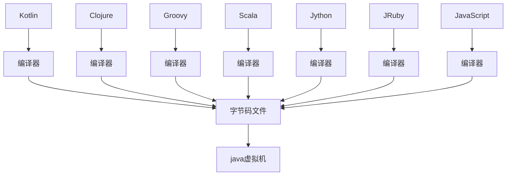
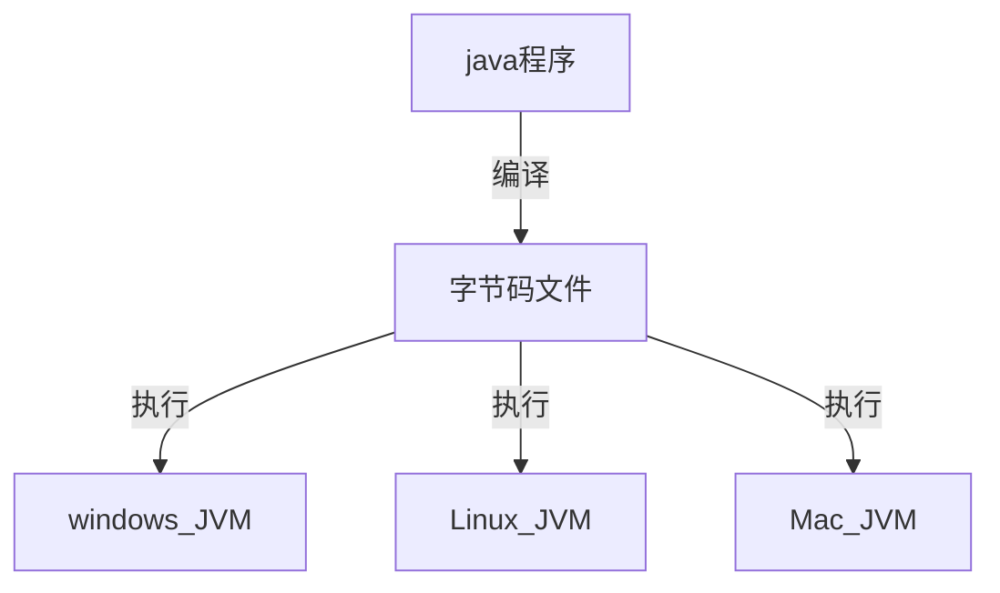
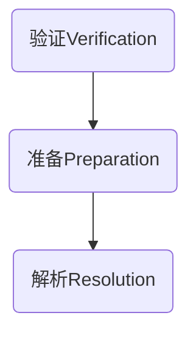
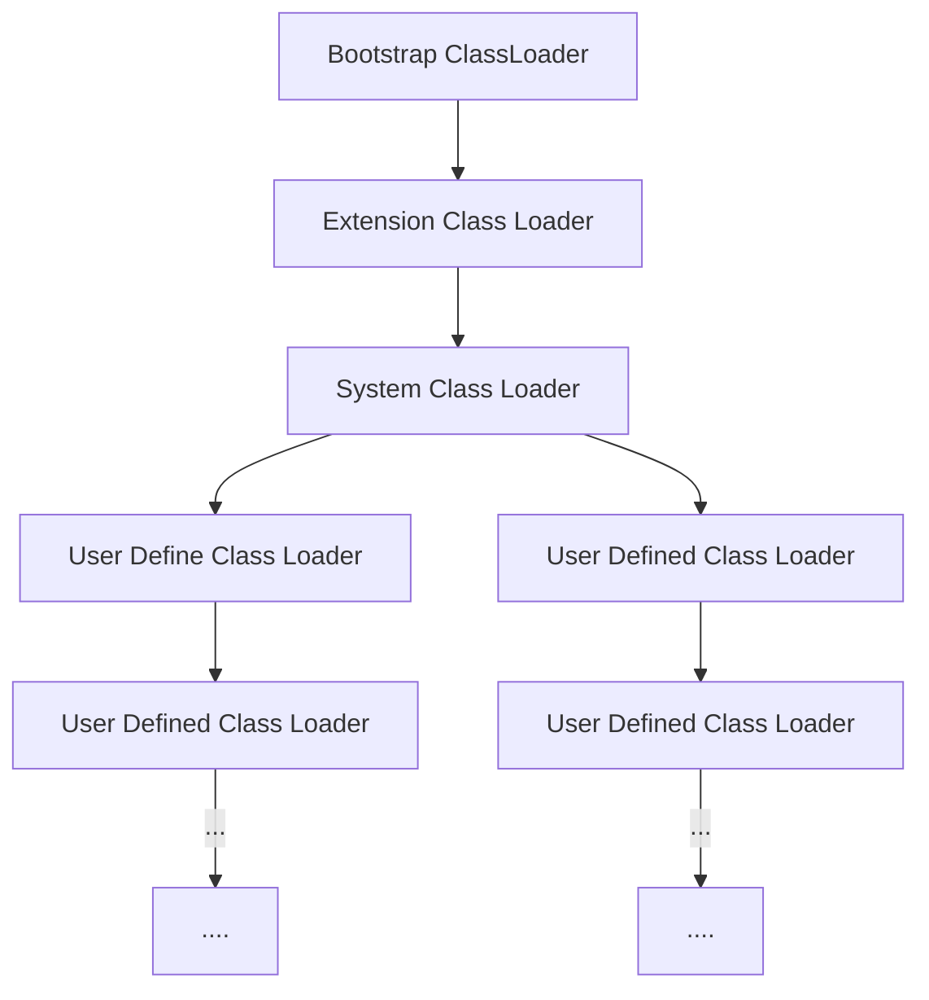
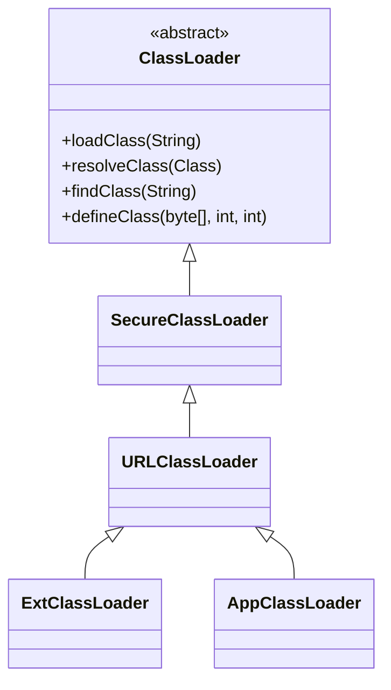

## 1. JVM与java体系

`JVM`是一个跨语言的平台，在`java7`的发布之后，`java`虚拟机的设计者们通过`JSR-292`规范基本实现在`java`虚拟机上运行非`java`语言编写的程序



### 1.1 字节码

- 对于字节码的理解，任何能在`jvm`平台上执行的字节码格式都是一样的。所以应该统称为`jvm`字节码
- 不同的编译器，可以编译出相同的字节码文件，字节码文件也可以在不同的`JVM`上运行
- `java`虚拟机与`java`语言没有必然的联系，它只与特定的二进制文件格式——`Class`文件格式所关联，`class`文件中包含了`java`虚拟机指令集(或者称为字节码`Bytecodes`)和符号表，还有一些其它辅助信息

### 1.2 多语言混合编程

- `java`平台上，通过特定领域的语言去解决特定领域的问题是当前软件开发的一个趋势

- 某一个项目

  ```mermaid
  graph TD
  并行处理 --> Clojure
  展示层 --> JRuby/Rails
  中间层 --> Java
  ```

- 各种语言之间的交互不存在任何困难，就像使用自己语言的原生`API`一样，因为它们最终都运行在一个虚拟机上

- 对于运行在`java`虚拟机之上、`java`之外的语言，来自系统级、底层的支持正在迅速曾倩，以`JSR-292`为核心的一系列项目和功能改进

  ```
  Vinci Machine
  Nashorn
  InvokeDynamic
  java.lang.invoke
  ```


### 1.3 虚拟机

#### 1.3.1 虚拟机

- 所谓虚拟机`virtual machine`，就是一台虚拟的计算机，它是一款软件，用来执行一系列虚拟计算机指令。大体上，虚拟机可以分为系统虚拟机和程序虚拟机

  `virtual box`，`VMware`就属于系统虚拟机，它们完全是对物理计算机的仿真，提供了一个可运行完整操作系统的软件平台

  程序虚拟机的典型代表就是`java`虚拟机，它专门执行单个计算机程序而设计，在`java`虚拟机中执行的指令我们称为`java`字节码指令

- 无论是系统虚拟机还是程序虚拟机，在上面运行的软件都被限制于虚拟机提供的资源中

#### 1.3.2 java虚拟机

- `java`虚拟机是一台执行`java`字节码的虚拟计算机，它拥有独立的运行机制，其运行的`java`字节码也未必是`java`语言编译而成

- `JVM`平台的各种语言可以共享`java`虚拟机带来的跨平台性、优秀的垃圾回收器，以及可靠的即时编译器

- `java`技术的核心就是`java`虚拟机，因为所有的`java`程序都运行在`java`虚拟机内部

- `java`虚拟机就是二进制字节码的运行环境，负责装载字节码到其内部，解释/编译为对应平台上的机器指令执行。每一条`java`指令，`java`虚拟机规范都有详细定义

- 特点

  一次编译，到处运行

  自动内存管理

  自动垃圾回收机制

### 1.4 java整体结构

- `HotSpot VM`目前市面上高性能虚拟机的代表作之一
- 它采用解释起与即时编译器并存的架构


### 1.5 java代码执行流程



### 1.6 JVM架构模型

`java`编译器输入的指令流基本上是一种基于栈的指令集架构，另外一种指令集架构则是基于寄存器的指令集架构

具体来说：这两种架构之间的区别

#### 1.6.1 基于栈式架构

- 设计和实现更简单，适用于资源受限的系统
- 避开了寄存器的分配难题：使用零地址指令方式分配
- 指令流中的大部分是零地址指令，其执行过程依赖于操作栈。指令集更小，编译器容易实现
- 不需要硬件支持，可移植性好，更好实现跨平台

#### 1.6.2 基于寄存器架构

- 典型的应用是`x86`的二进制指令集：比如传统的`PC`以及`Android`的`Davlik`虚拟机
- 指令集架构则完全依赖硬件，可移植性差
- 性能优秀和执行高效
- 花费更少的指令完成一项操作
- 在大部分情况下，基于寄存器架构的指令集往往都以一地址指令、二地址指令和三地址指令为主，而基于栈式架构的指令集都是以零地址指令为主

#### 1.6.3 总结

由于跨平台性的设计，`Java`的指令都是根据栈来设计的。

### 1.7 JVM的生命周期

**虚拟机的启动**

`Java`虚拟机的启动是通过引导类加载器`bootstrap class loader`创建一个初始类`initial class` 来完成的，这个类是由虚拟机的具体实现指定的

**虚拟机的运行**

- 一个运行中的`JaVA`虚拟机有着一个清晰的任务：执行`java`程序
- 程序开始执行时它才运行，程序结束时它就停止
- 执行一个所谓的`Java`程序的时候，真真正正在执行的是一个叫做`Java`虚拟机的进程

**虚拟机的退出**

- 程序正常执行结束
- 程序在执行过程中遇到了异常或者错误而异常终止
- 由于操作系统出现错误而导致`Java`虚拟机进程终止
- 某线程调用`Runtime`类或`System`类的`exit`方法，或`Runtime`类的`Halt`方法，并且`Java`安全管理器也允许这次`exit`或`halt`操作
- 除此之外，`JNI(Java Native Interface)`规范描述了用`JNI Invocation API`来加载或卸载`Java`虚拟机时，`Java`虚拟机的退出情况

## 2. 类加载子系统

### 2.1 类加载的过程


- 类加载子系统负责从文件系统或者网络中加载`Class`文件，`class`文件在文件开头有特定的文件标识
- `ClassLoader`只负责`calss`文件的加载，至于它是否可以运行，则由`Execution Engine`决定
- 加载的类信息存放于一块称为方法区的内存空间。除了类的信息外，方法区中还会存放运行时常量池信息，可能还包括字符串字面量和数字常量(这部分常量信息是`Class`文件中常量池部分的内存映射)


#### 2.1.1 加载

1. 通过一个类的全限定名获取定义此类的二进制字节流
2. 将这个字节流所代表的静态存储结构转化为方法区的运行时数据结构
3. 在内存中生成一个代表这个类的`java.lang.Class`对象，作为方法区这个类的各种数据的访问入口

> **加载字节码文件的方式**

1. 从本地系统中直接加载
2. 通过网络获取`Web Applet`
3. 从压缩包中读取`zip`、`jar`、`war`
4. 运行时计算生成，动态代理技术
5. 由其他文件生成，典型场景：`JSP`应用
6. 从专有数据库中提取`.class`文件
7. 从加密文件中获取，典型的防`Class`文件被反编译的保护措施

#### 2.1.2 链接

链接包括



- 验证`Verify`

  目的在于确保`Class`文件的字节流中包含信息符合当前虚拟机的要求，保证加载类的正确性，不会危害虚拟机自身安全

  主要包括四种验证，文件格式验证，元数据验证，字节码验证，符号引用验证

- 准备`Prepare`

  为类变量分配内存并且设置该类的默认初始值，即零值

  这里包括含用`final`修饰的`static`，因为`final`在编译的时候就会分配了，准备阶段会显式初始化

  这里不会为实例变量分配初始化，类变量会分配在方法区中，而实例变量会随着对象一起分配到`java`堆中

- 解析`Resolve`

  将常量池内的符号引用转换为直接引用的过程

  事实上，解析操作往往会伴随着`JVM`在执行完初始化之后再执行

  符号引用就是一组符号来描述所引用的目标，符号引用的字面量形式明确定义在`Java`虚拟机规范的`Class`文件格式中，直接引用就是目标的指针、相对偏移量或一个间接定位到目标的句柄

  解析动作主要针对类或接口、字段、类方法、接口方法、方法类型等。对应常量池中的`CONSTANT_Class_info`、`CONSTANT_Fieldref_info`、`CONSTANT_Methodref_info`等

#### 2.1.3 初始化

- 初始化阶段就是执行类构造器方法`<clinit>()`的过程
- 此方法不需定义，是`javac`编译器自动收集类中的所有类变量的赋值动作和静态代码块中的语句合并而来
- 构造器方法中指令按语句在源文件中出现的顺序执行
- `<clinit>()`不同于类的构造器。(关联：构造器是虚拟机视角下的`<init>()`)
- 若该类具有父类，`JVM`会保证子类的`<clinit>()`执行前，父类的`<clinit>()`已执行完毕
- 虚拟机必须保证一个类的`<clinit>()`方法在多线程下被同步加锁

### 2.2 类加载器

- `JVM`支持两种类型的类加载器，分别是引导类加载器`Bootstrap ClassLoader`和自定义类加载器`User-Defined ClassLoader`
- 从概念上来讲，自定义类加载器一般指的是程序中由开发人员自定义的一类类加载器，但是`java`虚拟机规范却没有这么定义，而是将所有派生于抽象类`ClassLoader`的类加载器都划分为自定义类加载器
- 无论类加载器的类型如何划分，在程序中我们最常见的类加载器始终只有3个



四者的关系不是继承而是包含

```java
public class ClassLoaderTest {
    @Test
    public void test() {
        // 获取系统类加载器
        ClassLoader systemClassLoader = ClassLoader.getSystemClassLoader();
        System.out.println(systemClassLoader); // jdk.internal.loader.ClassLoaders$AppClassLoader@2437c6dc

        // 获取系统类加载器的上层，扩展类加载器
        ClassLoader extClassLoader = systemClassLoader.getParent();
        System.out.println(extClassLoader); // jdk.internal.loader.ClassLoaders$PlatformClassLoader@7c30a502

        // 获取扩展类加载器的上层，引导类加载器
        ClassLoader bootstrapClassLoader = extClassLoader.getParent();
        System.out.println(bootstrapClassLoader); // null

        // 对于用户自定义类来说，默认使用系统类加载器进行加载
        ClassLoader classLoader = ClassLoaderTest.class.getClassLoader();
        System.out.println(classLoader); // jdk.internal.loader.ClassLoaders$AppClassLoader@2437c6dc
    }
}
```

`Java`的核心类库都是使用引导类加载器进行加载的

#### 2.2.1 虚拟机再带的加载器

> **启动类加载器**

启动类加载器(引导类加载器，Bootstrap ClassLoader)

1. 这个类加载器是使用`C/C++`实现，嵌套在`JVM`内部
2. 并不是继承自`java.lang.ClassLoader`，没有父加载器
3. 是加载扩展类和应用程序的类加载器，并指定为他们的父类加载器
4. 处于安全的考虑，`Bootstrap`启动类只加载包名为`java`、`javax`、`sun`等开头的类

> **扩展类加载器**

扩展类加载器(Extension ClassLoader)

1. `Java`语言编写，由`sun.misc.Lanucher$ExClassLoader`实现
2. 派生于`ClassLoader`类，父类加载器为启动类加载器
3. 从`java.ext.dirs`系统属性所指定的目录中加载类库，或从`JDK`的安装目录的`jre/lib/ext`子目录下加载类库。如果用户创建的`JAR`放在此目录下，也会自动由扩展类加载器加载

> **应用程序类加载器**

1. `java`语言编写，由`sun.misc.Launcher$AppClassLoader`实现
2. 派生于`ClassLoader`类，父类加载器为扩展类加载器
3. 它负责加载环境变量`classpath`或系统属性`java.class.path`指定路径下的类库
4. 该类加载是程序中默认的类加载器，一般来说，`Java`应用的类都是由它来完成加载
5. 通过`ClassLoader.getSystemClassLoader()`方法可以获取到该类加载器

#### 2.2.2 用户自定义的加载器

大部分场景下，类的加载是由上述的三种类加载器相互配合执行，在一些特殊的场景下，可以自定义类加载器来定制类的加载方式

1. 隔离加载类
2. 修改类加载的方式
3. 扩展加载源
4. 防止源码泄露

自定义类加载器步骤

1. 开发人员可以通过继承抽象类`java.lang.ClassLoader`类的方式，实现自己的类加载器，一满足一些特殊的需求
2. 继承`ClassLoader`类名重写`findClass()方法`
3. 在编写自定义类加载器时，如果没有太过于复杂的需求，可以直接继承`URLClassLoader`类，这样就可以避免自己去编写`findClass()`方法及其获取字节码流的方式，使自定义类加载器编写更加简洁

#### 2.2.3 ClassLoader

`ClassLoader`类，它是一个抽象类，其后所有类加载器都继承自`ClassLoader`(不包括启动类加载器)

| 方法名称                                             | 描述                                                         |
| ---------------------------------------------------- | ------------------------------------------------------------ |
| getParent()                                          | 返回该类加载器的超类加载器                                   |
| loadClass(String name)                               | 加载名称为name的类，返回结果java.lang.Class类的实例          |
| findClass(String name)                               | 查找名称为name的类，返回结果java.lang.Class类的实例          |
| findLoadedClass(String name)                         | 查找名称为name且已经被加载过的类，返回结果java.lang.Class的实例 |
| defineClass(String name, byte[] b, int off, int len) | 把字节数组b中的内容转换为一个java类，返回结果为java.lang.Class的实例 |
| resolveClass(Class<?> c)                             | 连接指定的一个java类                                         |



### 2.3 双亲委派机制

`Java`虚拟机对`class`文件采用的是按需加载的方式，也就是说当需要使用该类时才会将它的`class`文件加载到内存生成`class`对象。而且加载某个类的`class`文件时，`Java`虚拟机采用的是双亲委派模式，即把请求交由父类处理，它是一种任务委派模式

#### 2.3.1 工作原理


1. 如果一个类加载器收到了类加载请求，它并不会自己先去加载，而是把这个请求委托给父类的加载器去执行
2. 如果父类加载器还存在其父类加载器，则进一步向上委托，依次递归，请求最终到达顶层的启动类加载器
3. 如果父类加载器可以完成类加载器任务，就成功返回，倘若父类加载器无法完成此加载任务，子加载器才会尝试自己去加载，这就是双亲委派模式

#### 2.3.2 双亲委派的优点

1. 避免类的重复加载

2. 保护程序安全，防止核心`API`被随意篡改

3. 沙箱安全机制

   如自定义`String`类，但是在加载自定义`String`类的时候会率先使用引导类加载器加载，而引导类加载器在加载的过程中会先加载`JDK`自己的包，所以就会忽略自定义的类。这样可以保证对`java`核心源代码的保护

### 2.4 其它

> 在`JVM`中表示两个`class`对象是否为同一个类的两个必要条件

1. 类的完整类名必须一致(含包名)
2. 加载这个类的`ClassLoader`必须相同

> **对类加载器的引用**

`JVM`必须知道一个类是由启动类加载器加载的还是用户自定义的类加载器加载的。如果一个类是由用户类加载器加载的，那么`JVM`会将这个类加载器的一个引用作为类型信息的一部分保存在方法区中。当解析一个类型到另一个类型的饮用个的时候，`JVM`需要保证这两个类型的类加载器是相同的

> **主动使用和被动使用**

**主动使用**

1. 创建类的实例

2. 访问某个类或接口的静态变量，或者对该静态变量赋值

3. 调用类的静态方法

4. 反射(Class.forName("xxxx"))

5. 初始化一个类的子类

6. `Java`虚拟机启动时被标明为启动类的类

7. `JDK7`开始提供的动态语言的支持

   `java.lang.invoke.MethodHandle`实例的解析结果

   `REF_getStatic`、`REF_putStatic`、`REF_invokeStatic`句柄对应的类没有初始化则初始化

**被动使用**

除了以上七种情况，其他使用`Java`类的方式都被看作是对类的被动使用，都不会导致类的初始化

## 3. 运行时数据区


内存是非常重要的系统资源，是硬盘和`CPU`的中间仓库及桥梁，承载着操作系统和应用程序的事实运行。`JVM`内存布局规定了`Java`在运行过程中内存申请、分配、管理的策略，保证了`JVM`的高效稳定运行。不同的`JVM`对于内存的划分方式和管理机制存在着差异


`Java`虚拟机定义了若干种程序运行期间会使用到的运行时数据区，其中有一些会随着虚拟机的启动而创建，随着虚拟机的退出而销毁。另外一些则是与线程一一对应的，这些与线程对应的数据区域会随着线程开始和结束而创建和销毁，比如第一幅图，红色的代表多个线程共享，灰色的代表单独线程私有

### 3.1 线程

1. 线程是一个程序里的运行单元。`JVM`允许一个应用有多个线程并行的执行
2. 在`Hostspot JVM`里，每个线程都与操作系统的本地线程直接映射。当一个`Java`想成准备好执行以后，此时一个操作系统的 本地线程也同时创建。`Java`线程执行终止后，本地线程也会回收
3. 操作系统负责所有线程的安排调度到任何一个可用的`CPU`上。一旦本地线程初始化成功后，它就会调用`Java`线程中的`run()`方法

使用调试工具，能够在后台看到有许多线程在运行，这些后台不包括调用`public static void main(String[] args)`的`main`线程以及所有这个`main`线程自己创建的线程

1. 虚拟机线程：这种线程的操作都是需要`JVM`达到安全点才会出现。这些操作必须在不同的线程中发生的原因是他们都需要`JVM`达到安全点，这样堆才不会变化。这种线程的执行类型包括`stop-the-world`的垃圾收集，线程栈收集，线程挂起以及偏向锁撤销
2. 周期任务线程：这种线程是时间周期事件的体现(比如中断)，他们一般用于周期性操作的调度执行
3. `GC`线程：这种线程对`JVM`里不同种类的垃圾收集行为提供了支持
4. 编译线程：这种线程在运行时会将字节码编译成本地代码
5. 信号调度线程：这种线程接受信号并发送给`JVM`，在它内部通过调用适当的方法进行处理

### 3.2 程序计数器

#### 3.2.1 基本介绍

`JVM`中的程序计数寄存器`Program Counter Register`中，`Register`的命名源于`CPU`的寄存器，寄存器存储指令相关的现场信息。`CPU`只有把数据装载到寄存器才能够运行

> **注意**

这里并非广义上的物理寄存器，`JVM`中的`PC`寄存器是对物理`PC`寄存器的一种抽象模拟。`PC`寄存器用来存储指向下一条指令的地址，也就是即将要执行的指令代码。由执行引擎读取下一条指令


1. 它是一块很小的内存空间，几乎可以忽略不计。也是运行速度最快的存储区域
2. 在`JVM`规范中，每个线程都有它自己的程序计数器，是线程私有的，生命周期与线程的生命周期保持一致
3. 任何时间一个线程都只有一个方法在执行，也就是所谓的当前方法。程序计数器会存储当前正在执行的`JVM`指令地址。特别地，如果是在执行`navtive`方法，则是未指定值`undefined`
4. 它是程序控制流的指示器，分支、循环、跳转、异常处理、线程恢复等基础功能都需要依赖这个计数器来完成
5. 字节码解释器工作时就是通过改变这个计数器的值来选取下一条需要执行的字节码指令
6. 它是唯一一个在`Java`虚拟机规范中没有规定任何`OutOtMemoryError`情况的区域

#### 3.2.2 实例

```java
public class Main {
    public static void main(String[] args) {
        int i = 10;
        int j = 20;
        int k = i + j;
    }
}
```

```
 0: bipush        10
 2: istore_1
 3: bipush        20
 5: istore_2
 6: iload_1
 7: iload_2
 8: iadd
 9: istore_3
 10: return
```

#### 3.2.3 常见问题

1. 使用`PC`寄存器存储字节码指令地址有什么用？

   因为`CPU`需要不停的切换各个线程，这时候切换回来以后，就需要知道接着从哪开始继续执行

   `JVM`的字节码解释器就需要通过改变`PC`寄存器的值来明确下一条应该执行什么样的字节码指令

2. `PC`寄存器为什么被设定为线程私有的?

   我们都知道所谓的多线程在一个特定的时间段内只会执行其中某一个线程的方法，`CPU`会不停地做任务切换，这样必然导致经常中断或者恢复。为了能够准确地记录各个线程正在执行的当前字节码指令地址，最好的办法就是为每一个线程都分配一个`PC`寄存器，这样依赖各个线程之间便可以进行独立计算，而不会出现相互干扰的情况

   由于`CPU`时间片轮限制，众多线程在并发执行过程中，任何一个确定的时刻，一个处理器或者多核处理器中的一个内核，只会执行某个线程中的一条指令。这样必然导致经常中断或恢复，所以每个线程在创建后，都会产生自己的程序计数器和栈帧，程序计数器在各个线程之间互不影响

## 4. 虚拟机栈

由于跨平台性的设计，`Java`的指令都是根据栈来设计的。不同平台`CPU`架构不同，所以不能设计为基于寄存器的

优点：跨平台，指令集小，编译器容易实现，缺点是性能下降，实现同样的功能需要执行更多的指令

### 4.1 基本介绍

> **java虚拟栈**

`Java`虚拟机栈`Java Virtual Machine Stack`，早期也叫`Java`栈。每个线程在创建时都会创建一个虚拟机栈(即线程私有)，其内部保存一个个的栈帧`Stack Frame`，对应着一次次的`Java`方法调用。

> **生命周期**

生命周期和线程一致

> **作用**

主管`Java`程序的运行，它保存方法的局部变量、部分结果，并参与方法的调用和返回

> **优点**

1. 栈是一种快速有效的分配存储方式，访问速度仅次于程序计数器

2. `JVM`直接对`Java`栈的操作只有两个：

   每个方法执行，伴随着进栈(入栈、压栈)

   执行结束后的出栈工作

3. 不存在垃圾回收问题


> **栈溢出**

`Java`虚拟机规范允许`Java`栈的大小是动态的或者是固定不变的

1. 如果采用固定大小的`Java`虚拟机栈，那每一个线程的`Java`虚拟机栈容量可以在线程创建的时候独立选定。如果线程请求分配的栈容量超过`Java`虚拟机栈允许的最大容量，`Java`虚拟机唱会抛出一个`StackOverflowError`异常
2. 如果`Java`虚拟机栈可以动态扩展，并且在尝试扩展的时候无法申请到足够的内存，或者在创建新的线程时没有足够的内存去创建对应的虚拟机栈，那`Java`虚拟机将会抛出一个`OutOfMemoryError`异常

> **设置栈的大小**

可以使用参数-Xss选项来设置线程的最大栈空间，栈的大小直接决定了函数调用的最大可达深度

```
-Xss256K // KB
-Xss256M // MB
-Xss256G // GB
```

### 4.2 栈的存储单位

1. 每个线程都有自己的栈，栈中的数据都是以栈帧`Stack Frame`的格式存在
2. 在这个线程上正在执行的每个方法都各自对应一个栈帧`Stack Frame`
3. 栈帧是一个内存区块，是一个数据集，维系着方法执行过程中的各种数据信息
4. 在一条活动线程中，一个时间点上，只会有一个活动的栈帧。即只有当前正在执行的方法的栈帧。即只有当前正在执行的方法的栈帧(栈顶栈帧)是有效的，这个栈帧被称为当前栈帧`Current Frame`，与当前栈帧相对应的方法就是当前方法`Current Method`，定义这个方法的类就是当前类`Current Class`
5. 执行引擎运行的所有字节码指令只针对当前栈帧进行操作
6. 如果改方法中调用了其他方法，对应的新的栈帧会被创建出来，放在栈的顶端，成为新的当前帧

> **运行原理**

1. 不同线程中所包含的栈帧是不允许存在相互引用的，即不可能在一个栈帧中引用另外一个线程的栈帧
2. 如果当前方法调用了其他方法，方法返回之际，当前栈帧会传回此方法的执行结果给前一个栈帧，接着，虚拟机栈会丢弃当前栈帧，使得前一个栈帧重新称为当前栈帧
3. `Java`方法有两种返回函数的方式，一种是正常的函数返回，使用`return`指令，另外一种抛出异常。不管使用哪种方式，都会导致栈帧被弹出

### 4.3 栈帧的内部结构

1. 局部变量表`Local Variables`
2. 操作数栈`Operand Stack`(表达式栈)
3. 动态链接`Dynamic Linking`(或指向运行时常量池的方法引用)
4. 方法返回地址`Return Address`(或方法正常退出或者异常退出的定义)
5. 一些附加信息`可选`


#### 4.3.1 局部变量表

1. 局部变量表也称为局部变量数组或本地变量表
2. 定义为一个数字数组，主要用于存储方法参数和定义在方法体内的局部变量，这些数据类型、对象引用`reference`，以及`returnAddress`类型
3. 由于局部变量表是建立在线程的栈上，是线程的私有数据，因此不存在数据安全问题
4. 局部变量表所需的容量大小是编译期确定下来的，并保存在方法的`Code`属性的`maximum local variables`数据项中。在方法运行期间是不会改变局部变量表的大小的

> **slot**

**简介**

1. 参数值的存放总是在局部变量数组的`index0`开始，到数组长度`-1`的索引结束

2. 局部变量表，最基本的存储单元是`slot`

3. 局部变量表种存放编译期可知的各种基本数据类型，引用类型`reference`，`returnAddress`类型的变量

4. 在局部变量表里，32位以内的类型只占一个`slot`(包括`returnAddress`类型)，64位的类型(long和double)占用两个`slot`。

   `byte`、`short`、`char`在存储前被转换为`int`、`boolean`也被转换为`int`，0表示`false`，非零表示`true`

   `long`和`double`则占据两个`slot`

**理解**

1. `JVM`会为局部变量表中的每一个`slot`都分配一个访问索引，通过这个索引即可成功访问到局部变量表中指定的局部变量值
2. 当一个实例方法被调用的时候，它的方法参数和方法体内部定义的局部变量将会按照顺序被复制到局部变量表中的每一个`slot`上
3. 如果需要访问局部变量表中一个`64bit`的局部变量值时，只需要使用前一个索引即可
4. 如果当前帧是由构造方法或者实例方法创建的，那么该对象引用`this`会存放在`index`为`0`的`slot`处，其余的参数按照参数表顺序继续排列

```java
public class StackTest {
    public static void main(String[] args) {
        new StackTest().test(new Date(), "测试");
    }

    public void test(Date data, String name) {
        int a = 10;
        double b = 20.0;
        char c = 'c';
    }
}
```

查看`test`方法的局部变量表


**注意**：栈帧中的局部变量表中的槽位是可以重用的，如果一个局部变量过了其作用域，那么在其作用域之后申明的新的局部变量就很有可能会复用过期的局部变量的槽位，从而达到节省资源的目的

> **注意**

在栈帧中，与性能调优关系最为密切的部分就是前面提到的局部变量表。在方法执行时，虚拟机使用局部变量表完成方法的传递

局部变量表中的变量也是重要的垃圾回收根节点，只要被局部变量表中直接或间接引用的对象都不会被回收

#### 4.3.2 操作数栈

> **基本介绍**

1. 每一个独立的栈帧中除了包含局部变量表以外，还包含一个后进先出的操作数栈买也可以称为表达式栈`Expression Stack`

2. 操作数栈，在方法执行过程中，根据字节码指，往栈中国年写入数据或提取数据，即入栈`push`出栈`pop`

   某些字节码指令将值压入操作数栈，其余的字节码指令将操作数取出栈。使用它们后再把结果压入栈

   比如：执行复制、交换、求和等操作

3. 操作数栈，主要用于保存计算过程的中间结果，同时作为计算机过程中变量临时的存储空间

4. 操作数栈就是`JVM`执行引擎的一个工作区，当一个方法刚开始执行的时候，一个新的栈帧也会随之被创建出来，这个方法的操作数栈是空的

5. 每一个操作数栈都会拥有一个明确的栈深度用于存储数值，其所需的最大深度在编译期就定义好了，保存在方法的`Code`属性中，为`max_stack`的值

6. 栈中的任何一个元素都是可以任意的`Java`数据类型

   `32bit`的类型占用一个栈单位深度

   `64bit`的类型占用两个栈单位深度

7. 操作数栈并非采用访问索引的方式来进行数据访问的，而是只能通过标准的入栈`push`和出栈`pop`来完成一次数据访问

8. 如果被调用的方法带有返回值的话，其返回值将会被压入当前栈帧的操作数栈中，并更新`PC`寄存器中下一条需要执行的字节码指令

9. 操作数栈中元素的数据类型必须与字节码指令的序列严格匹配，这由编译器在编译器期间进行验证，同时在类加载过程中的类检验阶段的数据流分析阶段再次验证

10. `Java`虚拟机的解释引擎是基于栈的执行引擎，其中的栈指的就是**操作数栈**

> **案例演示**

```java
public class OperationTest {
    public void test() {
        int a = 0;
        int b = 1;
        int k = a + b;
    }
}
```

字节码

```class
0 iconst_0
1 istore_1
2 iconst_1
3 istore_2
4 iload_1
5 iload_2
6 iadd
7 istore_3
8 return
```

#### 4.3.3 栈顶缓存

由于操作数是存储在内存中的，因此频繁地执行内存读/写操作必然会影响执行速度。为了解决这个问题，`HotSpot JVM`的设计者们提出了栈顶缓存`Top-of-Stack Cashing`技术，将栈顶元素全部缓存在物理`CPU`的寄存器中，以此降低对内存的读/写次数，提升执行引擎的执行效率

#### 4.3.4 动态链接

1. 每一个栈帧内部都包含一个**指向运行时常量池中该帧所属方法的引用**。包含这个引用的目的就是为了当前方法的代码能够实现动态链接`Dynamic Linking`。比如：`invokedynamic`指令

2. 在`Java`源文件被编译到字节码文件中时，所有的变量和方法引用都作为符号引用`Symbolic Reference`保存在`class`文件的常量池里。比如：描述一个方法调用了另外的其他方法时，就是通过常量池中指向方法的符号引用来表示的，那么动态链接的作用就是为了将这些符号引用转换为调用方法的直接引用

3. 为什么需要常量池？

   常量池的作用，就是为了提供一些符号和常量，便于指令的识别

#### 4.3.5 方法调用

在`JVM`中，将符号引用转换为调用方法的直接引用与方法的绑定机制相关

> **链接方式**

**静态链接**：当一个字节码文件被装载进`JVM`内部时，如果被调用的目标方法在编译期可知，且运行期保持不变时。这种情况下将调用方法的符号引用转换为直接引用的过程称之为静态链接

**动态链接**：如果被调用的方法在编译期无法确定下来，也就是说，只能能够程序运行期将调用方法的符号引用转换为直接引用，由于这种引用转换过程具备动态性，因此也就称之为动态链接

> **绑定机制**

对应的方法绑定机制：早期绑定和晚期绑定。绑定是一个字段、方法或者类在符号引用被替换为直接引用的过程，这仅仅发生一次

**早期绑定**：指被调用的目标方法如果在编译期可知，且运行期保持不变时，即可将这个方法与所属的类型进行绑定，这样一来，由于明确了被调用的目标方法究竟是哪一个，因此也就可以使用静态链接的方式将符号引用替换为直接引用

**晚期绑定**：如果被调用的方法在编译期无法被确定下来，只能够在程序运行期根据实际的类型绑定相关的方法，珍重绑定方式就称为晚期绑定

```java
public class HuntableTest {
    public void test(Huntable huntable) {
        huntable.hunt(); // 晚期绑定
    }
}


class Dog implements Huntable {
    @Override
    public void hunt() {
        System.out.println("狗吃骨头");
    }
}
class Cat implements Huntable {

    @Override
    public void hunt() {
        System.out.println("猫吃鱼");
    }
}


interface Huntable{
    void hunt();
}
```

> **虚方法与非虚方法**

**非虚方法**：如果方法在编译期就确定了具体的调用版本，这个版本在运行时是不可变的。这样的方法被称为非虚方法

静态方法、私有方法、`final`方法、实例构造器、父类方法都是非虚方法

> **方法调用指令**

虚拟机中提供了以下几条方法调用指令

1. 普通调用指令

   ```
   invokestatic	# 调用静态方法，解析阶段确定唯一方法版本
   invokespecial	# 调用<init>方法、私有及父类方法，解析阶段确定唯一方法版本
   invokeVirtual	# 调用所有虚方法
   invokeinterface # 调用接口方法
   ```

2. 动态调用指令

   ```
   invokedynamic	# 动态解析出需要调用的方法，然后执行
   ```

   前四条指令固化在虚拟机内部，方法的调用执行不可人为干涉，而`invokedynamic`指令则支持由用户确定方法版本。其中`invokestatic`指令和`invokespecial`指令调用的方法称为非虚方法，其余的(`final`修饰的除外)称为虚方法

   `invokedynamic`指令是`Java7`中出现的指令，这是`Java`为了实现动态类型语言支持而做的一种改进。但是`Java7`中并没有提供直接生成`invokeddynamic`指令的方法，需要借助`ASM`这种底层字节码工具来产生`invokeddynamic`指令。直到`Java8`的`Lambda`表达式的出现，`invokedymic`指令的生成，在`Java`中才有了直接的生成方式

示例

```java
public class Father {
    public Father() {
        System.out.println("father的构造器");
    }

    public static void staticTest(String str) {
        System.out.println("father " + str);
    }

    public final void finalTest() {
        System.out.println("father final方法");
    }

    public void generalTest() {
        System.out.println("father 普通方法");
    }
}

class Son extends Father{
    public Son() {
        super(); // invokespecial
    }

    // 不是重写的静态方法,因为静态方法不能被重写
    public static void staticTest(String str) {
        System.out.println("son " + str);
    }

    private void privateTest() {
        System.out.println("son 私有方法");
    }

    public void show() {
        // invokestatic
        staticTest("good");
        // invokestatic
        super.staticTest("hello");
        // invokevirtual
        privateTest();
        // invokespecial
        super.generalTest();
        // invokevirtual
        finalTest();
        // invokevirtual
        generalTest();
    }

    public void generalTest() {
        System.out.println("son 普通方法");
    }
}
```

> **方法重写的本质**

1. 找到操作数栈顶的第一个元素所执行的对象的实际类型，记作`C`
2. 如果类型`C`中找到与常量中的描述符合简单名称都相符的方法，则进行访问权限校验，如果通过则返回这个方法的直接引用，查找过程结束；如果不通过则返回`java.lang.IllegalAccessError`异常
3. 否则按照继承关系从下往上依次对`C`的各个父类进行第2步的搜索和验证过程
4. 如果始终没有找到合适的方法，则抛出`java.lang.AbstractMethodError`异常

> **虚方法表**

1. 在面向对象的编程中，会很频繁的使用到动态分配，如果每次动态分配的过程中都要重新在类的方法元数据中搜索合适的目标的话可能影响到执行效率。因此，为了提高性能，`JVM`采用在类的方法区建立一个虚方法表`virtual method table`(非虚方法不会出现在表中)来实现，使用索引表来代替查找
2. 每个类中都有一个虚方法表，表中存放着各个方法的实际入口
3. 创建时机：虚方法表会在类加载的链接阶段被创建并开始初始化，类的变量初始值准备完成之后，`JVM`会把该类的方法表也初始化完毕


#### 4.3.6 方法返回地址

方法返回地址、动态链接地址和一些附加信息又被称为**栈数据区**

1. 存放调用该方法的`PC`寄存器的值

2. 一个方法的结束，有两种方式

   正常执行完成

   出现未处理的异常，非正常退出

3. 无论通过哪种方式退出，在方法退出后都返回到该方法被调用的位置。方法正常退出时，调用者的`PC`计数器的值作为返回地址，即调用该方法的指令的下一条指令的地址。而通过异常退出的，返回地址是要通过异常表来确定，栈帧中一般不会保存这部分信息

4. 一个方法在正常调用完成之后究竟需要使用哪一个返回指令还需要根据方法返回值的实际数据类型而定

5. 在字节码指令中，返回指令包含`ireturn`(当返回值是`boolean`、`byte`、`char`、`short`和`int`类型时使用)、`lreturn`、`freturn`、`dreturn`以及`areturn`，另外还有一个`return`指令提供声明为`void`的方法、实例初始化方法、类和接口的初始化方法使用

6. 在方法执行的过程中国年遇到了异常`Exception`，并且这个异常没有在方法内进行处理，也就是只要在本方法的异常表中没有搜索到匹配的异常处理器，就会导致方法退出。简称异常完成出口

   方法执行过程中抛出异常时的异常处理，存储一个异常处理表，方便在发生异常的时候找到处理异常的代码

```java
public class ReturnAddressTest {	// 3
    public void methodA() {			// 4
        try {						// 5
            int i = 1 / 0;			// 6
        } catch (Exception e) {		// 7
            e.printStackTrace();	// 8
        }							// 9
    }								// 10
}									// 11
```


## 5. 本地方法接口

### 5.1 什么是本地方法

本地方法`Native Method`：一个`Native Method`就是一个`Java`调用非`Java`代码的接口。

一个`Native Method`是这样的一个`Java`方法：该方法的实现由非`Java`语言实现，比如`C`。这个特征并非`Java`所特有，有很多其他的编程语言都有这一机制，比如在`C++`中，可以`extern`告知`C++`编译器去调用一个`C`的函数。本地接口的作用是融合不同的编程语言为`Java`所用，它的初衷是融合`C/C++`程序

### 5.2 为什么使用本地方法

`Java`使用起来非常方便，然而有些层次的任务用`Java`实现起来不容易，或者我们对程序的效率要求特别高时，就可考虑使用本地方法

> **与Java环境交互**

有时`Java`应用需要与`Java`外面的环境交互，这是本地方法存在的主要原因。`Java`需要与一些底层系统，如操作系统或某些硬件交换信息时的情况。本地方法正是这样一种交流机制：它为我么提供了一个非常简洁的接口，而且我们无需去了解`java`应用之外的繁琐的细节

> **与操作系统交互**

`JVM`支持着`Java`语言本身和运行时库，它是`Java`程序赖以生存的平台，它由一个解释器（解释字节码）和一些连接到本地代码的库组成。然而不管怎样，它毕竟不是一个完整的系统，它经常依赖与一些底层系统的支持。这些底层系统常常是强大的操作系统。通常使用本地方法，我们得以用`Java`实现了`jre`的与底层系统的交互，甚至`JVM`的一些部分就是使用`C`写的。还有，如果我们要使用一些`Java`语言本身没有提供封装的操作系统特性时，我们也需要使用本地方法

> **Sun' s Java**

`Sun`的解释器是用`C`实现的，这使得它能像一些普通的`C`一样与外部交互。`jre`大部分是用`Java`实现的，它也通过一些本地方法与外界交互。例如；类`java.lang.Thread`的`setPriority()`方法是用`java`实现的，但是它实现调用的是该类里的本地方法`setPriority0()`。这个本地方法是用`C`实现的，并被植入`JVM`内部，在`Windows 95`的平台上，这个本地方法最终调用`Win32 SetPriority() API`。这是一个本地方法的具体实现由`JVM`直接提供，更多的情况是本地方法由外部的动态链接库`external dynamic link library`提供，然后被`JVM`调用

## 6. 本地方法栈


1. `Java`虚拟机栈用于管理`Java`方法的调用，而本地方法栈用于管理本地方法的调用

2. 本地方法栈，也是线程私有的

3. 允许被实现成固定或者是可动态扩展的内存大小(在内存溢出方面是相同的)

   如果线程请求分配的栈容量超过本地方法栈允许的最大容量，`Java`虚拟机将会抛出一个`StackOverflowError`异常。

   如果本地方法栈可以动态扩展，并且在尝试扩展的时候无法申请到足够的内存，或者创建新的线程时没有足够的内存去创建对应的本地方法栈，那么`java`虚拟机将会抛出一个`OutOfMemoryError`异常

4. 本地方法是使用`C`语言实现的

5. 它的具体做法是`Native Method Stack`中登记`native`方法，在`Execution Engine`执行时加载本地方法库

6. 当某个线程调用一个本地方法时，它就进入了一个全新的并且不再受虚拟机限制的世界。它和虚拟机拥有同样的权限

   本地方法可以通过本地方法接口访问虚拟机内部的运行时数据区

   它甚至可以直接使用本地处理器中的寄存器

   直接从本地内存的堆中分配任意数量的内存

7. 并不是所有的`JVM`都支持本地方法。因为`Java`虚拟机规范并没有明确要求本地方法栈的使用语言、具体实现方式、数据结构等。如果`JVM`产品不打算支持`native`方法，也可以无需实现本地方法栈

8. 在`Hotspot JVM`中，直接将本地方法栈和虚拟机栈合二为一

## 7. 堆

### 7.1 基本概念

#### 7.1.1 概述

1. 一个`JVM`实例只存在一个堆内存，堆也是`Java`内存管理的核心区域
2. `Java`堆区在`JVM`启动的时候即被创建，其空间大小也就确定了。是`JVM`管理的最大一块内存空间(堆内存的大小是可以调整的)
3. 《Java虚拟机规范》规定，堆可以处于物理上不连续的内存空间中，但在逻辑上它应该被视为连续的
4. 所有的线程共享`Java`堆，在这里还可以划分线程私有的缓冲区`Thread Local Allocation Buffer, TLAB`
5. 《Java虚拟机规范》中对`Java`堆的描述是：所有的对象实例以及数组都应当在运行时分配在堆上
6. 数组和对象可能永远不会存储在栈上，因为栈帧中保存引用，这个引用指向对象或者数组在堆中的位置
7. 在方法结束后，堆中的对象不会马上被移除，仅仅在垃圾收集的时候才会被移除
8. 堆，是`GC`(`Garbage Collection`，垃圾收集器)执行垃圾回收的重点区域

#### 7.1.2 内存细分

现代垃圾收集器大部分都基于分代收集理论设计，堆空间细分为

`Java 7`及之前堆内存逻辑上分为三部分：新生区+养老区+永久区

`Java 8`及之后堆内存逻辑上分为三部分：新生区+养老区+元空间

### 7.2 堆空间大小的设置

1. `Java`堆区用于存储`Java`对象实例，那么堆的大小在`JVM`启动时就已经设定好了，可以通过`-Xmx`和`-Xms`来进行设置

   `-Xms`堆的起始内存

   `-Xmx`堆的最大内存

2. 一旦堆区中的内存超过`-Xmx`所指定的最大内存时，将会抛出`OutOfMemoryError`异常

3. 通常会将`-Xms`和`-Xmx`两个参数配置相同的，其目的就是为了能够在`Java`垃圾回收机制清理完堆区后不需要重新分割计算堆区的大小，从而提高性能

4. 默认情况下

   初始内存大小：物理电脑内存大小/64

   最大内存大小：物理电脑内存大小/4

### 7.3 年轻代与老年代


#### 7.3.1 概述

1. 存储在`JVM`中的`Java`对象可以划分为两类

   一类是生命周期较短的瞬时对象，这类对象的创建和消亡都非常迅速

   另外一类对象的声明周期却非常长，在某些极端的情况下还能够与`JVM`的生命周期保持一致

2. `Java`堆区进一步细分的话，可以划分为年轻代`YoungGen`和老年代`OldGen`

3. 其中年代又可以划分为`Eden`空间、`Survivor0`空间和`Survivor1`空间(有时也叫做`from`区、`to`区)

#### 7.3.2 默认大小


1. 默认`-XX:NewRatio=2`，表示新生代占1，老年代占2，新生代占整个堆的`1/3`
2. 可以修改`-XX:NewRation=4`，表示新生代占1，老年代占4，新生代占整个堆的`1/5`

> **Survivor**

1. 在`HotSpot`中，`Eden`空间和另外两个`Survivor`空间缺省所占的比例是`8:1:1`
2. 可以通过选项`-XX:SurvivorRatio`调整整个空间比例。比如`-XX:SurvivorRatio=8`
3. 几乎所有的`Java`对象都是在`Eden`区被`new`出来的
4. 绝大部分的`Java`对象的销毁都在新生代进行
5. 可以使用选项`-Xmn`设置新生代最大内存大小

### 7.4 对象分配过程


1. `new`的对象先放伊甸园。此区有大小限制

   

2. 当伊甸园的空间被填满时，程序又需要创建对象，`JVM`的垃圾回收器将对伊甸园区进行垃圾回收`Minor GC`，将伊甸园区中的不再被其他对象所引用的对象进行销毁。再加载新的对象放到伊甸园区

   

3. 然后将伊甸园中剩余对象移动到幸存者0区

4. 如果再次触发垃圾回收，此时在上次幸存下来的放到幸存者0区的对象，如果没有回收，就会放到幸存者1区

5. 如果再次触发垃圾回收，此时会重新放回幸存者0区，接着再去幸存者1区

6. 对象在幸存者区中的每一次移动都会使它的年龄加1当年龄达到15时便会移去养老区，可以通过参数`-XX:MaxTenuringThreshold=<N>`进行设置

   

### 7.5 MinorGC、Major GC、Full GC

`JVM`在进行`GC`，并非每次都对上面三个内存区域(新生代、老年代、方法区)一起回收的，大部分时候回收的都是指新生代

针对`HotSpot VM`的实现，它里面的`GC`按照回收区域又分为两大类型：一种是部分收集`Partial GC`，一种是整体收集`Full GC`

> **部分收集**

不是完整收集整个`Java`堆的垃圾收集。其中又分为

1. 新生代收集`Minor GC / Young GC`：只是新生代的垃圾收集

2. 老年代收集`Major GC / Old GC`：只是老年代的垃圾收集

   目前，只有`CMS GC`会有单独收集老年代的行为

   注意，很多时候`Major GC`会和`Full GC`混淆使用，需要具体分辨是老年代回收还是整堆回收

3. 混合收集`Mixed GC`：收集整个新生代以及部分老年代的垃圾收集

   目前，只有`G1 GC`会有这种行为

> **整堆收集**

整堆收集`Full GC`：收集整个`Java`堆和方法区的垃圾收集

#### 7.5.1 年轻代GC

年轻代`GC(Minor GC)`触发机制

1. 当年轻代空间不足时，就会触发`Minor GC`，这里的年轻代满指的是`Eden`区满，`Survior`满不会引发`GC`。每次`Minor GC`会清理年轻代的内存
2. 因为`Java`对象大多都具备朝生夕灭的特性，所以`Minor GC`非常频繁，一般回收速度也比较快
3. `Minor GC`会引发`STW`，暂停其他用户的线程，等垃圾回收结束，用户线程才恢复运行

#### 7.5.2 老年代GC

老年代`GC(Major GC/Full GC)`触发机制

1. 指发生在老年代的`GC`，对象从老年代消失时，我们说`Major GC`或`Full GC`发生了

2. 出现了`major GC`，经常会伴随着至少一次的`minor GC`(但非绝对的，在`Parallel Scavenge`收集器的收集策略这里就有直接进行`Major GC`的策略选择过程)

   也就是则老年代空间不足时，会先尝试触发`Minor GC`。如果之后空间还不足，则触发`Major GC`

3. `Major GC`的速度一般会比`Minor GC`慢10倍以上，`STW`的时间更长

4. 如果`Major GC`后，内存还是不足，就报`OOM`了

5. `Major GC`的速度一般会比`Minor GC`慢10倍以上

#### 7.5.3 Full GC

`Full GC`触发机制有以下五种

1. 调用`System.gc()`时，系统建议执行`Full GC`，但不是必然执行
2. 老年代空间不足
3. 方法区空间不足
4. 通过`Minor GC`后进入老年代的平均大小大于老年代的可用内存
5. 由`Eden`区、`Survior space0(From Space)`区向`Survior space1(To Space)`区复制时，对象大小大于`To Space`可用内存，则把该对象转存到老年代，且老年代的可用内存小于该对象大小 

### 7.6 堆空间分代

为什么需要把`Java`堆分代？不分代就不能正常工作了吗？

经研究，不同对象的声明周期不同。`70%-99%`的对象是临时对象

1. 新生代：有`Eden`、两块大小相同的`Survivor`(又称为`from/to`，`s0/s1`)构成，`to`总为空
2. 老年代：存放新生代中经历多次`GC`仍然存活的对象

不分代完全可以，分代的唯一理由就是优化`GC`性能

### 7.7 内存分配策略

如果对象在`Eden`出生并经过第一次`MinorGC`后任然存活，并且能被`Survior`容纳的话，将被移动到`Survivor`空间中，并将对象年龄设为1.对象在`Survivor`区中每熬过一次`MinorGC`，年龄就增加1岁，当它的年龄增加到一定程度(默认为15岁，其实每个`JVM`、每个`GC`都有所不同)时，就会被晋升到老年代中。

内存分配策略(或对象提升)

1. 优先分配到`Eden`

2. 大对象直接分配到老年代

   尽量避免程序中出现过多的大对象

3. 长期存活的对象分配到老年代

4. 动态对象年龄判断

   如果`Survivor`区中相同年龄的所有对象大小的总和大于`Survivor`空间的一半，年龄大于或等于该年龄的对象可以直接进入老年代，无需等到`MaxTenuringThreshold`中要求的年龄

5. 空间分配担保

   `-XX:HandlePromotionFailure`

### 7.8 TLAB


什么是`TLAB`？

1. 从内存模型而不是垃圾收集的角度，对`Eden`区域继续进行划分，`JVM`为每个线程分配了一个私有缓存区域，它包含在`Eden`空间内
2. 多线程同时分配内存时，使用`TLAB`可以避免一系列的非线程安全问题。同时还能够提升内存分配的吞吐量，因此我们可以将这种内存分配方式称为快速分配策略

为什么有`TLAB(Thread Loacl Allocation Buffer)`

1. 堆区是线程共享区域，任何线程都可以访问到堆区中的共享数据
2. 由于对象实例的创建在`JVM`中非常频繁，因此在并发环境下从堆区中划分内存空间是线程不安全的
3. 为避免多个线程操作同一地址，需要使用加锁等机制，进而影响分配速度

`TLAB`的说明

1. 尽管不是所有的对象实例都能够在`TLAB`中成功分配内存，但`JVM`确实是将`TLAB`作为内存分配的首选
2. 在程序中，开发人员可以通过选项`-XX:UseTLAB`设置是否开启`TLAB`空间
3. 默认情况下，`TLAB`空间的内存非常小，仅占有整个`Eden`空间的`1%`，当我们可以通过选项`-XX:TLABWasteTargetPercent`设置`TLAB`空间所占用空间的百分比大小
4. 一旦对象在`TLAB`空间分配内存失败时，`JVM`就会尝试着通过使用加锁机制确保数据操作的原子性，从而直接在`Eden`空间中分配内存

### 7.9 堆空间参数设置

1. 查看所有的参数的默认初始值

   ```shell
   -XX:+PrintFlagesInitial
   ```

2. 查看所有的参数的最终值

   ```shell
   -XX:+PrintFlagsFinal
   ```

3. 初始堆空间内存(默认为物理内存的1/64)

   ```shell
   -Xms
   ```

4. 最大堆空间内存(默认为物理内存的1/4)

   ```shell
   -Xmx
   ```

5. 设置新生代的大小

   ```shell
   -Xmn
   ```

6. 配置新生代与老年代在堆结构的占比

   ```shell
   -XX:NewRatio
   ```

7. 设置新生代中`Eden`和`S0`和`S1`空间的比例

   ```shell
   -XX:SurvivorRatio
   ```

8. 设置新生代垃圾的最大年龄

   ```shell
   -XX:+MaxTenuringThreshold
   ```

9. 输出详细的`GC`处理日志

   ```shell
   -XX:+PrintGC
   -verbose:gc
   ```

10. 是否设置空间分配担保

    ```shell
    -XX:HandlePromotionFailure
    ```

在发生`Minor GC`之前，虚拟机会检查老年代最大可用的连续空间是否大于新生代所有对象的总空间

- 如果大于，则此次`Minor GC`是安全的

- 如果小于，则虚拟机会查看`-XX:HandlePromotionFailure`设置值是否允许担保失败

  如果`handlePromotionFailure=true`，那么继续检查老年代最大可用连续空间是否大于历次晋升到老年代的对象的平均大小

  1. 如果大于，则尝试进行一次`Minor GC`，但这次`Minor GC`依然是有风险的
  2. 如果小于，则改为进行一次`Full GC`

  如果`HandlePromotionFailure=false`，则改为进行一次`Full GC`

在`JDK6 Update24`之后，`HandlePromotionFailure`参数不会影响到虚拟机的空间分配担保策略，观察`OpenJDK`中的源码变化，虽然源码中还定义了`HandlePromotionFailure`参数，但是在代码中已经不会在使用它。`JDK6 Update24`之后的规则变为只要老年代的连续空间大于新生代对象总大小或者历次晋升的平均大小就会进行`Minor GC`，否则将进行`Full GC`

### 7.10 堆不是分配对象的唯一选择

在《深入理解Java虚拟机》中：随着`JIT`编译期的发展与逃逸分析技术逐渐成熟，栈上分配、标量替换优化技术将会导致一些微妙的变化，所有的对象都分配到堆上也就渐渐变得不那么“绝对了”

#### 7.10.1 概述

在`Java`虚拟机中，对象是在`Java`堆中分配内存的，这是一个普遍的常识。但是，有一种特殊情况，那就是若干经过逃逸分析`Escape Analysis`后发现，一个对象并没有逃逸出方法的话，那么就可能被优化成栈上分配。这样就无需在堆上分配内存，也无需进行垃圾回收了。这也是最常见的堆外存储技术

此外，前面提到的基于`OpenJDK`深度定制的`TaoBaoVM`，其中创新的`GCIH(GC invisible heap)`技术实现`off-heap`，将生命周期较长的`Java`对象从`heap`中移至`heap`外，并且`GC`不能管理`GCIH`内部的`Java`对象，以此达到降低`GC`的回收频率和提升`GC`的回收效率的目的

#### 7.10.2 逃逸分析

1. 如果将堆上的对象分配到栈，需要使用逃逸分析手段

2. 这是一种可以有效减少`Java`程序中同步负载和内存堆分配压力的跨函数全局数据流分析算法

3. 通过逃逸分析，`Java Hotspot`编译器能够分析出一个新的对象的引用的使用范围从而决定是否要将这个对象分配到堆上

4. 逃逸分析的基本行为就是对象动态作用域：

   当一个对象在方法中被定义后，对象只能在方法内部使用，则认为没有发生逃逸，栈上分配

   当一个对象在方法中被定义后，它被外部方法所引用，则认为发生逃逸。例如作为调用参数传递到其他地方中

```java
public class EscapeAnalysis {
    private EscapeAnalysis obj;

    public EscapeAnalysis getInstance() {
        // 发生逃逸
        return obj == null ? new EscapeAnalysis() : obj;
    }

    public void setObj() {
        // 发生逃逸
        this.obj = new EscapeAnalysis();
    }
    
    public void useEscapeAnalysis1() {
        // 没有发生逃逸
        EscapeAnalysis e = new EscapeAnalysis();
    }
    
    public void useEscapeAnalysis2() {
        // 发生逃逸
        EscapeAnalysis e = getInstance();
    }
}
```

`JDK 6u23`之后，`Hotspot`默认开启逃逸分析

#### 7.10.3 代码优化

使用逃逸分析，编译器可以对代码做出如下优化

> **栈上分配**

栈上分配。将堆分配转化为栈分配。如果一个对象在子程序中被分配，要使指向该对象的指针永远不会逃逸，对象可能是栈分配的候选，而不是堆分配

`JIT`编译器在编译期间根据逃逸分析的结果，发现如果一个对象没有逃逸出方法的话，就可能被优化成栈上分配。分配完成后。继续在调用栈内执行，最后线程结束，栈空间被回收，局部变量也被回收。这样就无需进行垃圾回收了

> **同步省略**

同步省略。如果一个对象被发现只能从一个线程被访问，那么对于这个对象的操作可以不考虑同步

线程同步的代价是相当高的，同步的后果是降低并发性和性能

在动态编译同步块的时候，`JIT`编译器可以借助逃逸分析来判断同步块所使用的锁对象是否只够一个线程访问而没有被发布到其他线程。如果没有，那么`JIT`编译器在编译这个同步块的时候就会取消对这部分代码的同步。这样就能大大提高并发性和性能。这个取消同步的过程就叫同步省略，也叫锁消除

> **分离对象或标量替换**

分离对象或标量替换。有的对象可能不需要作为一个连续的内存结构存在也可以被访问到，那么对象的部分(或全部)可以不存储在内存，而是存储在`CPU`寄存器中

标量`Scalar`是指一个无法再分解更小的数据的数据。`Java`中**原始的数据类型**就是标量。

相对的，那些还可以分解的数据叫做聚合量`Agggregate`，`Java`中的**对象**就是聚合量，因为它可以分解成其他聚合量和标量

在`JIT`阶段，如果经过逃逸分析，发现一个对象不会被外界访问的话，那么经过`JIT`优化，就会把这个对象拆解成若干个其中包含的若干个成员变量来代替。这个过程就是标量替换(默认开启)

下面`alloc`方法可以被替换

```java
public class ScalarReplace {
    public static class User{
        private int id;
        private String name;
    }
    
    public static void alloc() {
        User user = new User();
        user.id = 1;
        user.name = "标量替换";
    }
}
```

被替换为

```java
public class ScalarReplace {
    public static class User{
        private int id;
        private String name;
    }
    
    public static void alloc() {
        int id = 1;
        String name = "标量替换";
    }
}
```

## 8. 方法区


《Java虚拟机规范》中明确说明："尽管所有的方法区在逻辑上是属于堆的一部分，但一些简单的实现可能不会选择去进行垃圾收集或者进行压缩"。但对于`Hotspot`，方法区还有一个别名叫做`Non-Heap`(非堆)，目的就是要和堆分开。所以方法区看作是一块独立于`Java`堆的内存空间


### 8.1 基本介绍


1. 方法区`Method Area`与`Java`堆一样，是各个线程共享的内存区域
2. 方法区在`JVM`启动的时候被创建，并且它的实际的物理内存空间中和`Java`堆区一样都可以是不连续的
3. 方法区的大小，跟堆空间一样，可以选择固定大小或者可扩展
4. 方法区的大小决定了系统可以保存多少个类，如果系统定义了太多的类，导致方法区溢出，虚拟机同样抛出内存溢出溢出`java.lang.OutOfMemoryError:PermGen Space`或者`java.lang.OutOfMemoryError:Metaspace`
5. 关闭`JVM`就会释放这个区域的内存

> **演变过程**

1. 在`JDK7`及以前，习惯上把方法区称为永久代。`JDK8`之后称为元空间

2. 本质上，方法区和永久代并不等价。仅是针对`hotspot`。《Java虚拟机规范》对如何实现方法区，不做统一要求。例如：`BEA JRockit / IBM J9`中不存在永久代的概念

3. 现在看来，使用永久代，并不是最好的方法，会导致`Java`程序更容易`OOM`

4. 在`JDK8`，完全废弃了永久代的概念，该用与`JRockit`、`J9`一样在本地内存中实现的元空间`Metaspace`来代替

   

5. 元空间的本质和永久代类似，都是对`JVM`规范中方法区的实现。不过元空间与永久代最大的区别在于：元空间不在虚拟机设置的内存中，而是使用本地内存
6. 根据《Java虚拟机规范》的规定，如果方法区无法满足新的内存分配需求时，将抛出`OOM`异常

### 8.2 设置方法区大小

方法区的大小不必是固定的，`JVM`可以根据应用的需要动态调整

> **JDK7及以前**

1. 通过`-XX:Permize xx`来设置永久初始分配空间。默认值是`20.75M`
2. `-XX:MaxPerSize`来设置永久代最大可分配空间。32位机器默认是`64M`，64位机器模式是`82M`
3. 当`JVM`加载的类信息容量超过了这个值，会报异常`OutOfMemory Error:PermGen space`

> **JDK8及以后**

1. 元数据区大小可以使用参数`-XX:MetaspaceSize`和`-XX:MaxMetaspaceSize`指定，替代`JDK7`中的参数
2. 默认值依赖于平台。`windows`下，`-XX:MetaspaceSize`是`21M`，`-XX:MaxMetaspaceSize`的值是`-1`，即没有限制
3. 与永久代不同，如果不指定大小，默认情况下，虚拟机会耗尽所有的可用系统内存。若干元数据区发生溢出，虚拟机一样会抛出异常`OutOfMemoryError:Metaspace`
4. `-XX:MetaspaceSize=xx`：设置初始的元空间大小。对于一个`64`位服务端`JVM`来说，其默认的`-XX:MetaspaceSize`值为`21MB`。这就是初始的高水位线。一旦触及这个水位线，`Full GC`将会被触发并卸载没用的类(即这些类对应的类加载器不再存活)，然后这个高水位线将会重置。新的高水位线的值取决于`GC`释放了多少元空间。如果释放的空间不足，那么在不超过`MaxMetaspaceSize`时，适当提高该值。如果释放空间过多，则适当降低该值
5. 如果初始化的高水位线设置过低，上述高水位线调整情况会发生很多次。通过垃圾回收器的日志可以观察到`Full GC`多次调用。为了避免频繁地`GC`，建议将`-XX:MetaspaceSize`设置为一个相对较高的值

> **解决OOM**

1. 要解决`OOM`异常或`heap space`的异常，一般的手段是首先通过内存映像分析工具`Eclipse Memory Analyzer`对`dump`出来的转储快照进行分析，重点是确认内存中对象是否是必要的，也就是要先分清楚到底是出现了内存泄露`Memory Leak`还是内存溢出`Memory Overflow`
2. 如果是内存泄露，可进一步通过工具查看泄露对象到`GC Roots`的引用链。于是就能找打泄露对象是通过怎样的路径与`GC Roots`相关联并导致垃圾收集器无法自动回收它们。掌握了泄露对象的类型信息，以及`GC Roots`引用链的信息，就可以比较准确地定位出泄露代码的位置
3. 如果不存在内存泄露，即内存中的对象确实都还存活着，那就应当检查虚拟机的堆参数(`-Xmx`与`-Xms`)，与机器物理内存对比看是否还可以调大，从代码上检查是否存在某些对象生存周期过长、持有状态时间过长的情况，尝试减少车给你需运行期的内存消耗

### 8.3 方法区的内部结构


它用于存储已被虚拟机加载的类型信息、常量、静态变量、及时编译器编译后的代码缓存等


#### 8.3.1 基本结构

> **类型信息**

对每个加载的类型(类`class`、接口`interface`、枚举`enum`、注解`annotation`，`JVM`必须在方法区中存储以下类型信息)

1. 这个类型的完整有效名称(全名=包名.类名)
2. 这个类型直接父类的完整有效名(对于`interface`或是`java.lang.Object`，都没有父类)
3. 这个类型直接接口的一个有序列表

> **域信息**

1. `JVM`必须在方法区中保存类型的所有域相关信息以及域的声明顺序
2. 域的相关信息包括：域名称、域类型、域修饰符(`public`、`private`、`portected`、`static`、`final`、`volatile`、`transient`的某个子集)

> **方法信息**

`JVM`必须保存所有方法的以下信息，同域信息一样包括声明顺序

1. 方法名称

2. 方法的返回类型(或void)

3. 方法参数的数量和类型(按顺序)

4. 方法的修饰符(`public`、`private`、`protected`、`static`、`final`、`synchronized`、`native`、`abstract`的一个子集)

5. 方法的字节码`bytecodes`、操作数栈、局部变量表及大小(`abstract`和`native`方法除外)

6. 异常表(`abstract`和`native`方法除外)

   每个异常处理的开始位置、结束位置、代码处理在程序计数器中的偏移地址、被捕获的异常类的常量池索引

#### 8.3.2 常量池

一个有效的字节码文件中除了包含类的版本信息、字段、方法以及接口等描述信息外，还包含一项信息那就是常量池表(`Constant Pool Table`)，包含各种字面量和对类型、域和方法的符号引用

方法区内部包含了**运行时常量池**，字节码文件内部包含了**常量池**

为什么需要常量池？

一个`Java`源文件中的类、接口，编译后产生的一个字节码文件。而`Java`中的字节码需要数据支持，通常这种数据会很大以至于不能直接存储到字节码里，换另外一种方式，可以存到常量池，这个字节码包含了指向常量池的引用。在动态链接的时候会用到运行时常量池

常量池中的信息

1. 数量值
2. 字符串值
3. 类引用
4. 字段引用
5. 方法引用

总的来说，常量池可以看作一张表，虚拟机指令根据这张常量表找到要执行的类名、方法名、参数类型、字面量等类型

> **运行时常量池**

运行时常量池`Runtime Constant Pool`是方法区的一部分

1. 常量池表`Constant Pool Table`是`Class`文件的一部分，用于存放编译期生成的各种字面量与符号引用，这部分内容将在类加载后存放到方法区的运行时常量池中

2. 运行时常量池，在加载类和类接口到虚拟机后，就会创建对应的运行时常量池

3. `JVM`为每个已加载的类型(类或接口)都维护一个常量池。池中的数据项就像数组项一样，是用过索引访问的

4. 运行时常量池中包含多种不同的常量，包括编译期就已经明确的数值字面量，也包括到运行期解析后才能获得的方法或字段引用。此时不再是常量池中的符号地址了，这里转换为真实地址

   运行时常量池，相对于`Class`文件常量池的另外一重要特征是：具备动态性

5. 运行时常量池类似于传统编程语言中的符号表(`symbol table`)，但它所包含的数据却比符号表更加丰富一些

6. 当创建类或类接口的运行时常量池时，如果构造运行时常量池所需的内存空间超过了方法区所能提供的最大值，则`JVM`会抛`OutOfMemoryError`异常

### 8.4 方法区演进

1. 只有个`HotSpot`才有永久代，`BEA JRockit`、`IBM J9`等，是不存在永久代。原则上如何实现方法区属于虚拟机实现的细节，不受《Java虚拟机规范》管束，并不要求统一

2. `HotSpot`中方法区的变化

   | 版本       | 说明                                                         |
   | ---------- | ------------------------------------------------------------ |
   | JDK6及之前 | 有永久代(Permanent generation)，静态变量存放发在永久代上     |
   | JDK7       | 有永久代，但已经逐步“去永久代”，字符串常量池、静态变量移除，保存在堆中 |
   | JDK8及之后 | 无永久代，类型信息、字段、方法、常量保存在本地内存的元空间，但字符串常量池、静态变量仍在堆 |

> **替换永久代的原因**

1. 随着`Java8`的到来，`HotSpot VM`中再也见不到永久代了。但是这并意味着类的元数据信息消失了。这些数据被移到了一个与堆不相连的本地内存区域，这个区域称为元空间`Metaspace`

2. 由于类的元数据分配在本地内存中，元空间的最大可分配空间就是系统可用内存空间

3. 这项改动很有必要，原因

   为永久代设置内存空间大小很难确定，在某些场景下，如果动态加载类过多，容易产生永久代的`OOM`。元空间和永久代之间最大的区别在于：元空间并不在虚拟机中，而是使用本地内存。因此，默认情况下，元空间的大小仅受本地内存限制

   对永久代的调优十分困难

> **StringTable为什么调整**

`JDK7`中将`StringTable`放到了堆空间中，因为永久代的回收效率很低，在`Full GC`的时候才会触发。而`Full GC`是老年代的空间不足、永久代不足时才会触发。

这就会导致`StringTable`回收效率不高。而我们开发中会有大量的字符串被创建，回收效率低，导致永久代内存不足。放到堆中，能及时回收内存

### 8.5 方法区的垃圾收集

一般来说这个区域的回收效果不太令人满意，尤其是类型的卸载，条件相当苛刻。但是这部分区域的回收有时又确实是必要的。

方法区的垃圾收集主要回收两部分内容：常量池中废弃的常量和不再使用的类型

#### 8.5.1 常量的回收

常量池中主要存放的两大类常量：字面量和符号引用。字面量比较接近`Java`语言层次的常量概念，如文本字符串、被声明为`final`的常量值等。而符号引用则属于编译原理方面的概念，包含下面三类常量

1. 类和接口的全限定名
2. 字段的名称和描述符
3. 方法的名称和描述符

`HotSpot`虚拟机对常量池的回收策略是很明确的，只要常量池中的常量没有被任何地方引用，就可以被回收

回收废弃常量与回收`Java`堆中国年对象非常类似

#### 8.5.2 类型的回收

判定一个常量是否"废弃"还是相对简单，而要判定一个类型是否属于“不再被使用的类”的条件就比较苛刻了。需要同时满足下面的三个条件

1. 该类的所有实例都已经被回收，也就是`Java`堆中不存在该类型以及其任何派生子类的实例
2. 加载该类的类加载器已经被回收，这个条件除非是经过精心设计的可替换类加载器的场景，如`OSGI`、`JSP`的重加载等，通常是很难达成的
3. 该类对应的`java.lang.Class`对象没有在任何地方被引用，无法在任何地方通过反射访问该类的方法

`Java`虚拟机被允许对满足上述三个条件的无用类进行回收，这里说的仅仅是“被允许”，而不是和对象一样，没有引用了就必然回收。关于是否对类型进行回收，`HotSpot`虚拟机提供了`-Xnoclassgc`参数进行控制，还可以使用`-verbose:class`以及`-XX:+TraceClass-Loading`、`-XX:+TraceClassUnLoading`查看类加载和卸载信息

在大量使用反射、动态代理、`CGLib`等字节码框架，动态生成`JSP`以及`OSGI`这类频繁自定义类加载器的场景中，通常都需要`Java`虚拟机具备类型卸载的能力，以保证不会对方法区造成过大的内存压力

## 9. 对象

### 9.1 对象的实例化

> **创建对象的方式**

1. `new`：最常见的方式

2. `Class`的`newInstance()`

3. 使用`clone()`

   不掉用任何构造器，需要实现`Cloneable`接口，实现`clone()`方法

4. 使用反序列化

   从文件中、网络中国年获取一个对象的二进制流

5. 使用第三方库`Objenesis`

> **创建对象的步骤**

1. 判断对象对应的类是否加载、链接、初始化

   虚拟机遇到一条`new`指令，首先去检查这个指令的参数是否在`Metaspace`的常量池中定位到一个类的符号引用，并且检查这个符号引用代表的类是否已经被加载、解析和初始化。(即判断类元信息是否存在)。如果没有，那么在双亲委派模式下，使用当前类加载器以`ClassLoader`+包名+类名为`Key`进行查找对应的`.class`文件。如果没有找到文件，则抛出`ClassNotFoundException`异常，如果找到，则进行类加载，并生成对应的`Class`对象

2. 为对象分配内存，首先计算对象占用空间大小，接着在堆中划分一块给新对象，如果实例成员变量是引用变量，仅分配引用变量空间，仅分配引用变量空间即可，即四个字节大小、

   如果内存规整，那么虚拟机将采用的是指针碰撞法`Bump The Pointer`作为对象分配内存。意思是所有用过的内存在一边，空闲的内存在另一边，中间放着一个指针作为分界点的指示器，分配内存就是仅仅是把指针向空闲那边挪动一段与对象大小相等的距离罢了。如果垃圾收集选择的是`Serial`、`ParNew`这种基于压缩算法的，虚拟机采用这种分配方式。一般使用带有`compact`整理过程的收集器时，使用指针碰撞

   如果内存不是规整的，已使用的内存和未使用的内存相互交错，那么虚拟机将采用的是空闲表法来为对象分配内存。(即虚拟机维护了一个列表，记录上哪些内存块是可用的，再分配的时候从列表中找到一块足够大的空间划分给对象实例，并更新列表上的内容。这种分配方式成为“空闲列表”`Free List`)

   具体采用哪种分配方式由`Java`堆是否规整决定，而`Java`堆是否规整又由所采用的垃圾收集器是否带有压缩整理功能决定

3. 处理并发安全问题，采用`CAS`失败重试、区域加锁保证更新的原子性。每个线程预先分配一块`TLAB`，通过`-XX:+/-UserTLAB`参数来设定

4. 初始化分配到的空间：所有属性设置默认值，保证对象实例字段在不赋值时可以直接使用

5. 设置对象的对象头：将对象的所属类(即类的元数据信息)、对象的`HashCode`和对象的`GC`信息、锁信息等数据存储在对象的对象头中。这个过程的具体设置方式取决于`JVM`实现。

6. 执行`init`方法进行初始化：在`Java`程序的视角来看，初始化才正式开始。初始化成员变量，执行实例化代码块，调用类的构造方法，并把堆内对象的首地址赋值给引用变量。一般来说(由字节码中是否跟随有`invokespecial`指令做决定)，`new`指令之后接着就是执行方法，把对象按照程序员的意愿进行初始化，这样一个真正可用的对象才算完全创建出来

### 9.2 对象的内存布局

1. 对象头`Header`

   运行时元数据`Mark Word`：哈希值`HashCode`、`GC`分代年龄、锁状态标志、线程持有的锁、偏向线程`ID`、偏向时间戳

   类型指针：指向类元数据`InstanceClass`，确定该对象所属的类型

   如果是数组，还需记录数组的长度

2. 实例数据`Instance Data`：它是对象真正存储的有效信息，包括程序代码中定义的各种类型的字段(包括从父类继承下来的和本身拥有的字段)

   规则：相同宽度的字段总是被分配在一起，父类中定义的变量会出现在子类之前，如果`CompactFields`参数为`true`(默认为`true`)，子类的窄变量可能插入到类变量的空隙。

3. 对齐填充`Padding`：不是必须的，没有特别的含义，仅仅起到占位符的作用

### 9.3 示例

待测试的类

```java
public class Customer {
    int id = 1001;
    String name;
    Account acct;
    {
        name = "匿名客户";
    }
    public Customer() {
        acct = new Account();
    }
}

class Account{

}
```

测试类

```java
public class CustomerTest {
    public static void main(String[] args) {
        Customer cust = new Customer();
    }
}
```


### 9.4 对象访问定位

`JVM`是如何通过栈帧中的对象引用访问到其内部的对象实例的呢?


是通过定位，通过栈上`reference`访问

对象访问方式有两种方式

1. 句柄访问

   

   好处：`reference`中国年存储稳定句柄地址，对象被移动(垃圾收集时移动对象很普遍)时只会改变句柄中实例数据指针即可，`reference`本身不需要被修改

2. 直接指针(`Hotspot`采用)

   

## 10. 直接内存

1. 直接内存不是虚拟机运行时数据区的一部分，也不是《Java虚拟机规范》中定义的内存区域

2. 直接内存是在`Java`堆外的、直接向系统申请的内存区间

3. 来源于`NIO`，通过存在堆中的`DirectByteBuffer`操作`Native`内存

4. 通常访问直接内存的速度优于`Java`堆。即读写性能好

   

   
   
   读写文件时，需要与磁盘交互，需要由用户态切换到内核态。
   
   因此出于性能考虑，读写频繁的场合可能会考虑使用直接内存
   
   `Java`的`NIO`库允许`Java`程序使用直接内存，用于数据缓冲区
   
5. 操作直接内存示例

   ```java
   public class BufferTest {
       public static void main(String[] args) {
           ByteBuffer byteBuffer = ByteBuffer.allocateDirect(1024 * 1024);
       }
   }
   ```

6. 由于直接内存在`Java`堆外，因此它的大小不会直接受限于`-Xmx`指定的最大堆大小，但是系统内存是有限的，`Java`堆和直接内存的总和依然受限于操作系统能给出的最大内存，也可能会导致`OutOfMemoryError`异常
7. 缺点：分配回收成本较高，不受`JVM`内存回收管理
8. 直接内存大小可以通过`MaxDirectMemorySize`设置，默认与堆的最大值`-Xmx`参数值一致

## 11. 执行引擎


### 11.1 概述

执行引擎是`Java`虚拟机核心的组成部分之一

“虚拟机”是一个相对于“物理机”的概念，这两种机器都有代码执行能力，其区别是物理机的执行引擎是直接建立在处理器、缓存、指令集和操作系统层面上的，而虚拟机的执行引擎则是由软件自行实现的，因此可以不受物理条件制约地定制指令集与执行引擎的结构体系，能够执行那些不被硬件直接支持的指令集格式

`JVM`的主要任务是负责装载字节码到其内部，但字节码并不能够直接运行在操作系统之上，因为字节码指令并非等价于本地机器指令、符号表，以及其他辅助信息

那么，如果想要让一个`Java`程序运行起来，执行引擎`Execution Engine`的任务就是将字节码指令解释/编译为对应平台上的本地机器指令才可以。简单来说，`JVM`中的执行引擎充当了将高级语言翻译为机器语言的译者

> **工作过程**


1. 执行引擎在执行的过程中究竟需要执行什么样的字节码指令完全依赖于`PC`寄存器
2. 每当执行完一项指令操作后，`PC`寄存器就会更新下一条需要被执行的指令地址
3. 当然方法在执行的过程中，执行引擎有可能会通过存储在局部变量表中的对象引用准确定位到存储在`Java`堆区中的对象实例信息，以及通过对象头中的元数据指针定位到目标对象的类型信息

从外观上来看，所有的`Java`虚拟机的执行引擎输入、输出都是一致的：输入的是字节码二进制流，处理过程是字节码解析执行的等效过程，输出的是执行结果

### 11.2 代码的编译和执行


大部分的程序代码转换成物理机的目标代码或虚拟机能执行的指令集之前，都需要经过上图的各个步骤

`Java`代码编译的流程


`Java`字节码的执行是由`JVM`执行引擎来完成，如下图所示


> **两个问题**

1. 什么是解释器`Interpreter`，是么是`JIT`编译器`Just In Time Compiler`？

   解释器：当`Java`虚拟机启动时会根据预定义的规范对字节码采用逐行解释的方式执行，将每条字节码文件中的内容"翻译"为对应平台的本地机器指令执行

   `JIT`编译器：就是虚拟机将源代码直接编译成和本地机器相关的机器语言

2. 为什么说`Java`是半编译半解释型语言？

   `JVM`在执行`Java`代码的时候，通常都会将解释执行与编译执行二者结合起来进行

### 11.3 编程语言


> **机器码**

1. 各种二进制编码方式表示的指令，叫做机器码指令码。最初，人们使用它来编写程序，也称作机器语言
2. 机器语言虽然能够被计算机理解和接受，但和人们的语言差别太大，不太容易被人么理解和记忆，并且使用它来编程容易出错
3. 用它编写的程序一经输入计算机，`CPU`直接读取运行，因此和其他语言编的程序相比，执行速度最快
4. 机器指令与硬件(`CPU`)耦合度较大，所以不同种类的`CPU`所对应的机器指令也就不同

> **指令**

1. 由于机器码是由0和1组成的二进制序列，可读性实在太差，于是人们发明了指令

2. 指令就是把机器码中 特定的0和1序列，简化成对应的指令(一般为英文简写，如`mov`，`inc`等)，可读性稍好

3. 由于不同的硬件平台，执行同一操作，对应的机器码可能不同，所以不同的硬件平台的同一种指令(比如`mov`)，对应的机器码也可能不同

4. 不同的硬件平台，各自支持的指令是有差别的。因此每个平台所支持的指令，称之为对应平台的指令集

5. 常见的有：

   `X86`指令集，对应的是`X86`架构的平台

   `ARM`指令集，对应的是`ARM`架构的平台

> **汇编语言**

1. 由于指令的可读性还是太差，人们又发明了汇编语言
2. 在汇编语言中，用助记符`Mnemonics`代替机器指令的操作码，用地址符号`Symbol`或标号`Label`代替指令或操作数的地址
3. 在不同的硬件平台，汇编语言对应着不同的机器语言指令集，通过汇编过程转换成机器指令。由于计算机只认识指令码，所以用汇编编写的程序还必须翻译成机器指令码，计算机才能识别和执行、

> **高级语言**

1. 为了使计算机用户编写程序更容易些，后来就出现了各种高级计算机语言。高级语言比机器语言、汇编语言更接近人的语言

2. 当计算机执行高级语言编写的程序时，仍然需要把程序解释和编译成机器的指令码。完成这个过程的程序就叫做解释程序或编译程序

> **字节码**

1. 字节码是一种中间状态(中间码)的二进制代码(文件)，它比机器码更抽象，需要直译器转译后才能称为机器码
2. 字节码主要是为了实现特定软件运行与软件环境和硬件环境无关
3. 字节码的实现方式是通过编译器和虚拟机器。编译器将源码编译成字节码，特定平台上的虚拟机器将字节码转译为可以直接执行的指令。典型应用`Java bytecode`

### 11.4 解释器

`JVM`设计者们的初衷仅仅只是单纯地为了满足`Java`程序实现跨平台特性，因此避免采用静态编译的方式直接生成本地机器指令，从而诞生了实现解释器在运行时采用逐行解释字节码执行程序的想法。

1. 解释器真正意义上所承担的角色就是一个运行时"翻译者"，将字节码文件中的内容"翻译"为对应平台的本地机器指令执行
2. 当下一条字节码指令被解释执行完成后，接着再根据`PC`寄存器中记录的下一条需要被执行的字节码指令执行解释器

在`Java`的发展历史里，一共有两套解释执行器，即古老的字节码解释器、和现在普遍使用的模板解释器

1. 字节码解释器在执行时通过纯软件代码模拟字节码的执行，效率底下

2. 而模板解释器将每一条字节码和一个模板函数相关联，模板函数中直接产生这条字节码执行时的机器码，从而很大程度上提高了解释器的性能

   在`HotSpot VM`中国年，解释器主要由`Interpreter`模块和`Code`模块构成。`Interpreter`模块：实现了解释器的核心功能

   `Code`模块：用于管理`HotSpot VM`在运行时生成的本地机器指令

3. 由于解释器在设计和实现上非常简单，因此除了`java`语言之外，还有许多高级语言同样也是基于解释器执行的，比如`Python`、`Perl`、`Ruby`等。但是在今天，基于解释器执行已经沦落为低效的代名词

4. 为了解决这个问题，`JVM`平台支持一种叫做即时编译的技术。即时编译的目的是避免函数被解释执行，是将整个函数体编译成机器码，每次函数执行时，只执行编译后的机器码即可，这种方式可以使执行效率大幅度提升

### 11.5 JIT编译器

`HotSpot VM`是目前市面上高性能虚拟机的代表作之一。它采用解释器与即时编译器并存的架构。在`java`虚拟机运行时，解释器和即时编译器能够相互协作，各自取长补短，尽力去选择最合适的方式来权衡编译本地代码的时间和本地直接解释执行代码的时间

为什么不移除解释器而只保留JIT？

当程序启动后，解释器可以马上发挥作用，省去编译的时间，立即执行。编译器要想发挥作用，把代码编译成本地代码，需要一定的执行时间。但编译为本地代码后，执行效率会提高

`HotSpot JVM`的执行方式

当虚拟机启动的时候，解释器可以首先发挥作用，而不必等待即时编译器全部编译完成再执行，这样可以省去许多不必要的编译时间。并且随着程序运行时间的推移，即时编译器逐渐发挥作用，根据热点探测功能，将有价值的字节码编译为本地机器指令，以换取更高的程序执行效率

#### 11.5.1 概念解释

`java`语言的“编译期”其实是一段“不确定”的操作过程。

1. 它可能是指一个前端编译器(其实叫"编译器前端")把`.java`文件转变为`.class`文件的过程。

2. 也可能是指虚拟机的后端运行期编译器(`JIT`编译器，`Just In Time Compiler`)把字节码转变成机器码的过程

3. 还可能是指使用静态提前编译器(`AOT`编译器，`Ahead Of Time Compiler`)直接把`.java`文件编译成本地代码的过程

前端编译器：`Sun`的`Javac`、`Eclipse JDT`中的增量式编译器`ECT`

`JIT`编译器：`HotSpot VM`的`C1`、`C2`编译器

`AOT`编译器：`GNU Compiler for the java GCJ`、`Excelsior JET`

#### 11.5.2 热点探测

是否需要启动`JIT`编译器将字节码直接编译为对应平台的本地机器指令，则需要根据代码被调用执行频率而定。关于那些被编译为本地代码的字节码，也被称之为“热点代码”，`JIT`编译器在运行时会针对那些频繁被调用的"热点代码"做出深度优化，将其直接编译为对应平台的本地机器指令，以此提升`java`程序的执行性能

1. 一个被多次调用的方法，或者是一个方法体内部循环次数较多的循环体都可以被称之为"热点代码"，因此都可以通过`JIT`编译器编译为本地机器指令。由于这种编译方式发生在方法的执行过程中，因此也被称为栈上替换，或简称为`OSR(On Stack Replacement)`编译

2. 一个方法究竟要被调用多少次，或者一个循环体究竟需要执行多少次循环才可以达到这个标准？必然需要一个明确的阈值，只有达到了阈值`JIT`编译器才会将这些"热点代码"编译为本地机器指令执行。这里主要依靠热点探测功能

3. 目前`HotSpot VM`所采用的热点探测方式是基于计数器的热点探测

4. 采用基于计数器的特点探测，`HotSpot VM`将会为每一个方法都建立2个不同类型的计数器，分别为方法调用计数器`Invocation Counter`和回边计数器`Back Edge Counter`

   方法调用计数器用于统计方法的调用次数

   回边计数器则用于统计循环体执行的循环次数

> **方法调用计数器**

1. 这个计数器就用于统计方法被调用的次数，它的默认阈值在`Client`模式下是1500次，在`Server`模式下是10000次。超过这个阈值，就会触发`JIT`编译
2. 这个阈值可以通过虚拟机参数`-XXCompileThreshold`来人为设定
3. 当一个方法被调用时，会先检查该方法是否存在被`JIT`编译过的版本，如果存在，则优先使用编译后的本地代码来执行。如果不存在已被编译过的版本，则将此方法的调用计数器值加1，然后判断方法调用计数器与回边计数器值之和是否超过方法调用计数器的阈值。如果已超过阈值，那么将会向及时编译器提交一个该方法的代码编译请求

> **热度衰减**

1. 如果不做任何设置，方法调用计数器统计的并不是方法被调用的绝对次数，而是一个相对的执行频率，即一段时间之内方法被调用的次数。当超过一定的时间限度，如果方法的调用次数仍然不足以让它提交给即时编译器编译，那这个方法的调用计数器就会被减少一般，这个过程成为方法调用计数器热度的衰减`Counter Decay`，而这段时间就称为此方法统计的半衰期`Counter Half Life Time`
2. 进行热度衰减的动作是在虚拟机进行垃圾收集时顺序进行的，可以使用虚拟机参数`-XX:-UseCounterDecay`来关闭热度衰减，让方法计数器统计方法调用的绝对次数，这样**只要系统运行时间足够长，绝大部分方法都会编译成本地代码**
3. 另外，可以使用`-XX:CounterHalfLifeTime`参数设置半衰周期的时间，单位秒是秒

> **回边计数器**

它的作用是统计一个方法中循环体代码执行的次数，在字节码中遇到控制流向后跳转的指令称为”回边“`Back Edge`。显然回边计数器统计的目的就是为了触发`OSR`编译

#### 1.5.3 设置程序执行方式

缺省的情况下`HotSpot VM`是采用解释器与即时编译器并存的架构，开发人员可以根据具体的应用场景，通过命令显示地为`Java`虚拟机指定在运行时到底是采用完全解释器执行，还是完全采用及时编译器执行


- `-Xint`：完全采用解释器模式执行程序

  

- `-Xcomp`：完全采用及时编译器模式执行程序。如果即时编译出现问题，解释器会介入执行

  

- `-Xmixed`：采用解释器+即时编译器的混合模式共同执行

也可以通过`java`程序的运行参数设置

#### 1.5.4 C1和C2

在`HotSpot VM`中内嵌有两个`JIT`编译器，分别为`Client Compiler`和`Server Compiler`，但大多数情况下我们简称为`C1`编译器和`C2`编译器。可以使用以下参数指定`JVM`在运行时使用哪一种即时编译器

- `-client`：指定`Java`虚拟机运行在`Client`模式下，并使用`C1`编译器。`C1`编译器会对字节码进行简单和可靠的优化，耗时短。以达到更快的编译速度
- `-server`：指定`Java`虚拟机运行在`Server`模式下，并使用`C2`编译器。`C2`进行耗时较长的优化，以及激进优化。但优化的代码执行效率更高(64位的`JDK`默认为`Server`模式)

> **C1和C2的优化策略**

1. 在不同的编译器上有不同的优化策略，`C1`编译器上主要有方法内联，去虚拟化、冗余消除

   方法内联：将引用的函数代码编译到引用点处，这样可以减少栈帧的生成，减少参数传递以及跳转过程

   去虚拟化：对唯一的实现类进行内联

   冗余消除：在运行期间把一些不会执行的代码折叠

2. `C2`的优化主要在全局方面，逃逸分析是优化的基础。基于逃逸分析在`C2`上有如下几种优化

   标量替换：用标量值代替聚合对象的属性值

   栈上分配：对于未逃逸的对象分配对象在栈而不是堆

   同步消除：清除同步操作，通常指`synchronized`

> **分层编译**

分层编译`Tiered Compilation`策略：程序解释执行(不开启性能监控)可以触发`C1`编译，将字节码编译成机器码，可以进行简单优化，也可以加上性能监控，`C2`编译会根据性能监控信息进行激进优化

`Java7`之后，一旦开发人员在程序中显式指定命令`-server`时，默认将会开启分层编译策略，由`C1`编译器和`C2`编译器相互协作共同来执行编译任务

#### 1.5.5 展望

> **Graal编译器**

1. 自`JDK10`起，`HotSpot`又加入了一个全新的即时编译器：`Graal`编译器

2. 编译效果已经追上了`C2`编译器

3. 目前，带着”实验状态“标签，需要使用开关参数开启

   ```shell
   -XX:+UnlockExperimentalVMOptions -XX:+UseJVMCICompiler
   ```

> **AOT编译器**

1. `JDK9`引入了`AOT`编译器(静态提前编译器，`Ahead Of Time Compiler`)

2. `JDK9`引入了实验性`AOT`编译工具`jaotc`。它借助了`Graal`编译器，将所输入的`Java`类文件转换为机器码，并存放至生成的动态共享库中

3. 所谓`AOT`编译，是与即时编译器相对立的一个概念。我们知道，即时编译指的是在程序的运行过程中，将字节码转换为可在硬件上直接运行的机器码，并部署至托管环境中的过程。而`AOT`编译指的则是，在程序运行之前，便将字节码转换为机器码的过程

4. 优点：`Java`虚拟机加载已经预编译成二进制的库，可以直接执行。不必等待即时编译器的预热

5. 缺点

   破坏了`java`”一次编译，到处运行“的特点，必须为每个不同硬件、`OS`编译对应的发行包

   降低了`Java`链接过程的动态性，加载的代码在编译器就必须全部已知

   还在继续优化中，最初只支持`Linux X64 java base`

## 12. StringTable

### 12.1 基本特性

#### 12.1.1 不可变性

1. `String`：字符串，使用一对""引起来表示

2. `String`声明为`final`的，不可继承

3. `Srting`实现了`Serializable`接口,表示字符串是支持序列化的，实现了`Comparable`接口，表示`String`可以比较大小

4. `String`在`JDK8`及以前内部定义了`final char[] value`用于存储字符串数据。`JDK9`改为`byte[]`

5. `String`代表不可变的字符序列。简称：不可变性

   当对字符串重新赋值时，需要重写指定内存区域赋值，不能使用原有的`value`进行赋值

   当对现有的字符串进行连接操作时，也需要重新指定内存区域赋值，不能使用原有的`value`进行赋值

   当调用`String`的`replace`方法修改指定字符或字符串时，也需要重新指定内存区域赋值，不能使用原有的`value`进行赋值

6. 通过字面量的方式(区别于`new`)给一个字符串赋值，此时的字符串值声明在字符串常量池中

#### 12.1.2 字符串常量池

字符串常量池中是不会存储相同内容的字符串的

1. `String`的`String Pool`是一个固定大小的`Hashtable`，默认值大小长度是`1009`。如果放进`String Pool`的`String`非常多，就会造成`Hash`冲突严重，从而导致链表会很长，而链表长了后直接造成的影响就是当调用`String.intern`时性能会大幅度下降
2. 使用`-XX:StringTableSize`可设置`StringTable`的长度
3. 在`JDK6`中`StringTable`是固定的，就是`1009`的长度，所以如果常量池中的字符串过多就会导致效率下降很快。`StringTableSize`设置没有要求
4. 在`JDK7`中，`StringTable`的长度默认值是`60013`
5. `JDK8`开始`1009`是可设置的最小值

### 12.2 String内存分配

在`Java`语言中有8种基本类型和一种比较特殊的类型`String`。这些类型为了使它们在运行过程中速度更快、更节省内存，都提供了一种常量池的概念

常量池就类似于一个`Java`系统级别提供的缓存。8种基本数据类型的常量池都是系统协调的，`String`类型的常量池比较特殊。它的主要使用方法有两种

1. 直接使用双引号声明出来的`String`对象会直接存储在常量池中

   ```java
   String info = "Hello World!"
   ```

2. 如果不是用双引号声明的`String`对象，可以使用`String`提供的`intern()`方法

> **常量池位置**

1. `Java 6`及以前，字符串常量池存放在永久代
2. `Java 7`中常量池位于`Java`堆内，所有的字符串都保存在堆`Heap`中，和其他对象一样，这样可以让你进行调优应用时仅需要调整堆大小就可以了
3. `java8`元空间，字符串常量在堆

### 12.3 字符串拼接

1. 常量与常量的拼接结果在常量池，原理是编译期优化

   ```java
   @Test
   public void test1() {
       String s1 = "a" + "b" + "c";		// 编译期优化成 s1 = "abc"
       String s2 = "abc";                  // ”abc“一定是存放在常量池中
       System.out.println(s1 == s2);       // true
       System.out.println(s1.equals(s2));  // true
   }
   ```

   部分字节码

   ```bytecode
    0 ldc #2 <abc>
    2 astore_1
    3 ldc #2 <abc>
    5 astore_2
   ```

2. 常量池中不会存在相同内容的常量

3. 只要其中有一个是变量结果就在堆中。变量拼接的原理是`StringBuilder`

   ```java
   @Test
   public void test3() {
       String s1 = "a";
       String s2 = "b";
       String s3 = s1 + s2;
       String s4 = "ab";
       System.out.println(s3 == s4); // false
       // s1 + s2 的执行细节
       // StringBuilder s = new StringBuilder();
       // s.append("a)
       // s.append("b)
       // s.toString() --> 约等于new String("ab")
   }
   
   // 如果拼接符号左右两边都是字符串常量或常量引用，则仍然使用编译期优化
   @Test
   public void test4() {
       final String s1 = "a";
       final String s2 = "b";
       String s3 = s1 + s2;
       String s4 = "ab";
       System.out.println(s3 == s4); // true
   }
   ```

4. 如果拼接的结果是调用`intern()`方法，则主动将常量池中还没有的字符串对象放入池中，并返回此对象的地址

   ```java
   @Test
   public void test2() {
       String s1 = "Hello ";
       String s2 = "World";
   
       String s3 = "Hello World";
       String s4 = "Hello " + "World";
       String s5 = s1 + "World";
       String s6 = "Hello " + s2;
       String s7 = s1 + s2;
   
       System.out.println(s3 == s4); // true
       System.out.println(s3 == s5); // false
       System.out.println(s3 == s6); // false
       System.out.println(s3 == s7); // false
       System.out.println(s5 == s6); // false
       System.out.println(s5 == s7); // false
       System.out.println(s6 == s7); // false
   
       String s8 = s6.intern();
       System.out.println(s3 == s8); // true
   }
   ```

5. 通过`StringBuilder`的`append()`方式拼接字符串的效率要远高于使用`String`的字符串拼接方式

   使用`String`的字符串拼接方式：每拼接一次都会创建一个`StringBuilder`和`String`的对象

   而`StringBuilder`的`append()`方式：自始至终都只有一个对象

### 12.4 intern()

如果不是用双引号声明的`String`对象，可以使用`String`提供的`intern`方法：`intern`方法会从字符串常量池中查询当前字符串是否存在，若不存在就会将当前字符串放入常量池中，并返回其引用

```java
String info = new String("Hello World!").intern();
```

也就是说，如果在任意字符串上调用`String.intern`方法，那么其返回结果所指向的那个类实例，必须和直接以常量形式出现的字符串实例完全相同。因此，下列表达式必定是`true`

```java
("a" + "b" + "c").intern() == "abc";
```

通俗点讲，`Interned String`就是确保字符串在内存里只有一份拷贝，这样可以节约内存空间，加快字符串操作任务的执行速度。注意，这个值会被存放子字符串内部池`String Intern Pool`

> **问题**

1. `new String("ab")`会创建几个对象？

   ```java
   @Test
   public void test5() {
   	String s = new String("ab");
   }
   ```

   对应的字节码

   ```bytecode
    0 new #16 <java/lang/String>
    3 dup
    4 ldc #15 <ab>
    6 invokespecial #17 <java/lang/String.<init>>
    9 astore_1
   10 return
   ```

   会创建两个对象，一个对象是：`new`关键字在堆空间创建的，一个对象是：字符串常量池中的对象

2. `new String("a") + new String("b")`会创建几个对象？

   ```java
   @Test
   public void test6() {
       String s = new String("a") + new String("b");
   }
   ```

   对应的字节码

   ```bytecode
    0 new #9 <java/lang/StringBuilder>
    3 dup
    4 invokespecial #10 <java/lang/StringBuilder.<init>>
    7 new #17 <java/lang/String>
   10 dup
   11 ldc #14 <a>
   13 invokespecial #18 <java/lang/String.<init>>
   16 invokevirtual #11 <java/lang/StringBuilder.append>
   19 new #17 <java/lang/String>
   22 dup
   23 ldc #15 <b>
   25 invokespecial #18 <java/lang/String.<init>>
   28 invokevirtual #11 <java/lang/StringBuilder.append>
   31 invokevirtual #12 <java/lang/StringBuilder.toString>
   34 astore_1
   35 return
   ```

   会创建5个对象

   1. `StringBuilder()`
   2. `new String("a")`
   3. 常量池中的`a`
   4. `new String("b")`
   5. 常量池中的`b`

   对于`StringBuilder`的`toString()`的调用，会生成一个`new String("ab")`，在字符串常量池中，没有生成`ab`
   
   > **面试题**
   
   ```java
   public static void main(String[] args) {
       String s1 = new String("1");
       s1.intern(); // 调用此方法前，常量池中已经存在"1"
       String s2 = "1";
       System.out.println(s1 == s2); // false
   
       String s3 = new String("1") + new String("1"); // 常量池中不存在”11“
       s3.intern();
       String s4 = "11";
       System.out.println(s3 == s4);                       // true
   }
   ```
   
   ```java
   public static void main(String[] args) {
       String s3 = new String("1") + new String("1"); 	// 常量池中不存在”11“
       String s4 = "11"; 								// 字符串常量池生成"11"
       s3.intern();
       System.out.println(s3 == s4);                       // false
   }
   ```

> **总结**

1. `JDK6`中，将这个字符串对象尝试放入串池

   如果串池中有，则并不会放入。返回已有的串池中的对象的地址

   如果没有，会把此对象复制一份，放入串池，并返回串池中的对象地址

2. `JDK7`中，将这个字符串对象尝试放入串池

   如果串池中有，则并不会放入。返回已有的串池中的对象的地址

   如果没有，则会把对象的引用地址复制一份，放入串池，并返回串池中的引用地址

3. 对于程序中存在很多重复字符串时，应该适当使用`intern()`

### 12.5 G1去重

**背景**：对许多`Java`应用(有大的也有小的)做的测试得出以下结果

1. 堆存活数据集合里面`String`对象占了`25%`
2. 堆存活数据集合里面重复的`String`对象有`13.5%`
3. `String`对象的平均长度是`45`

许多大规模的`Java`应用的瓶颈在于内存，测试表明，在这些类型的应用里面，`Java`堆中存活的集合差不多`25%`是`String`对象。更进一步，这里面差不多一半`String`对象是重复的，即`s1.equals(s2) == true`。堆上存在重复的`String`对象必然是一种内存的浪费。这个项目将在`G1`垃圾收集器中实现自动持续对重复的`String`对象进行去重，这样就能避免浪费内存

> **实现**

1. 当垃圾收集器工作的时候，会访问堆上存活的对象。对每一个访问的对象都会检查是否是候选的要去重的`String`对象
2. 如果是要去重的对象，把这个对象的一个引用插入到队列中等待后续的处理。一个去重的线程在后台运行，处理这个队列。处理队列的一个元素意味着从队列中删除这个元素，然后尝试去重它引用的`String`对象
3. 使用一个`hashtable`来记录所有的被`String`对象使用的不重复的`char`数组。当去重的时候，会查这个`hashtable`，看堆上是否已经存在一个一模一样的`char`数组
4. 如果存在，`String`对象会被调整引用那个数组，释放对原来的数组的引用，最终会被垃圾收集器回收掉
5. 如果查找失败了，`char`数组会被插入到`hashtable`，这样以后就可以共享这个数组了

> **命令行选项**

1. 开启去重，默认是不开启的，需要手动开启

   ```shell
   UseStringDeduplication (bool)
   ```

2. 打印详细的去重统计信息

   ```shell
   PrintStringDeduplicationStatistics (bool)
   ```

3. 达到这个年龄的`String`对象被认为是去重的候选对象

   ```shell
   StringDeduplicationAgeThreshold (uintx)
   ```

## 13. 垃圾回收

垃圾收集不是`Java`语言的伴生产物。早在`1960`年，第一门开始使用内存动态分配和垃圾收集技术的`Lisp`语言诞生

### 13.1 概述

#### 13.1.1 什么是垃圾

垃圾`Garbage`：垃圾是指在运行程序中没有任何指针指向的对象，这个对象就是需要被回收的垃圾

关于垃圾收集的问题

1. 哪些内存需要回收？
2. 什么时候回收？

3. 如何回收？

如果不及时对内存中的垃圾进行清理，那么，这些垃圾对象所占的内存空间会一直保持到应用程序结束，被保留的空间无法被其他对象所使用。甚至会导致内存溢出 

#### 13.1.2 为什么需要GC

1. 对于高级语言来说，一个基本认知是如果不进行垃圾回收，内存迟早都会被消耗完，因为不断地分配内存空间而不进行回收，就好像不停地产生垃圾而从来不打扫
2. 除了释放没用的对象，垃圾回收也可以清理内存里的记录碎片。碎片整理将所占用的堆内存移到堆的一端，以便`JVM`将整理出的内存重新分配给新的对象
3. 随着应用程序所应付的业务越来越庞大、复杂，用户越来越多，没有`GC`就不能保证随着应用程序的正常进行。而经常造成`STW`的`GC`又跟不上实际的需求，所以才会不断地尝试对`GC`进行优化

#### 13.1.3 早期的垃圾回收

1. 在早期的`C/C++`时代，垃圾回收基本上是手工进行的。开发人员可以使用`new`关键字进行内存申请，并使用`delete`关键字进行内存释放
2. 这种方式可以灵活控制内存释放的时间，但是会给开发人员带来频繁的申请和释放内存的管理负担。倘若有一处内存空间由于程序员编码的问题忘记被回收，那么就产生内存泄露，垃圾对象永远无法被清除，随着系统运行时间的不断增长，垃圾对象所耗内存可能持续上升，知道出现内存溢出并造成应用程序崩溃

#### 13.1.4 Java垃圾回收

> **优点**

1. 自动内存管理，无需开发人员手动参与内存的分配与回收，这样降低内存泄露和内存溢出的风险
2. 自动内存管理机制，将程序员从繁重的内存管理中释放出来，可以更专心地专注于业务开发

> **缺点**

1. 对于`Java`开发人员而言，自动内存管理就像是一个黑匣子，如果过度依赖于“自动”，那么将会是一场灾难，最严重的就是会弱化`Java`开发人员在程序出现内存溢出时定位问题和解决问题的能力
2. 此时，了解`JVM`的自动内存分配和内存回收原理就显得非常重要，只有在真正了解`JVM`是如何管理内存后，我们才能在遇见`OutOfMemoryError`时，快速地根据异常日志定位问题和解决问题
3. 当需要排查各种内存溢出、内存泄露问题时，当垃圾收集成为系统达到更高并发量的瓶颈时，我们就必须对这些“自动化”的技术实施必要的监控和调节

> **垃圾回收的对象**

1. 垃圾回收器可以对年轻代回收，也可以对老年代回收，甚至是全堆和方法区的回收，其中堆是垃圾收集器的工作重点

2. 从次数上讲

   频繁收集`Young`区

   较少收集`Old`区

   基本不动`Perm`区

### 13.2 回收算法

回收算法主要有两个阶段：标记阶段(标记哪些对象是垃圾)和清除阶段

> **标记阶段**

1. 在堆里存放着几乎所有的`Java`对象实例，在`GC`执行垃圾回收之前，首先需要区分出哪些是存活对象，哪些是已经死亡的对象。只有被标记为已经死亡的对象，`GC`才会执行垃圾回收时，释放掉其所占用的内存空间，因此这个过程我们可以称为垃圾标记阶段
2. 那么在`JVM`中究竟是如何标记一个死亡对象呢？简单来说，当一个对象已经不再被任何存活的对象继续引用时，就可以宣判为已经死亡
3. 判断对象存活一般有两种方式：引用计数算法和可达性分析算法

> **回收阶段**

当成功区分出内存中存活对象和死亡对象后，`GC`接下来的任务就是执行垃圾回收，释放掉无用对象所占用的内存空间，以便有足够的可用内存空间为新对象分配内存

目前在`JVM`中比较常见的三种垃圾收集算法是

- 标记-清除算法`Mark-Sweep`
- 复制算法`Copying`
- 标记-压缩算法`Mark-Compact`

#### 13.2.1 标记阶段：引用计数算法

1. 引用计数算法`Reference Counting`比较简单，对每个对象保存一个整型的引用计数器属性。用于记录对象被引用的情况

2. 对于一个对象`A`，只要有任何一个对象引用了`A`，则`A`而引用计数器就加1，当引用失效时，引用计数器减1.只要对象A的引用计数器的值为0，即表示对象不可能再被使用，可以进行回收

3. 优点：实现简单，垃圾对象便于辨识，判定效率高，回收没有延迟性

4. 缺点：

   它需要单独的字段存储计数器，这样的做法增加了存储空间的开销

   每次赋值都需要更新计数器，伴随着加法和减法操作，这增加了时间开销

   引用计数器有一个严重的问题，即无法处理循环引用的情况。这是一条致命的缺陷，导致在`Java`的垃圾回收器中没有使用这类算法


修改了P的指向但剩余的对象却无法回收

> **小结**

1. 引用计数算法，是很多语言的资源回收选择，例如因人工智能而更加火热的`Python`，它更是同时支持引用计数和垃圾收集机制

2. 具体哪种最优是要看场景，业界有大规模实践中仅保留引用技术机制，以提高吞吐量的尝试

3. `Python`如何解决循环引用？

   手动接触：很好理解，就是在合适的时机，接触引用关系

   使用弱引用`weakref`，`weakref`是`Python`提供的标准库，旨在解决循环引用

#### 13.2.2 标记阶段：可达性分析算法


可达性分析算法(根搜索算法、跟踪性垃圾收集)

1. 相对于引用计数算法而言，可达性分析算法不仅同样具备实现简单的执行高效等特点，更重要的是该算法可以有效地解决在引用技术算法中循环引用的问题，防止内存泄漏的发生
2. 相较于引用计算算法，这里的可达性分析就是`Java`、`C#`选择的。这种类型的垃圾收集通常也叫做追踪性垃圾收集`Tracing Garbage Collection`

> **基本思路**

1. 可达性分析算法是以根对象为集合`GC Roots`为起始点，按照从上至下的方式搜索被根对象集合所连接的目标对象是否可达
2. 使用可达性分析算法后，内存中存活的对象都会被根对象集合直接或间接连接着，搜索所走过的路径称为引用链
3. 如果目标对象没有任何引用链相连，则是不可达的，就意味着该对象已经死亡，可以标记为垃圾对象
4. 在可达性分析算法中，只有能够被根对象集合直接或间接连接的对象才是存活对象

> **GC Roots**

在`Java`语言中，`GC Roots`包括以下几类元素

1. 虚拟机栈中引用的对象，比如：各个线程被调用的方法中使用到的参数、局部变量等

2. 本地方法栈内`JNI`(通常说的本地方法)引用的对象

3. 方法区中类静态属性引用的对象：比如`Java`类的引用类型的静态变量

4. 方法区中常量引用的对象：比如字符串常量池`String Table`的引用

5. 所有被同步锁`synchroized`持有的对象

6. `Java`虚拟机内部的引用。

   基本数据类型对应的`Class`对象，一些常驻的异常对象(如：`NullPointerException`、`OutOfMemoryError`)，系统类加载器

7. 反应`Java`虚拟机内部情况的`JMXBean`、`JVMTI`中注册的回调、本地代码缓存等

8. 除了这些固定的`GC Roots`集合以外，根据用户所选用的垃圾收集器以及当前回收的内存区域不同，还有可以有其他对象"临时性"地加入，共同构成完整`GC Roots`集合。比如：分代收集和局部回收`Partial GC`

   如果只针对`Java`堆中的某一块区域进行垃圾回收(比如：典型的只针对新生代)，必须考虑到内存区域是虚拟机自己的实现细节，更不是孤立封闭的，这个区域的对象完全有可能被其他区域的对象所引用，这时候就需要一并将关联的区域对象也加入`GC Roots`集合中去考虑，才能保证可达性分析的准确性

**小技巧**：由于`Root`采用栈方式存放变量和指针，所以如果一个指针，它保存了堆内存里面的对象，但是自己又不存放在堆内存里面，那它就是一个`Root`

> **注意**

如果要使用可达性分析算法来判断内存是否可回收，那么分析工作必须在一个能保障一致性的快照中进行。这点不满足的话分析结果的准确性就无法保证

这点也是导致`GC`进行时必须`Stop The World`的一个重要原因。即使号称(几乎)不会发生停顿的`CMS`收集器中，枚举根节点时也必须是要停顿的

#### 13.2.3 对象的finalization机制

1. `Java`语言提供了对象终止`finalization`机制来允许开发人员提供对象被销毁之前的自定义处理逻辑

2. 当垃圾回收器发现没有引用指向一个对象，即：垃圾回收对象之前，总会先调用这个对象的`finalize()`方法

3. `finalize()`方法允许在子类中被重写，用于在对象被回收时进行资源释放。通常在这个方法中进行一些资源释放和清理的工作，比如关闭文件、套接字和数据库连接

4. 永远不要主动调用某个对象的`finalize()`方法，应该交给垃圾回收机制调用。理由包括下面三点

   `finalize()`可能会导致对象复活

   `finalize()`方法的执行时间是没有保障的，它完全由`GC`线程决定，极端情况下，若不发生`GC`，则`finalize()`方法将没有执行机会

   一个糟糕的`finalize()`会影响`GC`的性能

5. 从功能上来说，`finalize()`方法与`C++`中的析构函数比较相似，但是`Java`采用的是基于垃圾回收器的自动内存管理机制，所以`finalize()`方法在本质上不同于`C++`中的析构函数

6. 由于`finalize()`方法的存在，虚拟机中的对象一般处于三种可能的状态

> **生存还是死亡？**

如果从所有的根节点都无法访问到某个对象，说明对象已经不再使用了。一般来说，此对象需要被回收。但事实上，也并非是"非死不可"的，这时候它们暂时处于"缓刑"阶段。一个无法触及的对象有可能在某一个条件下"复活"字节，如果这样，那么对它的回收就是不合理的，为此，定义虚拟机中的对象可能的三种状态。如下：

- 可触及的：从根节点开始，可以到达这个对象。
- 可复活的：对象的所有引用都被释放，但是对象有可能在`finalize()`中复活。
- 不可触及的：对象的`finalize()`被调用，并且没有复活，那么就会进入不可触及的状态。不可触及的对象不可能被复活。因为`finalize()`只会被调用一次

以上3种状态中，是由于`finalize()`方法的存在，进行的区分。只有在对象不可触及时才回收

> **具体过程**

判断一个对象`obj`是否可回收，至少要经历两次标记过程

1. 如果对象`obj`到`GC Roots`没有引用链，则进行第一次标记

2. 进行筛选，判断此对象是否有必要执行`finalize()`方法

   如果对象`obj`没有重写`finalize()`方法，或者`finalize()`方法已经被虚拟机调用过，则虚拟机视为"没有必要执行"，`obj`被判定为不可触及的

   如果对象`obj`重写了`finalize()`犯法，且还未执行过，那么`obj`就会被插入到`F-Queue`队列中，由一个虚拟机自动创建的、低优先级的`Finalizer`线程触发其`finalize()`方法执行

   `finalize()`方法是对象逃脱死亡的最后机会，稍后`GC`会对`F-Queue`队列中的对象进行第二次标记。如果`obj`在`finalize()`方法中与引用链上的任何一个对象建立了联系，那么在第二次标记时，`obj`会被移除"即将回收"集合。之后，对象会再次出现没有引用存在的情况。在这个情况下，`finalize()`方法不会被再次调用，对象会直接变成不可触及的状态，也就是说，一个对象的`finalize`方法只会被调用一次

```java
public class CanReliveObj {
    public static CanReliveObj obj; // 属于GC Root
	
    // 方法只会被调用一次
    @Override
    protected void finalize() throws Throwable {
        System.out.println("调用当前类重写的finalize()方法");
        obj = this; // 当前待回收的对象在finalize()方法中与引用链上的一个对象obj建立了联系
    }

    public static void main(String[] args) throws InterruptedException {
        obj = new CanReliveObj();
        obj = null;
        System.gc();

        // Finallizer线程优先级很低, 暂停2秒
        Thread.sleep(2000);
        System.out.println("第一次: " + obj); 

        obj = null;
        System.gc();
        Thread.sleep(2000);
        System.out.println("第二次: " + obj);
    }
}
// 调用当前类重写的finalize()方法
// 第一次: com.valid.CanReliveObj@5cad8086
// 第二次: null
```

#### 13.2.4 清楚阶段：标记-清除算法

标记-清除算法`Mark-Sweep`：是一种非常基础和常见的垃圾收集算法，该算法被`J.McCarthy`等人在`1960`年提出并应用于`Lisp`语言

> **执行过程**

当堆中的有效内存空间`available memory`被耗尽的时候，就会停止整个程序(也被称为`stop the world`)，然后进行两项工作，第一项标记，第二项清除

1. 标记：`Collector`从引用根节点开始遍历，标记所有**被引用的对象**。一般是在对象的`Header`中记录为可达对象

2. 清除：`Collector`对堆内存从头到尾进行个线性的遍历，如果发现某个对象在其`Header`中没有标记为可达对象，则将其回收

   所谓的清除并不是真正的置空，而是把需要清除的对象地址保存在空闲的地址列表里，下次有新对象需要加载时，判断垃圾的位置空间是否够，如果够，就直接存放

> **缺点**

1. 效率不高
2. 在进行`GC`的时候，需要停止整个应用程序，导致用户体验差
3. 这种方式清理出来的空闲内存是不连续的，会产生内存碎片。需要维护一个空闲列表

#### 13.2.5 清除阶段：复制算法

**核心思想**：将活着的内存空间分为两块，每次只使用其中的一块，在垃圾回收时将正在使用的内存中的存活对象复制到未使用的内存块中，之后清除正在使用的内存块中的所有对象，交换两个内存的角色，最后完成垃圾收集

> **优点**

1. 没有标记和清除的过程，实现简单，运行高效
2. 复制过去之后能够保证空间的连续性，不会出现"碎片"问题

> **缺点**

1. 此算法的缺点很明显，就是需要两倍的内存空间
2. 对于`G1`这种分拆成大量`region`的`GC`，复制而不是移动，意味着`GC`需要维护`region`之间对象引用关系，不管是内存占用或者时间开销也不小

**特别的**：如果系统中的垃圾对象很多，复制算法不会很理想，因为需要复制的存活对象数量并不会太大，或者说非常低才行

> **应用场景**

在新生代，对常规应用的垃圾回收，一次通常可以回收`70%-99%`的内存空间。回收性价比很高。所以现在的商业虚拟机都是用这种算法回收新生代

#### 13.2.6 清除阶段：标记压缩算法

复制算法的高效性是建立在存活对象少、垃圾对象多的前提下。这种情况在新生代经常发生，但是在老年代，更常见的情况是大部分对象都是存活对象。如果依然使用复制算法，由于存活对象较多，复制的成本将会很高。因此基于老年代垃圾回收的特性，需要使用其他的算法

标记-清除算法的确可以应用在老年代中，但是该算法不仅执行效率低下，而且在执行完内存回收后还会产生内存碎片，所以`JVM`的设计者需要在此基础之上进行改进。标记-压缩`Mark-Compact`算法由此诞生

> **执行过程**

1. 第一阶段和标记-清除算法相同，从根节点开始标记所有被引用的对象
2. 第二阶段将所有的存活对象压缩到内存的一端，按顺序存放
3. 之后清理边界所有的空间


标记-压缩算法的最终效果等同于标记-清除算法执行完成后，再进行一次内存碎片整理，因此，也可以把它称为标记-清除-压缩`Mark-Sweep-Compact`算法

二者的本质差异在于标记-清楚算法是一种非移动式的回收算法，标记-压缩是移动式的。是否移动回收后的存活对象是一项优缺点并存的风险决策

可以看出，标记的存活对象将会被整理，按照内存地址一次排列，而未被标记的内存会被清理掉。如此一来，当我们需要给独享分配内存时，`JVM`只需要持有一个内存的起始地址即可，这比维护一个空闲列表显然少了许多开销

> **优点**

1. 消除了标记-清楚算法当中，内存区域分散的缺点，我们需要给新对象分配内存时，`JVM`需要持有一个内存的起始地址即可
2. 消除了复制算法当中，内存减半的高额代价

> **缺点**

1. 从效率上来说，标记-整理算法要低于复制算法
2. 移动对象的同时，如果独享被其他对象所引用，则还需要调整引用的地址
3. 移动过程中，需要全程暂停用户应用程序`STW`

#### 13.2.7 分代收集算法

前面所有这些算法中，并没有一种算法可以完全替代其他算法，它们都具有自己独特的优势和特点。分代收集算法应运而生

分代收集算法，是基于这样一个事实：不同的对象的生命周期是不一样的。因此，不同生命周期的对象可以采用不同的收集方式，以便提高回收效率。一般是把`Java`堆分为新生代和老年代，这样就可以根据各个年代的特点使用不同的回收算法，以提高垃圾回收的效率

在`Java`程序运行过程中，会产生大量的对象，其中有些对象是与业务信息相关，比如`Http`请求中的`Session`对象、线程、`Socket`连接，这类对象跟业务直接挂钩，因此生命周期比较长。但是还有一些对象，主要是程序运行过程中生成的临时变量，这些对象生命周期比较短，比如：`Stirng`对象，由于其不变的特性，系统会产生大量的这些对象，有些对象甚至只用一次即可回收

> **概述**

目前几乎所有的`GC`都是采用分代收集`Generational Collecting`算法执行垃圾回收的。在`HotSpot`中国年，基于分代的概念，`GC`所使用的内存回收算法必须结合年轻代和老年代各自的特点。

1. 年轻代`Young Gen`

   年轻代特点：区域相对老年代较小，对象生命周期短、存活率低，回收频繁

   这种情况复制算法的回收整理，速度是最快的。复制算法的效率只和当前存活对象大小有关，因此很适用于年轻代的回收。而复制孙发内存利用率不高的问题，通过`hotspot`中的两个`survivor`的设计得到缓解。

2. 老年代`Tenured Gen`

   老年代特点：区域较大，对象声明周期长、存活率高，回收不及年轻代频繁。这种情况存在大量存活率高的对象，复制算法明显变得不合适，一般是由标记-清除或是标记-清除与标记-整理的混合实现

   - `Mark`阶段的开销与存活对象的数量成正比
   - `Sweep`阶段的开销与所管理区域的大小成正相关
   - `compact`阶段的开销与存活对象的数据成正比

#### 13.2.8 增量收集算法、分区算法

> **增量收集算法**

上述的几种算法，在垃圾回收过程中，应用软件将处于一种`Stop the world`的状态。`Stop the World`状态下，应用程序所有的线程都会挂起，暂停一切正常的工作，等待垃圾回收的完成。如果垃圾回收时间过长，应用程序会被挂起很久，将严重影响用户体验或者系统的稳定性。为了解决这个问题，即对实时垃圾收集算法的研究直接导致了增量收集`Incremental Collecting`算法的诞生

**基本思想**

如果一次性将所有的垃圾进行处理，需要造成系统长时间的停顿，那么就可以让垃圾收集线程和应用线程交替执行。每次，垃圾收集线程只收集一小片区域的内存空间，接着切换到应用程序线程。依次反复，直到垃圾收集完成

总得来说，增量收集算法的基础仍是传统的标记-清除和复制算法。增量收集算法通过对线程间冲突的妥善处理，允许垃圾收集线程以分阶段的方式完成标记、清理或复制工作

**缺点**

使用这种方式，由于在垃圾回收过程中，间断性地还执行了应用程序代码，所以能减少系统的停顿时间。但是，因为线程切换和上下文转换的消耗，会使得垃圾回收的总体成本上升，造成系统吞吐量的下降

> **分区算法**

一般来说，在相同条件下，堆空间越大，一次`GC`所需的时间就越长，有关`GC`产生的停顿也越长。为了更好地控制`GC`产生的停顿时间，每次合理地回收若干个小区间，而不是整个堆空间，从而减少一次`GC`所产生的停顿

分代算法将按照对象的生命周期长短划分成两个部分，分区算法将整个堆空间划分成连续的不通下区间

每一个小区间都独立使用，独立回收。这种算法的好处是可以一次回收多个小区间


### 13.3 垃圾回收相关概念

#### 13.3.1 System.gc()

在默认情况下，通过`System.gc()`或者`Runtime.getRuntime().gc()`的调用，会显示**触发Full GC**，同时对老年代和新生代进行回收，尝试释放被丢弃对象占用的内存

然而`System.gc()`调用附带一个免责声明，无法保证对垃圾收集器的调用

`JVM`实现者可以通过`System.gc()`调用来决定`JVM`的`GC`行为。而一般情况下，垃圾回收应该是自动进行的，无需手动触发。在一些特殊的情况下，可以选择调用`System.gc()`

#### 13.3.2 内存泄露和溢出

> **内存溢出OOM**

内存溢出相对于内存泄露来说，会更容易理解，但是同样的，内存溢出也是引发程序崩溃的罪魁祸首之一

由于`GC`一直在发展，所有一般情况下，除非应用程序占用的内存增长速度非常快，造成垃圾回收已经跟不上内存消耗的速度，否则不太容易出现`OOM`的情况

大多数情况下，`GC`会进行各种年龄段的垃圾回收，是在不行了才会执行`Full GC`操作，这时候会回收大量的内存，供应用程序继续使用

`javadoc`中对`OutOfMemoryError`的解释是，没有空闲内存，并且垃圾收集器也无法提供更多的内存

没有空闲内存有两种情况

1. `Java`虚拟机的堆内存设置不够

   比如：可能存在内存泄漏问题，也可能是堆的大小不合理，比如我们要处理比较可观的数据量，但是没有显示指定`JVM`堆大小或者指定数值偏小。我们可以通过参数`-Xms`、`-Xmx`来调整

2. 代码中创建了大量大对象，并且长时间不能被垃圾收集器收集(存在被引用)

   对于老版本的`Oracle JDK`，因为永久代的大小是有限的，并且`JVM`对永久代垃圾回收(如，常量池回收、卸载不再需要的类型)非常不积极，所以当我们不断添加新类型的的时候，永久代出现`OutOfMemoryError`也非常难多见，尤其是在运行时存在大量动态类型生成的场合；类似`intern`字符串缓存占用太多空间，也会导致`OOM`问题。对应的异常类型，会标记出来和永久代相关：`java.lang.OutOfMemoryError: PermGen space`

   随着元数据的引入，方法区内存已经不再那么窘迫了，所以相应的`OOM`有所改观，出现`OOM`，异常信息则变成了：`java.lang.OutOfMemoryError: Metaspace`。直接内存不足，也会导致`OOM`

在抛出`OutOfMemoryError`之前，通常垃圾收集器会被触发，尽其所能去清理出空间

- 例如：在引用机制分析中，涉及到`JVM`会去尝试回收软引用指向的对象等
- 在`java.nio.BIts.reserveMemory()`方法中，我们能清除的看到，`System.gc()`会被调用，以清理空间

当然，也不是在任何情况下垃圾收集器都会被触发。比如，我们去分配一个超大对象，类似一个超大数组超过堆的最大值，`JVM`可以判断出垃圾收集并不能解决这个问题，所以直接抛出`OutOfMemoryError`

> **内存泄漏**

也称作"存储渗漏"`Memory Leak`。严格来说，只要对象不会再程序用到了，但是`GC`又不能回收他们的情况，才叫内存泄露

但实际情况很多时候一些不太好的实践(或疏忽)会导致对象的生命周期变得很长甚至导致`OOM`，也可以叫做宽泛意义上的"内存泄漏"

尽管内存泄漏并不立刻引起程序崩溃，但是一旦发生内存泄漏，程序中的可用内存就会被逐步蚕食，直至耗尽所有内存，最终出现`OutOfMemory`异常，导致程序崩溃

注意，这里的存储空间并不是指物理内存，而是指虚拟机内存大小，这个虚拟机内存大小取决于磁盘交换区设定的大小

> **示例**

1. 单例模式，单例的生命周期和应用程序一样长，所以单例程序中，如果持有对外部对像的引用的话，那么这个外部对象是不能被回收的，会导致内存泄漏的产生
2. 一些提供`close`的资源未关闭导致内存泄漏，数据库连接`dataSource.getConnection()`，网络连接`socket`和`io`连接必须手动`close`，否则是不能被回收的

#### 13.3.3 STW

`Stop the WOrld`，简称`STW`，指的是`GC`事件发生过程中，会产生应用程序的停顿。停顿产生时整个应用程序线程都会被暂停，没有任何响应，这个停顿称为`STW`

可达性分心算法中枚举根节点`GC Roots`会导致所有`Java`执行线程停顿。

- 分析工作必须在一个能确保一致性的快照中进行
- 一致性指整个分心期间整个执行系统看起来像被冻结在某个时间点上
- 如果出现分析过程中对象引用关系不断变化，则分析结果的准确性无法保证

被`STW`中断的应用程序线程会在完成`GC`之后恢复，频繁中断会让用户感觉像是网速不快造成的电影卡顿一样，所以我们需要减小`STW`的发生

`STW`事件和采用哪款`GC`无关，所有的`GC`都有这个事件。哪怕是`G1`也不能完全避免`Stop the World`情况发生，只能说垃圾回收器越来越优秀，回收效率越来越高，尽可能地缩短了暂停时间

`STW`是`JVM`在后台自动发起和自动完成的。在用户不可见的情况下，把用户正常的工作线程全部停掉

开发中不要使用`System.gc()`，会导致`STW`的发生

#### 13.3.4 垃圾回收的并行与并发

> **并发**

在操作系统中，是指一个时间段中有几个程序都处于已启动运行到完毕之间之间，且这几个程序都是在同一个处理器上运行

并发`Concurrent`不是真正意义上的"同时进行"，只是把`CPU`把一个时间段划分为几个时间片段(时间区间)，然后在这几个时间区间之间来回切换，由于`CPU`处理的速度非常快，只要时间间隔处理得当，就可以让用户感觉是多个应用程序在同时运行

> **并行**

当系统有一个以上的`CPU`时，当一个`CPU`执行一个进程时，另一个`CPU`可以执行另一个进程，两个进程互不抢占`CPU`资源，可以同时进行，我们称之为并行`Parallel`

决定并行的因素并不是`CPU`的数量，而是`CPU`的核心数量，比如一个`CPU`多个核也可以并行

适合科学计算，后台处理等弱交互场景

> **垃圾回收**


并行：指多条垃圾收集线程并行工作，但此时用户线程仍处于等待状态。

- 如`ParNew`、`Parallel`、`Scavenge`、`Parallel Old`

串行`Serial`

- 相较于并行的概念，单线程执行
- 如果内存不够，则程序暂停，启动`JVM`垃圾回收器进行垃圾回收。回收完，再启动程序的线程

并发：指用户线程与垃圾收集线程同时执行(但不一定是并行的，可能会交替执行)，垃圾回收线程在执行时不会停顿用户程序的运行

- 用户程序继续运行，而垃圾收集线程运行于另一个`CPU`上
- 如：`CMS`、`G1`

#### 13.3.5 安全点与安全区域

> **安全点**

程序在执行时并非在所有地方都能停顿下来开始`GC`，只有在特定的位置才能停顿下来开始`GC`，这些位置称为"安全点`Safepoint`"

`Safe Point`的选择很重要，如果太少可能导致`GC`等待的时间太长，如果太频繁可能导致运行时的性能问题。大部分指令的执行时间都非常短暂，通常会根据"是否具有让程序长时间执行的特征"为标准。比如：选择一些执行时间较长的指令作为`Safe Point`，如方法调用、循环跳转和异常跳转等

如何在`GC`发生时，检查所有线程都跑到最近的安全点停顿下来呢?

1. 抢占式中断：(目前没有虚拟机采用)首先中断所有线程。如果还有线程不在安全点，就恢复线程，让线程跑到安全点
2. 主动式中断：设置一个中断标志，各个线程运行到`Safe Point`的时候主动轮询这个标志，如果中断标志为真，则将自己进行中断挂起

> **安全区域**

`Safe point`机制保证了程序执行时，在不太长的时间内就会遇到可进入`GC`的`SafePoint`。但是程序"不执行"的时候呢?例如线程处于`Sleep`状态或`Blocked`状态，这时候线程无法响应`JVM`的中断请求，"走"到安全点去中断挂起，`JVM`也不太可能等待线程被唤醒。对于这种情况，就需要安全区域`Safe Region`来解决。

安全区域是指一段代码片段中，对象的引用关系不会发生变化，在这个区域中的任何位置开始`GC`都是安全的。我们也可以把`Safe Region`看做是被扩展了的`Safepoint`

实际执行时：

1. 当线程运行到`Safe Region`的代码时，首先标识已经进入了`Safe Region`，如果这段时间内发生`GC`，`JVM`会忽略标识为`Safe Region`状态的线程
2. 当线程即将离开`Safe Region`时，会检查`JVM`是否已经完成`GC`，如果完成了，则继续运行，否则线程必须等待直到可以安全离开`Safe Region`的信号为止

### 13.4 引用

希望一类对象：当内存空间还足够时，则能保留在内存中，如果内存空间在进行垃圾收集后还是很紧张，则可以抛弃这些对象

在`JDK1.2`之后，`Java`对引用的概念进行了扩充，将引用分为强引用`Stong Reference`、软引用`Soft Reference`、弱引用`WeakReference`和虚引用`PhantomReference`4种，这四种强度的引用依次逐渐减弱

除强引用以外的三种引用都位于`java.lang.ref`包下


- 强引用`StrongReference`：最传统的"引用"的定义，是指在程序代码之中普遍存在的引用赋值，即类似

  ```java
  Object obj = new Object();
  ```

  无论任何情况下，只要强引用关心还存在，垃圾收集器就永远不会回收掉被引用的对象

- 软引用`SoftReference`：在系统将要发生内存溢出之前，将会把这些对象列入回收范围之中进行第二次回收。如果这次会时候之后还没有足够的内存，才会抛出内存溢出异常

- 弱引用`WeakReference`：被弱引用关联的对象只能生存到下一次垃圾收集之前。当垃圾收集器工作时，无论内存空间是否足够，都会回收掉被弱引用关联的对象

- 虚引用`PhantomReference`：一个对象是否有虚引用的存在，完全不会对其生存时间构成影响，也无法通过虚引用来获得一个对象的实例。为一个对象设置虚引用关联的唯一目的就是能在这个被收集器回收时收到一个系统通知

#### 13.4.1 强引用

强引用`StrongReference`不回收

在`Java`程序中，最常见的引用类型就是强引用(普通系统`99%`以上都是强引用)，也就是我们最常见的普通对象引用，也是默认的引用类型

当在`Java`语言中使用`new`操作符创建一个新的对象，将其赋值给一个变量的时候，这个变量就成为指向该对象的一个强引用

```java
Object obj = new Object();
```

强引用的对象是可触及的，垃圾收集器就永远不会回收掉被引用的对象

对于一个普通的对象，如果没有其他的引用关系，只要超过了引用的作用域或者显式地将相应(强)引用赋值为`null`，就是可以当做垃圾收集了

相对的，软引用、弱引用和虚引用的对象都是软可触及、弱可触及和虚可触及的，在一定条件下，都是可以被回收的。所以，强引用是造成`Java`内存泄漏的主要原因之一

#### 13.4.2 软引用

软引用`SOft Reference`内存不足即回收

软引用是用来描述一些还有用，但非必需的对象。只被软引用关联着的对象，在系统将要发生内存溢出异常前，会把这些对象列进回收范围之中进行第二次回收，如果这次回收还没有足够的内存，才会抛出内存溢出异常

软引用通常用来实现内存敏感的缓存。比如：高速缓存就有用到软引用。如果还有空闲内存，就可以暂时保留缓存，当内存不足时清理掉，这样就保证了使用缓存的同时，不会耗尽内存

垃圾回收器在某个时刻决定回收软可达的对象的时候，会清理软引用，并可选地把引用存放到一个引用队列中`Reference Queue`

类似弱引用，只不过`Java`虚拟机会尽量让软引用的存活时间长一些，迫不得已才会清理

```java
// 声明一个软引用
SoftReference<Map<String, String>> obj = new SoftReference<>(new HashMap<>());
```

#### 13.4.3 弱引用

弱引用`Weak Reference`发现即回收

弱引用也是用来描述那些非必需对象，只被弱引用关联的对象只能生存到下一次垃圾收集发生为止。在系统`GC`时，不管系统堆空间使用是否充足，都会回收掉只被弱引用关联的对象

但是由于垃圾回收器的线程通常优先级很低，因此，并不一定能很快地发现持有软引用的对象。在这种情况下，弱引用对象可以存在较长的时间

弱引用和软引用一样，在构造弱引用时，也可以指定一个引用队列，当弱引用对象被回收时，就会加入指定的引用队列，通过这个队列可以跟踪对象的回收情况

软引用、弱引用都非常适合用来保存哪些可有可无的缓存数据。如果这么做。当系统内存不足时，这些缓存数据就会被回收，不会导致内存溢出。而当内存资源充足时，这些数据又可以存在相当长的时间，从而起到加速系统的作用

```java
// 声明一个弱引用
WeakReference<Object> obj = new WeakReference<>(new Object());
```

弱引用对象与软引用对象的最大不同就在于，当`GC`在进行回收时，需要通过算法检查是否回收软引用对象，而对于弱引用对象，`GC`总是进行回收。弱引用对象更容易、更快被`GC`回收

#### 13.4.4 虚引用

虚引用`Phantom Reference`对象回收跟踪。

也称为"幽灵引用"或者"幻影引用"，是所有引用类型中最弱的一个

一个对象是否有虚引用的存在，完全不会决定对象的声明周期。如果一个对象仅持有虚引用，那么它和几乎没有引用是一样的，随时可能被垃圾回收器回收器回收

它不能单独使用，也无法通过虚引用来获取被引用的对象。当试图通过虚引用的`get()`方法获取对象时，总是`null`

为一个对象设置虚引用关联的唯一目的是在于跟踪垃圾回收过程。比如：能在这个对象被收集器回收时收到一个系统通知

虚引用必须和引用队列一起使用。虚引用在创建时必须提供一个引用队列作为参数。当垃圾回收器准备回收一个对象时，若果发现它还有虚引用，就会在回收对象后，将这个虚引用加入到引用队列中，以通知应用程序对象的回收情况

由于虚引用可以跟踪对象的回收时间，因此，也可以将一些资源释放操作放置在虚引用中执行和记录

```java
Object obj = new Object();
ReferenceQueue<Object> queue = new ReferenceQueue<>(); 					// 引用队列
PhantomReference<Object> ref = new PhantomReference<>(obj, queue);		// 创建虚引用
obj = null; 															// 销毁强引用
```

#### 13.4.5 终结器引用

终结器引用`FinalReference`，用于实现对象的`finalize()`方法，也可以称为终结器引用

无需手动编码，其内部配合引用队列使用

在`GC`时，终结器引用入队。由`Finalizer`线程通过终结器引用找到被引用对象并调用它的`finalize()`方法，第二次`GC`时才能回收被引用对象

### 13.5 垃圾回收器

#### 13.5.1 GC分类与性能指标

垃圾收集器没有在规范中进行过多的规定，可以由不同的厂商、不同版本的`JVM`来实现

由于`JDK`的版本处于高速迭代过程中，因此`Java`发展至今已经衍生了众多的`GC`版本

> **分类**

从不同角度分析垃圾收集器，可以将`GC`分为不同的类型

1. 按照线程数分，分为串行垃圾收集器和并行垃圾收集器

   

   串行回收指的是在同一时间段内只允许有一个`CPU`用于执行垃圾回收操作，此时工作线程被暂停，直至垃圾收集工作结束

   - 在诸如`CPU`处理器或者较小的引用内存等硬件平台资源不是特别丰富的场合，串行回收器的性能表现可以超过并行回收器和并发回收器。所以。串行回收默认被应用在客户端的`Client`模式下的`JVM`中
   - 在并发能力较强的`CPU`上，并行回收器产生的停顿时间要短于串行回收期

   和串行回收相反，并行收集可以运行多个`CPU`同时执行垃圾回收，因此提升了应用的吞吐量，不过并行回收仍然与串行回收一样，采用独占式，使用了`Stop-the-world`机制

2. 按照工作模式分，可以分为并发式垃圾回收器和独占式垃圾回收器

   并发式垃圾回收器与应用程序线程交替工作，尽可能减少应用程序的停顿时间。

   独占式垃圾回收器一旦运行，就会停止应用程序中的所有用户线程，直到垃圾回收完全结束

   

3. 按碎片处理方法分，可分为压缩式垃圾回收器和非压缩式垃圾回收器

   压缩式垃圾回收器会在回收完成后，对存活对象进行压缩整理，消除回收后的碎片

   非压缩式的垃圾回收器不进行这步操作

4. 按工作的内存区间分，又可分为年轻代垃圾回收器和老年代垃圾回收器

> **性能指标**

**吞吐量**：运行用户代码的时间占总时间运行的比例

- 总运行时间：程序的运行时间+内存回收的时间

垃圾收集开销：吞吐量的补数，垃圾收集所用时间云总运行时间的比例

**暂停时间**：执行垃圾收集时，程序的工作线程被暂停的时间

收集频率：相对于应用程序的执行，收集操作发生的频率

**内存占用**：`Java`堆区所占用的内存大小

快速：一个对象从诞生到被回收所经历的时间

> **两大重点指标**

1. 吞吐量`throughput`

   吞吐量就是`CPU`用于运行用户代码的时间与`CPU`消耗时间的比值。即吞吐量=运行用户代码时间/(运行用户代码时间+垃圾收集时间)。比如：虚拟机总共运行了`100`分钟，其中垃圾收集花掉1分钟，那吞吐量就是`99%`
   
   这种情况下，应用程序能容忍较高的暂停时间，因此，高吞吐量的应用车程序有更长的时间基准，快速响应是不必考虑的
   
   吞吐量优先，意味着在单位时间内，`STW`的总时间最短：`0.2 + 0.2 = 0.4`
   
   
   
2. 暂停时间`pause time`

   "暂停时间"是指一个时间段内应用程序线程暂停，让`GC`线程执行的状态。例如，`GC`期间`100ms`的暂停时间意味着在这`100ms`内没有应用程序线程是活动的

   暂停时间优先，意味着尽可能让单次`STW`的时间最短：

   ```
   0.1 + 0.1 + 0.1 + 0.1 + 0.1 = 0.5
   ```

   

高吞吐量较好因为这会让应用程序的最终用户感觉只有应用程序线程在做"生产性"工作。直觉上，吞吐量越高程序运行越快

低暂停时间(低延迟)较好因为从最终用户的角度来看不管是`GC`还是其他原因导致一个应用被挂起始终是不好的。者取决于应用程序的类型，有时甚至短暂的`200ms`暂停可能会打断终端用户的体验，因此，具有较低的较大暂停时间是非常重要的，特别是对于一个交互式应用程序

不幸的是"高吞吐量"和"低暂停时间"是一对相互竞争的目标

- 因为如果选择以吞吐量优先，那么必然需要降低内存回收执行频率，但是这样导致`GC`需要更长的暂停时间来执行内存回收
- 相反的，如果选择以低延迟优先为原则，那么为了降低每次执行内存回收时的暂停时间，也只能频繁地执行内存回收，但这又引起了年轻代内存的缩减和导致程序吞吐量的下降

#### 13.5.2 不同垃圾回收器的概述

> **经典垃圾回收器**

串行回收器：`Serial`、`Serial Old`

并行回收器：`ParNew`、`Parallel Scavenge`、`Parallel Old`

并发回收器：`CMS`、`G1`


> **垃圾分代关系**


- 新生代收集器：`Serial`、`ParNew`、`Parallel Scavenge`
- 老年代收集器：`Serial Old`、`Parallel Old`、`CMS`
- 整堆收集器`G1`

> **垃圾收集器组合关系**


有连线说明可以组合使用

- 红色虚线：优于维护和兼容性测试的成本，在`JDK8`时将`Serial` + `CMS`、`ParaNew GC` + `Serial Old`这个组合废弃
- 绿色虚线：`JDK14`中弃用`Parallel Scavenge`和`Serial Old`
- 青色虚线：`JDK14`中删除`CMS`垃圾回收器

> **查看默认的垃圾收集器**

- `-XX:+PrintCommandLineFlags`：查看命令行相关参数(包含使用的垃圾收集器)
- 使用命令行指令：`jinfo -flag`相关垃圾回收器参数 进程`ID`

#### 13.5.3 Serial串行回收


`Serial`收集器是最基本、历史最悠久的垃圾收集器。`JDK1.3`之前回收新生代唯一的选择

`Serial`收集器作为`HotSpot`中`Client`模式下的默认新生代垃圾收集器

`Serial`收集器采用复制算法、串行回收和`Stop the world`机制的方式执行内存回收

出了年轻代之外，`Serial`收集器还提供用于执行老年代垃圾收集的`Serial Old`收集器。`Serial Old`收集器同样也采用了串行回收和`Stop the World`机制，只不过内存回收算法使用的是标记-压缩算法

- `Serial Old`是运行在`Client`模式下默认的老年代的垃圾回收器

- `Serial Old`在`Server`模式下主要有两个用途

  与新生代的`Parallel Scavenge`配合使用

  作为老年代`CMS`收集器的后备垃圾收集方案

这个收集器是一个单线程的收集器，但它的"单线程"的意义不仅仅说明它只会使用一个`CPU`或一条收集线程去完成垃圾收集工作，更重要的是在它进行垃圾收集时，必须暂停其他所有的工作线程，直到它收集结束`Stop The World`

优势：简单而高效(与其他收集器的单线程相比) ，对于限定单个`CPU`的环境来说，`Serial`收集器由于没有线程教会的开销，专心做垃圾收集自然可以获得最高的单线程收集效率。运行在`Client`模式下的虚拟机是个不错的选择

在用户的桌面应用场景中，可用内存一般不大，可以在较短时间内完成垃圾收集，只要不频繁发生，使用串行回收器是可以接受的

在`HotSpot`虚拟机中，使用`-XX:+UseSerialGC`参数可以指定年轻代和老年代都使用串行收集器。等价于新生代使用`Serial GC`，而老年代使用`Serial Old GC`

#### 13.5.4 ParNew并行回收


如果说`Serial GC`是年轻代中的单线程垃圾收集器，那么`ParNew`收集器则是`Serial`收集器的多线程版本。`Par`是`Parallel`的缩写，`New`：只能处理新生代

`ParNew`收集器除了采用并行回收的方式执行内存回收外，两款垃圾收集器之间几乎没有任何区别。`ParNew`收集器在年轻代中同样也是采用复制算法`Stop-the-World`机制

`ParNew`是很多`JVM`运行在`Server`模式下新生代的默认垃圾收集器

`ParNew`收集器运行在多`CPU`的环境下，由于可以充分利用多`CPU`、多核心等物理硬件资源优势，可以更快速地完成垃圾收集，提升程序的吞吐量。但是在单个`CPU`的环境下，`ParNew`收集器不比`Serial`收集器更高效。虽然`Serial`收集器是基于串行回收，但是由于`CPU`不需要频繁地做任务切换，因此可以有效避免多线程交互过程中产生的一些额外的开销。

除`Serial`以外，目前只有`ParNew GC`能与`CMS`收集器配合工作(`ParNew`已过时)

#### 13.5.5 Parallel吞吐量优先


`HotSpot`的年轻代中除了拥有`ParNew`收集器是基于并行回收的以外，`Parallel Scavenge`收集器同样采用了复制算法、并行回收和`Stop-the-World`机制

和`ParNew`收集器不同，`Parallel Scavenge`收集器的目标则是达到一个可控制的吞吐量`Throughput`，它也被称为吞吐量优先的垃圾收集器。自适应调节策略也是`Parallel Scavenge`与`ParNew`一个重要区别

高吞吐量则可以高效地利用`CPU`时间，尽快完成程序的运算任务，主要适合在后台运算而不需要太多交互的任务。因此，常见在服务器环境中使用。例如，一些执行批量处理、订单处理、工资支付、科学计算的应用程序

`Parallel`收集器在`JDK1.6`时提供了用于执行老年代垃圾收集的`Parallel Old`收集器，用来代替老年代的`Serial Old`收集器

`Parallel Old`收集器采用了标记-压缩算法，但同样也是基于并行回收和`Stop-the-World`机制

`JDK8`中默认是`Parallel`收集器

> **参数配置**

手动指定年轻代使用`Parallel`并行收集器执行内存回收任务

```shell
-XX:+UseParallelGC
```

手动指定老年代都是使用并行回收收集器，默认`JDK8`是开启的

```shell
-XX:+UseParallelOldGC
```

上面两个参数，默认开启一个，另一个也会被开启

设置年轻代并行收集器的线程数。一般地，最好与`CPU`数量相等，以避免过多的线程数影响垃圾收集性能

- 在默认情况下，当`CPU`数量小于8个，`ParallelGCThreads`的值等于`CPU`的数量

- 当`CPU`数量大于`8`个，`ParallelGCThreads`的值等于

  ```
  3 + (5 * CPU_Count) / 8
  ```

设置垃圾收集器最大停顿时间(即`STW`的时间)。单位：`ms`。为了尽可能地把停顿时间控制在`MaxGCPauseMills`以内，收集器在工作时会调整`Java`堆大小或者其他一些参数。对于用户来讲，停顿时间越短体验越好。但是在服务器端，我们注重高并发，整体的吞吐量。所以服务器端适合`Parallel`进行控制(该参数使用需谨慎)

```shell
-XX:MaxGCPauseMillis
```

设置垃圾收集时间占总时间的比例`1 / (N + 1)`用于衡量吞吐量的大小。取值范围(0, 100)。默认值是99，也就是垃圾回收时间不超过`1%`。与前一个`-XX:MaxGCPauseMills`参数有一定的矛盾性。暂停时间越长，`Radio`参数就容易超过设定的比例

```shell
-XX:GCTimeRatio
```

设置`Parallel Scavenge`收集器具有自适应调节策略。在这种模式下，年轻代的大小、`Eden`和`Survivor`的比例、晋升老年代的对象年龄等参数会被自动调整，已达到堆大小、吞吐量和停顿时间之间的平衡点。在手动调优比较困难的场合，可以直接使用这种自适应的方式，仅指定虚拟机的最大堆、目标的吞吐量`GCTImeRatio`和停顿时间`MaxGCPauseMills`，让虚拟机自己完成调优工作

```shell
-XX:+UseAdaptiveSizePolicy
```

#### 13.5.6 CMS低延迟


在`JDK1.5`时期，`HotSpot`推出了一款在强交互应用中几乎可认为有划时代意义的垃圾收集器：`CMS(Concurrent-Mark-Sweep)`收集器，这款收集器是`HotSpot`虚拟机中第一款真正意义上的并发收集器，它第一次实现了让**垃圾收集器与用户线程同时工作**

`CMS`收集器的关注点是尽可能缩短垃圾收集时用户线程的停顿时间。停顿时间越短(低延迟)就越适合与用户交互的程序，良好的响应速度能提升用户体验

- 目前很大一部分的`Java`应用集中在互联网站或者`B/S`系统的服务端上，这类应用尤其重视服务的响应速度，希望系统停顿时间最短，以给用户带来好的体验。`CMS`收集器就非常符合这类应用的需求

`CMS`的垃圾收集器算法采用标记-清除算法，并且也会`Stop-the-World`

`CMS`作为老年代的收集器，无法与新生代收集器`Parallel Scavenge`配合工作

> **工作原理**

`CMS`整个过程比之前的收集器要复杂，整个过程分为4个主要阶段，即初始标记阶段、并发标记阶段、重新标记阶段和并发清除阶段

1. 初始标记`Initial-Mark`阶段：在这个阶段中，程序所有的工作线程都会因为`Stop-the-World`机制而出现短暂的暂停，这个阶段的主要任务仅仅只是标记出`GC Roots`能直接关联到的对象。一旦标记完成之后就会恢复之前被暂停的所有应用线程。由于直接关联对象比较小，所以这里的速度非常快
2. 并发标记`Concurrent-Mark`阶段：从`GC Roots`的直接关联对象开始遍历整个对象图的过程，这个过程耗时较长但是不需要停顿用户线程，可以与垃圾收集线程一起并发运行
3. 重新标记`Remark`阶段：由于在并发阶段中，程序的工作线程会和垃圾收集线程同时运行或者交叉运行，因此为了修正并发标记期间，因用户线程继续运作而导致标记产生变动的那一部分对象的标记记录，这个阶段的停顿时间通常会比初始标记阶段稍长一些，但也远比并发标记阶段的时间短
4. 并发清除`Concurrent-Sweep`阶段：此阶段清理删除标记阶段的已经死亡的对象，释放内存空间。由于不需要移动存活对象，所以这个阶段也是可以与用户线程同时并发的

> **说明**

由于垃圾收集阶段用户线程没有中断，所以在`CMS`回收过程中，还应该确保应用程序用户线程有足够的内存可用。因此，`CMS`收集器不能像其他收集器那样等到老年代几乎完全填满了再进行收集，而是当堆内存使用率达到某一阈值时，便开始进行回收，以确保应用程序在`CMS`工作过程中依然有足够的空间支持应用程序运行。要是`CMS`运行期间预留的内存无法满足程序需要，就会出现一次`Concurrent Mode Failure`失败，这是虚拟机将启动后备预案：临时启用`Serial Old`收集器来重新进行老年代的垃圾收集，这样停顿时间就很长了

`CMS`收集器的垃圾收集算法采用的是标记-清除算法，这意味着每次执行完内存回收后，由于被执行内存回收的无用对象所占用的内存空间极有可能是不连续的一些内存块，不可避免地将产生一些内存碎片。那么`CMS`在为新对象分配内存空间时，将无法使用指针碰撞`Bump the Pointer`技术，而只能够选择空闲列表`Free List`执行内存分配

> **优缺点**

**优点**

1. 并发收集
2. 低延迟

**缺点**

1. 会产生内存碎片，导致并发清除后，用户线程可用的内存空间不足，在无法分配大对象的情况下，不得不提前触发`Full GC`
2. `CMS`收集器对`CPU`资源非常敏感。在并发阶段，它虽然不会导致用户停顿，但是会因为占用了一部分线程而导致应用程序变慢，总吞吐量会降低
3. `CMS`收集器无法处理浮动垃圾。可能出现`Concurrent Mode Failure`失败而导致另一次`Full GC`的产生。在并发标记阶段由于程序的工作线程和垃圾收集线程是同时运行或者交叉运行的，那么在并发标记阶段如何产生新的垃圾对象，`CMS`将无法对这些垃圾对象进行标记，最终会导致这些新产生的垃圾对象没有被及时回收，从而只能在下一次执行`GC`时释放这些之前未被回收的内存空间

> **参数设置**

1. 手动指定使用`CMS`收集器执行内存回收任务

   ```shell
   -XX:+UseConcMarkSweepGC
   ```

   开启该参数后会自动将`-XX:+UserParNewGC`打开，表明老年代使用`CMS`，年轻代使用`ParNew`

2. 设置堆内存使用率的阈值，一旦达到该阈值，便开始进行回收

   ```shell
   -XX:CMSInitiatingOccupanyFraction
   ```

   `JDK5`及以前版本的默认值是68，即当老年代的空间使用率达到`68%`时，会执行`CMS`回收。`JDK6`以上默认值是`92%`

   如果内存增长缓慢，则可以设置一个稍大的值，大的阈值可以有效降低`CMS`的触发频率，减少老年代回收的次数可以较为明显地改善应用程序性能。反之，如果应用程序内存使用率增长很快，则应该降低这个阈值，以避免频繁触发老年代串行收集器。因此通过该选项便可以有效降低`Full GC`的执行次数

3. 压缩整理

   ```shell
   -XX:+UseCMSCompactAtFullCollection
   ```

   用于指定在执行完`Full GC`后对内存空间进行压缩整理，以此避免内存碎片的产生。不过由于内存压缩整理过程无法并发执行，所以带来的问题就是停顿时间变得更长了

4. 设置在执行多少次`Full GC`后对内存空间行压缩整理

   ```shell
   -XX:CMSFullGCsBeforeCompaction
   ```

   设置在执行多少次`Full GC`后对内存空间进行压缩整理

5. 设置`CMS`的线程数量

   ```shell
   -XX:ParallelCMSThreads
   ```

   `CMS`默认启动的线程数是`(ParallelGCThreads+3) / 4`

   `ParallelGCThreads`是年轻代并行收集器的线程数。当`CPU`资源比较紧张时，收到`CMS`收集器线程的影响，应用程序的性能在垃圾回收阶段可能会非常糟糕

`CMS`在`JDK9`中过时，`JDK14`中移除

#### 13.5.7 G1区域分代式:star:


官方给`G1`设定的目标是在延迟可控的情况下获得尽可能高的吞吐量，所以才担当起"全功能收集器"的重任与期望

`G1(Garbage-First)`是一款面向服务端应用的垃圾收集器，主要针对配备多核`CPU`即大容量内存的机器，以极高概率满足`GC`停顿时间的同时，还兼具高吞吐量的性能特征

在`JDK1.7`版本正式启用，移除了`Experimental`的标识，是`JDK9`以后默认的垃圾回收器

> **为什么名字叫Garbage First**

因为`G1`是一个并行回收器，它把堆内存分割为很多不相关的区域`Region`(物理上是不连续的)。使用不同的`Region`来表示`Eden`、幸存者0区、幸存者1区、老年代等

`G1 GC`有计划地避免整个`Java`堆中进行全区域的垃圾收集。`G1`跟踪各个`Region`里面的垃圾堆积的价值大小(回收所获得的空间大小及回收所需时间的经验值)，在后台维护一个优先列表，每次根据允许收集时间，优先回收价值最大的`Region`

由于这种方式侧重点在于回收垃圾最大量的区间`Region`，所以我们给`G1`一个名字：垃圾优先`Garbage First`

> **优势**

**并行与并发**

- 并行性：`G1`在回收期间，可以有多个`GC`线程同时工作，有效利用多核计算能力。此时用户线程`STW`
- 并发性：`G1`拥有与应用程序交替执行的能力，部分工作可以和应用程序同时执行，一次，一般来说，不会在整个回收阶段发生完全阻塞应用程序的情况

**分代收集**


- 从分代上看，`G1`仍然属于分代型垃圾回收器，它会区分年轻代和老年代，年轻代依然有`Eden`区和`Survivor`区。但从堆的结构上看，它不要求整个`Eden`区、年轻代或者老年代都是连续的，也不再坚持固定大小和固定数量
- 将堆空间分为若干个区域`Region`，这些区域中包含了逻辑上的年轻代和老年代
- 和之前的各类回收器不同，它同时兼顾年轻代和老年代。对比其他回收器，或者工作在年轻代，或者工作在老年代

**空间整合**

- `CMS`："标记-清除"算法、内存碎片、若干次`GC`后进行一次碎片整理
- `G1`将内存划分为一个个的`region`。内存的回收是以`region`作为基本单位的。`Region`之间是复制算法，但整体上实际可看作是标记-压缩`Mark-Compact`算法，两种算法都可以避免内存碎片。这种特性有利于程序长时间运行，分配大对象时不会因为无法找到连续内存空间而提前触发下一次`GC`。尤其是当`Java`堆非常大的时候，`G1`的优势更加明显

**可预测的停顿时间**

这是`G1`相对于`CMS`的另一大优势，`G1`出了追求低停顿外，还可能建立预测的停顿时间模型，这能让使用者明确指定在一个长度为`M`毫秒的时间片段内，消耗在垃圾收集上的时间不得超过`N`毫秒

- 由于分区的原因，`G1`可以只选取部分区域进行内存回收，这样缩小了回收的范围，因此对于全局停顿情况的发生也能得到较好的控制
- `G1`跟踪各个`Region`里面的垃圾堆积的价值大小(回收所获得空间的大小以及回收所需时间的经验值)，在后台维护一个优先列表，每次根据允许的收集时间，优先回收价值最大的`Region`。保证了`G1`收集器在有限的时间内可以获取尽可能高的收集效率
- 相对于`CMS`、`GC`、`G1`未必能做到`CMS`在最好情况下的延时停顿，但是最差情况要好很多

> **缺点**

相较于`CMS`，`G1`还不具备全方位、压倒性优势。比如在用户程序运行过程中，`G1`无论是为了垃圾收集产生的内存占用`Footprint`还是程序运行时的额外执行负载`Overload`都要比`CMS`高

从经验上来说，在小内存应用上`CMS`的表现大概率会优于`G1`，而`G1`在大内存应用上则发挥其优势。平衡点在`6-8GB`之间

> **参数设置**

1. 手动指定使用`G1`收集器执行内存回收任务

   ```shell
   -XX:+UseG1GC
   ```

2. 设置每个`Region`的大小。值是2的幂，范围是`1MB`到`32MB`之间，目标是根据最小的`Java`堆划分出约`2048`个区域，默认是堆内存的`1/2000`

   ```shell
   -XX:G1HeapRegionSize
   ```

3. 设置期望达到的最大`GC`停顿时间指标(`JVM`)会尽力实现，但不保证达到。默认值是`200ms`

   ```shell
   -XX:MaxGCPauseMillis
   ```

4. 设置`STW`工作线程数的值。最多设置为8

   ```shell
   -XX:ParallelGCThread
   ```

5. 设置并发标记的线程数。将n设置为并行 垃圾回收线程数`ParallelGCThreads`的`1/4`左右

   ```shell
   -XX:ConcGCThreads
   ```

6. 设置触发并发`GC`周期的`Java`堆占用率阈值。超过此值，就触发`GC`。默认值是45

   ```shell
   -XX:InitiatingHeapOccupancyPercent
   ```

> **使用场景**

面向服务端应用，针对具有大内存、多处理器的机器。(在普通大小堆里表现并不明显)

最主要的应用是需要地延迟，并具有大堆的应用程序提供解决方案

如：在堆大小约`6GB`或更大时，可预测的暂停时间可以低于`0.5s`(`G1`通过每次只清理一部分而不是全部的`Region`的增量式清理来保证每次`GC`停顿时间不会过长)

用来替换`JDK1.5`中的`CMS`收集器，在下面的情况时，使用`G1`可能比`CMS`性能较好

1. 超过`50%`的`Java`堆被活动数据占用
2. 对象分配频率或年代提升频率变化很大
3. `GC`停顿时间过长(长于`0.5s~1s`)

`HotSpot`垃圾收集器里，除了`G1`以外，其他的垃圾收集器使用内置的`JVM`线程执行`GC`的多线程操作，而`G1 GC`可以采用应用线程承担后台运行的`GC`工作，即当`JVM`的`GV`线程处理速度慢时，系统会调用应用程序线程帮助加速垃圾回收过程

> **分区Region**

使用`G1`收集器时，它将整个`Java`堆划分为约`2048`个大小相同的独立的`Region`块，每个`Region`块大小根据堆空间的实际大小而定，整体被控制在`1MB`到`32MB`，且为2的`N`次幂。可以通过`-XX:G1HeapRegionSize`设定。所有的`Region`大小相同，且在`JVM`声明周期内不会被改变

虽然还保留有新生代和老年代的概念，但是新生代和老年代不再是物理隔离了，它们都是一部分`Region`(不需要连续)的集合。通过`Region`的动态分配方式实现逻辑上的连续


一个`Region`有可能属于`Eden`，`Survivor`或者`Old/Tenured`内存区域。但是一个`region`只可能属于一个角色。图中的`E`表示该`region`属于`Eden`内存区域，`S`表示属于`Survivor`内存区域，`O`表示属于`Old`内存区域。图中空白的表示未使用的内存区域

`G1`垃圾收集器还增加了一种新的内存`Old`内部区域，叫做`Humongous`内存区域，如图中的`H`块。主要用于存储大对象，如果超过`1.5`个`region`，就放到`H`

设置H的原因：对于堆中的大对象，默认直接会被分配到老年代，但是如果它是一个短期存在的大对象，就会对垃圾收集器造成负面影响。为了解决这个问题，`G1`划分了一个`Humongous`区，它用来专门存放大对象。如果一个`H`区装不下一个大对象，那么`G1`会寻找连续的`H`区来存储。为了能找到连续的`H`区，有时候不得不启动`Full GC`。`G1`的大多数行为都把`H`区作为老年代的一部分来看待

> **回收过程**

主要包含以下几个过程

1. 年轻代`GC(Young GC)`
2. 老年代并发标记过程`Concurrent Marking`
3. 混合回收`Mixed GC`
4. (如果需要，单线程、独占式、高强度的`Full GC`还是继续存在的。它针对`GC`的评估失败提供了一种失败保护机制，即强力回收)


应用程序分配内存，当年轻代的`Eden`区用尽时开始年轻代的回收过程：`G1`的年轻代收集阶段是一个并行的独占式收集器。在年轻代回收期，`G1 GC`暂停所有应用程序线程，启动多线程执行年轻代回收，然后从年轻代区间移动存活对象到`Survivor`区间或者老年区间，也有可能是两个区间都会涉及

当堆内存使用达到一定值(默认是`45%`)时，开始老年代并发标记过程。

标记完成后马上开始混合回收过程。对于一个混合回收期，`G1 GC`从老年区间移动存活对象到空闲区间，这些空闲区间也就成为了老年代的一部分。和年轻代不同，老年代的`G1`回收器和其他`GC`不同，`G1`的老年代回收器不需要整个老年代被回收，一次只需要扫描/回收一小部分老年代的`Region`就可以了。同时，这个老年代`Region`是和年轻代一起被回收的

> **记忆集**

记忆集`Remembered Set`会解决的问题

1. 一个对象被不同区域引用的问题
2. 一个`Region`不可能是孤立的，一个`Region`中的对象可能被其他任意`Region`中对象引用，判断对象存活时，是否需要扫描整个`Java`堆才能保证准确
3. 在其他的分代收集器，也存在这样的问题(G1更加突出)，这样的话会降低`Minor GC`的效率

解决方法

1. 无论`G1`还是其他分代收集器，`JVM`都是使用`Remembered Set`来避免全局扫描
2. 每个`Region`都有一个对应的`Remembered Set`
3. 每次`Reference`类型数据写操作时，都会产生一个`Write Barrier`暂时中断操作
4. 然后检查将要写入的引用指向的对象是否和该`Reference`类型数据在不同的`Region`(其他收集器：检查老年代对象是否引用了新生代)
5. 如果不同，通过`CardTable`把相关引用信息记录到引用指向对象所在`Region`对应的`Remembered Set`中
6. 当进行垃圾收集时，在`GC`根节点的枚举范围加入`Remembered Set`，就可以保证不进行全局扫描，也不会有遗漏


> **年轻代GC**

`JVM`启动时，`G1`先准备好`Eden`区，程序在运行过程中不断创建对象到`Eden`区，当`Eden`空间耗尽时，`G1`会启动一次年轻代垃圾回收过程

年轻代垃圾回收只会回收`Eden`区和`Survivor`区

`YGC`时，首先`G1`停止应用程序的执行`Stop-the-World`，`G1`创建回收集`Collection Set`，回收集是指需要被回收的内存分段的集合，年轻代回收过程的回收集包含年轻代`Eden`区和`Survivor`区所有的内存分段

**具体过程**

1. 扫描根

   根是指`static`变量指向的对象，正在执行的方法调用链条上的局部变量等。根引用连同`RSet`记录的外部引用作为扫描存活对象的入口

2. 更新`RSet`

   处理`dirty card queue`(见备注)中的`card`，更新`RSet`。此阶段完成后，`RSet`可以准确的反应老年代对所在的内存分段中对象的引用

   备注：对于应用程序的引用赋值语句`object.field=object`，`JVM`会在之前和之后执行特殊的操作以在`dirty card queue`中入队一个保存了对象引用信息的`card`。在年轻代回收的时候，`G1`会对`dirty card queue`中所有的`card`进行处理，以更新`RSet`，保证`RSet`实时准确的反应引用关系

   为什么不在引用赋值语句直接更新`RSet`呢?这是为了性能的需要，`RSet`的处理需要线程同步，开销会很大，使用队列性能会好很多

3. 处理`RSet`

   识别被老年代对象所指的`Eden`中的对象，这些是被指向的`Eden`中的对象被认为是存活的对象。

4. 复制对象

   此阶段，对象树被遍历，`Eden`区内存段中存活的对象会被复制到`Survivor`区中空的内存分段，`Survivor`区内存段中存活的对象如果年龄未达到阈值，年龄会加1，达到阈值会被复制到`Old`区中空的内存分段。如果`Survivor`空间不够，`Eden`空间的部分数据会直接晋升到老年代空间。

5. 处理引用

   处理`Soft`、`Weak`、`Phantom`、`Fianl`、`JNI Weak`等引用。最终`Eden`空间的数据为空，`GC`停止工作，而目标内存中的对象都是连续存储的，没有碎片，所以复制过程可以达到内存整理的效果，减少碎片

> **并发标记过程**

1. 初始标记阶段：标记从根节点直接可达的对象。这个阶段是`STW`的，并且会触发一次年轻代`GC`
2. 根区域扫描`Root Region Scanning`：`G1 GC`扫描`Survivor`区直接可达的老年代区域对象，并标记被引用的对象。这一过程必须在`young GC`之前完成
3. 并发标记`Concurrent Marking`：在整个堆中进行并发标记(和应用程序并发执行)，此过程可能被`young GC`中断。在并发标记阶段，若发现区域对象中的所有对象都是垃圾，那这个区域被立即回收。同时，并发标记过程中，会计算每个区域的对象活性(区域中存活对象的比例)
4. 再次标记`Remark`：由于应用程序持续进行，需要修正上一次的标记的结果。是`STW`的。`G1`中采用了比`CMS`更快的初始快照算法：`snapshot-at-the-beginning(SATB)`
5. 独占清理`cleanup STW`：计算各个区域的存活对象和`GC`回收比例，并进行排序，识别可以混合回收的区域。为下阶段做铺垫。会发生`STW`
6. 并发清理阶段：识别并清理完全空闲的区域

> **混合回收**


当越来越多的对象晋升到老年代`old region`时，为了避免堆内存被耗尽，虚拟机会触发一个混合的垃圾收集器，即`Mixed GC`，该算法并不是一个`Old GC`，除了回收整个`Young Region`，还回收一部分的`Old Region`。这里需要注意：是一部分老年代，而不是全部老年代。可以选择哪些`Old Region`进行收集，从而，从而可以对垃圾回收的耗时时间进行控制。也要注意的是`Mixed GC`并不是`Full GC`

并发标记结束以后，老年代中百分之百为垃圾的内存分段被回收了，部分为垃圾的内存分段被计算了出来。默认情况下，这些老年代的内存分段会分8次(可以通过`-XX:G1MixedGCCountTarget`设置)被回收

回合回收的回收集`Collection Set`包括八分之一的老年代内存分段，`Eden`区分段，`Survivor`区内存分段。混合回收的算法和年轻代回收的算法完全一致，只是回收集多了老年代的内存分段。具体过程请参考上面的年轻代回收过程

由于老年代中的内存分段默认分8次回收，`G1`优先回收垃圾多的内存分段。垃圾占内存分段比例越高的，越会被先回收。并且有一个阈值会决定内存分段是否被回收，`-XX:G1MixedGCLiveThresholdPercent`，默认为`65%`，意思是垃圾占内存分段比例要达到`65%`才会被回收。如果垃圾占比太低，意味着存活的对象占比高，在复制的时候会花费更多的时间

混合回收并不一定要进行8次。有一次阈值`-XX:G1HeapWastePercent`，默认值为`10%`，意思是允许整个堆内存中有`10%`的空间被浪费，意味着如果发现可以回收的垃圾占堆内存比例低于`10%`，则不再进行混合回收。因为`GC`会花费很多的时间但是回收到的内存却很少。

> **Full GC**

`G1`的初衷就是要避免`Full GC`的出现。但是如果上述方式不能正常工作，`G1`会停止应用程序的执行`Stop-The-World`，使用单线程的内存回收算法进行垃圾回收，性能会非常差，应用程序停顿时间会很长

要避免`Full GC`的发生，一旦发生需要进行调整。什么时候会发生`Full GC`？

- 比如堆内存太小，当`G1`在复制存活对象的时候没有空的内存分段可用，则回退到`Full GC`，这种情况可以通过增大内存解决

导致`G1 Full GC`的原因可能有两个

1. `Evacutaion`的时候没有足够的`to-space`来存放晋升的对象
2. 并发处理过程完成之前空间耗尽

#### 13.5.8 总结

| 垃圾收集器  | 分类           | 作用位置             | 使用算法                | 特点         | 使用场景                             |
| ----------- | -------------- | -------------------- | ----------------------- | ------------ | ------------------------------------ |
| Serial      | 串行运行       | 作用于新生代         | 复制算法                | 响应速度优先 | 适用于单CPU环境下的client模式        |
| ParNew      | 并行运行       | 作用于新生代         | 复制算法                | 响应速度优先 | 多CPU环境Server模式下与CMS配合使用   |
| Parallel    | 并行运行       | 作用于新生代         | 复制算法                | 吞吐量优先   | 适用于后台运算而不需要太多交互的场景 |
| Serial Old  | 串行执行       | 作用于老年代         | 标记-压缩算法           | 响应速度优先 | 适用于单CPU环境下的Client模式        |
| Parllel Old | 并行运行       | 作用于老年代         | 标记-压缩算法           | 吞吐量优先   | 适用于后台运算而不需要太多交互的场景 |
| CMS         | 并发运行       | 作用于老年代         | 标记-清除算法           | 响应速度优先 | 适用于互联网或B/S业务                |
| G1          | 并发、并行运行 | 作用于新生代、老年代 | 标记-压缩算法、复制算法 | 响应速度优先 | 面向服务端应用                       |

如何选择垃圾回收器？

`Java`垃圾收集器的配置对于`JVM`优化来说是一个很重要的选择，选择合适的垃圾收集器可以让`JVM`的性能有一个很大的提升

1. 优先调整堆的大小让`JVM`自适应完成
2. 如果内存小于`100M`，使用串行收集器
3. 如果是单核、单击程序，并且没有停顿时间的要求，串行收集器
4. 如果是多`CPU`、需要高吞吐量、允许停顿时间超过`1s`，选择并行或者`JVM`自己选择
5. 如果是多`CPU`、追求低停顿时间，需要快速响应(比如延迟不能超过`1s`，如互联网应用)，使用并发收集器