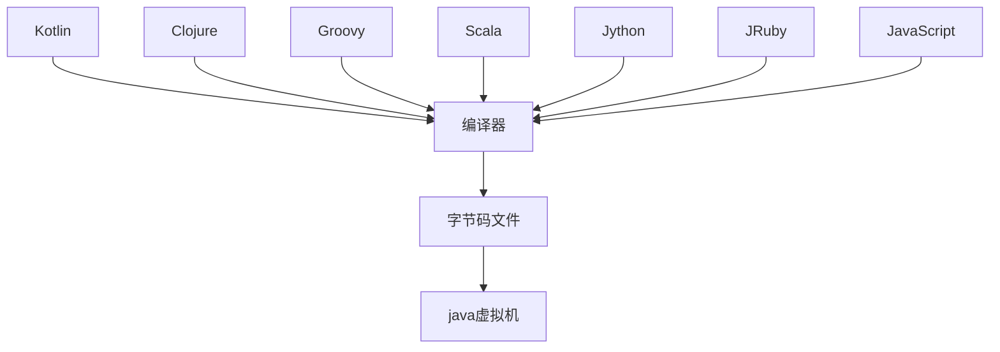
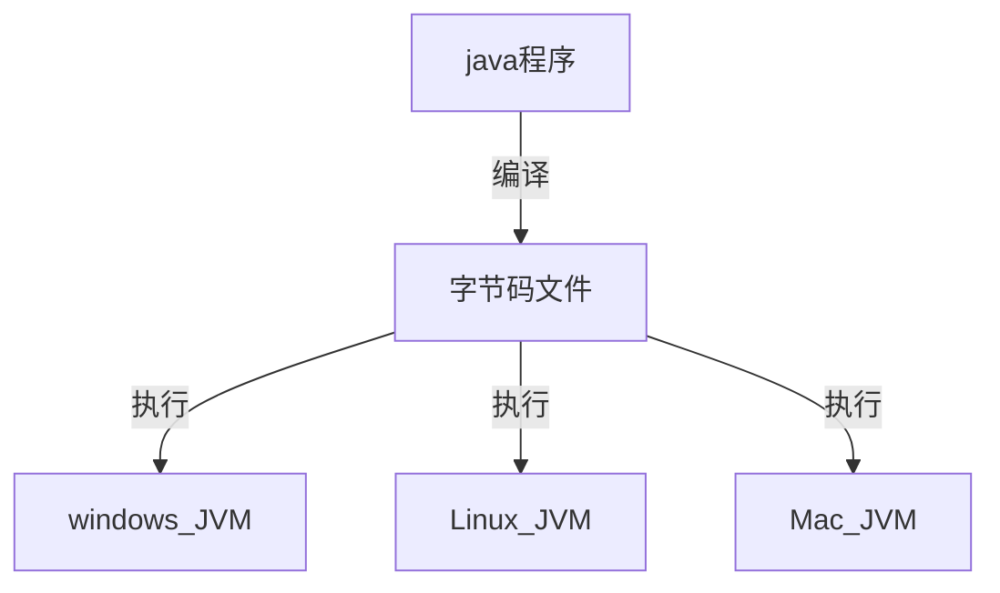
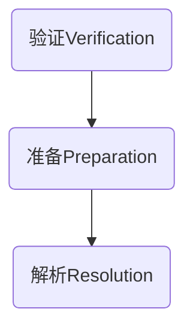
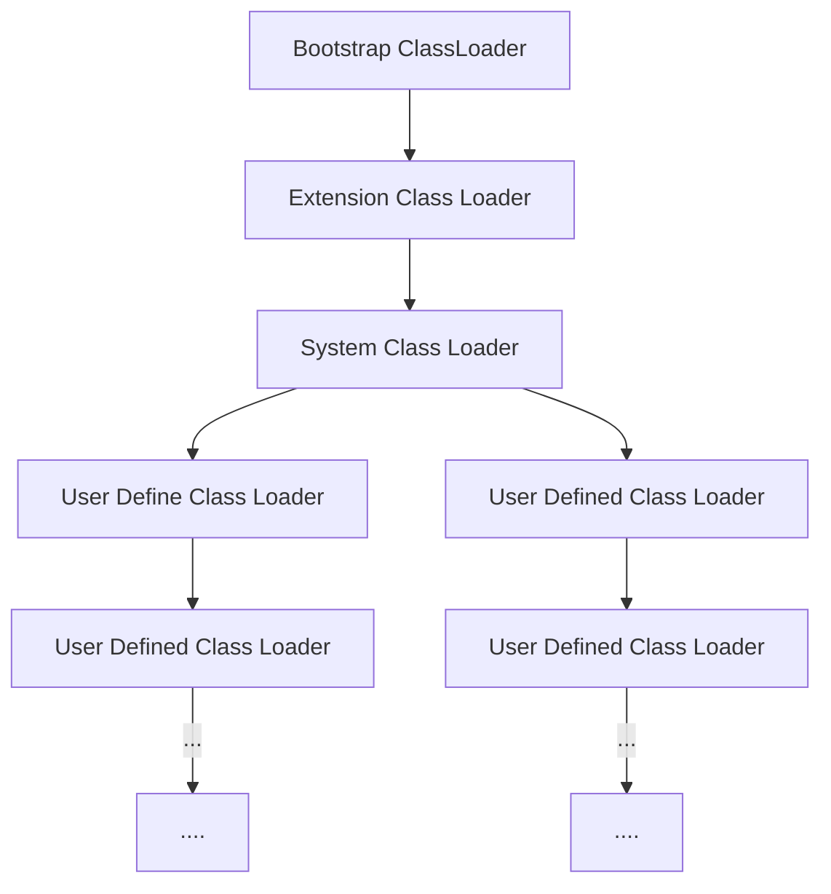
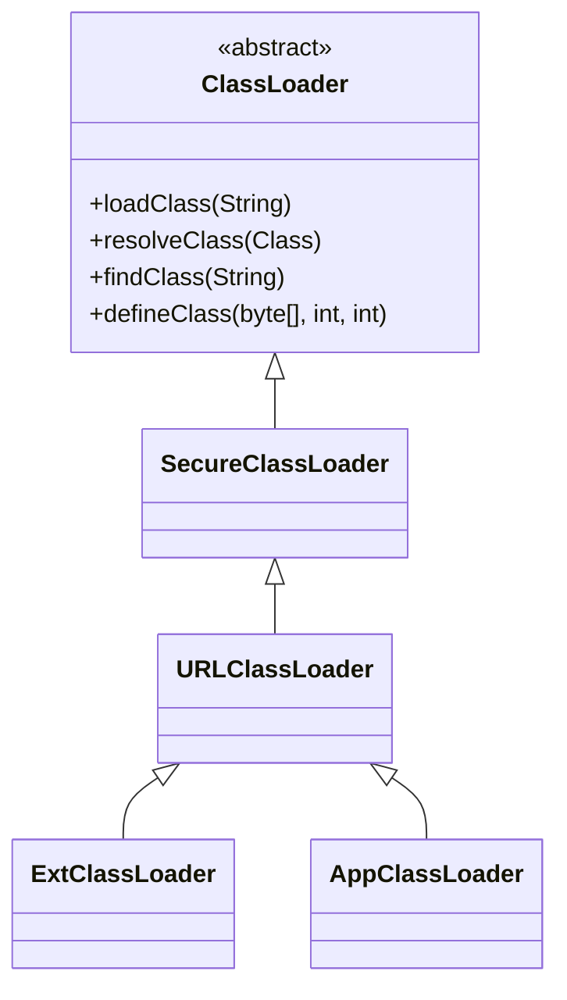

# JVM

[TOC]

## 1. JVM与java体系

`JVM`是一个跨语言的平台，在`java7`的发布之后，`java`虚拟机的设计者们通过`JSR-292`规范基本实现在`java`虚拟机上运行非`java`语言编写的程序



### 1.1 字节码

- 对于字节码的理解，任何能在`jvm`平台上执行的字节码格式都是一样的。所以应该统称为`jvm`字节码
- 不同的编译器，可以编译出相同的字节码文件，字节码文件也可以在不同的`JVM`上运行
- `java`虚拟机与`java`语言没有必然的联系，它只与特定的二进制文件格式——`Class`文件格式所关联，`class`文件中包含了`java`虚拟机指令集(或者称为字节码`Bytecodes`)和符号表，还有一些其它辅助信息

### 1.2 多语言混合编程

- `java`平台上，通过特定领域的语言去解决特定领域的问题是当前软件开发的一个趋势

- 某一个项目

  ```mermaid
  graph TD
  并行处理 --> Clojure
  展示层 --> JRuby/Rails
  中间层 --> Java
  ```

- 各种语言之间的交互不存在任何困难，就像使用自己语言的原生`API`一样，因为它们最终都运行在一个虚拟机上

- 对于运行在`java`虚拟机之上、`java`之外的语言，来自系统级、底层的支持正在迅速曾倩，以`JSR-292`为核心的一系列项目和功能改进

  ```
  Vinci Machine
  Nashorn
  InvokeDynamic
  java.lang.invoke
  ```


### 1.3 虚拟机

#### 1.3.1 虚拟机

- 所谓虚拟机`virtual machine`，就是一台虚拟的计算机，它是一款软件，用来执行一系列虚拟计算机指令。大体上，虚拟机可以分为系统虚拟机和程序虚拟机

  `virtual box`，`VMware`就属于系统虚拟机，它们完全是对物理计算机的仿真，提供了一个可运行完整操作系统的软件平台

  程序虚拟机的典型代表就是`java`虚拟机，它专门执行单个计算机程序而设计，在`java`虚拟机中执行的指令我们称为`java`字节码指令

- 无论是系统虚拟机还是程序虚拟机，在上面运行的软件都被限制于虚拟机提供的资源中

#### 1.3.2 java虚拟机

- `java`虚拟机是一台执行`java`字节码的虚拟计算机，它拥有独立的运行机制，其运行的`java`字节码也未必是`java`语言编译而成

- `JVM`平台的各种语言可以共享`java`虚拟机带来的跨平台性、优秀的垃圾回收器，以及可靠的即时编译器

- `java`技术的核心就是`java`虚拟机，因为所有的`java`程序都运行在`java`虚拟机内部

- `java`虚拟机就是二进制字节码的运行环境，负责装载字节码到其内部，解释/编译为对应平台上的机器指令执行。每一条`java`指令，`java`虚拟机规范都有详细定义

- 特点

  一次编译，到处运行

  自动内存管理

  自动垃圾回收机制

### 1.4 java整体结构

- `HotSpot VM`目前市面上高性能虚拟机的代表作之一
- 它采用解释起与即时编译器并存的架构


### 1.5 java代码执行流程



### 1.6 JVM架构模型

`java`编译器输入的指令流基本上是一种基于栈的指令集架构，另外一种指令集架构则是基于寄存器的指令集架构

具体来说：这两种架构之间的区别

#### 1.6.1 基于栈式架构

- 设计和实现更简单，适用于资源受限的系统
- 避开了寄存器的分配难题：使用零地址指令方式分配
- 指令流中的大部分是零地址指令，其执行过程依赖于操作栈。指令集更小，编译器容易实现
- 不需要硬件支持，可移植性好，更好实现跨平台

#### 1.6.2 基于寄存器架构

- 典型的应用是`x86`的二进制指令集：比如传统的`PC`以及`Android`的`Davlik`虚拟机
- 指令集架构则完全依赖硬件，可移植性差
- 性能优秀和执行高效
- 花费更少的指令完成一项操作
- 在大部分情况下，基于寄存器架构的指令集往往都以一地址指令、二地址指令和三地址指令为主，而基于栈式架构的指令集都是以零地址指令为主

#### 1.6.3 总结

由于跨平台性的设计，`Java`的指令都是根据栈来设计的。

### 1.7 JVM的生命周期

**虚拟机的启动**

`Java`虚拟机的启动是通过引导类加载器`bootstrap class loader`创建一个初始类`initial class` 来完成的，这个类是由虚拟机的具体实现指定的

**虚拟机的运行**

- 一个运行中的`JaVA`虚拟机有着一个清晰的任务：执行`java`程序
- 程序开始执行时它才运行，程序结束时它就停止
- 执行一个所谓的`Java`程序的时候，真真正正在执行的是一个叫做`Java`虚拟机的进程

**虚拟机的退出**

- 程序正常执行结束
- 程序在执行过程中遇到了异常或者错误而异常终止
- 由于操作系统出现错误而导致`Java`虚拟机进程终止
- 某线程调用`Runtime`类或`System`类的`exit`方法，或`Runtime`类的`Halt`方法，并且`Java`安全管理器也允许这次`exit`或`halt`操作
- 除此之外，`JNI(Java Native Interface)`规范描述了用`JNI Invocation API`来加载或卸载`Java`虚拟机时，`Java`虚拟机的退出情况

## 2. 类加载子系统

### 2.1 类加载的过程


- 类加载子系统负责从文件系统或者网络中加载`Class`文件，`class`文件在文件开头有特定的文件标识
- `ClassLoader`只负责`calss`文件的加载，至于它是否可以运行，则由`Execution Engine`决定
- 加载的类信息存放于一块称为方法区的内存空间。除了类的信息外，方法区中还会存放运行时常量池信息，可能还包括字符串字面量和数字常量(这部分常量信息是`Class`文件中常量池部分的内存映射)


#### 2.1.1 加载

1. 通过一个类的全限定名获取定义此类的二进制字节流
2. 将这个字节流所代表的静态存储结构转化为方法区的运行时数据结构
3. 在内存中生成一个代表这个类的`java.lang.Class`对象，作为方法区这个类的各种数据的访问入口

> **加载字节码文件的方式**

1. 从本地系统中直接加载
2. 通过网络获取`Web Applet`
3. 从压缩包中读取`zip`、`jar`、`war`
4. 运行时计算生成，动态代理技术
5. 由其他文件生成，典型场景：`JSP`应用
6. 从专有数据库中提取`.class`文件
7. 从加密文件中获取，典型的防`Class`文件被反编译的保护措施

#### 2.1.2 链接

链接包括



- 验证`Verify`

  目的在于确保`Class`文件的字节流中包含信息符合当前虚拟机的要求，保证加载类的正确性，不会危害虚拟机自身安全

  主要包括四种验证，文件格式验证，元数据验证，字节码验证，符号引用验证

- 准备`Prepare`

  为类变量分配内存并且设置该类的默认初始值，即零值

  这里包括含用`final`修饰的`static`，因为`final`在编译的时候就会分配了，准备阶段会显式初始化

  这里不会为实例变量分配初始化，类变量会分配在方法区中，而实例变量会随着对象一起分配到`java`堆中

- 解析`Resolve`

  将常量池内的符号引用转换为直接引用的过程

  事实上，解析操作往往会伴随着`JVM`在执行完初始化之后再执行

  符号引用就是一组符号来描述所引用的目标，符号引用的字面量形式明确定义在`Java`虚拟机规范的`Class`文件格式中，直接引用就是目标的指针、相对偏移量或一个间接定位到目标的句柄

  解析动作主要针对类或接口、字段、类方法、接口方法、方法类型等。对应常量池中的`CONSTANT_Class_info`、`CONSTANT_Fieldref_info`、`CONSTANT_Methodref_info`等

#### 2.1.3 初始化

- 初始化阶段就是执行类构造器方法`<clinit>()`的过程
- 此方法不需定义，是`javac`编译器自动收集类中的所有类变量的赋值动作和静态代码块中的语句合并而来
- 构造器方法中指令按语句在源文件中出现的顺序执行
- `<clinit>()`不同于类的构造器。(关联：构造器是虚拟机视角下的`<init>()`)
- 若该类具有父类，`JVM`会保证子类的`<clinit>()`执行前，父类的`<clinit>()`已执行完毕
- 虚拟机必须保证一个类的`<clinit>()`方法在多线程下被同步加锁

### 2.2 类加载器

- `JVM`支持两种类型的类加载器，分别是引导类加载器`Bootstrap ClassLoader`和自定义类加载器`User-Defined ClassLoader`
- 从概念上来讲，自定义类加载器一般指的是程序中由开发人员自定义的一类类加载器，但是`java`虚拟机规范却没有这么定义，而是将所有派生于抽象类`ClassLoader`的类加载器都划分为自定义类加载器
- 无论类加载器的类型如何划分，在程序中我们最常见的类加载器始终只有3个



四者的关系不是继承而是包含

```java
public class ClassLoaderTest {
    @Test
    public void test() {
        // 获取系统类加载器
        ClassLoader systemClassLoader = ClassLoader.getSystemClassLoader();
        System.out.println(systemClassLoader); // jdk.internal.loader.ClassLoaders$AppClassLoader@2437c6dc

        // 获取系统类加载器的上层，扩展类加载器
        ClassLoader extClassLoader = systemClassLoader.getParent();
        System.out.println(extClassLoader); // jdk.internal.loader.ClassLoaders$PlatformClassLoader@7c30a502

        // 获取扩展类加载器的上层，引导类加载器
        ClassLoader bootstrapClassLoader = extClassLoader.getParent();
        System.out.println(bootstrapClassLoader); // null

        // 对于用户自定义类来说，默认使用系统类加载器进行加载
        ClassLoader classLoader = ClassLoaderTest.class.getClassLoader();
        System.out.println(classLoader); // jdk.internal.loader.ClassLoaders$AppClassLoader@2437c6dc
    }
}
```

`Java`的核心类库都是使用引导类加载器进行加载的

#### 2.2.1 虚拟机再带的加载器

> **启动类加载器**

启动类加载器(引导类加载器，Bootstrap ClassLoader)

1. 这个类加载器是使用`C/C++`实现，嵌套在`JVM`内部
2. 并不是继承自`java.lang.ClassLoader`，没有父加载器
3. 是加载扩展类和应用程序的类加载器，并指定为他们的父类加载器
4. 处于安全的考虑，`Bootstrap`启动类只加载包名为`java`、`javax`、`sun`等开头的类

> **扩展类加载器**

扩展类加载器(Extension ClassLoader)

1. `Java`语言编写，由`sun.misc.Lanucher$ExClassLoader`实现
2. 派生于`ClassLoader`类，父类加载器为启动类加载器
3. 从`java.ext.dirs`系统属性所指定的目录中加载类库，或从`JDK`的安装目录的`jre/lib/ext`子目录下加载类库。如果用户创建的`JAR`放在此目录下，也会自动由扩展类加载器加载

> **应用程序类加载器**

1. `java`语言编写，由`sun.misc.Launcher$AppClassLoader`实现
2. 派生于`ClassLoader`类，父类加载器为扩展类加载器
3. 它负责加载环境变量`classpath`或系统属性`java.class.path`指定路径下的类库
4. 该类加载是程序中默认的类加载器，一般来说，`Java`应用的类都是由它来完成加载
5. 通过`ClassLoader.getSystemClassLoader()`方法可以获取到该类加载器

#### 2.2.2 用户自定义的加载器

大部分场景下，类的加载是由上述的三种类加载器相互配合执行，在一些特殊的场景下，可以自定义类加载器来定制类的加载方式

1. 隔离加载类
2. 修改类加载的方式
3. 扩展加载源
4. 防止源码泄露

自定义类加载器步骤

1. 开发人员可以通过继承抽象类`java.lang.ClassLoader`类的方式，实现自己的类加载器，一满足一些特殊的需求
2. 继承`ClassLoader`类名重写`findClass()方法`
3. 在编写自定义类加载器时，如果没有太过于复杂的需求，可以直接继承`URLClassLoader`类，这样就可以避免自己去编写`findClass()`方法及其获取字节码流的方式，使自定义类加载器编写更加简洁

#### 2.2.3 ClassLoader

`ClassLoader`类，它是一个抽象类，其后所有类加载器都继承自`ClassLoader`(不包括启动类加载器)

| 方法名称                                             | 描述                                                         |
| ---------------------------------------------------- | ------------------------------------------------------------ |
| getParent()                                          | 返回该类加载器的超类加载器                                   |
| loadClass(String name)                               | 加载名称为name的类，返回结果java.lang.Class类的实例          |
| findClass(String name)                               | 查找名称为name的类，返回结果java.lang.Class类的实例          |
| findLoadedClass(String name)                         | 查找名称为name且已经被加载过的类，返回结果java.lang.Class的实例 |
| defineClass(String name, byte[] b, int off, int len) | 把字节数组b中的内容转换为一个java类，返回结果为java.lang.Class的实例 |
| resolveClass(Class<?> c)                             | 连接指定的一个java类                                         |



### 2.3 双亲委派机制

`Java`虚拟机对`class`文件采用的是按需加载的方式，也就是说当需要使用该类时才会将它的`class`文件加载到内存生成`class`对象。而且加载某个类的`class`文件时，`Java`虚拟机采用的是双亲委派模式，即把请求交由父类处理，它是一种任务委派模式

#### 2.3.1 工作原理


1. 如果一个类加载器收到了类加载请求，它并不会自己先去加载，而是把这个请求委托给父类的加载器去执行
2. 如果父类加载器还存在其父类加载器，则进一步向上委托，依次递归，请求最终到达顶层的启动类加载器
3. 如果父类加载器可以完成类加载器任务，就成功返回，倘若父类加载器无法完成此加载任务，子加载器才会尝试自己去加载，这就是双亲委派模式

#### 2.3.2 双亲委派的优点

1. 避免类的重复加载

2. 保护程序安全，防止核心`API`被随意篡改

3. 沙箱安全机制

   如自定义`String`类，但是在加载自定义`String`类的时候会率先使用引导类加载器加载，而引导类加载器在加载的过程中会先加载`JDK`自己的包，所以就会忽略自定义的类。这样可以保证对`java`核心源代码的保护

### 2.4 其它

> 在`JVM`中表示两个`class`对象是否为同一个类的两个必要条件

1. 类的完整类名必须一致(含包名)
2. 加载这个类的`ClassLoader`必须相同

> **对类加载器的引用**

`JVM`必须知道一个类是由启动类加载器加载的还是用户自定义的类加载器加载的。如果一个类是由用户类加载器加载的，那么`JVM`会将这个类加载器的一个引用作为类型信息的一部分保存在方法区中。当解析一个类型到另一个类型的饮用个的时候，`JVM`需要保证这两个类型的类加载器是相同的

> **主动使用和被动使用**

**主动使用**

1. 创建类的实例

2. 访问某个类或接口的静态变量，或者对该静态变量赋值

3. 调用类的静态方法

4. 反射(Class.forName("xxxx"))

5. 初始化一个类的子类

6. `Java`虚拟机启动时被标明为启动类的类

7. `JDK7`开始提供的动态语言的支持

   `java.lang.invoke.MethodHandle`实例的解析结果

   `REF_getStatic`、`REF_putStatic`、`REF_invokeStatic`句柄对应的类没有初始化则初始化

**被动使用**

除了以上七种情况，其他使用`Java`类的方式都被看作是对类的被动使用，都不会导致类的初始化

## 3. 运行时数据区


内存是非常重要的系统资源，是硬盘和`CPU`的中间仓库及桥梁，承载着操作系统和应用程序的事实运行。`JVM`内存布局规定了`Java`在运行过程中内存申请、分配、管理的策略，保证了`JVM`的高效稳定运行。不同的`JVM`对于内存的划分方式和管理机制存在着差异


`Java`虚拟机定义了若干种程序运行期间会使用到的运行时数据区，其中有一些会随着虚拟机的启动而创建，随着虚拟机的退出而销毁。另外一些则是与线程一一对应的，这些与线程对应的数据区域会随着线程开始和结束而创建和销毁，比如第一幅图，红色的代表多个线程共享，灰色的代表单独线程私有

### 3.1 线程

1. 线程是一个程序里的运行单元。`JVM`允许一个应用有多个线程并行的执行
2. 在`Hostspot JVM`里，每个线程都与操作系统的本地线程直接映射。当一个`Java`想成准备好执行以后，此时一个操作系统的 本地线程也同时创建。`Java`线程执行终止后，本地线程也会回收
3. 操作系统负责所有线程的安排调度到任何一个可用的`CPU`上。一旦本地线程初始化成功后，它就会调用`Java`线程中的`run()`方法

使用调试工具，能够在后台看到有许多线程在运行，这些后台不包括调用`public static void main(String[] args)`的`main`线程以及所有这个`main`线程自己创建的线程

1. 虚拟机线程：这种线程的操作都是需要`JVM`达到安全点才会出现。这些操作必须在不同的线程中发生的原因是他们都需要`JVM`达到安全点，这样堆才不会变化。这种线程的执行类型包括`stop-the-world`的垃圾收集，线程栈收集，线程挂起以及偏向锁撤销
2. 周期任务线程：这种线程是时间周期事件的体现(比如中断)，他们一般用于周期性操作的调度执行
3. `GC`线程：这种线程对`JVM`里不同种类的垃圾收集行为提供了支持
4. 编译线程：这种线程在运行时会将字节码编译成本地代码
5. 信号调度线程：这种线程接受信号并发送给`JVM`，在它内部通过调用适当的方法进行处理

### 3.2 程序计数器

#### 3.2.1 基本介绍

`JVM`中的程序计数寄存器`Program Counter Register`中，`Register`的命名源于`CPU`的寄存器，寄存器存储指令相关的现场信息。`CPU`只有把数据装载到寄存器才能够运行

> **注意**

这里并非广义上的物理寄存器，`JVM`中的`PC`寄存器是对物理`PC`寄存器的一种抽象模拟。`PC`寄存器用来存储指向下一条指令的地址，也就是即将要执行的指令代码。由执行引擎读取下一条指令


1. 它是一块很小的内存空间，几乎可以忽略不计。也是运行速度最快的存储区域
2. 在`JVM`规范中，每个线程都有它自己的程序计数器，是线程私有的，生命周期与线程的生命周期保持一致
3. 任何时间一个线程都只有一个方法在执行，也就是所谓的当前方法。程序计数器会存储当前正在执行的`JVM`指令地址。特别地，如果是在执行`navtive`方法，则是未指定值`undefined`
4. 它是程序控制流的指示器，分支、循环、跳转、异常处理、线程恢复等基础功能都需要依赖这个计数器来完成
5. 字节码解释器工作时就是通过改变这个计数器的值来选取下一条需要执行的字节码指令
6. 它是唯一一个在`Java`虚拟机规范中没有规定任何`OutOtMemoryError`情况的区域

#### 3.2.2 实例

```java
public class Main {
    public static void main(String[] args) {
        int i = 10;
        int j = 20;
        int k = i + j;
    }
}
```

```
 0: bipush        10
 2: istore_1
 3: bipush        20
 5: istore_2
 6: iload_1
 7: iload_2
 8: iadd
 9: istore_3
 10: return
```

#### 3.2.3 常见问题

1. 使用`PC`寄存器存储字节码指令地址有什么用？

   因为`CPU`需要不停的切换各个线程，这时候切换回来以后，就需要知道接着从哪开始继续执行

   `JVM`的字节码解释器就需要通过改变`PC`寄存器的值来明确下一条应该执行什么样的字节码指令

2. `PC`寄存器为什么被设定为线程私有的?

   我们都知道所谓的多线程在一个特定的时间段内只会执行其中某一个线程的方法，`CPU`会不停地做任务切换，这样必然导致经常中断或者恢复。为了能够准确地记录各个线程正在执行的当前字节码指令地址，最好的办法就是为每一个线程都分配一个`PC`寄存器，这样依赖各个线程之间便可以进行独立计算，而不会出现相互干扰的情况

   由于`CPU`时间片轮限制，众多线程在并发执行过程中，任何一个确定的时刻，一个处理器或者多核处理器中的一个内核，只会执行某个线程中的一条指令。这样必然导致经常中断或恢复，所以每个线程在创建后，都会产生自己的程序计数器和栈帧，程序计数器在各个线程之间互不影响

## 4. 虚拟机栈

由于跨平台性的设计，`Java`的指令都是根据栈来设计的。不同平台`CPU`架构不同，所以不能设计为基于寄存器的

优点：跨平台，指令集小，编译器容易实现，缺点是性能下降，实现同样的功能需要执行更多的指令

### 4.1 基本介绍

> **java虚拟栈**

`Java`虚拟机栈`Java Virtual Machine Stack`，早期也叫`Java`栈。每个线程在创建时都会创建一个虚拟机栈(即线程私有)，其内部保存一个个的栈帧`Stack Frame`，对应着一次次的`Java`方法调用。

> **生命周期**

生命周期和线程一致

> **作用**

主管`Java`程序的运行，它保存方法的局部变量、部分结果，并参与方法的调用和返回

> **优点**

1. 栈是一种快速有效的分配存储方式，访问速度仅次于程序计数器

2. `JVM`直接对`Java`栈的操作只有两个：

   每个方法执行，伴随着进栈(入栈、压栈)

   执行结束后的出栈工作

3. 不存在垃圾回收问题


> **栈溢出**

`Java`虚拟机规范允许`Java`栈的大小是动态的或者是固定不变的

1. 如果采用固定大小的`Java`虚拟机栈，那每一个线程的`Java`虚拟机栈容量可以在线程创建的时候独立选定。如果线程请求分配的栈容量超过`Java`虚拟机栈允许的最大容量，`Java`虚拟机唱会抛出一个`StackOverflowError`异常
2. 如果`Java`虚拟机栈可以动态扩展，并且在尝试扩展的时候无法申请到足够的内存，或者在创建新的线程时没有足够的内存去创建对应的虚拟机栈，那`Java`虚拟机将会抛出一个`OutOfMemoryError`异常

> **设置栈的大小**

可以使用参数-Xss选项来设置线程的最大栈空间，栈的大小直接决定了函数调用的最大可达深度

```
-Xss256K // KB
-Xss256M // MB
-Xss256G // GB
```

### 4.2 栈的存储单位

1. 每个线程都有自己的栈，栈中的数据都是以栈帧`Stack Frame`的格式存在
2. 在这个线程上正在执行的每个方法都各自对应一个栈帧`Stack Frame`
3. 栈帧是一个内存区块，是一个数据集，维系着方法执行过程中的各种数据信息
4. 在一条活动线程中，一个时间点上，只会有一个活动的栈帧。即只有当前正在执行的方法的栈帧。即只有当前正在执行的方法的栈帧(栈顶栈帧)是有效的，这个栈帧被称为当前栈帧`Current Frame`，与当前栈帧相对应的方法就是当前方法`Current Method`，定义这个方法的类就是当前类`Current Class`
5. 执行引擎运行的所有字节码指令只针对当前栈帧进行操作
6. 如果改方法中调用了其他方法，对应的新的栈帧会被创建出来，放在栈的顶端，成为新的当前帧

> **运行原理**

1. 不同线程中所包含的栈帧是不允许存在相互引用的，即不可能在一个栈帧中引用另外一个线程的栈帧
2. 如果当前方法调用了其他方法，方法返回之际，当前栈帧会传回此方法的执行结果给前一个栈帧，接着，虚拟机栈会丢弃当前栈帧，使得前一个栈帧重新称为当前栈帧
3. `Java`方法有两种返回函数的方式，一种是正常的函数返回，使用`return`指令，另外一种抛出异常。不管使用哪种方式，都会导致栈帧被弹出

### 4.3 栈帧的内部结构

1. 局部变量表`Local Variables`
2. 操作数栈`Operand Stack`(表达式栈)
3. 动态链接`Dynamic Linking`(或指向运行时常量池的方法引用)
4. 方法返回地址`Return Address`(或方法正常退出或者异常退出的定义)

#### 4.3.1 局部变量表

1. 局部变量表也称为局部变量数组或本地变量表
2. 定义为一个数字数组，主要用于存储方法参数和定义在方法体内的局部变量，这些数据类型、对象引用`reference`，以及`returnAddress`类型
3. 由于局部变量表是建立在线程的栈上，是线程的私有数据，因此不存在数据安全问题
4. 局部变量表所需的容量大小是编译期确定下来的，并保存在方法的`Code`属性的`maximum local variables`数据项中。在方法运行期间是不会改变局部变量表的大小的