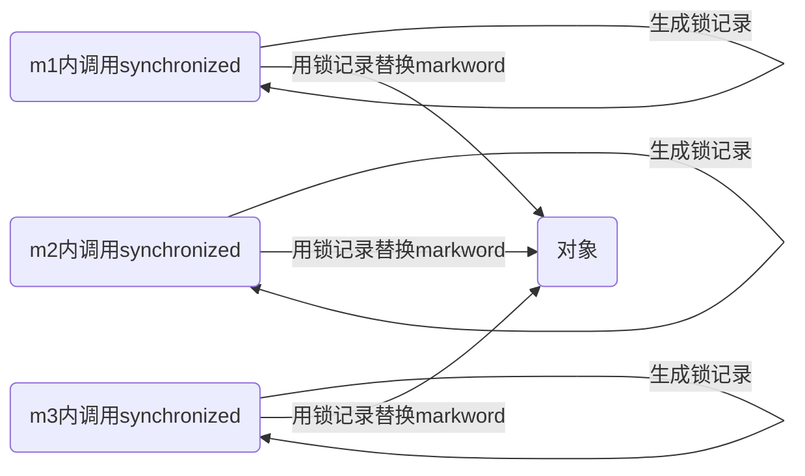
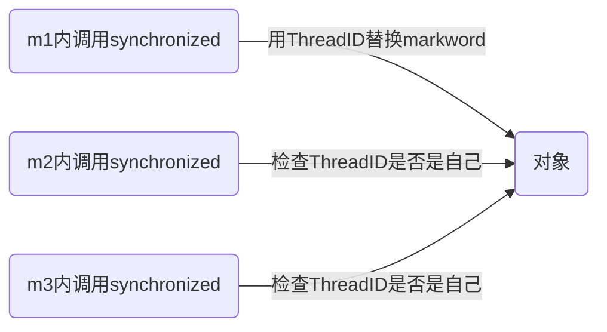
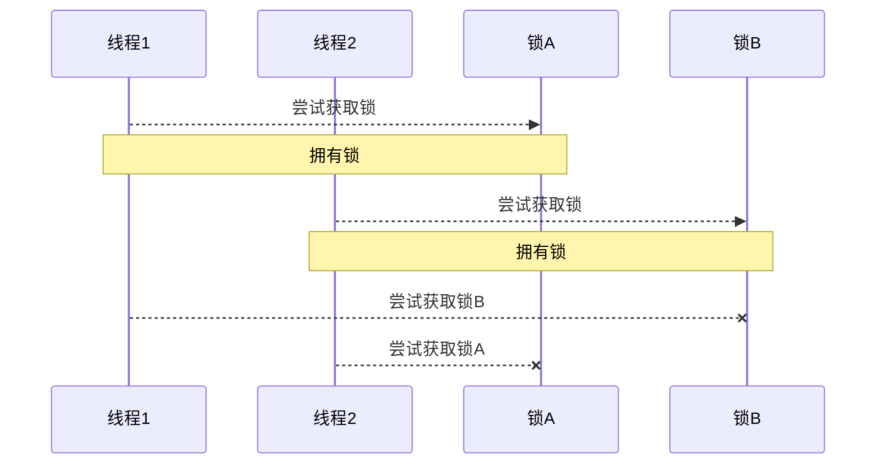
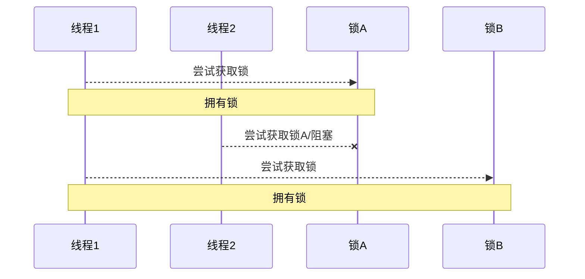
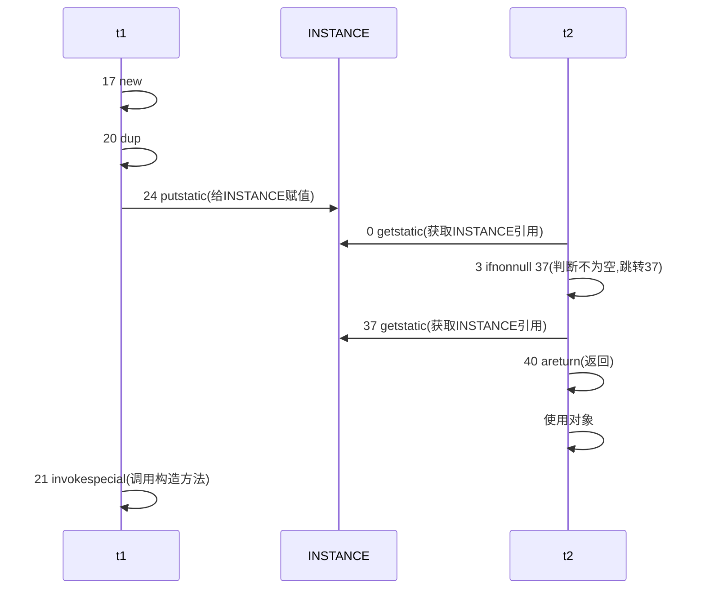
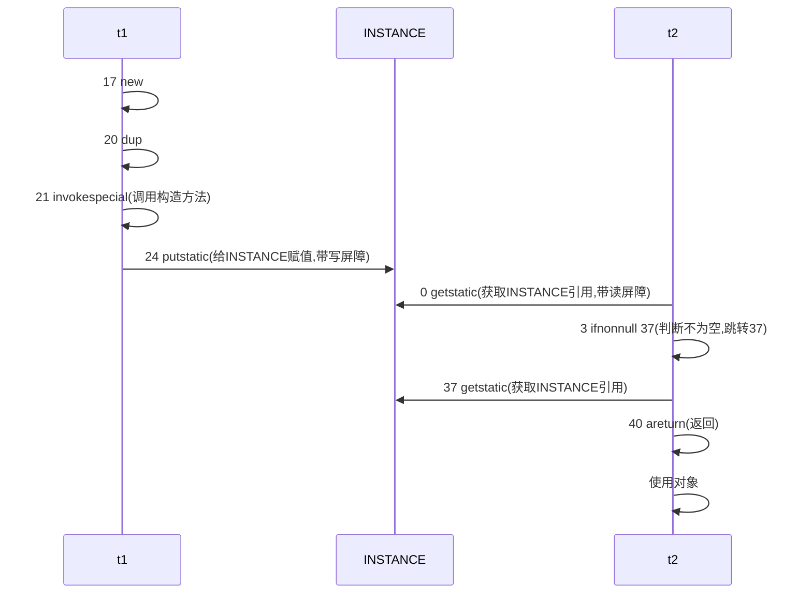
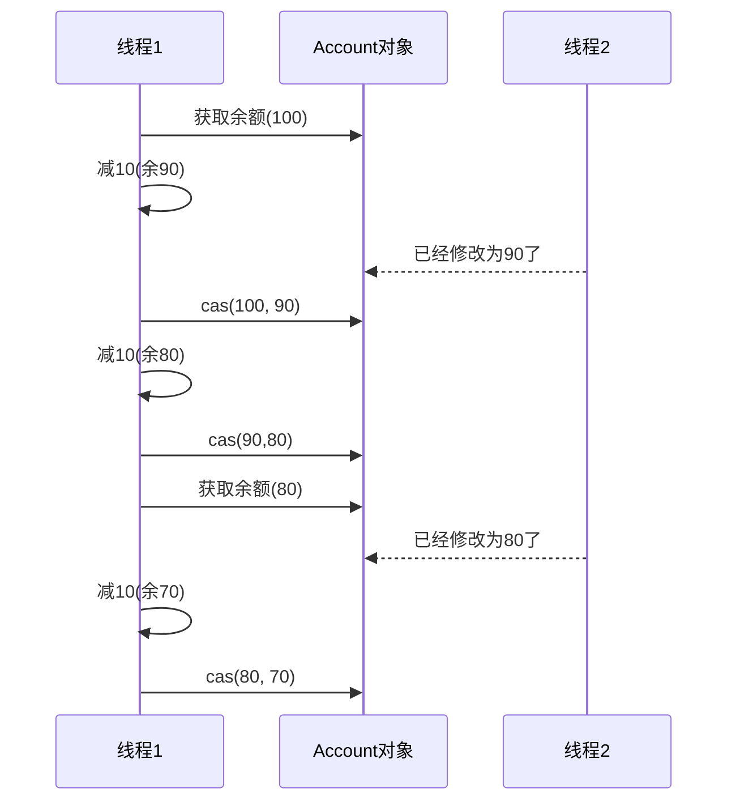
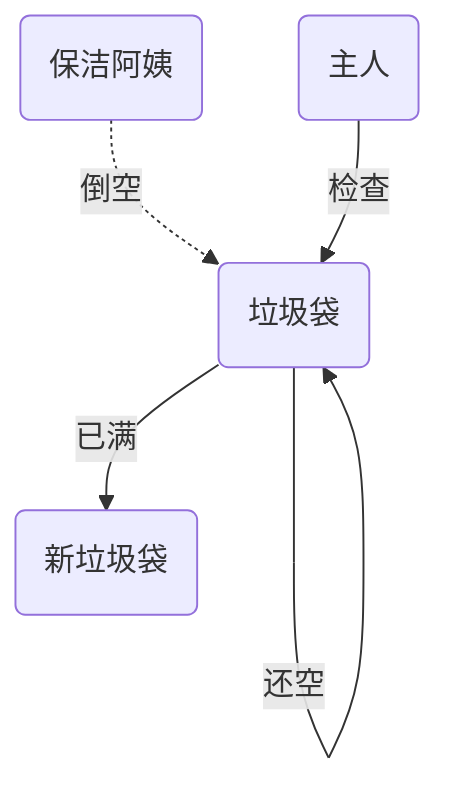
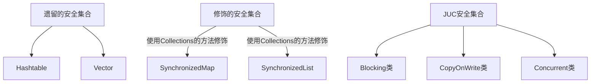

本项目所使用的依赖

```xml
<!--logback一般搭配slf4j使用-->
<dependency>
    <groupId>org.slf4j</groupId>
    <artifactId>slf4j-api</artifactId>
    <version>1.7.30</version>
</dependency>
<!--logback-classic包含logback-core的依赖-->
<dependency>
    <groupId>ch.qos.logback</groupId>
    <artifactId>logback-classic</artifactId>
    <version>1.2.3</version>
</dependency>
<dependency>
    <groupId>org.projectlombok</groupId>
    <artifactId>lombok</artifactId>
    <version>1.18.20</version>
    <scope>provided</scope>
</dependency>
<!--看对象头-->
<dependency>
    <groupId>org.openjdk.jol</groupId>
    <artifactId>jol-core</artifactId>
    <version>0.16</version>
</dependency>
```

`logback.xml`

```xml
<?xml version="1.0" encoding="UTF-8" ?>
<configuration>
    <property name="pattern" value = "%d{HH:mm:ss.SSS} 【%thread】 - %m %n" />
    <appender name="consoleAppender" class="ch.qos.logback.core.ConsoleAppender">
        <encoder class="ch.qos.logback.classic.encoder.PatternLayoutEncoder">
            <pattern>
                ${pattern}
            </pattern>
        </encoder>
    </appender>
    <root level="ALL">
        <appender-ref ref="consoleAppender"/>
    </root>
</configuration>
```

## 1. 线程

### 1.1 创建线程

1. 继承`Thread`类，重写`run`方法

    ```java
    @Slf4j(topic = "c.Test1")
    public class Test1 {
        public static void main(String[] args) {
            Thread t = new Thread() {
                @Override
                public void run() {
                    log.debug("running");
                }
            };
    
            t.start();
    
            log.debug("running");
        }
    }
    ```

2. 实现`Runnable`接口

    ```java
    @Slf4j
    public class Test2 {
        public static void main(String[] args) {
            Runnable runnable = new Runnable() {
                @Override
                public void run() {
                    log.debug("running");
                }
            };
            new Thread(runnable).start();
            log.debug("running");
        }
    }
    ```

3. `Callable`接口

    利用`FutureTask`来处理有返回结果的线程

    ```java
    @Slf4j
    public class Test3 {
        public static void main(String[] args) throws ExecutionException, InterruptedException {
            FutureTask<Integer> task = new FutureTask<>(new Callable<Integer>() {
                @Override
                public Integer call() throws Exception {
                    log.debug("running");
                    Thread.sleep(1000);
                    return 100;
                }
            });
    
            new Thread(task, "有返回值的线程").start();
            System.out.println(task.get());
        }
    }
    ```

### 1.2 线程的运行

1. 栈和栈帧

    `Java`虚拟机的内存由三部分组成堆、栈、方法区。每个线程启动后，虚拟机就会为其分配一块栈内存。

    每个栈由多个栈帧`Frame`组成，对应着每次方法调用时所占用的内存

    每个线程只能有一个活动栈帧，对应着当前正在执行的那个方法

2. 线程上下文切换`Thread Context Switch`

    因为以下一些原因导致`cpu`不再执行当前的线程，转而执行另外一个线程的代码

    - 线程的时间片用尽
    - 垃圾回收
    - 有更高优先级的线程需要运行
    - 线程自己调用了`sleep`、`yield`、`wait`、`jion`、`park`、`synchronized`、`lock`等方法

    当`Context Switch`发生时，需要由操作系统保存当前线程的**状态**，并恢复另一个线程的状态，`Java`中对应的概念就是程序计数器`Program Counter Register`，它的作用是记住下一条`JVM`指令的执行地址，是线程私有的属性

    - 状态包括程序计数器、虚拟机栈中每个栈帧的信息，如局部变量、操作数栈、返回地址等
    - `Context Switch`频繁发生会影响性能

### 1.3 常用方法

| 方法名           | 功能                                                         | 注意                                                         |
| ---------------- | ------------------------------------------------------------ | ------------------------------------------------------------ |
| start()          | 启动一个新线程，在新的线程运行run方法中的代码                | start方法只是让线程进入就绪，里面代码不一定立刻运行(CPU的时间片还没分给它)。每个线程对象的start方法只能调用一次，如果调用了多次会出现IllegalThreadStateException异常 |
| run()            | 新线程启动后会调用的方法                                     | 如果在构造Thread对象时传递了Runnable参数，则线程启动后会调用Runnable中的run方法，否则默认不执行任何操作。但可以创建Thread的子类对象，来覆盖默认行为 |
| join()           | 等待线程运行结束                                             |                                                              |
| join(long n)     | 等待线程运行结束，最多等待n毫秒                              |                                                              |
| getId()          | 获取县城长整型的id                                           | id唯一                                                       |
| getName()        | 获取线程名                                                   |                                                              |
| setName()        | 修改线程名                                                   |                                                              |
| getPriority()    | 获取线程优先级                                               |                                                              |
| setPriority(int) | 修改线程优先级                                               | java中规定线程优先级是1~10的整数，较大的优先级能提高该线程被CPU调度的几率 |
| getState()       | 获取线程状态                                                 | Java中线程状态是用6个enum表示，分别为：NEW、RUNNABLE、BLOCKED、WAITING、TIMED_WAITING、TERMINATED |
| isInterrupted()  | 判断是否被打断                                               | 不会清除打断标记                                             |
| isAlive()        | 线程是否存活                                                 |                                                              |
| interrupt()      | 打断线程                                                     | 如果打断的线程正在sleep、wait、join会导致被打断的线程抛出InterruptedException异常，并清除打断标记；如果打断的是正在运行的线程，则会设置打断标记；park的线程被打断，也会设置打断标记 |
| interrupted()    | static 判断当前线程是否被打断                                | 会清除打断标记                                               |
| currentThread()  | static 获取当前正在执行的线程                                |                                                              |
| sleep(long n)    | static 让前执行的线程休眠n毫秒，休眠时让出CPU的时间片给其他线程 |                                                              |
| yield()          | static 提示线程调度器让出当前线程调度器对CPU的使用           | 主要为了测试和调试                                           |

#### 1.3.1 sleep和yield

**sleep**

1. 调用`sleep`会让当前线程从`Running`进入`Timed Waiting`状态

    ```java
    @Slf4j
    public class Test5 {
        public static void main(String[] args) {
            Thread t1 = new Thread() {
                @Override
                public void run() {
                    try {
                        Thread.sleep(2000);
                    } catch (InterruptedException e) {
                        e.printStackTrace();
                    }
                }
            };
            t1.start();
            log.debug("{}", t1.getState());
            try {
                Thread.sleep(1000);
            } catch (InterruptedException e) {
                e.printStackTrace();
            }
            log.debug("{}", t1.getState());
        }
    }
    // 10:31:19.605 [main] DEBUG com.valid.concurrent.thread.Test5 - RUNNABLE
    // 10:31:20.611 [main] DEBUG com.valid.concurrent.thread.Test5 - TIMED_WAITING
    ```

2. 其它线程可以使用`interrupt`方法打断正在睡眠的线程，这时`sleep`方法会抛出`InterruptedException`

3. 睡眠结束后的线程未必会立刻得到执行

4. 建议用`TimeUnit`的`sleep`代替`Thread`的`sleep`来获得更好的可读性

**yield**

1. 调用`yield`会让前线程从`Running`进入`Runnable`状态，然后调度执行其他同优先级的线程。如果这时没有同优先级的线程，那么不能保证当前线程暂停的效果
2. 具体实现依赖于操作系统的任务调度器

**线程优先级**

`Thread`的`setPriority`方法可以设置线程的优先级，从低到高可以分为`1~10`个优先级，默认优先级为`5`

- 线程优先级会提示调度器优先调度该线程，但它仅仅是一个提示，调度器可以忽略它
- 如果`CPU`比较忙，那么优先级高的线程会获得更多的时间片，但`CPU`空闲时，优先级几乎没有作用

#### 1.3.2 join

在调用方角度来讲

- 需要等待结果返回，才能继续运行的是同步
- 不需要等待结果返回，就能继续运行就是异步

join方法的作用等待某个线程结束

```java
@Slf4j
public class Test6 {
    private static int num = 0;
    public static void main(String[] args) {
        Thread t = new Thread(() -> {
            try {
                TimeUnit.SECONDS.sleep(1);
                num = 10;
            } catch (InterruptedException e) {
                e.printStackTrace();
            }
        }, "t");
        t.start();
        try {
            // 等待t线程结束
            t.join();
        } catch (InterruptedException e) {
            e.printStackTrace();
        }
        log.debug(" num={}", num);
    }
}
```

#### 1.3.3 interrupt

每一个线程都会有一个打断标记，用于记录该线程是否被打断过。但是`sleep`、`wait`、`join`被打断后，会重置打断标记

打断`sleep`、`wait`、`join`阻塞状态的线程

```java
@Slf4j
public class Test7 {
    public static void main(String[] args) {
        Thread t1 = new Thread(() -> {
            log.debug("sleep...");
            try {
                TimeUnit.SECONDS.sleep(5);
            } catch (InterruptedException e) {
                log.info("线程被打断了");
                e.printStackTrace();
            }
        });
        t1.start();

        try {
            TimeUnit.SECONDS.sleep(1);
            t1.interrupt(); // 打断线程t1
        } catch (InterruptedException e) {
            e.printStackTrace();
        }
    }
}
```

打断正在运行的线程

```java
@Slf4j
public class Test8 {
    public static void main(String[] args) throws InterruptedException {
        Thread t1 = new Thread(() -> {
            while (true) {
                if (Thread.interrupted()) {
                    log.debug("线程被打断了");
                    break;
                }
            }
        });
        t1.start();

        TimeUnit.SECONDS.sleep(1);
        t1.interrupt();
    }
}
```

打断`park`线程，线程会在调用`park`的地方停止，使用`interrupt`可以重启线程（如果打断标记为真的情况下，`park`则会失效）

```java
@Slf4j
public class Test9 {
    public static void main(String[] args) throws InterruptedException {
        test();
    }

    private static void test() throws InterruptedException {
        Thread t1 = new Thread(() -> {
            log.debug("park...");
            LockSupport.park();
            log.debug("unpark...");
            log.debug("打断状态: {}", Thread.currentThread().isInterrupted());
        }, "t1");
        t1.start();

        TimeUnit.SECONDS.sleep(1);
        t1.interrupt();
    }
}
// 07:56:09.214 [t1] DEBUG com.valid.concurrent.thread.Test9 - park...
// 07:56:10.213 [t1] DEBUG com.valid.concurrent.thread.Test9 - unpark...
// 07:56:10.213 [t1] DEBUG com.valid.concurrent.thread.Test9 - 打断状态: true
```

### 1.4 不推荐的方法

这些方法已经过时，容易破坏同步代码块，造成线程死锁

| 方法名    | 功能说明           |
| --------- | ------------------ |
| stop()    | 停止线程运行       |
| suspend() | 挂起(暂停)线程运行 |
| resume()  | 恢复线程运行       |

### 1.5 主线程与守护线程

默认情况下，`Java`进程需要等待所有线程都运行结束，才会结束，有一种特殊的线程叫做守护线程，只要其它非守护线程运行结束了，即时守护线程的代码没有执行完，也会强制结束

```java
@Slf4j
public class Test10 {
    public static void main(String[] args) throws InterruptedException {
        Thread t1 = new Thread(() -> {
            while (true) {
                if (Thread.currentThread().isInterrupted()) {
                    break;
                }
            }
        });
        t1.setDaemon(true); // 设为守护线程
        t1.start();

        TimeUnit.SECONDS.sleep(1);
        log.debug("结束");
    }
}
```

应用场景

- 垃圾回收线程就是一种守护线程
- `Tomcat`中的`Acceptor`和`Poller`线程都是守护线程，所以`Tomcat`接受到`shutdown`命令后，不会等待它们处理完当前请求

### 1.6 线程状态

#### 1.6.1 五种状态

从操作系统的层面来描述


- 初始状态：仅是在语言层面创建了线程对象，还未与操作系统线程关联

- 可运行状态：(就绪状态)指该线程已经被创建(与操作系统关联)，可以由`CPU`调度执行

- 运行状态：指获取了`CPU`时间片运行中的状态

    当`CPU`时间片用完，会从运行状态转换为就绪状态，会导致线程的上下文切换

- 阻塞状态：

    如果调用了阻塞`API`，如`BIO`读写文件，这是该线程实际不会用到`CPU`，会导致线程上下文切换，进入阻塞状态

    等`BIO`操作完成，会由操作系统唤醒阻塞的线程，转换至可运行状态

    与可运行状态的区别是，对阻塞状态的线程来说只要它们一直不唤醒，调度器就一直不会考虑调度它们

- 终止状态表示线程已经执行完毕，生命周期已经结束，不会在转换为其他状态

#### 1.6.2 六种状态


从`Java`层面来描述，分为<font color='red'>**六种状态**</font>

- `NEW`： 线程刚被创建，但是还没有调用`start()`方法
- `RUNNABLE`： 当调用了`start()`方法之后，注意，`Java API`层面的`RUNNABLE`状态涵盖了操作系统层面的可运行状态、运行状态和阻塞状态(由于`BIO`导致的线程阻塞，在`Java`里无法区分，仍然认为是可运行)
- `BLOCKED`、`WAITING`、`TIMED_WAITING`都是`Java API`层面对阻塞状态的细分
- `TERMINATED`当线程代码运行结束

```java
@Slf4j
public class Test11 {
    public static void main(String[] args) {
        Thread t1 = new Thread(() -> {
            log.debug("running....");
        }, "t1");

        Thread t2 = new Thread(() -> {
            while (true) {}
        }, "t2");
        t2.start();

        Thread t3 = new Thread(() -> {
            log.debug("running....");
        }, "t3");
        t3.start();

        Thread t4 = new Thread(() -> {
            synchronized (Test11.class) {
                try {
                    TimeUnit.SECONDS.sleep(1000);
                } catch (InterruptedException e) {
                    e.printStackTrace();
                }
            }
        }, "t4");
        t4.start();

        Thread t5 = new Thread(() -> {
            try {
                t2.join();
            } catch (InterruptedException e) {
                e.printStackTrace();
            }
        }, "t5");
        t5.start();

        Thread t6 = new Thread(() -> {
            synchronized (Test11.class) {
                try {
                    TimeUnit.SECONDS.sleep(1000);
                } catch (InterruptedException e) {
                    e.printStackTrace();
                }
            }
        }, "t6");
        t6.start();

        try {
            TimeUnit.MILLISECONDS.sleep(500);
        } catch (InterruptedException e) {
            e.printStackTrace();
        }
        log.debug("t1 {}", t1.getState()); // NEW
        log.debug("t2 {}", t2.getState()); // RUNNABLE
        log.debug("t3 {}", t3.getState()); // TERMINATED
        log.debug("t4 {}", t4.getState()); // TIMED_WAITING
        log.debug("t5 {}", t5.getState()); // WAITING
        log.debug("t6 {}", t6.getState()); // BLOCKED
    }
}
```

## 2. 共享模型之管程

### 2.1 共享的问题

并发可能会出现的问题

```java
@Slf4j
public class Test1 {
    private static int count = 0;
    public static void main(String[] args) throws InterruptedException {
        Thread t1 = new Thread(() -> {
            for (int i = 0; i < 5000; i++) {
                count++;
            }
        }, "t1");
        Thread t2 = new Thread(() -> {
            for (int i = 0; i < 5000; i++) {
                count--;
            }
        }, "t2");

        t1.start();
        t2.start();

        // 主线程等待计算结果完成
        t1.join();
        t2.join();
        log.debug("{}", count); // 一个小于5000的随机数
    }
}
```

**临界区**：一段代码内如果存在对共享资源的多线程读写操作，称这段代码为临界区

一个程序运行多个线程本身是没有问题的，问题出现在多个线程访问共享资源

- 多个线程读共享资源基本上没有问题
- 多个线程对共享资源进行写操作时发生指令交错，就会出现问题

多个线程在临界区内执行，由于代码的执行序列不同而导致结果无法预测，称之为发生了竞态条件

为了避免临界区的竞态条件，有多种手段可以达到目的

- 阻塞式：`synchronized`、`Lock`
- 非阻塞式：原子变量

### 2.2 synchronized

`synchronized`(对象锁)：它采用互斥的方式让同一时刻至多只有一个线程能持有【对象锁】，其他线程再想获取这个【对象锁】时就会阻塞。这样就能保证拥有锁的线程可以安全的执行临界区内的代码，不用担心线程上下文切换

#### 2.2.1 案例改造

```java
@Slf4j
public class Test1 {
    private static int count = 0;
    public static void main(String[] args) throws InterruptedException {
        Thread t1 = new Thread(() -> {
            for (int i = 0; i < 5000; i++) {
                synchronized (Test1.class) {
                    count++;
                }
            }
        }, "t1");
        Thread t2 = new Thread(() -> {
            for (int i = 0; i < 5000; i++) {
                synchronized (Test1.class) {
                    count--;
                }
            }
        }, "t2");

        t1.start();
        t2.start();

        // 主线程等待计算结果完成
        t1.join();
        t2.join();
        log.debug("{}", count); // 0
    }
}
```

`synchronized`实际是用对象锁保证了临界区内代码的原子性，临界区内的代码对外是不可分割的，不会被线程切换所打断

#### 2.2.2 优化

在实际的开发中，一般有专门的资源类用于管理共享资源

```java
@Slf4j
public class Test1 {
    public static void main(String[] args) throws InterruptedException {
        Resource res = new Resource();
        Thread t1 = new Thread(() -> {
            for (int i = 0; i < 5000; i++) {
                res.increment();
            }
        }, "t1");
        Thread t2 = new Thread(() -> {
            for (int i = 0; i < 5000; i++) {
                res.decrement();
            }
        }, "t2");

        t1.start();
        t2.start();

        // 主线程等待计算结果完成
        t1.join();
        t2.join();
        log.debug("{}", res.getCounter()); // 0
    }
}
class Resource{
    private int counter = 0;

    public void increment() {
        synchronized (this) {
            counter++;
        }
    }

    public void decrement() {
        synchronized (this) {
            counter--;
        }
    }

    public int getCounter() {
        synchronized (this) {
            return counter;
        }
    }
}
```

`synchronized`也是可以加在方法上的，如果加在(非静态)方法上，锁依然是`this`对象

```java
@Slf4j
public class Test1 {
    public static void main(String[] args) throws InterruptedException {
        Resource res = new Resource();
        Thread t1 = new Thread(() -> {
            for (int i = 0; i < 5000; i++) {
                res.increment();
            }
        }, "t1");
        Thread t2 = new Thread(() -> {
            for (int i = 0; i < 5000; i++) {
                res.decrement();
            }
        }, "t2");

        t1.start();
        t2.start();

        // 主线程等待计算结果完成
        t1.join();
        t2.join();
        log.debug("{}", res.getCounter()); // 0
    }
}
class Resource{
    private int counter = 0;

    public synchronized void increment() {
        counter++;
    }

    public synchronized void decrement() {
        counter--;
    }

    public synchronized int getCounter() {
        return counter;
    }
}
```

如果`synchronized`加在静态方法上，锁是当前对象

### 2.3 线程安全分析

#### 2.3.1 安全分析

**成员变量和静态变量是否线程安全？**

如果它们没有共享，则线程安全

如果他们被共享了，根据他们的状态是否能够改变，又分为两种情况

- 如果只有读操作，则线程安全
- 如果有读写操作，则这段代码是临界区，需要考虑线程安全

**局部变量是否线程安全？**

局部变量是线程安全的

但局部变量引用的对象则未必

- 如果该对象没有逃离方法的作用访问，它是线程安全的
- 如果该对象逃离方法的作用范围，需要考虑线程安全

**局部变量线程安全分析**

```java
public static void test() {
    int i = 10;
    i++;
}
```

栈内存是每个线程独享的，线程在创建时，会分配独立的栈内存，所以上述代码是线程安全的

#### 2.3.2 常见安全类

- `String`
- `Integer`
- `StringBuffer`
- `Random`
- `Vector`
- `Hashtable`
- `java.util.concurrent`包下的类

这里说它们是线程安全的是指，多个线程调用它们同一个实例的某个方法时，是线程安全的。也可以理解为

- 它们的每个方法是原子的
- 但注意它们多个方法的组合不是原子的

#### 2.3.3 不可变线程安全性

`String`、`Integer`等都是不可变类，因为其内部状态不可以改变，因此它们的方法都是线程安全的

### 2.4 Monitor

#### 2.4.1 对象头

`java`对象头,每一个`java`对象都有一个对象头用于存储一些额外的信息，以32为虚拟机为例

<table style="text-align:center">
	<caption><h5>普通对象</h5></caption>
	<tr>
	    <th colspan="2">Object Header(64bits)</th>
	</tr >
	<tr >
	    <td>Mark Word(32bits)</td>
	    <td>Klass Word(32bits)(类对象)</td>
	</tr>
</table>

<table style="text-align:center">
	<caption><h5>数组对象</h5></caption>
	<tr>
	    <th colspan="3">Object Header(96bits)</th>
	</tr >
	<tr >
	    <td>Mark Word(32bits)</td>
	    <td>Klass Word(32bits)</td>
        <td>Array length(32bits)</td>
	</tr> 
</table>

<table style="text-align:center">
	<caption><h5>Mark World的结构</h5></caption>
	<tr>
	    <th colspan="5">Object Header(96bits)</th>
        <th>State</th>
	</tr>
	<tr>
	    <td colspan="2">hashcode(25bits)</td>
	    <td>age(4bits)</td>
        <td>biased_lock(1bits是否为偏向锁)</td>
        <td>01(2bits加锁状态)</td>
        <td>Normal</td>
	</tr>
    <tr>
	    <td>thread(25bits)</td>
        <td>epoch(2bits)</td>
	    <td>age(4bits)</td>
        <td>biased_lock(1bits是否为偏向锁)</td>
        <td>01(2bits加锁状态)</td>
        <td>Biased</td>
	</tr>
    <tr>
	    <td colspan="4">ptr_to_lock_record(30bits)</td>
        <td>00(2bits加锁状态)</td>
		<td>Lightweight Locked</td>
	</tr>
    <tr>
	    <td colspan="4">ptr_to_heavyweight_monitor(30bits)</td>
        <td>10(2bits加锁状态)</td>
		<td>Heavyweight Locked</td>
	</tr>
    <tr>
	    <td colspan="4"></td>
        <td>11(2bits加锁状态)</td>
		<td>Marked for GC</td>
	</tr>
</table>

#### 2.4.2 Monitor

`Monitor`被翻译为**监视器**或**管程**

每个`Java`对象都可以关联一个`Monitor`对象，如果使用`synchronized`给对象上锁(重量级)之后，该对象头的`Mark Word`中就被设置指向`Monitor`对象的指针


1. 刚开始`Monitor`中`Owner`为`null`，`obj`的`MarkWord`并无指向
2. 当`Thread-1`执行`synchronized(obj)`就会将`Monitor`的所有者`Owner`置为`Thread-1`，`Monitor`中只能有一个`Owner`
3. 在`Thread-1`上锁的过程中，如果`Thread-2`、`Thread-3`、`...`也来执行`synchronized(obj)`，就会计入`EntryList`阻塞队列中
4. 当`Thread-1`执行完同步代码块的内容，然后唤醒`EntryList`中等待的线程来竞争锁，竞争的时候是非公平的
5. `Thread-0`则是之前获得过锁，但条件不满足进入`WATIING`状态的线程

> 注意

- `synchronized`必须是进入同一个对象的`monitor`才有上述的效果
- 不加`synchronized`的对象不会关联监视器，不遵从上述规则

### 2.5 synchronized进阶

#### 2.5.1 轻量级锁

轻量级锁的使用场景：如果一个对象虽然有多线程访问，但多线程访问的时间是错开的(也就是没有竞争)，那么可以使用轻量级锁来优化

轻量级锁对使用者是透明的，即语法仍然是`synchronized`

假设有两个方法同步块，利用同一个对象加锁

```java
public class Test {
    private static final Object lock = new Object();

    public static void method1() {
        synchronized (lock) {
            method2();
        }
    }

    public static void method2() {
        synchronized (lock) {
            // 同步代码...
        }
    }
}
```

> 执行过程

1. 创建锁记录`Lock Record`对象，每个线程的栈帧都会包含一个锁记录的结构，内部可以存储锁定对象的`Mark Word`

    

2. 让锁记录中`Object reference`指向锁对象，并尝试用`cas`(原子操作)替换`Object`的`Mark Word`，将`Mark Word`的值存入锁记录

    

3. 如果`cas`交换成功，对象头中存储了锁记录地址和状态`00`，表示由该线程给对象加锁，这时图示如下

    

4. 如果`cas`失败，有两种情况

    如果是其它线程已经持有了该`Object`的轻量级锁，这时表明有竞争，进入锁膨胀过程

    如果是自己执行了**synchronized锁重入**，那么再添加一条`Lock Record`作为重入的计数(对应代码进入`method2`方法的临界区时)

    

5. 当退出`synchronized`代码块(解锁时，即退出`method2`方法时)如果有取值为`null`的锁记录，表示有重入，这时重置锁记录，表示重入计数减一

    

6. 当退出`synchronized`代码块(解锁时，即退出`method1`方法时)锁记录的值不为`null`，这是使用`cas`将`Mark Word`的值恢复给对象头

    成功，则解锁成功

    失败，说明轻量级锁进行了锁膨胀或已升级为重量级锁，进入重量级锁解锁流程

#### 2.5.2 锁膨胀

如果在尝试加轻量级锁的过程中，`CAS`操作无法成功，这时一种情况就是有其他线程为此对象加上了轻量级锁(有竞争)，这时需要进行锁膨胀，将轻量级锁变为重量级锁

```java
public class Test {
    private static final Object lock = new Object();

    public static void method() {
        synchronized (lock) {
            // 同步代码...
        }
    }
}
```

> 执行过程

1. 当`Thread-1`进行轻量级加锁时，`Thread-0`已经对该对象加了轻量级锁

    

2. 这时`Thread-1`加轻量级锁失败，进入锁膨胀流程

    即为`Object`对象申请`Monitor`锁，让`Object`指向重量级锁地址

    然后自己进入`Monitor`的`EntryList BLOCKED`

    

3. 当`Thread-0`退出同步代码块解锁时，使用`cas`将`Mark Word`的值恢复给对象头，一定会失败。这时会进入重量级锁解锁流程，即按照`Monitor`地址找到`Monitor`对象，设置`Owner`为`null`，唤醒`EntryList`中`BLOCKED`线程

#### 2.5.3 自旋优化(重量级锁)

重量级锁竞争的时候，还可以使用自旋来进行优化，如果当前线程自旋成功(即这时候持锁线程已经退出了同步块，释放了锁)，这时当前线程就可以避免阻塞

> 自旋重试成功的情况

| 线程1(CPU1上)           | 对象Mark                | 线程2(CPU上)            |
| ----------------------- | ----------------------- | ----------------------- |
|                         | 10(重量级锁)            |                         |
| 访问同步块，获取monitor | 10(重量级锁) 重量锁指针 |                         |
| 成功 (加锁)             | 10(重量级锁) 重量锁指针 |                         |
| 执行同步块              | 10(重量级锁) 重量锁指针 |                         |
| 执行同步块              | 10(重量级锁) 重量锁指针 | 访问同步块，获取monitor |
| 执行同步块              | 10(重量级锁) 重量锁指针 | 自旋重试                |
| 执行完毕                | 10(重量级锁) 重量锁指针 | 自旋重试                |
| 成功 (解锁)             | 01(无锁) 重量锁指针     | 自旋重试                |
|                         | 10(重量级锁) 重量锁指针 | 成功 (加锁)             |
|                         | 10(重量级锁) 重量锁指针 | 执行同步块              |
|                         | ...                     | ...                     |

> 自旋重试失败的情况

| 线程1(CPU1上)           | 对象Mark                | 线程2(CPU上)            |
| ----------------------- | ----------------------- | ----------------------- |
|                         | 10(重量级锁)            |                         |
| 访问同步块，获取monitor | 10(重量级锁) 重量锁指针 |                         |
| 成功 (加锁)             | 10(重量级锁) 重量锁指针 |                         |
| 执行同步块              | 10(重量级锁) 重量锁指针 |                         |
| 执行同步块              | 10(重量级锁) 重量锁指针 | 访问同步块，获取monitor |
| 执行同步块              | 10(重量级锁) 重量锁指针 | 自旋重试                |
| 执行同步块              | 10(重量级锁) 重量锁指针 | 自旋重试                |
| 执行同步块              | 01(无锁) 重量锁指针     | 自旋重试                |
| 执行同步块              | 10(重量级锁) 重量锁指针 | 阻塞                    |
|                         | ...                     | ...                     |

- 在`Java6`之后自旋锁是自适应的，比如对象刚刚的一次自旋操作成功过，那么认为这次自旋成功的可能性会高，就会多自旋几次
- 自旋会占用`CPU`时间，单核`CPU`自旋就是浪费，多核`CPU`自旋才能发挥优势
- `Java7`之后不能控制是否开启自旋功能

#### 2.5.4 偏向锁

轻量级锁在没有竞争时(就自己这个线程)，每次重入仍然需要执行`CAS`操作

`Java6`中引入了偏向锁来做进一步优化：只有第一次使用`CAS`将线程`ID`设置到对象的`Mark Word`头，之后发现这个线程`ID`是自己的就表示没有竞争，不用重新`CAS`。以后只要不发生竞争，这个独享就归该线程所有

```java
public class Test1 {
    private static final Object lock = new Object();

    public static void m1() {
        synchronized (lock) {
            method2();
        }
    }

    public static void m2() {
        synchronized (lock) {
            method3();
        }
    }
    
    public static void m3() {
        synchronized (lock) {
            // 同步代码...
        }
    }
}
```

> 轻量级锁



> 偏向锁



**偏向状态**

<table style="text-align:center">
	<caption><h5>Mark Word的结构</h5></caption>
	<tr>
	    <th colspan="6">Mark Word(64bits)</th>
        <th>State</th>
	</tr>
	<tr>
        <td>unused:25</td>
	    <td>hashcode:31</td>
        <td>unused:1</td>
	    <td>age:4</td>
        <td>biased_lock:0(是否为偏向锁)</td>
        <td>01(加锁状态)</td>
        <td>Normal</td>
	</tr>
    <tr>
	    <td>thread:54</td>
        <td>epoch:2</td>
        <td>unused:1</td>
	    <td>age:4</td>
        <td>biased_lock:1(是否为偏向锁)</td>
        <td>01(加锁状态)</td>
        <td>Biased</td>
	</tr>
    <tr>
	    <td colspan="5">ptr_to_lock_record:62</td>
        <td>00(加锁状态)</td>
		<td>Lightweight Locked</td>
	</tr>
    <tr>
	    <td colspan="5">ptr_to_heavyweight_monitor:62</td>
        <td>10(加锁状态)</td>
		<td>Heavyweight Locked</td>
	</tr>
    <tr>
	    <td colspan="5"></td>
        <td>11(加锁状态)</td>
		<td>Marked for GC</td>
	</tr>
</table>

```java
@Slf4j
public class Test2 {
    public static void main(String[] args) {
        Dog dog = new Dog();
        log.debug(ClassLayout.parseInstance(dog).toPrintable()); 		// 0x0000000000000005
        synchronized (dog) {
            log.debug(ClassLayout.parseInstance(dog).toPrintable()); 	// 0x000001aef93bc005
        }
        log.debug(ClassLayout.parseInstance(dog).toPrintable()); 		// 0x000001aef93bc005
    }
}

class Dog{

}
```

一个对象创建时：

- 如果开启了偏向锁(默认开启)，那么对象创建后，`MarkWord`值为`0x05`即最后3位为101，这是它的`thread`、`epoch`、`age`都为0
- 偏向锁是默认延迟的，不会在程序启动时立即生效，如果想避免延迟，可以添加`JVM`参数`-XX:BiasedLockingStartupDelay=0`来禁用延迟
- 如果没有开启偏向锁，那么对象创建后，`markword`值为`0x01`即最后三位为`001`，这时它的`hashcode`、`age`都为0，第一次用到`hashcode`时才会赋值
- 可以添加`-XX:-UseBiasedLocking`禁用偏向锁

**撤销-调用hashcode**

当一个可偏向的对象，调用`hashcode`方法后，会变成不可偏向的正常状态

```java
@Slf4j
public class Test2 {
    public static void main(String[] args) {
        Dog dog = new Dog();
        dog.hashCode();
        log.debug(ClassLayout.parseInstance(dog).toPrintable());      // 0x00000063e2203c01 正常对象
        synchronized (dog) {
            log.debug(ClassLayout.parseInstance(dog).toPrintable());   // 0x000000e5a2eff230 轻量级锁
        }
        log.debug(ClassLayout.parseInstance(dog).toPrintable());      // 0x00000063e2203c01 正常对象
    }
}

class Dog{

}
```

**撤销-其他线程使用对象**

当有其他线程使用偏向锁对象时，会将偏向锁升级为轻量级锁

```java
@Slf4j
public class Test {
    public static void main(String[] args) {
        Dog dog = new Dog();

        new Thread(() -> {
            log.debug(ClassLayout.parseInstance(dog).toPrintable()); 		// 0x0000000000000005
            synchronized (dog) {
                log.debug(ClassLayout.parseInstance(dog).toPrintable()); 	// 0x000002919fb25005
            }
            log.debug(ClassLayout.parseInstance(dog).toPrintable()); 		// 0x000002919fb25005
            synchronized (Test.class) {
                Test.class.notify();
            }
        }, "t1").start();

        new Thread(() -> {
            synchronized (Test.class) {  // 与线程1交错执行，确保为轻量级锁
                try {
                    Test.class.wait();
                } catch (InterruptedException e) {
                    e.printStackTrace();
                }
            }
            log.debug(ClassLayout.parseInstance(dog).toPrintable()); 	// 0x000002919fb25005 偏向锁
            synchronized (dog) {
                log.debug(ClassLayout.parseInstance(dog).toPrintable());// 0x000000a3fddfece8 轻量级锁
            }
            log.debug(ClassLayout.parseInstance(dog).toPrintable()); 	// 0x0000000000000001 正常对象
        }, "t2").start();
    }
}

class Dog{

}
```

**撤销-调用wait/notify**

`wait/notify`是重量级锁特有的，所以调用`wait/notify`会撤销偏向锁，转换为重量级锁

**批量重偏向**

如果对象虽然被多个线程访问，但没有竞争，这时偏向了线程`T1`的对象仍有机会重新偏向`T2`，重偏向会重置对象的`ThreadID`

当撤销偏向锁阈值超过20次后，`JVM`会这样觉得，我是不是偏向错了呢，于是会在给这些对象加锁时重新偏向至加锁线程

**批量撤销**

当撤销偏向锁阈值超过40次后，`JVM`会这样觉得，自己确实偏向错了。根本不应该偏向。于是整个类的所有对象都会变为不可偏向的，新建的对象也是不可偏向的

#### 2.5.5 锁消除

```java
public class Test {
    private int x = 0;
    
    public void test1() {
        x++;
    }
    
    public void test2() {
        Object obj = new Object();
        synchronized (obj) {
            x++;
        }
    }
}
```

实际运行测试可以得知`test1()`和`test2()`的性能几乎相近，这是因为`JVM`的`JIT`进行优化的结果，它分析，`obj`是一个局部变量，不可能被多个线程锁共享，会进行锁消除，实际代码运行过程中，是没有`synchronized`这一项的。

锁消除默认是打开的，可以通过参数`-XX:-EliminateLocks`关闭

### 2.6 wait/notify

#### 2.6.1 原理


- `Owner`线程发现条件不满足，调用`wait`方法，即可进入`WaitSet`变为`WAINTING`状态
- `BLOCKED`和`WAITING`的线程都处于阻塞状态，不占用`CPU`时间片
- `BLOCKED`线程会在`Owner`线程释放锁时唤醒
- `WAITING`线程会在`OWNER`线程调用`notify`或`notifyAll`时唤醒，但唤醒后并不意味者立刻获得锁，仍需进入`EntryList`重新竞争

#### 2.6.2 API

- `obj.wait()`让进入`object`监视器的线程到`waitSet`等待，`wait`中可以添加一个等待的参数，表示如果在这个时间内，没有其他线程来唤醒它，就会结束等待
- `obj.notify()`在`object`上正在`waitSet`等待的线程中挑一个唤醒
- `obj.notifyAll()`让`object`上正在`waitSet`等待的线程全部唤醒

```java
@Slf4j
public class Test4 {
    private static final Object lock = new Object();
    public static void main(String[] args) throws InterruptedException {
        new Thread(() -> {
            synchronized (lock) {
                try {
                    log.debug("t1线程 进入等待");
                    lock.wait();
                } catch (InterruptedException e) {
                    e.printStackTrace();
                }
                log.debug("t1线程结束");
            }
        }, "t1").start();

        TimeUnit.SECONDS.sleep(2);
        synchronized (lock) {
            log.debug("唤醒t1线程");
            lock.notifyAll();
        }
    }
}
// 11:43:53.223 [t1] DEBUG com.valid.concurrent.sync.Test4 - t1线程 进入等待
// 11:43:55.221 [main] DEBUG com.valid.concurrent.sync.Test4 - 唤醒t1线程
// 11:43:55.222 [t1] DEBUG com.valid.concurrent.sync.Test4 - t1线程结束
```

#### 2.6.3 wait和sleep

`sleep(long n)`和`wait(long n)`的区别

1. `sleep`是`Thread`方法，而`wait`是`Object`的方法
2. `sleep`不需要强制和`synchronized`配合使用，但`wait`需要和`synchronized`一起用
3. `sleep`在睡眠的同时，不会释放对象锁，但`wait`在等待的时候会释放对象锁
4. 它们的状态都是`TIMED_WAITING`

```java
@Slf4j
public class Test {

    private static final Object lock = new Object();
    private static boolean condition = false;

    public static void main(String[] args) throws InterruptedException {
        new Thread(() -> {
            synchronized (lock) {
                while (!condition) {
                    try {
                        log.debug("条件不满足，等待");
                        lock.wait();
                    } catch (InterruptedException e) {
                        e.printStackTrace();
                    }
                }
                log.debug("条件满足，结束线程");
            }
        }, "t1").start();

        TimeUnit.SECONDS.sleep(2);
        synchronized (lock) {
            log.debug("唤醒线程");
            condition = true;
            lock.notifyAll();
        }
    }
}
```

#### 2.6.4 保护性暂停

即`Guarded Suspension`，用在一个线程等待另一个线程的执行结果

- 有一个结果需要从一个线程传递到另一个线程，让它们关联同一个`GuardedObject`
- 如果有结果不断从一个线程到另一个线程那么可以使用消息队列
- `JDK`中，`join`的实现，`Future`的实现，采用的就是此模式
- 因为要等待另一方的结果，因此归类到同步模式

```java
@Slf4j
public class Test5 {
    public static void main(String[] args) {
        // 线程1等待线程2的结果

        GuardedObject obj = new GuardedObject();
        new Thread(() -> {
            log.debug("获取线程2计算的结果为: {}",obj.get());
        }, "t1").start();

        new Thread(() -> {
            obj.complete("结果");
        }, "t2").start();
    }
}

@Slf4j
class GuardedObject {
    // 结果
    private Object response;
    // 获取结果
    public Object get() {
        synchronized (this) {
            while (response == null) {
                try {
                    log.debug("等待结果的返回");
                    this.wait();
                } catch (InterruptedException e) {
                    e.printStackTrace();
                }
            }
            return response;
        }
    }
    // 计算结果
    public void complete(Object response) {
        synchronized (this) {
            log.debug("放入计算结果");
            this.response = response;
            log.debug("唤醒线程");
            this.notifyAll();
        }
    }
}
```

> 扩展


图中`Futures`就好比居民楼一层的信箱(每个信箱有房间编号)，左侧的`t0`、`t2`、`t4`就好比等待邮件的居民，右侧的`t1`、`t3`、`t5`就好比邮递员

如果需要在多个类之间使用`GuardedObject`对象，作为参数传递不是很方便，因此设计一个用来解藕的中间类，这样不仅能够解藕【结果等待者】和【结果生产者】，还能够同时支持多个任务的管理

```java
@Slf4j
public class Test5 {
    public static void main(String[] args) throws InterruptedException {
        for(int i = 0; i < 3; i++) {
            new People().start();
        }

        TimeUnit.SECONDS.sleep(1);
        for (int id : MailBoxes.getIds()) {
            new Postman(id, "内容"+id).start();
        }
    }
}

@Slf4j
class GuardedObject {
    // 用于区分GuardedObject
    private int id;
    // 结果
    private Object response;

    public GuardedObject(int id) {
        this.id = id;
    }

    public int getId() {
        return id;
    }

    // 获取结果
    public Object get(long timeout) {
        // 开始时间
        long begin = System.currentTimeMillis();
        // 经历的时间
        long passedTime = 0;
        synchronized (this) {
            while (response == null) {
                if (passedTime >= timeout) {
                    break;
                }
                try {
                    this.wait(timeout - passedTime);
                } catch (InterruptedException e) {
                    e.printStackTrace();
                }
                passedTime = System.currentTimeMillis() - begin;
            }
            return response;
        }
    }
    // 计算结果
    public void complete(Object response) {
        synchronized (this) {
            this.response = response;
            this.notifyAll();
        }
    }
}

class MailBoxes {
    private static Map<Integer, GuardedObject> boxes = new Hashtable<>();
    private static int id = 1;

    // 产生唯一id
    private synchronized static int generateId() {
        return id++;
    }

    public static GuardedObject createGuardObject() {
        GuardedObject go = new GuardedObject(generateId());
        boxes.put(go.getId(), go);
        return go;
    }

    public static GuardedObject getGuardedObject(int id) {
        return boxes.remove(id);
    }

    public static Set<Integer> getIds() {
        return boxes.keySet();
    }
}

@Slf4j
class People extends Thread{
    @Override
    public void run() {
        // 收信
        GuardedObject guardObject = MailBoxes.createGuardObject();
        log.debug("开始收信 id: {}", guardObject.getId());
        Object mail = guardObject.get(5000);
        log.debug("收到信 id: {}, 内容: {}", guardObject.getId(), mail);
    }
}

@Slf4j
class Postman extends Thread{
    private int id;       // 邮件ID
    private String mail; // 邮件内容

    public Postman(int id, String mail) {
        this.id = id;
        this.mail = mail;
    }
    @Override
    public void run() {
        GuardedObject guardedObject = MailBoxes.getGuardedObject(id);
        log.debug("送信 id:{}, 内容", guardedObject.getId());
        guardedObject.complete(mail);
    }
}
```

#### 2.6.5 生产者/消费者


与前面的保护性暂停中的`GuardObject`不同，不需要产生结果和消费结果的线程一一对应

消费队列可以用来平衡生产和消费的线程资源

生产者仅负责产生结果数据，不关心数据该如何处理，而消费者专心处理结果数据

消息队列是有容量限制的，满时不会再加入数据，空时不会再消耗数据

`JDK`中各种阻塞队列，采用的就是这种模式

> 生产者消费者示例

```java
@Slf4j
public class Test6 {
    public static void main(String[] args) {
        MessageQueue<String> queue = new MessageQueue<>(2);
        for (int i = 0; i < 3; i++) {
            int id = i;
            new Thread(() -> {
                queue.put(new Message<>(id, "值"+id));
            }, "生产者"+i).start();
        }
        new Thread(() -> {
            while (true) {
                try {
                    TimeUnit.SECONDS.sleep(1);
                    Message<String> message = queue.take();
                } catch (InterruptedException e) {
                    e.printStackTrace();
                }
            }
        }, "消费者").start();
    }
}

// 消息队列类
@Slf4j
class MessageQueue<E>{
    // 消息队列的集合
    private final LinkedList<Message<E>> list = new LinkedList<>();
    // 消息队列的容量
    private final int capacity;

    public MessageQueue(int capacity) {
        this.capacity = capacity;
    }

    // 获取消息
    public Message<E> take() {
        synchronized (list) {
            while (list.isEmpty()) {
                try {
                    log.debug("队列为空, 消费者线程等待");
                    list.wait();
                } catch (InterruptedException e) {
                    e.printStackTrace();
                }
            }
            // 从头部获取消息返回
            Message<E> message = list.remove();
            log.debug("消费一个消息");
            list.notifyAll();
            return message;
        }
    }

    // 放入消息
    public void put(Message<E> message) {
        synchronized (list) {
            while (list.size() == capacity) {
                try {
                    log.debug("队列为满, 生产者线程等待");
                    list.wait();
                } catch (InterruptedException e) {
                    e.printStackTrace();
                }
            }
            list.add(message);
            log.debug("{}生产一个消息 {}", Thread.currentThread().getName(),message);
            list.notifyAll();
        }
    }
}

class Message<E> {
    private final int id;
    private final E value;

    public Message(int id, E value) {
        this.id = id;
        this.value = value;
    }

    public E getValue() {
        return value;
    }

    public int getId() {
        return id;
    }

    @Override
    public String toString() {
        return "Message{" +
                "id=" + id +
                ", value=" + value +
                '}';
    }
}
```

### 2.7 park/unpark

#### 2.7.1 基本使用

`park/unpark`是`LockSupport`类中的方法，被`park`的线程，状态会变为`waitting`

```java
// 暂停当前线程
LockSupport.park()
// 回复某个线程的运行
LockSupport.unpark(暂停线程对象)
```

```java
@Slf4j
public class Test7 {
    public static void main(String[] args) throws InterruptedException {
        Thread t1 = new Thread(() -> {
            try {
                log.debug("start...");
                TimeUnit.SECONDS.sleep(1);
                log.debug("park...");
                LockSupport.park();
                log.debug("resume...");
            } catch (InterruptedException e) {
                e.printStackTrace();
            }
        }, "t1");
        t1.start();

        TimeUnit.SECONDS.sleep(2);
        log.debug("unpark...");
        LockSupport.unpark(t1);
    }
}
// 22:16:29.406 [t1] DEBUG com.valid.concurrent.sync.Test7 - start...
// 22:16:30.413 [t1] DEBUG com.valid.concurrent.sync.Test7 - park...
// 22:16:31.410 [main] DEBUG com.valid.concurrent.sync.Test7 - unpark...
// 22:16:31.410 [t1] DEBUG com.valid.concurrent.sync.Test7 - resume...
```

`unpark`可以在`park`之前调用

> 特点

与`Object`的`wait/notify`相比

- `wait`、`notify`和`notifyAll`必须配合`Object Monitor`一起使用，而`unpark`不必
- `park/unpark`是以线程为单位来【阻塞】和【唤醒】线程，而`notify`只能随机唤醒一个等待线程，`notifyAll`是唤醒所有等待线程，就不那么【精确】
- `park/unpark`可以先`unpark`而`wait/notify`不能先`notify`

#### 2.7.2 原理

每个线程都有自己的一个`parker`对象，由三部分组成`_counter`，`_cond`和`_mutex`打个比喻

- 线程就像一个旅客，`parker`就像他随身携带的背包，条件变量就好比背包中的帐篷。`_counter`就好比背包中的备用干粮(0为耗尽，1为充足)

- 调用`park`就是要看需不需要停下来休息

    如果备用干粮耗尽，那么钻进帐篷休息

    如果备用干粮充足，那么不需停留，继续前进

- 调用`unpark`，就好比令干粮充足

    如果这时线程还在帐篷，就唤醒让他继续前进

    如果这时线程还在运行，那么下次它调用`park`时，仅是消耗掉备用干粮，不需要零六继续前进（背包空间有限，多次调用`unpark`仅会补充一份备用干粮


1. 当前线程调用`Unsafe.park()`方法
2. 检查`_counter`，本情况为0，这是获得`_mutex`互斥锁
3. 线程进入`_cond`条件变量阻塞
4. 设置`_counter=0`


1. 调用`Unsafe.unpark(Thread_0)`方法，设置`_counter`为1
2. 唤醒`_cond`条件变量中的`Thread_0`
3. `Thread_0`恢复运行
4. 设置`_counter`为0


1. 调用`Unsafe.unpark(Thread_0)`方法，设置`_counter`为1
2. 当前线程调用`Unsafe.park()`方法
3. 检查`_counter`，本情况为1，这是线程无需阻塞，继续运行
4. 设置`_counter`为0

### 2.8 状态转换


假设有线程`Thread t`

1. 当调用`t.start()`方法时，由`NEW`-->`RUNNABLE`

2. `t`线程用`synchronized(obj)`获取了对象锁后

    调用`obj.wait()`方法时，`t`线程从`RUNNABLE`-->`WAITING`

    调用`obj.notify()`、`obj.notifyAll()`、`t.interrrupt()`时

    - 竞争锁成功，`t`线程从`WAITING`-->`RUNNABLE`
    - 竞争锁失败，`t`线程从`WAITING`-->`BLOCKED`

3. 当前线程调用`t.join()`方法时，当前线程从`RUNNABLE`-->`WAITING`(注意是当前线程在`t`线程对象的监视器上等待)

    `t`线程运行结束，或调用了当前线程的`interrupt()`时，当前线程`WAITING`-->`RUNNABLE`

4. 当前线程调用`LockSupport.park()`方法会让当前线程从`RUNNABLE`-->`WAITING`

    调用`LockSupport.unpark(目标线程)`或调用了线程的`interrupt()`，当前线程`WAITING`-->`RUNNABLE`

5. `t`线程用`synchronized(obj)`获取了对象锁后

    调用`obj.wait(long n)`方法时，`t`线程从`RUNNABLE`-->`TIMED_WAITING`

    `t`线程等待时间超过了`n`毫秒，或调用`obj.notify()`、`obj.notifyAll()`、`t.interrupt()`时

    - 竞争锁成功，`t`线程从`TIMED_WAITING`-->`RUNNABLE`
    - 竞争锁失败，`t`线程从`TIMED_WAITING`-->`BLOCKED`

6. 当前线程调用`t.join(long n)`方法时，当前线程从`RUNNABLE`-->`TIMED_WAITING`(注意当前线程在`t`线程对象的监视器上等待)

    当前线程等待时间超过了`n`毫秒，或`t`线程运行结束，或调用了当前线程的`interrupt()`时，当前线程从`TIMED_WAITING`-->`RUNNABLE`

7. 当前线程调用`Thread.sleep(long n)`，当前线程从`RUNNABLE`-->`TIMED_WAITING`

    当前线程等待时间超过了`n`毫秒，当前线程从`TIMED_WAITING`-->`RUNNABLE`

8. 当前线程调用`LockSupport.parkNanos(long nanos)`或`LockSupport.parkUntil(long millis)`时，当前线程从`RUNNABLE`-->`TIMED_WAITING`

    调用`LockSupport.unpark(目标线程)`或调用了线程的`interrupt()`，或是等待超时，会让目标线程从`TIMED_WAITING`-->`RUNNABLE`

9. `t`线程用`synchronized(obj)`获取了对象锁时如果竞争失败，从`RUNNABLE`-->`BLOCKED`

    持有`obj`锁线程的同步代码块执行完成，会唤醒该对象上所有`BLOCKED`的线程重新竞争，如果其中`t`线程竞争成功，从`BLOCKED`-->`RUNNABLE`，其它失败的线程仍然`BLOCKED`

10. 当前线程所有代码运行完毕，进入`TERMINATED`

### 2.9 多把锁

假设现在有一个房子，能够进行睡觉和学习

```java
@Slf4j
public class Test8 {
    public static void main(String[] args) {
        Room room = new Room();
        new Thread(() -> {
            room.study();
        }, "学习线程").start();

        new Thread(() -> {
            room.sleep();
        }, "睡觉线程").start();
    }
}

@Slf4j
class Room {
    private final Object study = new Object();
    private final Object sleep = new Object();
    
    public void sleep() {
        synchronized (sleep) {
            log.debug("sleeping 2小时");
            try {
                TimeUnit.SECONDS.sleep(2);
            } catch (InterruptedException e) {
                e.printStackTrace();
            }
        }
    }

    public void study() {
        synchronized (study) {
            log.debug("study 2小时");
            try {
                TimeUnit.SECONDS.sleep(2);
            } catch (InterruptedException e) {
                e.printStackTrace();
            }
        }
    }
}
```

### 2.10 活跃性

#### 2.10.1 死锁

有这样的情况：一个线程需要同时获取多把锁，这时就容易发生死锁

`t1`线程获得`A`对象锁，接下来想获取`B`对象的锁。`t2`线程获得`B`对象锁，接下来想获取`A`对象的锁

```java
@Slf4j
public class Test9 {
    private final static Object A = new Object();
    private final static Object B = new Object();

    public static void main(String[] args) {
        new Thread(() -> {
            synchronized (A) {
                log.debug("lock A");
                try {
                    TimeUnit.SECONDS.sleep(1);
                    synchronized (B) {
                        log.debug("lock B");
                        log.debug("操作....");
                    }
                } catch (InterruptedException e) {
                    e.printStackTrace();
                }
            }
        }).start();

        new Thread(() -> {
            synchronized (B) {
                log.debug("lock B");
                try {
                    TimeUnit.SECONDS.sleep(1);
                    synchronized (A) {
                        log.debug("lock A");
                        log.debug("操作....");
                    }
                } catch (InterruptedException e) {
                    e.printStackTrace();
                }
            }
        }).start();
    }
}
// 12:24:00.805 【Thread-0】 - lock A 
// 12:24:00.805 【Thread-1】 - lock B 
```

#### 2.10.2 哲学家就餐问题


有五位哲学家，围坐在圆桌旁

- 他们只做两件事，思考和吃饭，思考完成后会吃饭，吃饭之后继续思考
- 吃饭时要用两根筷子吃，桌子上共有5根筷子，每位哲学家左右手边各有一根筷子
- 如果筷子被身边的人拿着，自己就需要等待

```java
@Slf4j
public class Test10 {
    public static void main(String[] args) {
        Chopstick c1 = new Chopstick("1");
        Chopstick c2 = new Chopstick("2");
        Chopstick c3 = new Chopstick("3");
        Chopstick c4 = new Chopstick("4");
        Chopstick c5 = new Chopstick("5");
        new Philosopher("苏格拉底", c1, c2).start();
        new Philosopher("柏拉图", c2, c3).start();
        new Philosopher("亚里士多德", c3, c4).start();
        new Philosopher("赫拉克利特", c4, c5).start();
        new Philosopher("阿基米德", c5, c1).start();
    }
}

@Slf4j
class Philosopher extends Thread {
    private Chopstick left;
    private Chopstick right;

    public Philosopher(String name, Chopstick left, Chopstick right) {
        super(name);
        this.left = left;
        this.right = right;
    }

    @Override
    public void run() {
        while (true) {
            synchronized (left) {
                synchronized (right) {
                    eat();
                }
            }
        }
    }

    public void eat() {
        log.debug("吃饭...");
        try {
            TimeUnit.SECONDS.sleep(1);
        } catch (InterruptedException e) {
            e.printStackTrace();
        }
    }
}

class Chopstick {
    private String name;

    public Chopstick(String name) {
        this.name = name;
    }

    @Override
    public String toString() {
        return "筷子"+name;
    }
}
```

#### 2.10.3 活锁

活锁出现在两个线程互相改变对方的结束条件，最后谁也无法正常结束

线程1想要`count < 0`时退出，线程2想要`count > 20`时退出

```java
@Slf4j
public class Test11 {
    private volatile static int count = 10;
    private final Object lock = new Object();

    public static void main(String[] args) {
        new Thread(() -> {
            while (count > 0) {
                try {
                    Thread.sleep(200);
                    count--;
                    log.debug("count: {}", count);
                } catch (InterruptedException e) {
                    e.printStackTrace();
                }
            }
        }, "t1").start();

        new Thread(() -> {
            while (count < 20) {
                try {
                    Thread.sleep(200);
                    count++;
                    log.debug("count: {}", count);
                } catch (InterruptedException e) {
                    e.printStackTrace();
                }
            }
        }, "t1").start();
    }
}
```

#### 2.10.4 饥饿

一个线程由于优先级太低，始终得不到`CPU`调度执行，也不能够结束

一个典型的死锁问题：线程1拥有锁A，尝试获取锁B，线程2拥有锁B尝试获取锁A。会发生死锁



采用顺序加锁的方法可以解决死锁，但是容易引起线程饥饿的问题



### 2.11 ReentrantLock

相对于`synchronized`它的特点

- 可中断
- 可以设置超时时间
- 可以设置为公平锁
- 支持多个条件变量

与`synchronized`一样，支持可重入

```java
@Slf4j
public class Test {
    private final static ReentrantLock lock = new ReentrantLock();

    public static void main(String[] args) {
        lock.lock();
        try {
            
        } finally {
            lock.unlock();
        }
    }
}
```

#### 2.11.1 可重入

可重入是指同一个线程如果获得了这把锁，那么因为它是这把锁的拥有者，因此有权利再次获取这把锁。如果不是可重入锁，那么第二次获得锁时，自己也会被锁挡住

```java
@Slf4j
public class Test12 {
    private final static ReentrantLock lock = new ReentrantLock();

    public static void main(String[] args) {
        lock.lock();
        try {
            log.debug("进入main");
            m1();
        } finally {
            lock.unlock();
        }
    }

    public static void m1() {
        lock.lock();
        try {
            log.debug("进入m1");
            m2();
        } finally {
            lock.unlock();
        }
    }

    public static void m2() {
        lock.lock();
        try {
            log.debug("进入m2");
        } finally {
            lock.unlock();
        }
    }
}
// 17:18:32.042 【main】 - 进入main 
// 17:18:32.044 【main】 - 进入m1 
// 17:18:32.044 【main】 - 进入m2 
```

#### 2.11.2 可打断

```java
@Slf4j
public class Test {
    private final static ReentrantLock lock = new ReentrantLock();
    public static void main(String[] args) throws Exception {
        Thread t1 = new Thread(() -> {
            try {
                log.debug("尝试获取锁");
                lock.lockInterruptibly(); // 可打断的锁
            } catch (InterruptedException e) {
                log.debug("被打断了");
                return;
            }
            try {
                log.debug("获取到锁");
            } finally {
                lock.unlock();
            }
        }, "t1");

        lock.lock(); // 主线程首先获取锁，t1线程就会阻塞
        t1.start();

        Thread.sleep(1000);
        t1.interrupt(); // 打断t1线程
    }
}
// 18:44:33.463 【t1】 - 尝试获取锁 
// 18:44:34.469 【t1】 - 被打断了
```

#### 2.11.3 锁超时

`lock.tryLock()`尝试获取锁，返回值为是否获取到锁，它有一个重载的版本，可以等待指定的时间来获取锁，

```java
@Slf4j
public class Test14 {
    private final static ReentrantLock lock = new ReentrantLock();

    public static void main(String[] args) {
        Thread t1 = new Thread(() -> {
            log.debug("尝试获得锁");
            if (!lock.tryLock()) {
                log.debug("获取不到锁");
                return;
            }
            try {
                log.debug("获得锁");
            } finally {
                lock.unlock();
            }
        }, "t1");

        lock.lock();
        log.debug("获得锁");
        t1.start();
    }
}
```

使用`lock.tryLock()`解决哲学家进餐的问题

```java
@Slf4j
public class Test10 {
    public static void main(String[] args) {
        Chopstick c1 = new Chopstick("1");
        Chopstick c2 = new Chopstick("2");
        Chopstick c3 = new Chopstick("3");
        Chopstick c4 = new Chopstick("4");
        Chopstick c5 = new Chopstick("5");
        new Philosopher("苏格拉底", c1, c2).start();
        new Philosopher("柏拉图", c2, c3).start();
        new Philosopher("亚里士多德", c3, c4).start();
        new Philosopher("赫拉克利特", c4, c5).start();
        new Philosopher("阿基米德", c5, c1).start();
    }
}

@Slf4j
class Philosopher extends Thread {
    private Chopstick left;
    private Chopstick right;

    public Philosopher(String name, Chopstick left, Chopstick right) {
        super(name);
        this.left = left;
        this.right = right;
    }

    @Override
    public void run() {
        while (true) {
            if (left.tryLock()) {
                try {
                    if (right.tryLock()) {
                        try{
                            eat();
                        } finally {
                            right.unlock();
                        }
                    }
                } finally {
                    left.unlock();
                }
            }
        }
    }

    public void eat() {
        log.debug("吃饭...");
        try {
            TimeUnit.SECONDS.sleep(1);
        } catch (InterruptedException e) {
            e.printStackTrace();
        }
    }
}

class Chopstick extends ReentrantLock {
    private String name;

    public Chopstick(String name) {
        this.name = name;
    }

    @Override
    public String toString() {
        return "筷子"+name;
    }
}
```

#### 2.11.4 公平锁

`ReentrantLock`默认是非公平锁(即每个线程抢到锁的几率是不相同的)，可以通过构造函数设置为公平锁

```java
public class Test {
    ReentrantLock lock = new ReentrantLock(true);
}
```

公平锁一般没有必要，会降低并发度

#### 2.11.5 条件变量

`synchronized`中也有条件变量，即当条件不满足时进入`waitSet`等待

`ReentrantLock`的条件变量比`synchronized`请打之处在于，它是支持多个条件变量的.

使用流程

1. `await`前需要获得锁
2. `await`执行后，会释放锁，进入`conditionObject`等待
3. `await`的线程被唤醒(或打断，或超时)取重新竞争`lock`锁
4. 竞争`lock`锁成功后，从`await`后继续执行

> 情景分析：小南(一个线程)需要烟才能干活，小北(一个线程)需要外卖才能干活，外卖员和送烟的是两条不同的线程

```java
@Slf4j
public class Test {
    private final static ReentrantLock lock = new ReentrantLock();
    private final static Condition conditionCigarette = lock.newCondition(); // 创建一个新的条件变量1
    private final static Condition conditionTakeout = lock.newCondition(); // 创建一个新的条件变量2
    private static boolean hasCigarette = false;            // 是否有烟
    private static boolean hasTakeout = false;              // 是否有外卖

    public static void main(String[] args) throws InterruptedException {
        new Thread(() -> {
            lock.lock();
            try {
                log.debug("有烟没?: {}", hasCigarette);
                while (!hasCigarette) {
                    log.debug("没烟, 休息");
                    conditionCigarette.await(); // 不可打断的等待
                }
                log.debug("烟到了,可以开始干活了");
            } catch (InterruptedException e) {
                e.printStackTrace();
            } finally {
                lock.unlock();
            }
        }, "小南").start();

        new Thread(() -> {
            lock.lock();
            try {
                log.debug("有外卖没?: {}", hasTakeout);
                while (!hasTakeout) {
                    log.debug("没外卖, 休息");
                    conditionTakeout.await(); // 不可打断的等待
                }
                log.debug("外卖到了,可以开始干活了");
            } catch (InterruptedException e) {
                e.printStackTrace();
            } finally {
                lock.unlock();
            }
        }, "小北").start();

        TimeUnit.SECONDS.sleep(1);
        new Thread(() -> {
            lock.lock();
            try {
                hasTakeout = true;
                conditionTakeout.signal();
            } finally {
                lock.unlock();
            }
        }, "送外卖的").start();

        TimeUnit.SECONDS.sleep(1);
        new Thread(() -> {
            lock.lock();
            try {
                hasCigarette = true;
                conditionCigarette.signal();
            } finally {
                lock.unlock();
            }
        }, "送烟的").start();
    }
}
```

### 2.12 控制线程顺序

#### 2.12.1 固定顺序

通过不同的方式控制线程执行的顺序

```java
@Slf4j
public class Test {
    public static void main(String[] args) {
        Thread t1 = new Thread(() -> {
            log.debug("1");
        }, "t1");

        Thread t2 = new Thread(() -> {
            log.debug("2");
        }, "t2");

        t1.start();
        t2.start();
    }
}
```

以上的程序打印1、2的顺序是随机的且1的概率较大。我们可以通过现有的手段来控制它的打印顺序，并使其顺序固定(固定为2、1)

**wait/notify**

```java
@Slf4j
public class Test {
    private static final Object lock = new Object();
    private static boolean t2Runned = false; // t2是否运行过
    public static void main(String[] args) {
        Thread t1 = new Thread(() -> {
            synchronized (lock) {
                while (!t2Runned) {
                    try {
                        lock.wait();
                    } catch (InterruptedException e) {
                        e.printStackTrace();
                    }
                }
                log.debug("1");
            }
        }, "t1");

        Thread t2 = new Thread(() -> {
            synchronized (lock) {
                log.debug("2");
                t2Runned = true;
                lock.notify();
            }
        }, "t2");

        t1.start();
        t2.start();
    }
}
```

**park/unpark**

```java
@Slf4j
public class Test {
    public static void main(String[] args) {
        Thread t1 = new Thread(() -> {
            LockSupport.park();
            log.debug("1");
        }, "t1");

        Thread t2 = new Thread(() -> {
            log.debug("2");
            LockSupport.unpark(t1);
        }, "t2");

        t1.start();
        t2.start();
    }
}
```

也可以使用`ReentrantLock`与`wait/notify`相似

#### 2.12.2 交替输出

线程1输出`a`5次，线程2输出`b`5次，线程3输出`c`5次。现在要求输出`abcabcabcabcabc`

**wait/notify**

```java
@Slf4j
public class Test {
    private final static Object lock = new Object();
    private static int order = 1;
    public static void main(String[] args) {
        new Thread(() -> {
            print("a", 1, 2);
        }, "t1").start();
        new Thread(() -> {
            print("b", 2, 3);
        }, "t2").start();
        new Thread(() -> {
            print("c", 3, 1);
        }, "t3").start();
    }
    public static void print(String ch, int flag, int nextFlag) {
        synchronized (lock) {
            for (int i = 0; i < 5; i++) {
                try {
                    while (order != flag) {
                        lock.wait();
                    }
                    log.debug(ch);
                    order = nextFlag;
                    lock.notifyAll();
                } catch (InterruptedException e) {
                    e.printStackTrace();
                }
            }
        }
    }
}
```

**ReentrantLock**

```java
public class Test {
    public static void main(String[] args) throws InterruptedException {
        AwaitSignal awaitSignal = new AwaitSignal(5);
        Condition a = awaitSignal.newCondition();
        Condition b = awaitSignal.newCondition();
        Condition c = awaitSignal.newCondition();

        new Thread(() -> {
            awaitSignal.print("a", a, b);
        }).start();
        new Thread(() -> {
            awaitSignal.print("b", b, c);
        }).start();
        new Thread(() -> {
            awaitSignal.print("c", c, a);
        }).start();

        TimeUnit.SECONDS.sleep(1);
        awaitSignal.lock();
        try {
            a.signal();
        } finally {
            awaitSignal.unlock();
        }
    }
}

@Slf4j
class AwaitSignal extends ReentrantLock {
    private int loop; // 循环次数

    public AwaitSignal(int loop) {
        this.loop = loop;
    }
    public void print(String content, Condition current, Condition next) {
        for (int i = 0; i < loop; i++) {
            lock();
            try {
                current.await();
                log.debug(content);
                next.signalAll();
            } catch (InterruptedException e) {
                e.printStackTrace();
            } finally {
                unlock();
            }
        }
    }
}
```

#### 2.12.3 park/unpark

```java
public class Test19 {
    private static Thread t1, t2, t3;
    public static void main(String[] args) throws InterruptedException {
        ParkUnpark parkUnpark = new ParkUnpark(5);

        t1 = new Thread(() -> {
            parkUnpark.print("a", t2);
        }, "t1");
        t2 = new Thread(() -> {
            parkUnpark.print("b", t3);
        }, "t2");
        t3 = new Thread(() -> {
            parkUnpark.print("c", t1);
        }, "t3");

        t1.start();
        t2.start();
        t3.start();

        TimeUnit.SECONDS.sleep(1);
        LockSupport.unpark(t1);
    }
}

@Slf4j
class ParkUnpark {
    private int loop;

    public ParkUnpark(int loop) {
        this.loop = loop;
    }
    public void print(String content, Thread next) {
        for (int i = 0; i < loop; i++) {
            LockSupport.park();
            log.debug(content);
            LockSupport.unpark(next);
        }
    }
}
```

## 3. 共享模型之内存

`Java`内存模型(`JMM`)即`Java Memory Model`，它定义了主存、工作内存抽象概念，底层对应着`CPU`寄存器、缓存、硬件内存、`CPU`指令优化等

`JMM`体现在以下几个方面

- 原子性-保证指令不会受到线程上下文切换的影响
- 可见性-保证指令不会受`CPU`缓存的影响
- 有序性-保证指令不会受`CPU`指令并行优化的影响

### 3.1 可见性

#### 3.1.1 无法退出的循环

```java
@Slf4j
public class Test1 {
    private static boolean run = true;
    public static void main(String[] args) throws InterruptedException {
        new Thread(() -> {
            while (run) {

            }
            log.debug("线程运行结束");
        }, "线程t").start();

        TimeUnit.SECONDS.sleep(1);
        log.debug("停止t线程");
        run = false;
    }
}
```

上述程序，在执行`run = false`后不会如预想的那样停下来

1. 初始状态，`t`线程刚开始从主内存读取了`run`的值到工作内存

    

2. 因为`t`线程要频繁从主存中读取`run`的值，`JIT`编译器会将`run`的值缓存至自己工作内存的高速缓存中，减少对主存中`run`的访问，提高效率

    

3. 1秒之后，`main`线程修改了`run`的值，并同步至主存，而`t`是从自己工作内存中的高速缓存中读取

    

4. 解决办法`volatile`

    ```java
    @Slf4j
    public class Test1 {
        private volatile static boolean run = true;
        public static void main(String[] args) throws InterruptedException {
            new Thread(() -> {
                while (run) {
    
                }
                log.debug("线程运行结束");
            }, "线程t").start();
    
            TimeUnit.SECONDS.sleep(1);
            log.debug("停止t线程");
            run = false;
        }
    }
    ```

#### 3.1.2 可见性和原子性

前面例子体现的是可见性，它保证的是在多个线程之间，一个线程对`volatile`变量的修改对另一个线程可见，它不能保证原子性

`synchronized`语句块既可以保证代码块的原子性，也同时保证代码块内变量的可见性，但缺点是`synchronized`是属于重量级操作，性能相对较低

#### 3.1.3 两阶段终止模式

在一个线程`t1`中优雅的终止线程`t2`

```java
@Slf4j
public class Test2 {
    public static void main(String[] args) throws InterruptedException {
        Work work = new Work();
        work.start();

        TimeUnit.SECONDS.sleep(1);
        log.debug("停止监控");
        work.stop();
    }
}
@Slf4j
class Work{
    private volatile boolean stop = false;

    public void start() {
        new Thread(() -> {
            while (true) {
                if (stop) {
                    log.debug("料理后事");
                    break;
                }
                try {
                    TimeUnit.SECONDS.sleep(1);
                    log.debug("线程工作中");
                } catch (InterruptedException e) {
                    e.printStackTrace();
                }
            }
        }, "monitor").start();
    }

    public void stop() {
        this.stop = true;
    }
}
```

#### 3.1.4 同步模式之Balking

`Balking`(犹豫)模式用在一个线程发现另一个线程或本线程已经做了某一件相同的事，那么本线程就无需再做了，直接结束返回

```java
@Slf4j
public class Test2 {
    public static void main(String[] args) throws InterruptedException {
        Work work = new Work();
        work.start();
        work.start();

        TimeUnit.SECONDS.sleep(1);
        log.debug("停止监控");
        work.stop();
    }
}
@Slf4j
class Work{
    private volatile boolean stop = false;
    private Thread monitor;

    public void start() {
        synchronized (this) {
            if (monitor != null) return; // 确保多线程情况下也只能调用一次
        }
        monitor = new Thread(() -> {
            while (true) {
                if (stop) {
                    log.debug("料理后事");
                    break;
                }
                try {
                    TimeUnit.SECONDS.sleep(1);
                    log.debug("线程工作中");
                } catch (InterruptedException e) {

                }
            }
        }, "monitor");
        monitor.start();
    }

    public void stop() {
        this.stop = true;
        monitor.interrupt();
    }
}
```

### 3.2 有序性

`JVM`会在不影响正确性的前提下，可以调整语句的执行顺序

```java
static int i;
static int j;

// 在某个线程内执行如下的赋值操作
i = ...;
j = ...;
```

对上述代码进行分析，无论是先执行i还是先执行j，对最终的结果不会产生影响，所以上述代码真正执行时，既可以是

```java
i = ...;
j = ...;
```

也可以是

```java
j = ...;
i = ...;
```

这种特性称之为【指令重排】，**多线程**下【指令重排】会影响正确性

#### 3.2.1 指令重排优化

事实上，现代处理器会设计为一个时钟周期完成一条执行时间最长的`CPU`指令。为什么这么做呢？可以想到指令还可以再划分为一个个更小的阶段，例如，每条指令都可以分为：

```
取指令-指令译码-执行指令-内存访问-数据写回
```

**串行执行**


现代`CPU`支持多几指令流水线，例如支持同时执 *行取指令-指令译码-执行指令-内存访问-数据写回*  的处理器，就可以称之为五级指令流水线。这时`CPU`可以在一个时钟周期内，同时运行五条指令的不同阶段(相当于一条执行时间最长的复杂指令)，`IPC=1`，本质上，流水线技术并不能缩短单条指令的执行时间，但它变相地提高了指令吞吐率


在不改变程序结果的前提下，这些指令的各个阶段可以通过重排序和组合来实现指令级并行

#### 3.2.2 指令重排的错误

```java
@Slf4j
public class Test3 {
    private static int num = 0;
    private static boolean ready = false;

    public static void main(String[] args) throws InterruptedException {
        Thread t1 = new Thread(() -> {
            m1();
        }, "t1");
        Thread t2 = new Thread(() -> {
            m2();
        });

        t1.start();
        t2.start();

        t1.join();
        t2.join();
        log.debug("num: {}", num);
    }
    public static void m1() {
        if (ready) {
            num = num + num;
        } else {
            num = 1;
        }
    }
    public static void m2() {
        num = 2;
        ready = true;
    }
}
```

对上述结果进行分析，结果应该是`4`或者`1`，但如果`JVM`对`m2()`方法进行指令重排可能会出现结果`0`

#### 3.2.3 禁用指令重排序

只需要在`ready`上添加`volatile`

```java
@Slf4j
public class Test3 {
    private static int num = 0;
    private volatile static boolean ready = false;

    public static void main(String[] args) throws InterruptedException {
        Thread t1 = new Thread(() -> {
            m1();
        }, "t1");
        Thread t2 = new Thread(() -> {
            m2();
        });

        t1.start();
        t2.start();

        t1.join();
        t2.join();
        log.debug("num: {}", num);
    }
    public static void m1() {
        if (ready) {
            num = num + num;
        } else {
            num = 1;
        }
    }
    public static void m2() {
        num = 2;
        ready = true;
    }
}
```

### 3.3 volatile原理

`volatile`的底层实现原理是内存屏障，`Memory Barrier(Memory Fence)`

- 对`volatile`变量的写指令后会加入写屏障
- 对`volatile`变量的读指令前会加入读屏障

#### 3.3.1 保证可见性

- 写屏障保证在该屏障之前的，对共享变量的改动，都同步到主存当中

    ```java
    public static void m2() {
        num = 2;
        ready = true; // ready是volatile赋值带写屏障
        // 写屏障
    }
    ```

- 读屏障保证在该屏障之后，对共享变量的读取，加载的是主存中最新的数据

    ```java
    public static void m1() {
        // 读屏障
        // ready是volatile读取值带读屏障
        if (ready) {
            num = num + num;
        } else {
            num = 1;
        }
    }
    ```

#### 3.3.2 保证有序性

- 写屏障会确保指令重排序时，不会将写屏障之前的代码排在写屏障之后

    ```java
    public static void m2() {
        num = 2;
        ready = true; // ready是volatile赋值带写屏障
        // 写屏障
    }
    ```

- 读屏障会确保指令重排时，不会将读屏障之后的代码排在读屏障之前

    ```java
    public static void m1() {
        // 读屏障
        // ready是volatile读取值带读屏障
        if (ready) {
            num = num + num;
        } else {
            num = 1;
        }
    }
    ```

> 注意

写屏障仅仅是保证之后的读能够读到最新的结果，但不能保证读跑到它前面去

而有序性的保证也只是保证了本线程内相关代码不被重排序

#### 3.3.3 double-checked locking

普通单例，因为每次获取实例时，都要先获取锁，所以效率底下

```java
public class Singleton {
    private Singleton() {}

    private static Singleton INSTANCE = null;
    public static Singleton getInstance() {
        synchronized (Singleton.class) {
            if (INSTANCE == null) {
                INSTANCE = new Singleton();
            }
        }
        return INSTANCE;
    }
}
```

双重检测解决单例效率低下的问题

```java
public class Singleton {
    private Singleton() {}

    private static Singleton INSTANCE = null;
    public static Singleton getInstance() {
        if (INSTANCE == null) {
            synchronized (Singleton.class) {
                if (INSTANCE == null) {
                    INSTANCE = new Singleton();
                }
            }
        }
        return INSTANCE;
    }
}
```

但双重检测依旧会有问题，其字节码为

```bytecode
 0 getstatic #2 <com/valid/concurrent/chapter04/Singleton.INSTANCE : Lcom/valid/concurrent/chapter04/Singleton;>
 3 ifnonnull 37 (+34)
 6 ldc #3 <com/valid/concurrent/chapter04/Singleton>
 8 dup
 9 astore_0
10 monitorenter
11 getstatic #2 <com/valid/concurrent/chapter04/Singleton.INSTANCE : Lcom/valid/concurrent/chapter04/Singleton;>
14 ifnonnull 27 (+13)
17 new #3 <com/valid/concurrent/chapter04/Singleton>
20 dup
21 invokespecial #4 <com/valid/concurrent/chapter04/Singleton.<init> : ()V>
24 putstatic #2 <com/valid/concurrent/chapter04/Singleton.INSTANCE : Lcom/valid/concurrent/chapter04/Singleton;>
27 aload_0
28 monitorexit
29 goto 37 (+8)
32 astore_1
33 aload_0
34 monitorexit
35 aload_1
36 athrow
37 getstatic #2 <com/valid/concurrent/chapter04/Singleton.INSTANCE : Lcom/valid/concurrent/chapter04/Singleton;>
40 areturn
```

指令说明

- 17 表示创建对象，将对象引用入栈			// new Singleton
- 20 表示复制一份对象引用                          // 引用地址
- 21 表示利用一个对象引用，调用构造方法            // 根据引用地址调用
- 24 表示利用一个对象引用，赋值给`static INSTANCE`   

也许`JVM`会优化为：先执行24，再执行21。如果两个线程`t1`，`t2`按如下时间序列执行



关键在于`0 getstatic`这行代码在`moitor`控制之外，可以越过`monitor`读取`INSTANCE`变量的值

这时`t1`还未完全将构造方法执行完毕，如果构造方法中要执行很多初始化操作，那么`t2`拿到的将是一个未初始化完毕的单例

对`INSTANCE`使用`volatile`修饰即可，可以禁用指令重排，但要注意在`JDK5`以上的版本的`volatile`

#### 3.3.4 double-checked locking解决

`INSTANCE`添加`volatile`修饰即可

```java
package com.valid.concurrent.chapter04;

public class Singleton {
    private Singleton() {}

    private volatile static Singleton INSTANCE = null;
    public static Singleton getInstance() {
        if (INSTANCE == null) {
            synchronized (Singleton.class) {
                if (INSTANCE == null) {
                    INSTANCE = new Singleton();
                }
            }
        }
        return INSTANCE;
    }
}
```

字节码与原本并无差异

```
 // --------------------------------------->加入对INSTANCE变量的读屏障
 0 getstatic #2 <com/valid/concurrent/chapter04/Singleton.INSTANCE : Lcom/valid/concurrent/chapter04/Singleton;>
 3 ifnonnull 37 (+34)
 6 ldc #3 <com/valid/concurrent/chapter04/Singleton>
 8 dup
 9 astore_0
10 monitorenter
11 getstatic #2 <com/valid/concurrent/chapter04/Singleton.INSTANCE : Lcom/valid/concurrent/chapter04/Singleton;>
14 ifnonnull 27 (+13)
17 new #3 <com/valid/concurrent/chapter04/Singleton>
20 dup
21 invokespecial #4 <com/valid/concurrent/chapter04/Singleton.<init> : ()V>
24 putstatic #2 <com/valid/concurrent/chapter04/Singleton.INSTANCE : 
 // --------------------------------------->加入对INSTANCE变量的写屏障Lcom/valid/concurrent/chapter04/Singleton;>
27 aload_0
28 monitorexit
29 goto 37 (+8)
32 astore_1
33 aload_0
34 monitorexit
35 aload_1
36 athrow
37 getstatic #2 <com/valid/concurrent/chapter04/Singleton.INSTANCE : Lcom/valid/concurrent/chapter04/Singleton;>
40 areturn
```



#### 3.3.5 happends-before

`happends-before`规定了对共享变量的写操作对其他线程的读操作可见，它是可见性与有序性的一套规则总结，抛开以下`happens-before`规则，`JVM`并不能保证一个线程对共享变量的写，对于其他线程对该共享变量的读可见

- 线程解锁`m`之前对变量的写，对接下来对`m`加锁的其他线程对该变量的读可见

    ```java
    public class Test {
        private static int x;
        private static Object m = new Object();
    
        public static void main(String[] args) {
            new Thread(() -> {
                synchronized (m) {
                    x = 10;
                }
            }, "t1").start();
            
            new Thread(() -> {
                synchronized (m) {
                    System.out.println(x);
                }
            }, "t2").start();
        }
    }
    ```

- 线程对`volatile`变量的写，对接下来其他线程对该变量的读可见

    ```java
    public class Test {
        private volatile static int x;
    
        public static void main(String[] args) {
            new Thread(() -> {
                x = 10;
            }, "t1").start();
            
            new Thread(() -> {
                System.out.println(x);
            }, "t2").start();
        }
    }
    ```

- 线程`start`前对变量的写，对该线程开时候对该变量的读可见

    ```java
    public class Test {
        private volatile static int x;
    
        public static void main(String[] args) {
            x = 10;
    
            new Thread(() -> {
                System.out.println(x);
            }, "t1").start();
        }
    }
    ```

- 线程结束前对变量的写，对其他线程得知它结束后的读可见(比如其他线程调用`t1.isAlive()`或`t1.join()`等待它结束)

    ```java
    public class Test {
        private volatile static int x;
    
        public static void main(String[] args) throws InterruptedException {
            Thread t1 = new Thread(() -> {
                x = 10;
            }, "t1");
    
            t1.start();
            t1.join();
            System.out.println(x);
        }
    }
    ```

- 线程`t1`打断`t2(interrrupt)`前对变量的写，对于其他线程得知`t2`被打断后对变量的读可见(通过`t2.interrupted`或`t2.isInterrupted`)

    ```java
    public class Test {
        private static int x;
    
        public static void main(String[] args) {
            Thread t2 = new Thread(() -> {
                while (true) {
                    if (Thread.currentThread().isInterrupted()) {
                        System.out.println(x);
                        break;
                    }
                }
            }, "t2");
            t2.start();
    
            new Thread(() -> {
                try {
                    TimeUnit.SECONDS.sleep(1);
                    x = 10;
                    t2.interrupt();
                } catch (InterruptedException e) {
                    e.printStackTrace();
                }
            }, "t1").start();
    
            while (!t2.isInterrupted()) {
                Thread.yield();
            }
            System.out.println(x);
        }
    }
    ```

- 对变量默认值(`0`、`false`、`null`)的写，对其它线程对该变量的读可见

- 具有传递性，如果`x hb->y`并且`y hb->z`那么有`x hb->z`，配合`volatile`的防指令重排，有下面的例子

    ```java
    public class Test6 {
        private volatile static int x;
        private static int y;
    
        public static void main(String[] args) {
            new Thread(() -> {
                y = 10;
                x = 20;
            }, "t1").start();
    
            new Thread(() -> {
                // x = 20对t2可见,同时y=10也对t2可见
                System.out.println(x);
            }, "t2").start();
        }
    }
    ```

## 4. 共享模型之无锁

一个银行取钱的例子，该接口提供取钱和获取余额的方法，并提供一个`start()`测试方法

```java
interface Account {
    void withdraw(int amount);
    Integer getBalance();

    public static void start(Account account) {
        List<Thread> list = new LinkedList<>();
        for (int i = 0; i < 1000; i++) {
            list.add(new Thread(()-> {
                account.withdraw(10);
            }));
        }
        long current = System.currentTimeMillis();
        list.forEach(Thread::start);
        list.forEach(thread -> {
            try {
                thread.join();
            } catch (InterruptedException e) {
                e.printStackTrace();
            }
        });
        System.out.println("时间: " + (System.currentTimeMillis() - current));
        System.out.println("余额: " + account.getBalance()); // 获取余额
    }
}
```

加锁的实现

```java
public class Test1 {
    public static void main(String[] args) {
        Account account = new AccountLock(10000);
        Account.start(account);
    }
}
class AccountLock implements Account {
    private Integer balance;

    public AccountLock(Integer balance) {
        this.balance = balance;
    }
    
    @Override
    public void withdraw(Integer amount) {
        synchronized (this) {
            balance -= amount;
        }
    }

    @Override
    public Integer getBalance() {
        synchronized (this) {
            return balance;
        }
    }
}
```

不加锁的实现

```java
class AccountCas implements Account {
    private final AtomicInteger balance;

    public AccountCas(int balance) {
        this.balance = new AtomicInteger(balance);
    }

    @Override
    public void withdraw(Integer amount) {
        while (true) {
            int prev = balance.get(); // 获取余额的最新值
            int next = prev - amount; // 修改余额
            // 修改余额
            if(balance.compareAndSet(prev, next)) {
                break;
            }
        }
    }

    @Override
    public Integer getBalance() {
        return balance.get();
    }
}
```

### 4.1 CAS与volatile

`AtomicInteger`内部并没有用锁来保护共享变量的线程安全，那么它是如何保证线程安全的呢？

```java
public void withdraw(Integer amount) {
    while (true) {
        int prev = balance.get(); // 获取余额的最新值
        int next = prev - amount; // 修改余额
        // 修改余额
        if(balance.compareAndSet(prev, next)) {
            break;
        }
    }
}
```

其中的关键就是`compareAndSet`，它的简称就是`CAS`，它是原子操作



> 注意

其实`CAS`的底层是`lock cmpxchg`指令(X86架构)，在单核`CPU`和多核`CPU`下都能保证【比较-交换】的原子性

在多核状态下，某个核执行到带`lock`的指令时，`CPU`会让总线锁住，当这个核把此指令执行完毕，再开启总线。这个过程中不会被线程的调度机制所打断，保证了多个线程对内存操作的准确性，是原子操作

`CAS`必须借助`volatile`才能读取到共享变量的最新值来实现【比较并交换】的效果

**CAS特点**

结合`CAS`和`volatile`可以实现无锁并发，适用于线程数少，多核`CPU`的场景下

- `CAS`是基于乐观锁的思想：最乐观的估计，不怕别的线程来修改共享变量

- `synchronized`是基于悲观锁的思想

- `CAS`体现的是无锁并发，无阻塞并发、

    因为没有使用`synchronized`，所以线程不会陷入阻塞，这是效率提升的因素之一

    如果竞争激烈，可以想到重试必然频繁发生，反而效率会受到影响

### 4.2 原子整数

`JUC`并发包提供了`AtomicBoolean`、`AtomicInteger`、`AtomicLong`

常用方法

```java
public class Test {
    public static void main(String[] args) {
        AtomicInteger i = new AtomicInteger(0);
        System.out.println(i.incrementAndGet());            // 1    ++i 
        System.out.println(i.getAndIncrement());            // 1    i++ 
        System.out.println(i.get());                        // 2
        System.out.println(i.getAndAdd(5));            		// 2
        System.out.println(i.addAndGet(5));            		// 12
        System.out.println(i.get());                        // 12
        System.out.println(i.updateAndGet(value -> value * 10)); // 120
    }
}
```

### 4.3 原子引用

原子引用用于无锁保护一些引用类型的共享变量

#### 4.3.1 基本用法

原子引用类型`AtomicReference`、`AtomicMarkableReference`、`AtomicStampedReference`

```java
public class Test1 {
    public static void main(String[] args) {
        Account account = new AccountCas(new BigDecimal("10000"));
        Account.start(account);
    }
}
class AccountCas implements Account {
    private final AtomicReference<BigDecimal> balance;

    public AccountCas(BigDecimal balance) {
        this.balance = new AtomicReference<>(balance);
    }

    @Override
    public void withdraw(BigDecimal amount) {
        while (true) {
            BigDecimal prev = balance.get(); // 获取余额的最新值
            BigDecimal next = prev.subtract(amount); // 修改余额
            // 修改余额
            if(balance.compareAndSet(prev, next)) {
                break;
            }
        }
    }

    @Override
    public BigDecimal getBalance() {
        return balance.get();
    }
}
interface Account {
    void withdraw(BigDecimal amount);
    BigDecimal getBalance();

    public static void start(Account account) {
        List<Thread> list = new LinkedList<>();
        for (int i = 0; i < 1000; i++) {
            list.add(new Thread(()-> {
                account.withdraw(BigDecimal.TEN);
            }));
        }
        long current = System.currentTimeMillis();
        list.forEach(Thread::start);
        list.forEach(thread -> {
            try {
                thread.join();
            } catch (InterruptedException e) {
                e.printStackTrace();
            }
        });
        System.out.println("时间: " + (System.currentTimeMillis() - current));
        System.out.println("余额: " + account.getBalance()); // 获取余额
    }
}
```

#### 4.3.2 ABA问题

```java
@Slf4j
public class Test3 {
    private final static AtomicReference<String> ref = new AtomicReference<>("A");
    public static void main(String[] args) throws InterruptedException {
        log.debug("main start...");
        //获取值
        String prev = ref.get();
        other();
        TimeUnit.SECONDS.sleep(1);
        // 尝试改为"C"
        log.debug("change A -> C: {}", ref.compareAndSet(prev, "C"));
    }
    private static void other() throws InterruptedException {
        new Thread(() -> {
            log.debug("change A -> B: {}", ref.compareAndSet(ref.get(), "B"));
        }, "t1").start();
        TimeUnit.SECONDS.sleep(1);
        new Thread(() -> {
            log.debug("change B -> A: {}", ref.compareAndSet(ref.get(), "A"));
        }, "t2").start();
    }
}
// 21:21:10.832 【main】 - main start... 
// 21:21:10.834 【t1】 - change A -> B: true 
// 21:21:11.843 【t2】 - change B -> A: true 
// 21:21:12.856 【main】 - change A -> C: true 
```

分析上述程序，主线程首先获取了原来的引用A，接下来t1线程将A改为B，t2线程又将B改为A，最后主线程将A改为C。问题就是主线程并未感知原值已经被修改，并且做出修改成功的举动

#### 4.3.3 AtomicStampedReference

解决问题的方式仅仅比较值是不够的，还需要再加一个版本号

```java
@Slf4j
public class Test4 {
    private final static AtomicStampedReference<String> ref = new AtomicStampedReference<>("A", 0);
    public static void main(String[] args) throws InterruptedException {
        log.debug("main start...");

        String prev = ref.getReference();// 获取值
        int stamp = ref.getStamp();      // 获取版本号
        log.debug("stamp: {}", stamp);

        other();
        TimeUnit.SECONDS.sleep(1);
        // 尝试改为"C"
        log.debug("stamp: {}", stamp);
        log.debug("change A -> C: {}", ref.compareAndSet(prev, "C", stamp, stamp + 1));
    }
    private static void other() throws InterruptedException {
        new Thread(() -> {
            int stamp = ref.getStamp();
            log.debug("stamp: {}", stamp);
            log.debug("change A -> B: {}", ref.compareAndSet(ref.getReference(), "B", stamp, stamp + 1));
        }, "t1").start();
        TimeUnit.SECONDS.sleep(1);
        new Thread(() -> {
            int stamp = ref.getStamp();
            log.debug("stamp: {}", stamp);
            log.debug("change B -> A: {}", ref.compareAndSet(ref.getReference(), "A",  stamp, stamp + 1));
        }, "t2").start();
    }
}
// 21:33:06.199 【main】 - main start... 
// 21:33:06.200 【main】 - stamp: 0 
// 21:33:06.202 【t1】 - stamp: 0 
// 21:33:06.202 【t1】 - change A -> B: true 
// 21:33:07.205 【t2】 - stamp: 1 
// 21:33:07.205 【t2】 - change B -> A: true 
// 21:33:08.216 【main】 - stamp: 0 
// 21:33:08.216 【main】 - change A -> C: false 
```

#### 4.3.4 AtomicMarkableReference

`AtomicStampedReference`可以给原子引用加上版本号，追踪原子引用整个的变化过程，如

```
A -> B -> A -> C
```
通过`AtomicStampedReference`，我们可以知道，引用变量中途被更改了几次

但是有时候，我们并不关心引用变量更改了几次，只是单纯的关心是否更改过，所以就有了`AtomicMarkableRefernece`



```java
@Slf4j
public class Test5 {
    public static void main(String[] args) throws InterruptedException {
        GarbageBag bag = new GarbageBag("装满了垃圾");
        AtomicMarkableReference<GarbageBag> ref = new AtomicMarkableReference<>(bag, true);

        log.debug("start...");
        GarbageBag prev = ref.getReference();
        log.debug(prev.toString());

        new Thread(() -> {
            log.debug("start...");
            bag.setDesc("空垃圾袋");
            ref.compareAndSet(bag, bag, true, false);
            log.debug(bag.toString());
        }, "保洁阿姨").start();

        TimeUnit.SECONDS.sleep(1);
        log.debug("想换一直新垃圾袋?");
        boolean success = ref.compareAndSet(prev, new GarbageBag("空垃圾袋"),true, false);
        log.debug("换了么?: " + success);
        log.debug(ref.getReference().toString());
    }
}
class GarbageBag {
    private String desc;

    public GarbageBag(String desc) {
        this.desc = desc;
    }
    public void setDesc(String desc) {
        this.desc = desc;
    }

    @Override
    public String toString() {
        return "GarbageBag{" +
                "desc='" + desc + '\'' +
                '}';
    }
}
```

### 4.4 原子数组

原子数组有`AtomicIntegerArray`、`AtomicLongArray`、`AtomicReferenceArray`

测试方法

```java
public class Test {
    /*
    * 参数1，提供数组、可以是线程不安全数组或线程安全数组
    * 参数2，获取数组长度的方法
    * 参数3，自增方法，回传array，index
    * 参数4，打印数组的方法
    * */
    private static <T> void start(
            Supplier<T> arraySupplier,
            Function<T, Integer> len,
            BiConsumer<T, Integer> putConsumer,
            Consumer<T> printConsumer) {
        List<Thread> ts = new ArrayList<>();
        T array = arraySupplier.get();
        int length = len.apply(array);
        for (int i = 0; i < length; i++) {
            // 每个线程对数组做10000次操作
            ts.add(new Thread(()  -> {
                for (int j = 0; j < 10000; j++) {
                    putConsumer.accept(array, j % length);
                }
            }));
        }
        ts.forEach(Thread::start); // 启动线程
        ts.forEach(t -> {          // 等待线程结束
            try {
                t.join();
            } catch (InterruptedException e) {
                e.printStackTrace();
            }
        });
        printConsumer.accept(array); // 打印数组的值
    }
}
```

测试普通数组

```java
public class Test {
    public static void main(String[] args) {
        start(
                () -> new int[10],
                (arr) -> arr.length,
                (arr, index) -> arr[index]++,
                arr->System.out.println(Arrays.toString(arr))
        );
    }
}
// [8391, 8399, 8457, 8452, 8444, 8445, 8434, 8419, 8410, 8397] 测试结果出错
```

原子数组

```java
public class Test6 {
    public static void main(String[] args) {
        start(
                () -> new AtomicIntegerArray(10),
                (arr) -> arr.length(),
                (arr, index) -> arr.getAndIncrement(index),
                arr -> System.out.println(arr)
        );
    }
}
// [10000, 10000, 10000, 10000, 10000, 10000, 10000, 10000, 10000, 10000] 测试正确
```

### 4.5 字段更新器

字段更新器有`AtomicReferenceFieldUpdater`、`AtomicIntegerFieldUpdater`、`AtomicLongFieldUpdater`

利用字段更新器，可以针对对象的某个域`Field`进行原子操作，只能配合`volatile`修饰的字段使用，否则会出现异常`IllegalArgumentException`

```java
@Slf4j
public class Test7 {
    public static void main(String[] args) {
        Student student = new Student();
        AtomicReferenceFieldUpdater<Student, String> name =
                AtomicReferenceFieldUpdater.newUpdater(Student.class, String.class, "name");
        
        new Thread(() -> {
            if (name.compareAndSet(student, null, "张三")) {
                log.debug("t1线程更新成功");
            }
        }, "t1").start();
        new Thread(() -> {
            if (name.compareAndSet(student, null, "张三")) {
                log.debug("t2线程更新成功");
            }
        }, "t2").start();
    }
}

class Student {
    volatile String name;
}
```

### 4.6 原子累加器

#### 4.6.1 性能测试

性能测试

```java
public class Test8 {
    public static void main(String[] args) {
        start(
                () -> new AtomicLong(),
                adder -> adder.getAndIncrement()
        );

        start(
                () -> new LongAdder(),
                adder -> adder.increment()
        );
    }
    private static <T> void start(
            Supplier<T> adderSupplier,
            Consumer<T> action) {
        T adder = adderSupplier.get();
        List<Thread> ts = new ArrayList<>();
        for (int i = 0; i < 4; i++) {
            // 每个线程对数组做10000次操作
            ts.add(new Thread(()  -> {
                for (int j = 0; j < 500000; j++) {
                    action.accept(adder);
                }
            }));
        }
        long start = System.nanoTime();
        ts.forEach(Thread::start); // 启动线程
        ts.forEach(t -> {          // 等待线程结束
            try {
                t.join();
            } catch (InterruptedException e) {
                e.printStackTrace();
            }
        });
        long end = System.nanoTime();
        System.out.println(adder + " 花费: " + (end - start) / 1000000);
    }
}
// 2000000 花费: 43
// 2000000 花费: 27
```

显然`LongAdder`要比`AtomicLong`的性能高上不少。

性能提升的原因很简单，就是在有竞争时，设置多个累加单元，`Thread-0`累加`Cell[0]`，而`Thread-1`累加`Cell[1]...`最后将结果汇总。这样它们在累加操作时操作的不同的`Cell`单元，因此减少了`CAS`重试失败，从而提高性能

#### 4.6.2 LongAdder源码

`LongAdder`是并发大师`@author Doug Lea`的作品，设计的非常精巧

`LongAdder`类有几个关键域

```java
// 累加单元数组，懒惰初始化
transient volatile Cell[] cells;
// 基础值,如果没有竞争，则用cas累加这个域
transient volatile long base;
// 在cells创建或扩容时，置为1，表示加锁
transient volatile int cellsBusy;
```

#### 4.6.7 伪共享

其中`cell`即为累加单元

```java
// 防止缓存行为伪共享
@sun.misc.Contended
static final class Cell {
    volatile long value;
    Cell(long x) {
        value = x;
    }
    // 最重要的方法，用cas方式进行累加，prev表示旧值，next表示新值
    final boolean cas(long prev, long next) {
        return UNSAFE.compareAndSwapLong(this, valueOffset, prev, next);
    }
}
```


| 从CPU到 | 大约需要的时钟周期 |
| ------- | ------------------ |
| 寄存器  | 1                  |
| L1      | 3~4                |
| L2      | 10~20              |
| L3      | 40~45              |
| 内存    | 120~240            |

因为`CPU`与内存的速度差异很大，需要靠预读数据至缓存来提升效率。而缓存以缓存行为单位，每个缓存行对应着一块内存，一般是`64byte`(8个`long`)。缓存的加入会造成数据副本的产生，即同一份数据会缓存在不同核心的缓存行中。`CPU`要保证数据的一致性，如果某个`CPU`核心更改了数据，其他`CPU`核心对应的整个缓存行必须失效


因为`Cell`是数组形式，在内存中是连续存储的，一个`Cell`为24字节(16字节的对象头和8字节的`value`)，因此缓存行可以存下2个`Cell`对象。这样问题来了

- `CPU1`要修改`Cell[0]`
- `CPU2`要修改`Cell[1]`

无论谁修改成功，都会导致对方的缓存失效

`@sun.misc.Contended`用来解决这个问题，它的原理是在使用此注解的对象或字段的前后各增加128字节大小的`padding`，从而让`CPU`将对象预读至缓存时占用不同的缓存行，这样，不会造成对方缓存行的失效


#### 4.6.8 Unsafe

`Unsafe`对象提供了非常底层的，操作内存、线程的方法，`Unsafe`独享不能直接调用，只能通过反射获取

```java
public class Test {
    public static void main(String[] args) throws NoSuchFieldException, IllegalAccessException {
        Field theUnsafe = Unsafe.class.getDeclaredField("theUnsafe");
        theUnsafe.setAccessible(true);
        Unsafe unsafe = (Unsafe) theUnsafe.get(null); // 获取unsafe对象

        // 1. 获取域的偏移地址
        long idOffset = unsafe.objectFieldOffset(Teacher.class.getDeclaredField("id"));
        long nameOffset = unsafe.objectFieldOffset(Teacher.class.getDeclaredField("name"));

        Teacher t = new Teacher();
        // 2. 执行cas操作
        unsafe.compareAndSwapInt(t, idOffset, 0, 1);
        unsafe.compareAndSwapObject(t, nameOffset, null, "张三");

        // 3. 验证
        System.out.println(t);
    }
}

@Data
class Teacher {
    volatile int id;
    volatile String name;
}
```

## 5. 共享模型之不可变

```java
@Slf4j
public class Test {
    public static void main(String[] args) {
        SimpleDateFormat sdf = new SimpleDateFormat("yyyy-MM-dd");
        for (int i = 0; i < 10; i++) {
            new Thread(() -> {
                try {
                    log.debug("{}", sdf.parse("1951-04-21"));
                } catch (ParseException e) {
                    e.printStackTrace();
                }
            }).start();
        }
    }
}
```

`SimpleDateFormat`在多线程情况下会出现`NumberFormatException`异常，虽然可以通过`synchronized`加锁来解决，但是这样效率不高

可以采用`DateTimeFormatter`来解决(不可变类)

```java
@Slf4j
public class Test {
    public static void main(String[] args) {
        DateTimeFormatter dtf = DateTimeFormatter.ofPattern("yyyy-MM-dd");
        for (int i = 0; i < 10; i++) {
            new Thread(() -> {
                log.debug("{}", dtf.parse("1951-04-21"));
            }).start();
        }
    }
}
```

### 5.1 不可变设计

#### 5.1.1 String类

`String`类是不可变的，以它为例

```java
public final class String
    implements java.io.Serializable, Comparable<String>, CharSequence {
    @Stable
    // 存储字符串的值
    private final byte[] value;
	
    // 首次调用哈希值时才会生成，之后会使用缓存
    private int hash; // Default to 0
}
```

`String`类的特点

- 属性用`final`修饰保证了该属性是只读的，不能修改
- 类用`final`修饰保证了该类中的方法不能被覆盖，防止子类无意间破坏不可变性

`String`类为了防止值被修改，使用了保护性拷贝的手段(构造新的字符串对象时，会生成新的`char`数组，对其内容进行复制)

#### 5.1.2 享元模式

用在需要重用数量有限的同一类对象时，因为保护性拷贝需要创建大量的对象，而又不改变它们的值，所以这些创建的对象可以共享

在`JDK`中的包装类都提供了`valueOf()`方法，例如`Long`的`valueOf()`会缓存`-128~127`之间的`Long`对象，在这个范围之间会重用对象，大于这个范围，才会新建`Long`对象，小于直接使用即可

```java
public static Long valueOf(long l) {
    final int offset = 128;
    if (l >= -128 && l <= 127) { // will cache
        return LongCache.cache[(int)l + offset];
    }
    return new Long(l);
}
```

**注意**

`Byte`、`Short`、`Long`缓存的范围都是`-128~127`

`Character`缓存的范围是`0~127`

`Integer`的默认范围是`-128~127`，最小值不能变，但最大值可以通过调整虚拟机参数`-Djava.lang.Integer.IntegerCache.high`来改变

`Boolean`缓存了`TRUE`和`FALSE`

### 5.2 final

#### 5.2.1 设置final变量的原理

```java
public class Test {
    private final int a = 20;
}
```

对应的字节码

```bytecode
0 aload_0
1 invokespecial #1 <java/lang/Object.<init> : ()V>
4 aload_0
5 bipush 20
7 putfield #2 <com/valid/concurrent/chaptor05/Test2.a : I>
	<-- 写屏障
10 return
```

`final`变量的赋值也会通过`putfield`指令来完成，同样在这条指令之后也会加入写屏障，保证在其他线程读到它的值时不会出现为0的情况

#### 5.2.2 读取final变量的原理

```java
public class Test2 {
    public final static int a = 20;
    public final static int b = Short.MAX_VALUE + 1;
}

class Test3 {
    public void test() {
        // 如果不加final修饰都是从堆内存中获取效率较低
        System.out.println(Test2.a); // bipush 20 直接把a的值复制到Test3的栈中
        System.out.println(Test2.b); // ldc #5    从常量池中获取
    }
}
```

### 5.3 无状态

在`javaweb`中，设计`Servlet`时为了保证其线程安全，都会有这样的建议，不要为`Servlet`设置成员变量，这种没有任何成员变量的类是线程安全的

> 因为成员变量保存的数据也可以称为状态信息，因此没有成员变量就称之为【无状态】

## 6. 共享模型之工具

### 6.1 线程池


#### 6.1.1 线程池状态

`ThreadPoolExecutor`使用`int`的高三位来表示线程池状态，低29位表示线程数量

| 状态名     | 高三位 | 接受任务 | 处理阻塞队列任务 | 说明                                       |
| ---------- | ------ | -------- | ---------------- | ------------------------------------------ |
| RUNNING    | 111    | Y        | Y                |                                            |
| SHUTDOWN   | 000    | N        | Y                | 不会接受新任务，但是会处理阻塞队列剩余任务 |
| STOP       | 001    | N        | N                | 会中断正在执行的任务，并抛弃阻塞队列任务   |
| TIDYING    | 010    | -        | -                | 任务全部执行完毕，活动线程为0即将进入终结  |
| TERMINATED | 011    | -        | -                | 终结状态                                   |

从数字上比较，`TERMINATED`>`TIDYING`>`STOP`>`SHUTDOWN`>`RUNNING`

这些信息存储在一个原子变量`ctl`中，目的是将线程池状态与线程个数合二为一，这样就可以用一次`cas`原子操作进行赋值

#### 6.1.2 构造方法

```java
public ThreadPoolExecutor(int corePoolSize,
                          int maximumPoolSize,
                          long keepAliveTime,
                          TimeUnit unit,
                          BlockingQueue<Runnable> workQueue,
                          ThreadFactory threadFactory,
                          RejectedExecutionHandler handler) {
    // ...
}
```

- `corePoolSize`：核心线程数目(最多保留的线程数)
- `maximumPoolSize`：最大线程数目
- `keepAliveTime`：生存时间-针对救急线程
- `unit`：时间单位-针对救急线程
- `workQueue`：阻塞队列
- `threadFactory`：线程工厂-可以为线程创建时起名字
- `handler`：拒绝策略

执行流程

1. 线程池中刚开始没有线程，当一个任务提交给线程池后，线程池会创建一个新线程来执行任务。

2. 当线程数达到`corePoolSize`并没有线程空闲，这时在加入任务，新加的任务会被加入`workQueue`队列排队，直到有空闲的线程

3. 如果队列选择了有界队列，那么任务超过了队列大小时，会创建`maximumPoolSize-corePoolSize`数目的线程来救急

4. 如果线程达到了`maximumPoolSize`仍然有新任务这时会执行拒绝策略。拒绝策略`JDK`提供了4中实现，其他著名框架也提供了实现

    `AbortPolicy`让调用者抛出`RejectedExcutionException`异常，这是默认策略

    `CallerRunPolicy`让调用者运行任务

    `DiscardPolicy`放弃本次任务

    `DiscardOldestPolicy`放弃队列中最早的任务，本任务取而代之

    `Dubbo`的实现，在抛出`RejectedExecutionException`异常之前会记录日志，并`dump`线程栈信息，方便定位问题

    `Netty`的实现，是创建一个新线程来执行任务

    `ActiveMQ`的实现，带超时等待`60s`尝试放入队列

    `PinPoint`的实现，它使用了一个拒绝策略链，会逐一尝试策略链中每种拒绝策略

5. 当高峰过去后，超过`corePoolSize`的救急线程如果一段时间没有任务做，需要结束节省资源，这个时间由`keepAliveTime`和`unit`来控制


#### 6.1.3 Executors

根据上述的构造方法，`JDK Executors`中提供了众多工厂方法来创建各种用途的线程池

> newFixedThreadPool

```java
public static ExecutorService newFixedThreadPool(int nThreads) {
    return new ThreadPoolExecutor(nThreads, nThreads,
                                  0L, TimeUnit.MILLISECONDS,
                                  new LinkedBlockingQueue<Runnable>());
}
```

- 核心线程数等于最大线程数，(没有救急线程被创建)，因此也无需超时时间
- 阻塞队列是无界的，可以放任意数量的任务

> newCachedThreadPool

```java
public static ExecutorService newCachedThreadPool() {
    return new ThreadPoolExecutor(0, Integer.MAX_VALUE,
                                  60L, TimeUnit.SECONDS,
                                  new SynchronousQueue<Runnable>());
}
```

- 核心线程数是0，最大线程数是`Integer.MAX_VALUE`，救急线程的空闲生存时间是`60s`，意味着

    全部都是救急线程(`60s`后可以回收)

    救急线程可以无限创建

- 阻塞队列采用了`SynchronousQueue`实现特点是，它没有容量，没有线程来取是放不进去的

> newSingleThreadExecutor

```java
public static ExecutorService newSingleThreadExecutor() {
    return new FinalizableDelegatedExecutorService
        (new ThreadPoolExecutor(1, 1,
                                0L, TimeUnit.MILLISECONDS,
                                new LinkedBlockingQueue<Runnable>()));
}
```

希望多个任务排队执行。线程数固定为1，任务数多于1时，会放入无界队列排队。任务执行完毕，这唯一的线程也不会被释放

与自己创建单线程串行执行任务的区别

- 自己创建一个单线程串行执行任务，如果任务执行失败而终止那么没有任何补救措施，而线程池还会新建一个线程，保证池的正常工作

- `Executors.newSingleThreadExecutor()`线程数格式始终为1，不能修改

    `FinalizableDelegatedExecutorService`应用的是装饰器模式，只对外暴露了`ExecutorService`接口，因此不能调用`ThreadPoolExecutor`中特有的方法

- `Executors.newFixedThreadPool(1)`初始时为1，以后还可以修改

    对外暴露的是`ThreadPoolExecutor`对象，可以强转后调用`setCorePoolSize`等方法进行修改

#### 6.1.4 提交任务

```java
// 执行任务
void execute(Runnable command);
// 提交任务task，用返回值Future获得任务执行结果
<T> Future<T> submit(Callable<T> task);
Future<?> submit(Runnable task);
// 提交tasks中所有任务
<T> List<Future<T>> invokeAll(Collection<? extends Callable<T>> tasks)
    throws InterruptedException;
// 提交tasks中所有任务，带超时时间
<T> List<Future<T>> invokeAll(Collection<? extends Callable<T>> tasks,
                              long timeout, TimeUnit unit)
    throws InterruptedException;
// 提交tasks中所有任务，哪个任务先成功执行完毕，返回此任务执行结果，其他任务取消
<T> T invokeAny(Collection<? extends Callable<T>> tasks)
    throws InterruptedException, ExecutionException;
// 提交tasks中所有任务，哪个任务先成功执行完毕，返回此任务执行结果，其他任务取消，带超时时间
<T> T invokeAny(Collection<? extends Callable<T>> tasks,
                long timeout, TimeUnit unit)
    throws InterruptedException, ExecutionException, TimeoutException;
```

简单示例

```java
@Slf4j
public class Test3 {
    public static void main(String[] args) throws ExecutionException, InterruptedException {
        ExecutorService pool = Executors.newFixedThreadPool(2);

        Future<String> task = pool.submit(new Callable<String>() {
            @Override
            public String call() throws Exception {
                log.debug("running...");
                TimeUnit.SECONDS.sleep(1);
                return "ok";
            }
        });

        log.debug("{}", task.get());
    }
}
// 09:10:06.126 【pool-1-thread-1】 - running... 
// 09:10:07.143 【main】 - ok 
```

#### 6.1.5 关闭线程池

1. 调用此方法后，线程池的状态变为`SHUTDOWN`，不会接受新任务，但已提交任务会执行完，此方法不会阻塞调用线程的执行

    ```java
    void shutdown();
    ```

2. 线程池状态变为`STOP`，不会接受新任务，会将队列中的任务返回，并用`interrupt`的方式中断正在执行的任务

    ```java
    List<Runnable> shutdownNow();
    ```

3. 其他方法

    ```java
    // 不在RUNNING状态的线程池，此方法就返回true
    boolean isShutdown();
    
    // 线程池状态是否是TERMINATED
    boolean isTerminated();
    
    // 调用shutDown后，由于调用线程并不会等待所有任务运行结束，因此如果它想在线程池TERMINATED后做些事情，可以利用此方法等待
    boolean awaitTermination(long timeout, TimeUint unit) throws InterruptedException;
    ```

#### 6.1.6 异常处理

在线程池执行任务的过程中如果出现异常，默认情况下是不会抛出的，需要我们手动处理

```java
@Slf4j
public class Test {
    public static void main(String[] args) throws ExecutionException, InterruptedException {
        ExecutorService pool = Executors.newFixedThreadPool(1);

        // 自行处理
        pool.submit(() -> {
            try{
                log.debug("running...");
                int i = 1 / 0;
            } catch (Exception e) {
                e.printStackTrace();
            }
        });

        // 通过future对象返回，正确情况下future返回任务的返回值，异常情况下返回异常信息
        Future<Boolean> result = pool.submit(() -> {
            log.debug("running...");
            int i = 1 / 0;
            return true;
        });

        log.debug("{}", result.get());
    }
}
```

### 6.2 异步模式之工作线程

让有限的工作线程`Worker Thread`来轮流异步处理无限多的任务。也可以将其归类为分工模式，它的典型实现就是线程池，也体现了经典设计模式中的享元模式

注意，不同任务类型应该使用不同的线程池，这样能够避免饥饿，并能提升效率

#### 6.2.1 线程饥饿

固定大小线程池会有饥饿现象

假设现在两个工人是用一个线程池中的两个线程，他们要做的事情是：为客人点餐和到后厨做菜，这是两个阶段的工作。客人点餐：必须先点完餐，等菜做好，上菜，在此期间处理点餐的工人必须等待，后厨做菜即可。有两种情况

- 工人A处理了点餐任务，接下来它要等着工人B把菜做好，然后上菜，他们能相互配合完成任务
- 但现在同时来了两个客人，这个时候工人A和B处理点餐了，这时没人做饭了，死锁

```java
@Slf4j
public class Test {
    private static List<String> MENU = Arrays.asList("地三鲜", "宫保鸡丁", "辣子鸡丁", "烤鱿鱼");
    private static Random RANDOM = new Random();

    public static void main(String[] args) {
        ExecutorService pool = Executors.newFixedThreadPool(2);

        pool.execute(() -> {
            log.debug("处理点餐...");
            Future<String> f = pool.submit(() -> {
                log.debug("做菜");
                return cooking();
            });
            try {
                log.debug("上菜: {}", f.get());
            } catch (InterruptedException | ExecutionException e) {
                e.printStackTrace();
            }
        });

        pool.execute(() -> {
            log.debug("处理点餐...");
            Future<String> f = pool.submit(() -> {
                log.debug("做菜");
                return cooking();
            });
            try {
                log.debug("上菜: {}", f.get());
            } catch (InterruptedException | ExecutionException e) {
                e.printStackTrace();
            }
        });
    }

    private static String cooking() {
        return MENU.get(RANDOM.nextInt(MENU.size()));
    }
}
// 07:46:36.668 【pool-1-thread-2】 - 处理点餐... 
// 07:46:36.668 【pool-1-thread-1】 - 处理点餐...
```

程序发生死等

#### 6.2.2 解决办法

将任务分配给不同的线程池，相同性质的任务分给同一个线程池

```java
@Slf4j
public class Test {
    private static List<String> MENU = Arrays.asList("地三鲜", "宫保鸡丁", "辣子鸡丁", "烤鱿鱼");
    private static Random RANDOM = new Random();

    public static void main(String[] args) {
        ExecutorService waiterPool = Executors.newFixedThreadPool(1);
        ExecutorService cookPool = Executors.newFixedThreadPool(1);

        waiterPool.execute(() -> {
            log.debug("处理点餐...");
            Future<String> f = cookPool.submit(() -> {
                log.debug("做菜");
                return cooking();
            });
            try {
                log.debug("上菜: {}", f.get());
            } catch (InterruptedException | ExecutionException e) {
                e.printStackTrace();
            }
        });

        waiterPool.execute(() -> {
            log.debug("处理点餐...");
            Future<String> f = cookPool.submit(() -> {
                log.debug("做菜");
                return cooking();
            });
            try {
                log.debug("上菜: {}", f.get());
            } catch (InterruptedException | ExecutionException e) {
                e.printStackTrace();
            }
        });
    }

    private static String cooking() {
        return MENU.get(RANDOM.nextInt(MENU.size()));
    }
}
// 08:08:08.589 【pool-1-thread-1】 - 处理点餐... 
// 08:08:08.592 【pool-2-thread-1】 - 做菜 
// 08:08:08.592 【pool-1-thread-1】 - 上菜: 辣子鸡丁 
// 08:08:08.594 【pool-1-thread-1】 - 处理点餐... 
// 08:08:08.595 【pool-2-thread-1】 - 做菜 
// 08:08:08.595 【pool-1-thread-1】 - 上菜: 宫保鸡丁 
```

#### 6.2.3 线程合适的数量

过小会导致程序不能充分利用系统资源，容易产生线程饥饿

过大会导致更多的线程上下文切换，占用更多的内存

> CPU密集型运算

通常采用`CPU`核数加1能够实现最优的`CPU`利用率,`+1`是保证当前线程由于页缺失故障(操作系统)或其他原因导致暂停时，额外的这个线程就能够派上用场，保证`CPU`时钟周期不被浪费

> I/O密集型运算

`CPU`不总是处于繁忙状态，例如，当你执行业务计算时，这时候会使用`CPU`资源，但当你执行`IO`操作时、远程`RPC`调用时，包括进行数据库操作时，这时候`CPU`就闲下来了，你可以利用多线程提高它的利用率

经验公式

```
线程数=核心数*期望CPU利用率*总时间(CPU计算时间+等待时间)/CPU计算时间
```

例如四核`CPU`计算时间是`50%`，其他等待时间是`50%`，期望`CPU`被`100%`利用，套用公式

```
4 * 100% * 100% / 50% = 8
```

### 6.3 任务调度线程池

在【任务调度线程池】功能加入之前，可以使用`java.util.Timer`来实现定时功能，`Timer`的优点在于简单易用，但由于所有任务都是由同一个线程来调度，因此所有任务都是串行执行的，同一时间只能有一个任务在执行，前一个任务的延迟或异常都将会影响到之后的任务

```java
@Slf4j
public class Test {
    public static void main(String[] args) {
        Timer timer = new Timer();

        TimerTask task1 = new TimerTask() {
            @Override
            public void run() {
                log.debug("task 1");
                try {
                    TimeUnit.SECONDS.sleep(1);
                } catch (InterruptedException e) {
                    e.printStackTrace();
                }
            }
        };
        TimerTask task2 = new TimerTask() {
            @Override
            public void run() {
                log.debug("task 2");
            }
        };
        log.debug("start...");
        timer.schedule(task1, 1000);
        timer.schedule(task2, 1000);
    }
}
// 08:55:07.446 【main】 - start... 
// 08:55:09.449 【Timer-0】 - task 1 
// 08:55:09.450 【Timer-0】 - task 2 
```

可以看到虽然设置`task2`是推迟1s执行，但是由于`task1`的延迟执行，导致`task2`在`2s`后才执行。假设任务1出现异常，这会直接导致任务线程的终止，`task2`将没有执行的机会

#### 6.3.1 延时任务

```java
@Slf4j
public class Test {
    public static void main(String[] args) {
        ScheduledExecutorService pool = Executors.newScheduledThreadPool(2);
        for(int i = 0; i < 10; i++) {
            int id = i;
            pool.schedule(() -> {
                log.debug("task" + id);
            }, 1, TimeUnit.SECONDS);
        }
    }
}
```

通过`ScheduledThreaPool`可以很容实现并发执行延时任务，并且各个任务之间不会有影响

#### 6.3.2 定时任务

间隔一秒执行任务

```java
@Slf4j
public class Test {
    public static void main(String[] args) {
        ScheduledExecutorService pool = Executors.newScheduledThreadPool(1);
        log.debug("start...");
        // 从上一次任务开始时算起，间隔两秒执行一次
        pool.scheduleAtFixedRate(() -> {
            log.debug("running1...");
            try {
                TimeUnit.SECONDS.sleep(2);
            } catch (InterruptedException e) {
                e.printStackTrace();
            }
        }, 1, 1, TimeUnit.SECONDS);

        // 从上一次任务结束时算起，间隔三秒执行一次
        pool.scheduleWithFixedDelay(() -> {
            log.debug("running2...");
            try {
                TimeUnit.SECONDS.sleep(2);
            } catch (InterruptedException e) {
                e.printStackTrace();
            }
        }, 1, 1, TimeUnit.SECONDS);
    }
}
```

#### 6.3.4 应用场景

每周四18:00:00定时执行任务

```java
public class Test7 {
    // 一周的时间间隔
    private static final long period = 7 * 24 * 60 * 60 * 1000;
    public static void main(String[] args) {
        ScheduledExecutorService pool = Executors.newScheduledThreadPool(1);
        // 获取当前时间
        LocalDateTime now = LocalDateTime.now();
        // 获取周四的时间
        LocalDateTime time = LocalDateTime.now()
                                        .withHour(18)
                                        .withMinute(0)
                                        .withSecond(0)
                                        .withNano(0)
                                        .with(DayOfWeek.THURSDAY);
        // 如果当前时间>本周周四，应当获取下周周四
        if (now.compareTo(time) > 0) {
            time = time.plusWeeks(1);
        }
        // 计算时间差值
        long dealy = Duration.between(now, time).toMillis();
        pool.scheduleAtFixedRate(() -> {
            System.out.println("running...");
        }, dealy, period, TimeUnit.MILLISECONDS);
    }
}
```

### 6.4 Tomcat线程池


各组件简介

- `LimitLatch`用来限流，可以控制最大连接个数，类似`JUC`中的`Semaphore`
- `Acceptor`只负责【接受新的`socket`连接】
- `Poller`只负责监听`socket channel`是否有【可读的`I/O`事件】
- 一旦可读，封装一个任务对象`socketProcessor`，提交给`Executor`线程池处理
- `Executor`线程池中的工作线程最终负责【处理请求】

`Tomcat`线程池扩展了`ThreadPoolExecutor`，行为稍有不同

- 如果总线程数达到`maximumPoolSize`，这时不会立刻抛出`RejectedExecutionException`异常。而是再次尝试将任务放入队列，如果还失败，才抛出`RejectedExecutionException`异常

`Connector`配置

| 配置项              | 默认值 | 说明                                 |
| ------------------- | ------ | ------------------------------------ |
| acceptorThreadCount | 1      | acceptor线程数量                     |
| pollerThreadCount   | 1      | poller线程数量                       |
| minSpareThreads     | 10     | 核心线程数，即corePollSize           |
| maxThreads          | 200    | 最大线程数，即maximumPoolSize        |
| executor            | -      | Executor名称，用来引用下面的Executor |

`Executor`线程配置

| 配置项                  | 默认值            | 说明                                    |
| ----------------------- | ----------------- | --------------------------------------- |
| threadPriority          | 5                 | 线程优先级                              |
| daemon                  | true              | 是否守护线程                            |
| minSpareThreads         | 25                | 核心线程数，即corePoolSize              |
| maxThreads              | 200               | 最大线程数，即maximumPoolSize           |
| maxIdleTime             | 60000             | 线程生存时间，单位是毫秒，默认值即1分钟 |
| maxQueueSize            | Integer.MAX_VALUE | 队列长度                                |
| prestartminSpareThreads | false             | 核心线程是否在服务器启动时启动          |

### 6.5 Fork/join

#### 6.5.1 概念

`Fork/Join`是`JDK 1.7`加入的新的线程池实现，它体现的是一种分治思想，适用于能够进行任务拆分的`CPU`密集型运算

所谓的任务拆分，是将一个大任务拆分为算法上相同的小人物，直至不能拆分可以直接求解。跟递归相关的一些计算，如归并排序、斐波那契数列、都可以用分支思想进行求解

`Fork/Join`在分治的基础上加入了多线程，可以把每个任务的分解和合并交给不同的线程来完成，进一步提升了运算效率

`Fork/Join`默认会创建与`CPU`核心数大小相同的线程池

#### 6.5.2 使用

```java
@Slf4j
public class Test8 {
    public static void main(String[] args) {
        ForkJoinPool pool = new ForkJoinPool();
        System.out.println(pool.invoke(new MyTask(5)));
    }
}

// 计算1~n之间整数的和
class MyTask extends RecursiveTask<Integer> {

    private int n;

    public MyTask(int n) {
        this.n = n;
    }

    @Override
    protected Integer compute() {
        if (n == 1) {
            return 1;
        }
        MyTask t1 = new MyTask(n - 1);
        t1.fork();                  // 让一个线程去执行此任务
        // 获取任务的结果并合并
        return n + t1.join();
    }
}
```

## 7.JUC

### 7.1 AQS

全称是`AbstractQueueSynchronizer`，是阻塞式锁和相关的同步器工具的框架

> 特点

用`state`属性来表示锁资源的状态(分独占模式和共享模式)，子类需要定义如何维护这个状态，控制如何获取锁和释放锁

- `getState`-获取`state`状态
- `getState`-设置`state`状态
- `compareAndSetState`-乐观锁机制设置`state`状态
- 独占模式是只有一个线程能够访问资源，而共享模式可以允许多个线程访问资源

提供了基于`FIFO`的等待队列，类似于`Monitor`的`EntryList`

条件变量来实现等待、唤醒机制、支持多个条件变量，类似于`Monitor`的`WaitSet`

子类主要实现了这样一些方法(默认抛出`UnsupportedOperationException`)

`tryAcquire`、`tryRelease`、`tryAcquireShared`、`tryReleaseShared`、`isHeldExclusively`

### 7.2 ReentrantLock

#### 7.2.1 加解锁流程

<div style="text-align: center;">
    
    <p>ReentrantLock关系图</p>
</div>

构造器默认是非公平锁实现

```java
public ReentrantLock() {
    sync = new NonfairSync();
}
```

> 执行流程

1. 当没有竞争的时候

	

	修改状态为1，并且锁的拥有者设置为当前线程

2. 出现竞争

	

	`Thread-1`执行了

	- `CAS`尝试将`state`由0改为1，结果失败
	- 进入`tryAcquire`逻辑，这时`state`已经是1，结果仍然失败
	- 接下来进入`addWaiter`逻辑，构造`Node`队列
	
	

- 图中黄色三角表示该`Node`的`waitStatus`状态，其中`0`为默认正常状态，`-1`表示有责任唤醒后继节点
- `Node`的创建是懒惰的
- 其中第一个`Node`称为`Dummy`(哑元)或哨兵，用来占位，并不关联线程

当前线程进入`acquireQueued`逻辑

1. `acquireQueued`会在一个死循环中不断尝试获得锁，失败后进入`park`阻塞

2. 如果自己是紧邻着`head`(排第二位)，那么再次`tryAcquire`尝试获取锁，当然这是`state`仍为1，失败

3. 进入`shouldParkAfterFailedAcauire`逻辑，将前驱`node`，即`head`的`waitStatus`改为`-1`，这次返回`false`

	

4. `shouldParkAfterFailedAcquire`执行完毕回到`acquireQueued`，再次`tryAcquire`尝试获取锁，当然这时`state`仍为1，失败

5. 当再次进入`shouldParkAfterFailedAcquire`时，这时因为其前驱`node`的`waitStatus`已经是`-1`这次返回`true`

6. 进入`parkAndCheckInterrupt`，`Thread-1 park`(粉色表示)此时`Thread-1`已经阻塞

	

经过一段时间假设有多个线程经历上述过程竞争失败，


`Thread-0`释放锁，进入`tryRelease`流程，如果成功：设置`exclusiveOwnerThread`为`null`，`state=0`


当前队列不为`null`，并且`head`的`waitStatus=-1`，进入`unparkSuccessor`流程

找到队列中离`head`最近的一个`Node`(每取消的)，`unpark`恢复其运行，本例中即为`Thread-1`

回到`Thread-1`的`AcquireQueued`流程


如果加锁成功(没有竞争)，会设置

- `exclusiveOwnerThread`为`Thread-1`、`state=1`
- `head`指向刚刚`Thread-1`所在的`Node`，该`Node`清空`Thread`
- 原本的`head`因为从链表断开，而可被垃圾回收

如果这时候有其他线程来竞争(非公平的体现)，例如这时有`Thread-4`来了


如果不巧又被`Thread-4`抢了先(如果是公平锁，它会先检查AQS队列中是否有节点)

- `Thread-4`被设置为`exclusiveOwnerThread`，`state=1`
- `Thread-1`再次进入`acquireQueued`流程，获取锁失败，重新进入`park`阻塞

#### 7.2.2 可重入原理

当发生锁重入时`state`会自增1，而释放时，每释放一次，`state`都会减一，直至减为0才算释放成功

#### 7.2.3 条件变量

每个条件变量起始对应着一个等待队列，其实现类就是`ConditionObject`

执行流程

> await流程

开始`Thread-0`持有锁，调用`await`，进入`ConditionObject`的`addConditionWaiter`流程创建新的`Node`状态为`-2`(Node.CONDITION)，关联`Thread-0`，加入等待队列尾部


接下来进入`AQS`的`fullyRelease`流程，释放同步器上的锁


`unpark AQS`队列中的下一个节点，竞争锁，假设没有其他竞争线程，那么`Thread-1`竞争成功


> signal流程

假设`Thread-1`要来唤醒`Thread-0`


进入`ConditionObject`的`doSignal`流程，取得等待队列中第一个`Node`，即`Thread-0`所在`Node`


执行`transferForSignal`流程，将该`Node`加入`AQS`队列尾部，将`Thread-0`的`waitStatus`改为0，`Thread-0`的`waitStatus`改为-1


`Thread-1`释放锁，进入`unlock`流程

### 7.3 读写锁

#### 7.3.1 ReentrantReadWriteLock

当读操作远远高于写操作时，这时候使用读写锁让读-读可以并发，提高性能

示例：提供一个容器类内部分别使用读锁保护数据的`read()`方法，写锁保护数据的`write()`方法

```java
public class Test9 {
    public static void main(String[] args) {
        DataContainer data = new DataContainer();
        ReentrantLock lock = new ReentrantLock();
        for (int i = 0; i < 2; i++) {
            int id = i + 1;
            new Thread(() -> {
                data.read();
            }, "t" + id).start();
        }

        for (int i = 0; i < 2; i++) {
            int id = i + 1;
            new Thread(() -> {
                data.write();
            }, "t" + id).start();
        }
    }
}

@Slf4j
class DataContainer {
    private Object data;
    private ReentrantReadWriteLock rw = new ReentrantReadWriteLock();
    private ReentrantReadWriteLock.ReadLock r = rw.readLock();
    private ReentrantReadWriteLock.WriteLock w = rw.writeLock();

    public Object read() {
        log.debug("获取读锁...");
        r.lock();
        try {
            log.debug("读取");
            TimeUnit.SECONDS.sleep(1);
            return data;
        } catch (InterruptedException e) {
            e.printStackTrace();
        } finally {
            log.debug("释放读锁");
            r.unlock();
        }
        return null;
    }

    public void write() {
        log.debug("获取写锁...");
        w.lock();
        try{
            log.debug("写入");
            TimeUnit.SECONDS.sleep(1);
        } catch (InterruptedException e) {
            e.printStackTrace();
        } finally {
            log.debug("释放写锁");
            w.unlock();
        }
    }
}
```

注意事项

- 读锁不支持条件变量
- 重入时升级不支持：即持有读锁的情况下去获取写锁，会导致获取写锁永久等待
- 重入时降级支持：即持有写锁的情况下去获取读锁

#### 7.3.2 读写锁的原理

读写锁用的是同一个`Sync`同步器，因此等待队列、`state`等也是同一个

> t1 w.lock , t2 r.lock

1. `t1`成功上锁，流程与`ReentrantLock`加锁相比没有特殊之处，不同是写锁状态占了`state`的低`16`位，而读锁使用的是`state`的高`16`位

	

2. `t2`执行`r.lock`，这时进入读锁的`sync.acquireShared(1)`流程，首先会进入`tryAcquireShared`流程。如果有写锁占据，那么`tryAcquireShared`返回`-1`表示失败(0，表示成功，但后继节点不会继续唤醒。正数表示成功，而且数值是还有几个后继节点需要唤醒，读写锁只会返回1)

	

3. 这时会进入`sync.doAcquireShared(1)`流程，首先也是调用`addWaiter`添加节点，不同之处在于节点被设置为`Node.SHARED`模式而非`Node.EXCLUSIVE`模式，注意此时`t2`仍处于活跃状态

	

4. `t2`会看看自己的节点是不是老二，如果是，还会再次调用`tryAcquireShared(1)`来尝试获取锁

5. 如果没有成功，在`doAcquireShared`内`for(;;)`循环一次，把前驱节点的`waitStatus`改为`-1`，再`for(;;)`循环一次尝试`tryAcquireShared(1)`如果还不成功，那么在`parkAndCheckInterrupt`处`park`

	

> t3 r.lock，t4 w.lock

在上面那种状态下，假设又有`t3`加读锁和`t4`加写锁，这期间`t1`仍然持有锁


> t1 w.unlock

这时会走到写锁的`sync.release(1)`流程，调用`sync.tryRelease(1)`成功，如下图所示


接下来唤醒流程`sync.unparkSuccessor`，让`t2`恢复运行，这时`t2`在`doAcquireShared`内`parkAndCheckInterrupt()`处恢复运行

这次再执行一次`for(;;)`执行`tryAcquireShared`成功则让读锁计数(`state`高十六位)加一


这时`t2`已经恢复运行，接下来`t2`调用`setHeadAndPropagate(node, 1)`，它原本所在节点被设置为头节点


之后在`setHeadAndPropagate`方法内还会检查下一个节点是否是`shared`，如果是则调用`doReleaseShared()`将`head`的状态从`-1`改为`0`并唤醒`t3`，这时`t3`在`doAcquireShared`内`parkAndCheckInterrupt()`处恢复运行


这时再执行一次`for(;;)`执行`tryAcquireShared`成功让读锁计数加一


这时`t3`已经恢复运行，接下来`t3`调用`setHeadAndPropagate(node, 1)`，它原本所在节点被设置为头节点


下一个节点`t4`不是`shared`了，因此不会继续唤醒`t4`所在节点

> t2 r.unlock()，t3 r.unlock()

`t2`进入`sync.releaseShared(1)`中，调用`tryReleaseShared(1)`让计数减一(高位减一)，但由于计数还不为零，不会唤醒后继节点


`t3`进入`sync.releaseShared(1)`中，调用`tryReleaseShared(1)`让计数器减一(高位减一)，这时计数器为零，进入`doReleaseShared()`将头节点从`-1`改为`0`并唤醒`t4`


之后`t4`在`acquireQueued`中`parkAndCheckInterrupt`处恢复运行，再次`for(;;)`，没有竞争`tryAcquire(1)`成功，修改头结点，流程结束


#### 7.3.2 StampedLock

该类自`JDK8`加入，是为了进一步又换读性能，它的特点是在使用读锁，写锁时都必须配合【戳】使用

```java
StampedLock lock = new StampedLock();
```

加解读锁

```java
long stamp = lock.readLock();
lock.unlockRead(stamp);
```

加解写锁

```java
long stamp = lock.writeLock();
lock.unlockWrite(stamp);
```

乐观读，`StampLock`支持`tryOptimisticRead()`方法(乐观读)，读取完毕后需要做一次戳校验如果校验通过，表示这期间确实没有写操作，数据可以安全使用，如果校验没通过，需要重新获取读锁，保证数据安全

```java
long stamp = lock.tryOptimisticRead();
// 验戳
if (!lock.validate(stamp)) {
    // 锁升级
}
```

具体示例

```java
public class Test {
    public static void main(String[] args) throws InterruptedException {
        Resource resource = new Resource(10);
        new Thread(() -> {
            try {
                resource.read();
            } catch (InterruptedException e) {
                e.printStackTrace();
            }
        }, "t1").start();
        TimeUnit.MILLISECONDS.sleep(500);

        new Thread(() -> {
            resource.write(20);
        }, "t3").start();
    }
}

@Slf4j
class Resource {
    private int data;
    private final StampedLock lock = new StampedLock();

    public Resource(int data) {
        this.data = data;
    }

    public int read() throws InterruptedException {
        long stamp = lock.tryOptimisticRead();
        log.debug("乐观读{}", stamp);
        TimeUnit.SECONDS.sleep(1);
        if (lock.validate(stamp)) {
            log.debug("读取成功{}", stamp);
            return data;
        }

        // 锁升级
        log.debug("锁升级{}", stamp);
        try{
            stamp = lock.readLock();
            log.debug("读锁{}", stamp);
            TimeUnit.SECONDS.sleep(1);
            return data;
        } finally {
            log.debug("读锁解锁{}", stamp);
            lock.unlock(stamp);
        }
    }

    public void write(int data) {
        long stamp = lock.writeLock();
        try {
            log.debug("写操作{}", stamp);
            this.data = data;
            TimeUnit.SECONDS.sleep(1);
        } catch (InterruptedException e) {
            e.printStackTrace();
        } finally {
            log.debug("解写锁{}", stamp);
            lock.unlock(stamp);
        }
    }
}
```

### 7.4 Semaphore

信号量，用来限制能同时访问共享资源的线程上限

```java
@Slf4j
public class Test {
    public static void main(String[] args) {
        Semaphore s = new Semaphore(3);
        for (int i = 0; i < 10; i++) {
            new Thread(() -> {
                try {
                    s.acquire(); // 请求一个信号量
                    log.debug("begin...");
                    TimeUnit.SECONDS.sleep(1);
                } catch (InterruptedException e) {
                    e.printStackTrace();
                } finally {
                    log.debug("end...");
                    s.release(); // 释放信号量
                }
            }).start();
        }
    }
}
```

### 7.5 CountDownLatch

用来进行线程同步协作，等待所有线程完成倒计时。其中构造参数用来初始化等待计数值，`await()`用来等待计数归零，`countDown()`用来让计数减一，`countDwon`一般搭配线程池使用

```java
@Slf4j
public class Test {
    public static void main(String[] args) throws InterruptedException {
        ExecutorService pool = Executors.newFixedThreadPool(2);
        CountDownLatch latch = new CountDownLatch(2);
        pool.submit(() -> {
            log.debug("begin....");
            try {
                TimeUnit.SECONDS.sleep(1);
                latch.countDown(); //计数器减一
                log.debug("end....");
            } catch (InterruptedException e) {
                e.printStackTrace();
            }
        });
        pool.submit(() -> {
            log.debug("begin....");
            try {
                TimeUnit.SECONDS.sleep(2);
                latch.countDown(); //计数器减一
                log.debug("end....");
            } catch (InterruptedException e) {
                e.printStackTrace();
            }
        });

        log.debug("await...");
        latch.await(); //等待计数器减为一
    }
}
```

### 7.6 CyclicBarrier

循环栅栏，用来进行线程协作，等待线程满足某个计数。构造时设置【计数个数】，每个线程执行到某个需要"同步"的时刻调用`await()`方法进行等待，当等待的线程满足【计数个数】时，继续执行

```java
@Slf4j
public class Test13 {
    public static void main(String[] args) {
        ExecutorService pool = Executors.newFixedThreadPool(2); // 线程数保持与计数值一致
        CyclicBarrier barrier = new CyclicBarrier(2, () -> {
            log.debug("任务1, 任务2 finish..."); //当计数值减为0之后，会调用此线程,CyclicBarrier可以使用多次
        });

        pool.submit(() -> {
            log.debug("任务1 begin...");
            try {
                TimeUnit.SECONDS.sleep(1);
                barrier.await(); // 让初始值减一,如果不为0,则阻塞
            } catch (InterruptedException | BrokenBarrierException e) {
                e.printStackTrace();
            }
        });

        pool.submit(() -> {
            log.debug("任务2 begin...");
            try {
                TimeUnit.SECONDS.sleep(2);
                barrier.await(); // 让初始值减一,如果不为0,则阻塞
            } catch (InterruptedException | BrokenBarrierException e) {
                e.printStackTrace();
            }
        });

        pool.shutdown();
    }
}
```

### 7.7 线程安全集合类



遗留的安全集合：安全的实现方式为每个方法上面都添加`synchronized`关键字修饰

修饰的安全集合：使用装饰器模式，将每个原集合方法使用`synchronized`代码块包裹

`JUC`安全集合：`Blocking`、`CopyOnWrite`、`Concurrent`

- `Blcoking`大部分使用基于锁，并提供用来阻塞的方法

- `CopyOnWrite`之类容器修改开销相对较重

- `Concurrent`类型的容器，内部使用`cas`优化，一般具有较高的吞吐量

	弱一致性：遍历时弱一致性，例如，当利用迭代器遍历时，如果容器发生修改，迭代器仍然可以继续进行遍历，这时内容是旧的；大小弱一致性，`size`操作未必是`100%`准确；读取弱一致性，遍历时如果发生了修改，对于非安全容器来讲，使用`fail-fast`机制也就是让遍历立刻失败，抛出`ConcurrentModificationException`，不再继续遍历

#### 7.7.1 ConcurrentHashMap

练习：单词计数

生成测试数据

```java
public class Test1 {
    static final String ALPHA = "abcedfghijklmnopqrstuvwxyz";
    public static void main(String[] args) {
        int length = ALPHA.length();
        int count = 200;
        List<String> list = new ArrayList<>(length * count);
        for (int i = 0; i < length; i++) {
            char ch = ALPHA.charAt(i);
            for (int j = 0; j < count; j++) {
                list.add(String.valueOf(ch));
            }
        }
        Collections.shuffle(list);
        for (int i = 0; i < 26; i++) {
            try (PrintWriter out = new PrintWriter(
                    new OutputStreamWriter(
                            new FileOutputStream("tmp/" + (i+1) + ".txt")))) {
                String collect = list.subList(i * count, (i + 1) * count).stream()
                        .collect(Collectors.joining("\n"));
                out.print(collect);
            } catch (IOException e) {
            }
        }
    }
}
```

模板代码，模板代码封装了多线程读取文件的代码

```java
private static <V> void demo(Supplier<Map<String,V>> supplier,
                             BiConsumer<Map<String,V>,
                             List<String>> consumer) {
    Map<String, V> counterMap = supplier.get();
    List<Thread> ts = new ArrayList<>();
    for (int i = 1; i <= 26; i++) {
        int idx = i;
        Thread thread = new Thread(() -> {
            List<String> words = readFromFile(idx);
            consumer.accept(counterMap, words);
        });
        ts.add(thread);
    }
    ts.forEach(t->t.start());
    ts.forEach(t-> {
        try {
            t.join();
        } catch (InterruptedException e) {
            e.printStackTrace();
        }
    });
    System.out.println(counterMap);
}
public static List<String> readFromFile(int i) {
    ArrayList<String> words = new ArrayList<>();
    try (BufferedReader in = new BufferedReader(new InputStreamReader(new FileInputStream("tmp/"
                                                                                          + i +".txt")))) {
        while(true) {
            String word = in.readLine();
            if(word == null) {
                break;
            }
            words.add(word);
        }
        return words;
    } catch (IOException e) {
        throw new RuntimeException(e);
    }
}
```

